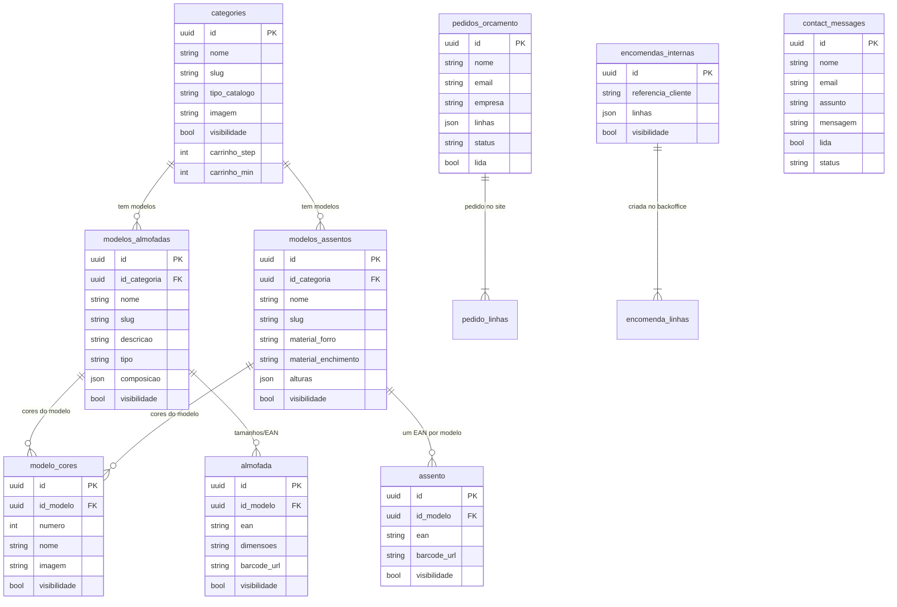

# Base de dados comercial — Diomika

Modelo de dados de **negócio** (catálogo + pedidos + contacto).  
Não inclui tabelas puramente técnicas (`outbox_events`, `saga_instances`, `idempotency_keys`) — essas são infraestrutura de fiabilidade da API.

Fonte de verdade no código: `backend-api/models/schemas.py` (`CATALOG_TYPES` + `TABLE_MAP`).  
Migração que removeu paletas: `backend-api/sql/migration_drop_paletas.sql`.

---

## Diagrama (entidade–relação)

> Nota: `pedido_linhas` / `encomenda_linhas` no diagrama representam o conteúdo do campo JSON `linhas` (EAN + número de cor + quantidade [+ altura]), não tabelas físicas separadas.  
> `modelo_cores.id_modelo` aponta para o UUID do modelo (almofada **ou** assento). Não há FK Postgres polimórfica; o hard-delete do modelo na API limpa as cores.

---

## Regras formais

| Regra | Detalhe |
|-------|---------|
| Categoria | Só em `categories` e nos **modelos** (`id_categoria`). Produtos (`almofada` / `assento`) **não** têm `id_categoria`. |
| Cor | Só em `modelo_cores`, sempre com `id_modelo` obrigatório. **Não existe** `paletas_cores` / `id_paleta` / `template_modelo`. |
| Estampados iguais | Duplicar cores por modelo (cada um com a sua imagem). |
| Orçamento | `pedidos_orcamento` — pedido no **site**. |
| Encomenda | `encomendas_internas` — criada no **backoffice**. Fluxos distintos. |

---

## Leitura comercial (como se vende)

1. **Categoria** (`categories`) — “Almofadas” ou “Assentos”; define tipo de catálogo e regras de quantidade no carrinho (ex.: múltiplos de 6 ou 12).
2. **Modelo** — família de produto (`modelos_almofadas` / `modelos_assentos`): nome, descrição, composição ou materiais; **é aqui que vive `id_categoria`**.
3. **Cor** (`modelo_cores`) — ligada a **um** modelo via `id_modelo`. A mesma estampa em categorias diferentes = cores/imagens **duplicadas** por modelo.
4. **Produto / variante** — `almofada` = tamanho + EAN-13; `assento` = um EAN por modelo (cor/altura escolhidas no pedido). Categoria = join `produto → modelo → categoria`.
5. **Pedido de orçamento** (`pedidos_orcamento`) — pedido no **site** pelo cliente (preço sob consulta).
6. **Encomenda interna** (`encomendas_internas`) — criada pelo dono no **backoffice**.
7. **Contacto** — mensagens do formulário da loja.

Regra de negócio visível na loja: mínimo de encomenda **500€ + IVA** (texto em `MIN_ORCAMENTO_TEXTO`); preços sob consulta.

---

## Famílias de catálogo

| tipo_catalogo | Tabela modelo | Tabela produto | Notas |
|---------------|---------------|----------------|-------|
| `almofada` | `modelos_almofadas` | `almofada` | Variantes por dimensões; cores em `modelo_cores` |
| `assento` | `modelos_assentos` | `assento` | Alturas no modelo; cores em `modelo_cores` |

Para acrescentar uma família nova (ex.: mantas): editar só `backend-api/models/schemas.py` (`CATALOG_TYPES` + classes + `CATEGORY_DEFINITIONS`).
