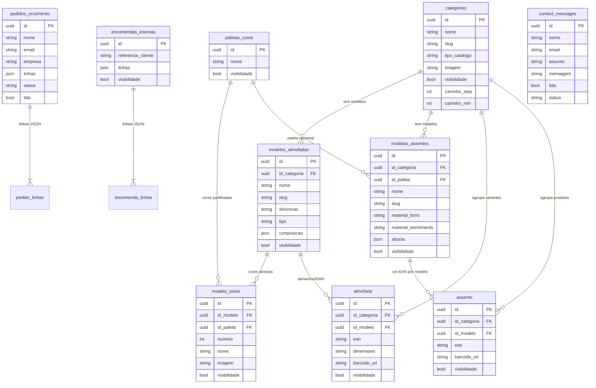

# Base de dados comercial — Diomika

Modelo de dados de **negócio** (catálogo + pedidos + contacto).  
Não inclui tabelas puramente técnicas (`outbox_events`, `saga_instances`, `idempotency_keys`) — essas são infraestrutura de fiabilidade da API.

Fonte de verdade no código: `backend-api/models/schemas.py` (`CATALOG_TYPES` + `TABLE_MAP`).

---

## Diagrama (entidade–relação)

> Nota: `pedido_linhas` / `encomenda_linhas` no diagrama representam o conteúdo do campo JSON `linhas` (EAN + número de cor + quantidade [+ altura]), não tabelas físicas separadas.

---

## Leitura comercial (como se vende)

1. **Categoria** (`categories`) — “Almofadas” ou “Assentos”; define tipo de catálogo e regras de quantidade no carrinho (ex.: múltiplos de 6 ou 12).
2. **Modelo** — família de produto (`modelos_almofadas` / `modelos_assentos`): nome, descrição, composição ou materiais.
3. **Cor** (`modelo_cores`) — ou ligada a um modelo, ou a uma **paleta** partilhada (`paletas_cores`), útil nos assentos.
4. **Produto / variante** — `almofada` = tamanho + EAN-13; `assento` = um EAN por modelo (cor/altura escolhidas na encomenda).
5. **Pedido de orçamento** — o cliente pede preço (sem preços públicos); linhas referenciam EAN + cor (+ altura).
6. **Encomenda interna** — fluxo operacional interno com referência de cliente.
7. **Contacto** — mensagens do formulário da loja.

Regra de negócio visível na loja: mínimo de encomenda **500€ + IVA** (texto em `MIN_ORCAMENTO_TEXTO`); preços sob consulta.

---

## Famílias de catálogo

| tipo_catalogo | Tabela modelo | Tabela produto | Notas |
|---------------|---------------|----------------|-------|
| `almofada` | `modelos_almofadas` | `almofada` | Variantes por dimensões; cores em `modelo_cores` |
| `assento` | `modelos_assentos` | `assento` | Alturas no modelo; cores via paleta |

Para acrescentar uma família nova (ex.: mantas): editar só `backend-api/models/schemas.py` (`CATALOG_TYPES` + classes + `CATEGORY_DEFINITIONS`).
