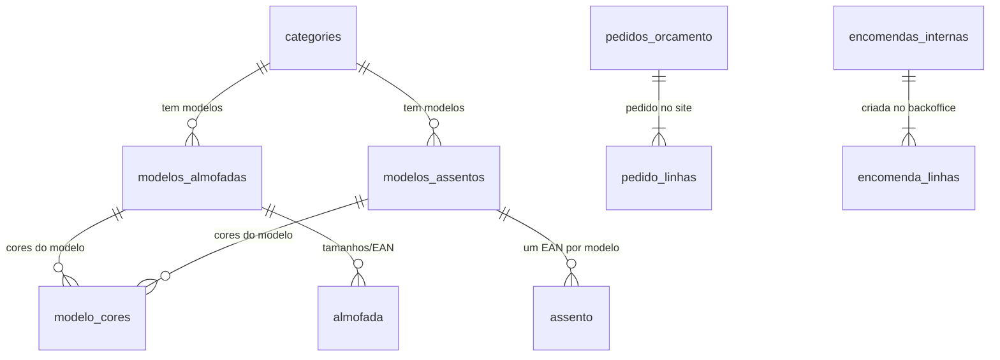

# Diomika — Relatório técnico exaustivo

**Versão:** 2.2 (actualizado 27 Agosto 2026)  
**Audiência:** qualquer pessoa inteligente — **não** se assume conhecimento prévio de informática.  
**Regra:** cada sigla é expandida e explicada na primeira aparição; o glossário da Parte I serve de dicionário permanente.  
**Segurança:** este texto **não contém** passwords, tokens nem chaves. Esses vivem só em .env / pastas gitignored.

**Instruções práticas (ligar, deploy, hub):** [`INSTRUCOES.md`](INSTRUCOES.md) — **usar este ficheiro no dia-a-dia.**

**Nota sobre secções antigas:** partes redigidas antes de Agosto 2026 podem referir sessão admin de 15 minutos ou uptime CI de 15 min. O estado **actual** está no **Apêndice D** (prevalece sobre texto antigo).

## Índice das partes

| Parte | Conteúdo |
|-------|----------|
| I | Fundamentos da web + glossário A–Z |
| II | Arquitectura e tráfego (Pages → Tunnel → VM → Docker → Supabase) |
| III | A loja (rontend-web) |
| IV | A API (ackend-api) |
| V | Segurança camada a camada |
| VI | Dados (Supabase / Postgres / Storage) |
| VII | Observabilidade |
| VIII | Backoffice Electron |
| IX | Deploy e operações |
| X | Decisões e trade-offs |
| XI | Limitações honestas |
| XII | Como estudar o código |
| Apêndices A–C | Fluxos sequenciais, índice de ficheiros, FAQ |
| **Apêndice D** | **Registo de actualizações (Ago 2026) — estado actual** (+ D.9 hub, D.10 performance loja, D.11 segurança) |
| **Apêndice E** | **Diagrama BD comercial** |

**Como ler:** podes saltar para a parte que precisas; se encontrares uma sigla desconhecida, volta ao glossário (Parte I.13). Para operar o sistema, usa [`INSTRUCOES.md`](INSTRUCOES.md).

**Fontes:** volume único consolidado em `docs/RELATORIO_TECNICO.md` (não há pasta `deploy/relatorio_parts/`); Apêndice D reflecte o estado até **27/08/2026**.

---

# Diomika — Relatório técnico exaustivo

**Parte 1 de N — Fundamentos**
Ficheiro: `deploy/relatorio_parts/part_01_fundamentos.md`

Este documento descreve o sistema **Diomika** tal como ele existe e funciona em produção: um catálogo profissional de almofadas e produtos de estofo vendido de empresa para empresa. Descreve as três superfícies visíveis (a loja no browser, a interface de administração instalada no computador, e a camada de dados), o que corre em cada máquina, que protocolos são usados entre elas, e — sobretudo — **porque** cada decisão foi tomada.

Nenhum segredo real (palavra-passe, token, chave de acesso, credencial de base de dados) aparece neste documento. Sempre que for necessário falar de um segredo, é referido apenas pelo **nome da variável** que o guarda (por exemplo `API_SECRET_KEY`), nunca pelo valor. Essa é uma regra de segurança do projecto, não uma cortesia editorial: o repositório de código é tratado como podendo tornar-se público a qualquer momento, e portanto nada que seja secreto pode viver lá dentro.

---

## Como ler este documento

Este relatório foi escrito para uma pessoa inteligente, curiosa e capaz de raciocinar sobre sistemas — mas que **não** trabalha em informática e a quem ninguém explicou o significado das siglas que a indústria usa como se fossem palavras comuns. A informática tem um problema cultural: comunica por abreviaturas. Diz-se "a API está atrás do Tunnel com TLS terminado na CDN e RLS no Postgres" e espera-se que o interlocutor acene. Este documento recusa esse hábito.

**Regra de ouro deste relatório:** nenhuma sigla é usada sem ser expandida na primeira vez que aparece, e a expansão vem sempre acompanhada de uma explicação em linguagem comum do que a coisa **é** e do que a coisa **faz**. Se aparecer "HTTPS" pela primeira vez, aparece como "HTTPS — *HyperText Transfer Protocol Secure*, isto é, o protocolo de conversa entre browsers e servidores, na versão encriptada". Se depois disso o documento voltar a escrever apenas "HTTPS", é porque o leitor já foi apresentado ao termo.

### Estrutura em partes

O relatório completo está neste ficheiro único (`docs/RELATORIO_TECNICO.md`). Historicamente existiu uma pasta `deploy/relatorio_parts/` com partes separadas; foi consolidada. Cada «Parte» abaixo continua a poder ser lida de forma relativamente autónoma, assumindo o glossário da Parte I.

Esta é a **Parte I — Fundamentos**. O objectivo desta parte não é descrever a Diomika em detalhe técnico (isso vem nas partes seguintes); é **construir o vocabulário e os modelos mentais** necessários para que as partes seguintes sejam legíveis. É a parte que se lê primeiro e à qual se volta sempre que uma sigla parecer opaca.

### Três níveis de leitura

Cada secção desta parte está escrita para poder ser lida a três velocidades diferentes:

1. **Leitura rápida (o essencial).** Os primeiros parágrafos de cada secção dão a ideia central em linguagem comum, muitas vezes com uma analogia do mundo físico. Se o objectivo for apenas conseguir seguir uma conversa técnica sobre a Diomika, basta este nível.
2. **Leitura normal (compreender).** O corpo de cada secção explica o mecanismo — o que acontece, em que ordem, quem fala com quem. Este é o nível certo para quem quer poder tomar decisões informadas sobre o sistema, aprovar orçamentos, ou perceber o impacto de uma avaria.
3. **Leitura aplicada (a Diomika concretamente).** Cada secção termina com uma subsecção do género "na Diomika", que liga o conceito abstracto a ficheiros e caminhos reais do repositório, como `backend-api/main.py` ou `frontend-web/src/lib/api.js`. Este nível interessa a quem vai mexer no código ou operar o sistema.

### Convenções tipográficas

- `Texto em tipo monoespaçado` indica algo literal do sistema: um nome de ficheiro (`backend-api/core/middleware.py`), uma pasta (`frontend-web/`), um nome de variável de ambiente (`SUPABASE_URL`), um endereço (`https://api.diomika.com`), ou um cabeçalho de protocolo (`X-Diomika-Desktop`).
- **Negrito** marca o primeiro aparecimento de um conceito importante, ou uma decisão de engenharia que vale a pena reter.
- *Itálico* é usado para as expansões em inglês das siglas (porque as siglas são quase todas inglesas) e para ênfase leve.
- Blocos de código com moldura mostram exemplos ilustrativos. Salvo indicação em contrário, os valores nesses blocos são **inventados para o exemplo** e não correspondem a dados reais nem a segredos reais.

### O que este documento não é

Não é um roteiro de futuro. Quando o documento diz que algo existe, é porque existe no código e corre em produção. Quando algo está implementado mas desligado, o documento di-lo explicitamente com essas palavras ("implementado, desligado por omissão"). Quando algo é apenas uma possibilidade prevista pelo código mas nunca activada, o documento di-lo também ("código pronto, não activado"). Esta honestidade é deliberada: um relatório técnico que confunde o que existe com o que se gostaria de ter é pior do que não ter relatório nenhum, porque induz decisões erradas.

Também não é um manual de utilização. Não explica como criar um produto no catálogo nem como responder a um pedido de orçamento. Explica como o sistema que permite fazer essas coisas está construído.

### Uma nota sobre "porque é que isto é tão complicado"

Um leitor não-técnico que percorra este documento pode legitimamente perguntar: para vender almofadas a empresas, é preciso tudo isto? Vale a pena responder desde já, porque a resposta é o fio condutor de todo o relatório.

Grande parte da complexidade não serve para mostrar o catálogo — mostrar um catálogo é fácil. A complexidade serve para três coisas: **não ser invadido**, **não gastar dinheiro**, e **não perder dados**. A internet pública é um ambiente hostil por omissão: qualquer endereço acessível recebe, poucas horas depois de existir, tentativas automáticas de descobrir ficheiros de configuração, painéis de administração e palavras-passe fracas. Não são ataques dirigidos à Diomika; são varreduras industriais que testam todos os endereços do mundo. A arquitectura da Diomika está desenhada para que essas varreduras não encontrem nada útil.

A segunda razão é económica. A Diomika corre com um custo de infra-estrutura recorrente próximo de **zero euros por mês**, usando camadas gratuitas permanentes de vários fornecedores em vez de servidores alugados. Isso é uma vitória, mas tem um preço: obriga a escolhas de arquitectura que não seriam necessárias com um orçamento maior — como fazer trabalho pesado num computador muito pequeno, ou usar um túnel em vez de um endereço público próprio. Muitas das decisões descritas neste relatório só se compreendem à luz desta restrição.

A terceira razão é a natureza dos dados. Pedidos de orçamento de clientes empresariais contêm nomes, contactos, e às vezes preços negociados. Não é informação de altíssima sensibilidade, mas é informação que não deve andar exposta, e cuja perda ou fuga teria consequências comerciais e legais reais.

---

## Parte I — Fundamentos (o que é cada peça do puzzle)

---

### I.1 O que é a Diomika (produto de negócio)

Antes de qualquer tecnologia, é preciso entender **o que o sistema serve para fazer**. Toda a arquitectura descrita neste relatório é uma resposta a este problema de negócio, e nada nela faz sentido sem ele.

#### O problema comercial

A Diomika vende almofadas e produtos de estofo — assentos, costas, capas, composições de espuma e tecido — a **outras empresas**: fabricantes de mobiliário, retalhistas, decoradores, hotelaria. Não vende ao consumidor final que compra uma almofada para o sofá de casa.

Esta distinção parece pequena e é enorme. Uma venda a consumidor final é: a pessoa vê, gosta, mete no cesto, paga com cartão, recebe em casa. Uma venda entre empresas é quase sempre: o comprador vê o catálogo, identifica referências e cores, calcula quantidades, **pede um preço**, discute prazos e condições, e só depois se confirma uma encomenda. O preço não é público porque depende do volume, da relação comercial, do tecido escolhido e da margem negociada. Pedir a um cliente empresarial que compre com um botão de "pagar agora" é ignorar como o negócio funciona.

Consequência directa: a Diomika **não é uma loja online com pagamentos**. É um **catálogo com pedido de orçamento**. Não existe processamento de cartões, não existe carrinho que termina em pagamento, não existe integração com nenhum sistema financeiro. O que existe é: um catálogo navegável e bonito, um mecanismo para o cliente montar uma lista de interesse, e um canal fiável para essa lista chegar à Diomika como um pedido a que alguém responde.

Esta escolha remove uma quantidade imensa de complexidade e de risco. Não guardar dados de pagamento significa não ter de cumprir as normas pesadas da indústria de cartões, não ter de gerir fraude, não ter de gerir reembolsos, e não ser um alvo interessante para quem rouba dados financeiros. É uma das decisões mais valiosas do projecto, e é uma decisão de negócio, não de tecnologia.

#### As três superfícies

O sistema Diomika manifesta-se ao mundo através de três "superfícies" — três coisas que uma pessoa pode ver e usar. Vale a pena fixá-las desde já, porque o resto do relatório está organizado em torno delas.

**1. A loja.** É o sítio na internet, em `www.diomika.com`, que qualquer pessoa pode abrir num browser. Mostra categorias, produtos, fotografias, especificações técnicas, e tem formulários de contacto e de pedido de orçamento. É a cara pública. Vive na pasta `frontend-web/` do repositório.

**2. O backoffice.** É um **programa instalado no computador** de quem gere a Diomika — não é um sítio na internet. Serve para criar e editar produtos, categorias, cores, modelos; ver e responder aos pedidos de orçamento e às mensagens de contacto; registar e acompanhar encomendas; gerar documentos. Vive na pasta `backoffice-desktop/`.

**3. A interface de programação.** É a peça que ninguém vê mas que faz o trabalho: recebe pedidos das outras duas superfícies, valida-os, aplica regras de negócio, guarda e lê dados, envia e-mails. Está publicada em `api.diomika.com` e vive na pasta `backend-api/`.

Por baixo das três há uma quarta peça, que é onde a informação realmente mora: a **base de dados e o armazenamento de imagens**, alojados num serviço chamado Supabase.

#### Porque é que o backoffice é um programa instalado

Esta é a decisão de arquitectura mais invulgar da Diomika e merece explicação imediata, porque contraria a tendência da indústria — hoje quase toda a administração de sistemas se faz num painel dentro do browser.

A administração da Diomika é feita por um número muito pequeno de pessoas, sempre nos mesmos computadores. Não há centenas de utilizadores nem necessidade de acesso a partir de qualquer sítio. Nessas condições, um painel de administração acessível pelo browser é sobretudo um passivo: cria um endereço público que qualquer pessoa no mundo pode encontrar e onde qualquer pessoa pode tentar adivinhar palavras-passe. Vinte e quatro horas por dia, para sempre.

Ao fazer do backoffice um programa instalado, a Diomika consegue exigir uma coisa que um browser não pode fornecer: **prova de que o pedido vem de uma instalação oficial**. O programa instalado carrega no seu interior um segredo partilhado, colocado lá no momento em que o instalador é construído, e envia-o em todos os pedidos administrativos. Quem não tem o programa não tem o segredo; e sem o segredo os endereços administrativos comportam-se como se não existissem. Um atacante que descubra `api.diomika.com` e tente abrir a zona de administração no browser não recebe um formulário de login para atacar — recebe uma resposta de "não existe".

Isto não é uma solução perfeita e o relatório será explícito quanto aos seus limites nas partes seguintes: quem obtiver simultaneamente o instalador oficial **e** uma palavra-passe válida entra. O que a decisão consegue é eliminar toda a classe de ataques anónimos e automáticos, que é a esmagadora maioria do que realmente acontece.

#### Porque é que existe uma peça no meio

Uma pergunta natural: se os dados estão na base de dados, e a loja e o backoffice precisam de dados, porque não falam directamente com a base de dados? Porquê a peça do meio?

Três razões.

A primeira é **regras de negócio**. Criar um pedido de orçamento não é escrever uma linha numa tabela. É validar que os campos fazem sentido, verificar que quem submeteu não é um robô, garantir que uma submissão repetida por engano não cria dois pedidos, registar o pedido, enviar um e-mail de notificação, enviar uma confirmação ao cliente, e registar tudo isso de forma auditável. Essa sequência tem de viver **num** lugar, e tem de viver num lugar que o utilizador não controla.

A segunda é **confiança**. O código que corre no browser de um visitante está, por definição, nas mãos desse visitante: pode ser lido, alterado e contornado. Qualquer regra implementada só no browser é uma sugestão, não uma regra. As regras têm de ser aplicadas onde o utilizador não chega — ou seja, no servidor.

A terceira é **segredos**. Escrever na base de dados exige uma credencial poderosa. Essa credencial não pode existir no browser nem no computador do cliente; se existisse, quem a extraísse podia apagar tudo. A peça do meio é o único lugar do sistema que a possui.

#### A restrição de custo

Um último elemento de contexto sem o qual metade das decisões deste relatório parecem estranhas: a Diomika foi construída para custar **cerca de zero euros por mês** de infra-estrutura recorrente. O domínio paga-se uma vez por ano; tudo o resto usa camadas gratuitas permanentes de fornecedores estabelecidos.

Concretamente: a loja é servida por uma plataforma de alojamento estático gratuita; a peça do meio corre numa máquina virtual da camada "sempre gratuita" de um grande fornecedor de nuvem, que é muito pequena; a base de dados usa a camada gratuita do Supabase; a monitorização usa camadas gratuitas de vários serviços independentes.

Esta restrição tem consequências reais e visíveis na arquitectura. A máquina onde corre a peça do meio tem pouca memória, o que obriga a cuidado com o que se põe lá a correr. A máquina não tem um endereço público próprio bem configurado, o que motivou o uso de um túnel. E a plataforma da loja não pode correr código de servidor tradicional, o que motivou a separação entre loja e interface de programação. Nada disto é acidente; é engenharia sob restrição, que é a única engenharia que existe.

---

### I.2 O que é uma aplicação web (browser, servidor, pedido/resposta)

#### A ideia central: nada está no seu computador

Quando se abre uma página de jornal no computador, a sensação é de que o jornal "está ali". Não está. O que está no computador é um programa — o **browser** — que sabe pedir coisas a computadores distantes e mostrar o que recebe. A página que se vê foi construída no momento, a partir de ficheiros que acabaram de chegar através da rede.

Um **browser** (navegador) é um programa como o Chrome, o Firefox, o Safari ou o Edge. Faz três coisas: pede ficheiros a computadores remotos, interpreta esses ficheiros, e desenha o resultado no ecrã. É um dos programas mais complexos que existem num computador comum, precisamente porque tem de fazer isto de forma segura com ficheiros vindos de fontes desconhecidas.

Um **servidor** é um computador cuja função é estar sempre ligado à espera de pedidos, e responder-lhes. A palavra tem duas acepções que convém não confundir: o servidor-máquina (o computador físico ou virtual) e o servidor-programa (o software que atende pedidos nessa máquina). Neste relatório, quando a distinção importar, ela será feita explicitamente.

#### O ciclo pedido/resposta

Toda a web funciona sobre um único mecanismo, repetido milhões de vezes por segundo em todo o mundo: **o ciclo pedido/resposta**.

1. O browser envia um **pedido**: "dá-me o documento que está em `/produtos/almofada-lisboa`".
2. O servidor recebe o pedido, decide o que fazer, e envia uma **resposta**: um código que diz se correu bem, alguma informação sobre o que vem a seguir, e o conteúdo em si.
3. A conversa termina. O servidor não guarda memória de que aquele browser existiu.

Este último ponto é fundamental e chama-se **ausência de estado** (em inglês, *statelessness*). Cada pedido é independente. O servidor não se lembra de nada. Isto parece uma limitação — e é, do ponto de vista da conveniência — mas é a razão pela qual a web escala: qualquer servidor pode atender qualquer pedido, porque nenhum pedido depende de conversas anteriores.

A consequência prática é que tudo o que se pareça com memória tem de ser reconstruído a cada pedido. Se um administrador da Diomika fez login e depois abre a lista de produtos, o servidor não "sabe" que ele fez login — o programa tem de **reenviar a prova** de que fez login, em cada pedido, sem excepção. Essa prova é o que se chama um *token* de sessão, e a Parte sobre autenticação explica em detalhe como a Diomika o constrói.

#### Uma volta completa, em detalhe

Vale a pena percorrer uma sequência real, porque quase todos os conceitos deste relatório aparecem nela.

Um comprador de uma fábrica de mobiliário escreve `www.diomika.com` no browser.

**Passo 1 — encontrar o computador.** `www.diomika.com` é um nome, e a rede não funciona com nomes: funciona com números. O browser pergunta a um serviço de tradução de nomes qual é o número correspondente. Recebe um endereço numérico. (Este mecanismo é o assunto da secção I.5.)

**Passo 2 — abrir uma conversa segura.** O browser liga-se a esse endereço e, antes de dizer o que quer, negocia uma conversa encriptada, para que ninguém no caminho possa ler nem alterar o que vai ser trocado. O servidor apresenta um certificado que prova ser quem diz ser. (Assunto da secção I.7.)

**Passo 3 — o primeiro pedido.** O browser pede o documento raiz: "dá-me `/`". Recebe um documento em HTML — *HyperText Markup Language*, a linguagem de marcação que descreve a estrutura de uma página, isto é, o que é um título, o que é um parágrafo, o que é uma imagem.

**Passo 4 — os pedidos seguintes.** Esse documento é pequeno e quase vazio. O que ele contém são **referências** a outros ficheiros: folhas de estilo, ficheiros de código, tipos de letra, imagens. O browser lê essas referências e faz **mais pedidos** — dezenas, tipicamente. Abrir "uma página" são na realidade muitos ciclos de pedido/resposta.

**Passo 5 — o código toma conta.** Um dos ficheiros pedidos é o programa da loja, escrito em JavaScript, a linguagem de programação que os browsers sabem executar. Quando esse programa arranca, é ele que constrói a página visível. É também ele que vai buscar os dados do catálogo, com mais pedidos — agora não para páginas, mas para **dados**.

**Passo 6 — os dados.** Os produtos, as categorias, os preços de referência e as fotografias não estão no programa; estão na base de dados. O programa da loja pede-os, recebe-os num formato de troca de dados (assunto da secção I.8), e preenche o ecrã.

**Passo 7 — a interacção.** O comprador clica numa categoria. Aqui está a diferença entre a web antiga e a moderna: **a página não recarrega**. O programa que já está a correr no browser apanha o clique, vai buscar os dados da categoria, e substitui a parte do ecrã que muda. A sensação é de uma aplicação, não de um documento. (Assunto da secção I.10.)

**Passo 8 — o pedido de orçamento.** O comprador escolhe referências, indica quantidades, e submete um pedido de orçamento. Agora o fluxo inverte-se: em vez de o browser pedir informação, **envia** informação, para a interface de programação em `api.diomika.com`. Essa peça valida, verifica que não é um robô, guarda, notifica, e responde. É a única parte do fluxo em que algo no mundo muda de estado.

#### Na Diomika

A loja da Diomika é uma aplicação web no sentido pleno: os ficheiros que o browser pede estão numa plataforma de alojamento estático, e os dados vêm de dois sítios diferentes — o catálogo vem directamente do Supabase, através de `frontend-web/src/lib/catalogSupabase.js`, e as operações que escrevem algo vão para `api.diomika.com`, através de `frontend-web/src/lib/api.js`.

Essa divisão é intencional e vale a pena reter desde já, porque é uma das características distintivas da arquitectura: **ler o catálogo não passa pela peça do meio; escrever passa sempre**. Ler é uma operação inofensiva sobre dados públicos, e fazê-la directamente é mais rápido e mais barato. Escrever exige validação, regras de negócio e credenciais privilegiadas, e portanto tem de passar por onde essas coisas vivem.

---

### I.3 Cliente vs servidor

#### A distinção

Na conversa entre dois computadores, **cliente** é quem pede e **servidor** é quem responde. Não é uma característica permanente de uma máquina; é um papel numa conversa concreta. A mesma máquina pode ser servidora numa conversa e cliente noutra — e na Diomika isso acontece constantemente.

Um exemplo: a interface de programação da Diomika é **servidora** quando a loja lhe pede para registar um pedido de orçamento. Mas quando ela precisa de guardar esse pedido, passa a ser **cliente** do Supabase. E quando envia o e-mail de notificação, é cliente de um servidor de correio. Uma única acção de um comprador desencadeia uma cadeia de conversas em que os papéis mudam a cada elo.

#### Porque é que esta distinção é a base de toda a segurança

Aqui está a razão pela qual a distinção cliente/servidor domina este relatório: **o cliente é território inimigo**.

Não porque o cliente seja mal-intencionado — o comprador da fábrica de mobiliário não é. Mas porque o código que corre no computador de outra pessoa está sob o controlo dessa pessoa, e não sob o nosso. Todo o browser moderno traz ferramentas de desenvolvimento que permitem, sem qualquer conhecimento especial:

- ler todo o código que a loja enviou, incluindo comentários e nomes de variáveis;
- ver todos os pedidos que o browser fez, com todo o conteúdo enviado e recebido;
- alterar valores em memória enquanto o programa corre;
- fabricar pedidos à mão, ignorando completamente a interface.

Isto significa que existe uma regra sem excepções, e é provavelmente a regra mais importante de toda a segurança web:

> **Nunca confiar em nada que venha do cliente. Nunca esconder um segredo no cliente. Nunca aplicar uma regra apenas no cliente.**

Uma validação no browser — "este campo é obrigatório", "a quantidade tem de ser maior que zero" — é **conveniência para o utilizador honesto**, não segurança. Ajuda a pessoa a não errar, e evita uma ida ao servidor por nada. Mas não impede ninguém de enviar um pedido com o campo vazio, porque o pedido pode ser fabricado à mão. Todas as validações que **importam** têm de ser repetidas no servidor. Na Diomika elas estão declaradas em `backend-api/models/schemas.py`, e são aplicadas em cada pedido, independentemente do que o browser já tenha verificado.

#### O que pode e o que não pode viver no cliente

Esta distinção decide o desenho de todo o sistema. Vale a pena ser explícito.

**Pode viver no cliente:** o desenho visual; a navegação entre ecrãs; a formatação de números e datas; validações de conveniência; identificadores públicos (o código de um produto que já está no catálogo); chaves de acesso **desenhadas para serem públicas** e cujos poderes são restringidos do outro lado.

**Não pode viver no cliente, em circunstância alguma:** credenciais que permitam escrever ou apagar dados; chaves de serviços pagos; a lógica que decide se uma pessoa tem permissão para algo; regras de negócio cuja violação tenha consequências; segredos de qualquer tipo que não estejam já publicados.

#### O caso mais subtil: as duas chaves do Supabase

O Supabase entrega a cada projecto duas chaves de acesso muito diferentes, e a distinção entre elas é um exemplo perfeito da fronteira cliente/servidor.

A **chave anónima** (*anon key*) é desenhada para ser pública. Vai dentro do programa da loja, é visível a qualquer visitante, e não faz sentido tentar esconde-la. Ela não é, por si, uma autorização; é apenas uma identificação do projecto. O que ela pode realmente fazer é definido por regras declaradas **na base de dados** — regras que dizem, por exemplo, "com esta chave é possível ler produtos visíveis, e mais nada". Mesmo que um visitante extraia a chave e fabrique pedidos à mão, não consegue ler o que as regras não permitem.

A **chave de serviço** (*service role key*) é o oposto: ignora todas essas regras, por desenho. É a chave de administração da base de dados. Vive exclusivamente na variável `SUPABASE_KEY` no ficheiro de configuração da máquina onde corre a interface de programação, um ficheiro que nunca entra no repositório de código. Nunca é enviada a um browser, nunca é embutida num instalador, nunca aparece numa resposta.

Este par de chaves resume a filosofia: **a chave que é pública tem poderes limitados por regras do lado do servidor; a chave que tem poderes ilimitados nunca sai do servidor.**

#### O terceiro tipo de cliente: o backoffice

A Diomika tem um caso que não é browser nem servidor no sentido clássico: o programa instalado no computador do administrador. É um cliente — pede coisas à interface de programação — mas é um cliente **com propriedades especiais**.

Ao contrário de um browser, o programa instalado pode transportar um segredo que não é trivialmente visível: um valor colocado dentro do binário no momento em que o instalador é construído. Não é secreto de forma absoluta — quem tiver o ficheiro e paciência suficiente consegue extraí-lo — mas é secreto em relação a quem apenas visita `api.diomika.com` com um browser. Essa diferença de grau é suficiente para eliminar a totalidade dos ataques anónimos e automáticos.

O mecanismo, na Diomika, funciona assim: o programa instalado corre um pequeno servidor local no próprio computador, que serve a interface visual e reencaminha os pedidos para `api.diomika.com` acrescentando um cabeçalho de identificação chamado `X-Diomika-Desktop`. Do lado da interface de programação, `backend-api/core/local_only.py` compara o valor recebido com o valor esperado, usando uma comparação criptograficamente segura, e `backend-api/core/path_guard.py` bloqueia os caminhos administrativos quando a comparação falha.

Note-se o detalhe: o programa instalado é simultaneamente **servidor** (para a interface visual que corre dentro dele) e **cliente** (do serviço na nuvem). É a demonstração perfeita de que cliente e servidor são papéis, não naturezas.

---

### I.4 Frontend vs backend

#### As duas metades

**Frontend** significa literalmente "a parte da frente": tudo o que corre no dispositivo do utilizador e produz o que ele vê e toca. **Backend** é "a parte de trás": tudo o que corre em máquinas controladas por quem opera o sistema, e que o utilizador nunca vê.

A analogia mais útil é um restaurante. A sala é o frontend: mesas, menu, empregado, apresentação do prato. A cozinha é o backend: fornecedores, câmaras frigoríficas, receitas, preparação. O cliente interage só com a sala. Mas se a cozinha falhar, a sala não tem nada para servir — e por muito bonita que a sala seja, ninguém volta se a comida for má.

A analogia esclarece uma coisa importante: as duas metades exigem competências diferentes e otimizam para objectivos diferentes. O frontend preocupa-se com clareza visual, tempo até o utilizador ver algo útil, comportamento em ecrãs de tamanhos diferentes, acessibilidade. O backend preocupa-se com correcção dos dados, permissões, resistência a falhas, e comportamento sob carga.

#### O que a divisão implica na prática

A fronteira entre frontend e backend não é uma questão de gosto; é a fronteira de confiança descrita na secção anterior. Tudo o que está do lado do frontend é público e manipulável; tudo o que está do lado do backend é privado e autoritativo.

Isto tem uma implicação que surpreende quem vem de fora: **o mesmo trabalho é frequentemente feito duas vezes, de propósito**. Uma validação de formulário é implementada no frontend, para dar feedback imediato ao utilizador sem esperar pela rede, e implementada outra vez no backend, porque a do frontend não é uma garantia. Isto não é desperdício nem falta de organização; é a consequência inevitável de o frontend não ser de confiança.

#### Frontend na Diomika

A Diomika tem **dois** frontends, o que é invulgar e vale a pena sublinhar.

O primeiro é a **loja**, em `frontend-web/`. É construída com Vue, uma biblioteca de construção de interfaces. Os seus ecrãs estão em `frontend-web/src/views/` — `HomeView.vue` para a entrada, `CategoriesView.vue` para as categorias, `ProductsView.vue` para as listagens, `ProductDetailView.vue` para a ficha de um produto, `CartView.vue` para a lista de interesse, `ContactView.vue` para o formulário de contacto, `PrivacyView.vue` para a política de privacidade. As peças reutilizáveis estão em `frontend-web/src/components/`, e a lógica partilhada em `frontend-web/src/composables/` e `frontend-web/src/lib/`.

O segundo é o **backoffice**, em `backoffice-desktop/src/`. É também construído com Vue — a mesma tecnologia, a mesma linguagem, competências reutilizáveis — mas embrulhado num programa instalável em vez de servido por um sítio na internet. Os seus ecrãs estão em `backoffice-desktop/src/views/`: `LoginView.vue`, `TableView.vue` para navegar registos, `RecordFormView.vue` para editar, `EncomendasView.vue` para encomendas, `ContactView.vue` para mensagens, `SchemaSyncView.vue` para operações de estrutura de dados.

Uma característica notável do backoffice: os formulários de edição **não estão escritos à mão**. O componente `backoffice-desktop/src/components/SchemaForm.vue` recebe uma descrição da estrutura de dados vinda do backend e constrói o formulário adequado a partir dela. A consequência prática é que acrescentar um campo a um produto não obriga a reescrever o formulário de produtos — a descrição muda, e o formulário acompanha. Esta abordagem, que o projecto chama *schema-driven* (guiada pelo esquema), é uma das decisões estruturantes da Diomika e é tratada em detalhe em parte posterior.

#### Backend na Diomika

O backend vive em `backend-api/`, escrito em Python, e está organizado em camadas com responsabilidades distintas:

- `backend-api/main.py` é a porta de entrada: monta a aplicação, instala as camadas de protecção pela ordem correcta, e registra as famílias de endereços disponíveis.
- `backend-api/routes/` contém os pontos de entrada agrupados por assunto: `categories.py`, `catalog_generic.py`, `contact.py`, `orcamentos.py`, `encomendas.py`, `admin.py`, `admin_crud.py`, `admin_auth.py`, `privacy.py`, `system.py`.
- `backend-api/core/` contém a maquinaria: autenticação, sessões, limitação de ritmo, protecção de caminhos, ligação à base de dados, registo de eventos, alertas, saúde do sistema.
- `backend-api/models/` contém as definições de forma dos dados, que são a fonte de verdade de todo o sistema.
- `backend-api/utils/` contém utilitários concretos: envio de e-mail, geração de documentos, validação de imagens, armazenamento de ficheiros.
- `backend-api/workers/` contém processos que trabalham em segundo plano, sem estar ligados a nenhum pedido.
- `backend-api/sql/` contém a evolução da estrutura da base de dados ao longo do tempo.

#### Onde a fronteira é atravessada

Convém saber exactamente onde é que os dois lados se tocam, porque é nesses pontos que a segurança se aplica.

Na loja, o frontend fala com o backend em dois sítios: `frontend-web/src/lib/api.js`, que envia os pedidos que escrevem algo para `api.diomika.com`; e `frontend-web/src/lib/catalogSupabase.js`, que lê o catálogo directamente do Supabase com a chave pública. No backoffice, o único ponto de contacto é `backoffice-desktop/src/lib/api.js`, que fala com o servidor local dentro do próprio programa, e é esse servidor local — `backoffice-desktop/electron/main.cjs` — que reencaminha para a nuvem acrescentando o cabeçalho de identificação.

Ter estes pontos de contacto reduzidos e nomeados é uma decisão consciente: significa que existe um número pequeno de ficheiros onde se pode auditar toda a comunicação entre lados, em vez de a comunicação estar espalhada por todo o código.

---

### I.5 Domínio, DNS, subdomínios (www vs api)

#### Nomes e números

Todo o computador ligado à internet é identificado por um **IP** — *Internet Protocol address*, ou endereço de Protocolo de Internet. É um número, escrito em partes: `203.0.113.42` no formato antigo e mais comum, ou algo bem mais longo e com dois-pontos no formato moderno. É o equivalente de uma morada postal: identifica um destino na rede de forma inequívoca, e é isso — e só isso — que os equipamentos de rede usam para encaminhar informação.

O problema é que os números não servem para pessoas. São difíceis de memorizar, impossíveis de dizer ao telefone sem erros, e — pior — **mudam**. Um servidor pode ser substituído e receber outro número. Se os clientes soubessem apenas o número, todos teriam de ser avisados.

A solução é o **DNS** — *Domain Name System*, ou Sistema de Nomes de Domínio. É uma lista telefónica distribuída pelo mundo inteiro que traduz nomes legíveis em números. Quando um browser precisa de contactar `www.diomika.com`, pergunta ao DNS "qual é o endereço deste nome?" e recebe um número com que consegue trabalhar. A tradução é invisível, acontece em milissegundos, e é a razão pela qual se pode mudar de servidor sem que ninguém repare.

#### Um domínio é uma propriedade alugada

Um **domínio** é um nome registado, como `diomika.com`. Não se compra: aluga-se, tipicamente ao ano, através de um registador. Quem controla o domínio controla o que os nomes por baixo dele apontam — e essa é uma das chaves mais importantes de qualquer presença na internet. Perder o controlo de um domínio é pior do que perder um servidor: um servidor substitui-se, um nome que os clientes conhecem não.

A leitura de um nome de domínio faz-se **da direita para a esquerda**, do mais geral para o mais específico. Em `www.diomika.com`: `com` é o domínio de topo, a categoria mais ampla; `diomika` é o nome registado dentro dessa categoria; `www` é um **subdomínio**, um nome criado livremente por quem controla `diomika.com`.

#### Subdomínios são de graça e por isso usam-se

Este ponto é frequentemente mal compreendido por quem está fora da área, e é importante: criar subdomínios **não custa nada e não requer autorização de ninguém**. Quem controla `diomika.com` pode criar `api.diomika.com`, `loja.diomika.com`, `interno.diomika.com`, quantos quiser, instantaneamente. Não são domínios novos; são ramos do mesmo domínio.

E cada subdomínio pode apontar para um sítio completamente diferente, gerido por um fornecedor completamente diferente. Esta é a propriedade que torna os subdomínios uma ferramenta de arquitectura e não apenas de nomenclatura.

#### Os dois nomes da Diomika

A Diomika usa dois subdomínios, com papéis deliberadamente separados:

**`www.diomika.com`** — a loja. Aponta para a plataforma de alojamento estático da Cloudflare. Quem abre este nome recebe ficheiros: documentos, código, estilos, imagens. É público, indexado por motores de busca, e desenhado para ser encontrado.

**`api.diomika.com`** — a interface de programação. Aponta, através da rede da Cloudflare, para um túnel que termina na máquina virtual onde corre o backend. Quem abre este nome num browser não recebe uma página; recebe dados, ou uma recusa. Não é para ser visitado por pessoas.

#### Porque separar, em vez de usar um caminho

Uma alternativa técnica óbvia seria não criar um segundo nome e usar em vez disso um caminho dentro do primeiro: `www.diomika.com/api/...`. Muitos sistemas fazem exactamente isso. A Diomika não, e as razões são instrutivas.

**Fornecedores diferentes.** A loja está numa plataforma que serve ficheiros a partir de centenas de localizações no mundo, e que não corre código de servidor tradicional. O backend precisa de correr Python continuamente, com memória entre pedidos e ligações abertas à base de dados. São necessidades incompatíveis, satisfeitas por infra-estruturas diferentes. Dois nomes permitem apontar cada um para onde deve.

**Regras de cache opostas.** Os ficheiros da loja devem ser guardados agressivamente em cópias locais — não mudam, e cada cópia poupada é tempo ganho. As respostas da interface de programação, pelo contrário, quase nunca devem ser guardadas: uma resposta com a lista de pedidos de orçamento não pode ser servida a partir de uma cópia antiga, e muito menos a outra pessoa. Ter nomes separados permite configurar políticas opostas sem ambiguidade.

**Regras de segurança separadas.** A rede da Cloudflare permite aplicar regras por nome. A Diomika aplica em `api.diomika.com` regras que não teriam sentido na loja — como bloquear na fronteira qualquer pedido a caminhos administrativos que não traga o cabeçalho de identificação correcto. Se tudo fosse o mesmo nome, essas regras teriam de distinguir por caminho, o que é mais frágil.

**Clareza operacional.** Quando algo falha, saber se o que falhou foi o nome da loja ou o nome da interface de programação reduz o espaço de diagnóstico à partida. A monitorização da Diomika vigia os dois nomes separadamente, e uma falha num não é confundida com falha no outro.

#### Um detalhe do mundo real: o registo de tempo de vida

Cada resposta do DNS traz consigo um **TTL** — *Time To Live*, ou tempo de vida — que diz durante quanto tempo a resposta pode ser reutilizada sem voltar a perguntar. É uma optimização essencial: sem ela, cada pedido a `www.diomika.com` obrigaria a uma consulta de nomes.

Mas tem uma consequência operacional que morde na prática: **mudanças de DNS não são instantâneas**. Se o nome `api.diomika.com` passar a apontar para outro sítio, os computadores que já tinham a resposta antiga em memória continuam a usá-la até o tempo de vida expirar. Durante esse período — minutos, às vezes mais — parte do mundo vê o destino novo e parte vê o antigo. Qualquer alteração de infra-estrutura da Diomika tem de contar com esta janela de inconsistência. Não é um defeito a corrigir; é uma propriedade do sistema com que se planeia.

#### Na Diomika

A configuração de nomes está descrita em `deploy/cloudflare/dns_plan.json`, que documenta que nomes existem e para onde apontam. As regras de fronteira aplicadas por nome estão em `deploy/cloudflare/waf_rules.json`. Manter estes ficheiros no repositório é uma decisão deliberada: a configuração de rede é parte do sistema, e um sistema cuja configuração vive apenas dentro do painel de um fornecedor é um sistema que ninguém consegue reconstruir se algo se perder.

---

### I.6 HTTP e HTTPS

#### O protocolo que sustenta a web

**HTTP** significa *HyperText Transfer Protocol* — Protocolo de Transferência de Hipertexto. É o conjunto de convenções que browsers e servidores usam para conversar. Foi criado para transferir documentos com ligações entre si, e hoje transporta tudo: páginas, vídeo, dados, comandos de máquinas a máquinas.

Um ponto que ajuda a desmistificar: HTTP é **texto legível**. Não é um formato binário obscuro. Um pedido HTTP, visto em cru, parece isto:

```
GET /api/categories HTTP/1.1
Host: api.diomika.com
Accept: application/json
User-Agent: Mozilla/5.0 (...)
```

E uma resposta parece isto:

```
HTTP/1.1 200 OK
Content-Type: application/json
Content-Length: 1842
Cache-Control: public, max-age=300

{"items": [...]}
```

Toda a web moderna assenta nisto. Perceber esta estrutura é perceber metade das conversas técnicas sobre sistemas web.

#### A anatomia de um pedido

Um pedido HTTP tem quatro partes.

**O método** (`GET`, no exemplo) declara a **intenção**: estou a ler ou estou a mudar algo?

**O caminho** (`/api/categories`) diz **o quê**: qual o recurso em questão.

**Os cabeçalhos** (as linhas seguintes) são metadados — informação sobre o pedido e não o pedido em si. `Host` diz a que nome o pedido se dirige, o que permite a uma máquina servir muitos sítios diferentes. `Accept` diz que formatos o cliente compreende. `User-Agent` identifica o programa que faz o pedido. `Authorization` transporta prova de identidade. Na Diomika, `X-Diomika-Desktop` transporta a prova de que o pedido vem do programa instalado — cabeçalhos com nome próprio, específicos de uma aplicação, são prática normal e é assim que a Diomika o faz.

**O corpo** é o conteúdo enviado, quando existe. Um pedido que apenas lê não tem corpo. Um pedido que cria um orçamento tem no corpo os dados desse orçamento.

#### Os métodos, um a um

Os métodos HTTP existem para que a **intenção** de um pedido seja legível sem interpretar o seu conteúdo. Isso permite que camadas intermédias — caches, servidores de fronteira, sistemas de segurança — tomem decisões correctas sem compreender a aplicação.

**`GET` — ler.** Pede um recurso sem alterar nada. É a operação mais comum da web e a única que pode ser guardada em cache com segurança, repetida sem consequências, e colocada num endereço partilhável. Um `GET` que altere algo é um erro de desenho grave, porque quebra as suposições de toda a infra-estrutura da internet: um sistema que faça pré-carregamento de ligações executaria a alteração sem que ninguém clicasse. Na Diomika, ler categorias, produtos, ou o estado de saúde do sistema são `GET`.

**`POST` — criar ou executar.** Envia dados para que o servidor faça algo: crie um registo, execute uma operação, processe uma submissão. Não é repetível com segurança — dois `POST` idênticos criam, em princípio, duas coisas. É por isso que os browsers avisam antes de reenviar um `POST`. Na Diomika, submeter um contacto, criar um pedido de orçamento, ou fazer login são `POST`.

**`PUT` — substituir.** Coloca um recurso num estado determinado, substituindo-o por inteiro. Tem uma propriedade valiosa chamada **idempotência**: repetir o mesmo `PUT` várias vezes tem o mesmo efeito que fazê-lo uma vez, porque o resultado final é o mesmo estado. Isto torna-o seguro em face de falhas de rede — se não se souber se o pedido chegou, pode-se simplesmente repeti-lo.

**`PATCH` — alterar parcialmente.** Envia apenas os campos que mudam, em vez do recurso completo. É mais eficiente e menos perigoso do que `PUT` quando duas pessoas editam o mesmo registo: quem altera só o preço não apaga inadvertidamente uma descrição que outra pessoa acabou de mudar. O backoffice da Diomika usa alterações parciais para edições de registos, através dos endereços de `backend-api/routes/admin_crud.py`.

**`DELETE` — remover.** Elimina um recurso. Na Diomika, quase nunca significa apagar fisicamente uma linha da base de dados. A prática dominante é marcar como inactivo ou invisível, preservando o histórico — porque num contexto comercial, apagar o produto que consta de uma encomenda antiga destrói informação com valor legal e contabilístico. A excepção deliberada é o apagamento a pedido do titular dos dados, ao abrigo da legislação de protecção de dados, tratado em `backend-api/routes/privacy.py`, onde apagar significa realmente apagar.

**`OPTIONS` — perguntar antes.** Não é usado por pessoas; é usado por browsers, automaticamente, para perguntar a um servidor de outro domínio se determinado pedido é permitido antes de o enviar. É uma peça do mecanismo de partilha entre origens, tratado na Parte sobre protocolos. Aparece nas configurações de `backend-api/main.py` porque tem de ser explicitamente permitido.

#### Os códigos de estado

Toda a resposta HTTP começa com um número de três dígitos que diz, de forma padronizada, o que aconteceu. O primeiro dígito dá a família:

- **2xx** — correu bem.
- **3xx** — está noutro sítio, vai lá.
- **4xx** — o pedido está errado; o problema é de quem pediu.
- **5xx** — o pedido podia estar certo; o problema é de quem respondeu.

A distinção entre 4xx e 5xx é a mais importante de todas em operação de sistemas, porque determina **quem tem de agir**. Um aumento de erros 4xx é normalmente um problema de integração, de um cliente mal configurado, ou de alguém a sondar o sistema. Um aumento de erros 5xx é um problema **nosso** e exige intervenção imediata. Toda a monitorização da Diomika trata estas duas famílias de forma diferente, e só a segunda gera alertas urgentes.

Os códigos que mais importam na Diomika:

**`200 OK`** — pedido bem-sucedido, resposta no corpo. O caso normal de uma leitura.

**`201 Created`** — recurso criado. Resposta correcta a um `POST` que cria algo, como um pedido de orçamento.

**`204 No Content`** — correu bem e não há nada para devolver. Típico de um apagamento.

**`304 Not Modified`** — "o que tens em cache continua válido". O browser tinha uma cópia, perguntou se mudou, e o servidor diz que não. Poupa transferência inteira do conteúdo.

**`400 Bad Request`** — o pedido é malformado ao ponto de não ser interpretável.

**`401 Unauthorized`** — falta identificação, ou a identificação é inválida. O nome é historicamente infeliz: significa "não autenticado", não "não autorizado". Na Diomika, é o que se recebe ao chamar um endereço administrativo sem um token de sessão válido, ou com um token expirado. Quando o backoffice recebe 401, a interpretação correcta é "a sessão caiu, é preciso voltar a entrar" — e é isso que `backoffice-desktop/src/lib/api.js` faz.

**`403 Forbidden`** — a identidade é conhecida mas não tem permissão. A diferença face ao 401 é essencial: 401 significa "não sei quem és", 403 significa "sei quem és e não podes". Confundir os dois na implementação leva a interfaces que pedem login a quem já está autenticado, uma frustração clássica.

**`404 Not Found`** — o recurso não existe. Na Diomika, este código tem um uso adicional que é uma decisão de segurança consciente: caminhos administrativos respondem `404` — e não `403` — quando o pedido não vem de uma origem legítima. A diferença é subtil e importante. Um `403` confirma que o caminho existe e que há algo protegido para atacar. Um `404` não confirma nada. Esta técnica — **não revelar a existência do que se protege** — está implementada em `backend-api/core/path_guard.py` e testada em `backend-api/tests/test_path_guard_hardening.py`.

**`422 Unprocessable Entity`** — o pedido está bem formado e é compreensível, mas o **conteúdo** não passa as regras de validação: falta um campo obrigatório, um valor tem o tipo errado, um e-mail não tem forma de e-mail. É o código que a framework usada pela Diomika devolve automaticamente quando os dados não correspondem à forma declarada, e a resposta indica exactamente que campos falharam.

Este código tem uma história importante no projecto, que ilustra bem como bugs subtis se manifestam. Numa fase do desenvolvimento, tentativas de login legítimas começaram a receber `422` com a indicação de que o campo da palavra-passe estava em falta — apesar de o programa o estar claramente a enviar. A causa não estava na validação nem no formulário: estava numa camada intermédia que limitava o tamanho dos pedidos e que, para o medir, **lia o corpo do pedido**. Como o corpo de um pedido só pode ser lido uma vez, quando a validação chegava ao seu turno já não havia nada para ler, e concluía correctamente que o campo faltava. A correcção foi deixar de ler o corpo e passar a confiar no cabeçalho que declara o seu tamanho. Está em `backend-api/core/middleware.py` e é discutida em detalhe na Parte sobre decisões de engenharia.

**`429 Too Many Requests`** — demasiados pedidos em demasiado pouco tempo. É a resposta da limitação de ritmo, e é um sinal de saúde, não de doença: significa que uma protecção está a funcionar. Na Diomika há limites globais e limites específicos, sendo os mais estritos os do login administrativo, contados simultaneamente por endereço de origem e por nome de utilizador.

**`500 Internal Server Error`** — algo correu mal dentro do servidor de forma imprevista. Na Diomika, em produção, a resposta ao cliente é deliberadamente vaga — apenas `{"detail": "Erro interno"}` — enquanto o detalhe completo, com o rastreio da falha, vai para os registos e para o sistema de captura de erros. A razão é que mensagens de erro detalhadas são informação valiosa para quem ataca: revelam versões de bibliotecas, caminhos de ficheiros, estrutura de tabelas. Este comportamento está em `backend-api/main.py`, no tratador global de excepções, que muda de comportamento consoante o ambiente.

**`502 Bad Gateway`** e **`503 Service Unavailable`** — a peça que atendeu o pedido não conseguiu obter resposta de quem estava atrás dela, ou o serviço não está em condições de responder. Na topologia da Diomika, um `502` em `api.diomika.com` tem um significado muito específico e muito útil: a rede da Cloudflare está de pé, mas **não conseguiu falar com a máquina virtual através do túnel**. Ou o túnel caiu, ou o contentor da aplicação está em baixo, ou a máquina reiniciou. Distinguir isto de um `500` — em que a aplicação está viva e falhou internamente — poupa tempo real de diagnóstico. O endereço `/health/ready` da Diomika responde `503` quando a aplicação está viva mas a base de dados não está acessível, permitindo distinguir "arrancou" de "está pronta para trabalhar".

#### HTTPS: o mesmo protocolo, dentro de um envelope selado

**HTTPS** é *HyperText Transfer Protocol Secure* — o mesmo HTTP, transportado dentro de um canal encriptado. O "S" final não muda nada na gramática do protocolo: os métodos são os mesmos, os cabeçalhos são os mesmos, os códigos são os mesmos. O que muda é que ninguém no caminho consegue ler nem alterar o que passa.

A diferença entre HTTP e HTTPS é a diferença entre um postal e uma carta registada em envelope selado. O postal viaja e todos os que o manuseiam podem ler o que está escrito — e, com um pouco de ousadia, riscar e reescrever. O envelope selado chega como saiu, e é detectável se alguém o tiver aberto.

"Todos os que o manuseiam" não é uma figura de estilo. Um pedido HTTP entre um browser em Lisboa e um servidor na Bélgica passa fisicamente por muitos equipamentos: o router de casa, a rede do operador, pontos de troca de tráfego, redes intermédias. Sem encriptação, qualquer um deles vê tudo — incluindo palavras-passe e dados pessoais — e qualquer um deles pode injectar conteúdo.

Hoje HTTPS não é uma opção. Os browsers marcam sítios sem encriptação como não seguros, recusam funcionalidades modernas a páginas não encriptadas, e mostram avisos que afastam visitantes. Não usar HTTPS é, na prática, não estar na web.

Na Diomika, **todo** o tráfego público é HTTPS. `www.diomika.com` e `api.diomika.com` só aceitam ligações encriptadas. Pedidos que cheguem sem encriptação são redireccionados. A única excepção é interna e não atravessa a internet: dentro da máquina virtual, o túnel entrega o pedido à aplicação através de uma ligação local não encriptada, em `127.0.0.1:8000`. Essa ligação nunca sai da máquina — encriptá-la seria encriptar uma conversa entre dois programas no mesmo computador, com custo real e benefício nulo.

#### Na Diomika

Os endereços do backend estão organizados por famílias, em `backend-api/routes/`, e a lista completa pode ser inspeccionada num documento de descrição automática que a framework gera — quando essa função está activada, o que em produção é controlado por configuração. As camadas que examinam cada pedido antes de ele chegar ao seu destino estão em `backend-api/core/middleware.py` e `backend-api/core/path_guard.py`. Os cabeçalhos de segurança que o backend acrescenta a cada resposta estão na mesma camada, e os que a loja envia estão declarados em `frontend-web/public/_headers`.

---

### I.7 TLS / SSL (encriptação em trânsito, certificados, e porque a Cloudflare termina a encriptação)

#### Dois nomes, uma tecnologia

**SSL** significa *Secure Sockets Layer* — Camada de Sockets Segura. **TLS** significa *Transport Layer Security* — Segurança da Camada de Transporte. São, na prática corrente, a mesma coisa: SSL é o nome original, criado nos anos 90; TLS é o nome do sucessor, tecnicamente diferente e muito mais seguro.

Todas as versões de SSL estão obsoletas e desactivadas há anos por serem inseguras. Tudo o que hoje funciona é TLS — actualmente nas versões 1.2 e 1.3. Mas o nome "SSL" ficou preso na linguagem da indústria: continua-se a dizer "certificado SSL" quando se quer dizer "certificado TLS", e a maioria dos fornecedores usa os dois termos como sinónimos nos seus painéis.

**Neste relatório:** quando aparecer "SSL", é uma referência ao nome histórico. O que a Diomika realmente usa é **TLS**, na versão que o browser do visitante e a rede da Cloudflare negociarem, sendo a mais recente a preferida.

#### O que a encriptação em trânsito garante — e o que não garante

Encriptação **em trânsito** significa: os dados são ilegíveis enquanto viajam pela rede. É diferente de encriptação **em repouso**, que significa que os dados são ilegíveis enquanto estão guardados em disco. São problemas distintos com soluções distintas, e confundi-los leva a conclusões erradas sobre o nível de protecção de um sistema.

O TLS resolve três problemas, e é útil enumerá-los porque são frequentemente amalgamados numa noção vaga de "segurança":

**1. Confidencialidade.** Ninguém no caminho consegue ler o conteúdo. O que passa pelos equipamentos intermédios é ruído indistinguível de aleatório.

**2. Integridade.** Ninguém no caminho consegue **alterar** o conteúdo sem que a alteração seja detectada. Isto é tão importante como a confidencialidade e muito menos discutido. Sem integridade, um equipamento intermédio poderia injectar código malicioso numa página legítima, ou trocar um número numa resposta de dados. Foi um problema real e generalizado com operadores de rede a injectar publicidade em páginas não encriptadas.

**3. Autenticidade.** O cliente tem prova de que está a falar com quem pensa estar a falar, e não com um impostor que se colocou no meio. É isto que os certificados fazem.

E o que o TLS **não** garante, e vale a pena ser explícito porque é fonte de mal-entendidos: não garante que o sítio do outro lado seja honesto; não garante que os dados estejam bem guardados depois de chegarem; não protege contra ninguém que tenha acesso legítimo a um dos extremos. Um cadeado no browser diz "esta conversa é privada e é com quem diz ser" — não diz "esta entidade é de confiança".

#### Certificados e cadeias de confiança

Um **certificado** TLS é um ficheiro que diz, essencialmente: "a chave criptográfica pública X pertence ao nome `api.diomika.com`", assinado por uma entidade em quem os browsers já confiam.

A engenharia por trás disto resolve um problema aparentemente impossível: como pode um browser que nunca viu `diomika.com` verificar que está a falar com o servidor certo? A resposta é uma **cadeia de confiança**. Todo o sistema operativo e todo o browser vêm com uma lista pré-instalada de algumas centenas de **autoridades de certificação** — entidades auditadas cujas assinaturas são aceites por omissão. Quando um servidor apresenta um certificado, o browser verifica se a assinatura foi feita por uma dessas autoridades, ou por alguém em quem uma dessas autoridades confie. Se a cadeia fechar até um ponto de confiança conhecido, o certificado é aceite.

Um certificado tem sempre **validade limitada** — hoje tipicamente semanas ou poucos meses. Isto é deliberado: limita a janela de exploração de uma chave comprometida e força a renovação automatizada. Um certificado expirado torna um sítio inacessível com um aviso alarmante, e é uma das causas mais comuns e mais evitáveis de indisponibilidade em sistemas web. Na Diomika, os certificados são **geridos pela Cloudflare**, emitidos e renovados automaticamente. Não existe processo manual de renovação, e portanto não existe a possibilidade de alguém se esquecer.

#### O aperto de mão

Antes de qualquer conteúdo ser trocado, cliente e servidor executam um **aperto de mão** (*handshake*), que consiste em:

1. O cliente anuncia que versões de TLS e que algoritmos suporta.
2. O servidor escolhe a melhor combinação comum e apresenta o seu certificado.
3. O cliente verifica o certificado contra a cadeia de confiança e contra o nome pedido.
4. Ambos derivam, através de troca de chaves, um segredo compartilhado que **nenhum observador da conversa consegue calcular**, mesmo tendo gravado tudo.
5. A partir daí, tudo o que passa é encriptado com esse segredo.

O passo 4 é a parte contra-intuitiva e brilhante: é possível dois interlocutores acordarem um segredo comum trocando mensagens em público, de tal forma que quem ouviu toda a conversa não consegue deduzir o segredo. Uma propriedade importante das versões modernas é o **sigilo futuro** (*forward secrecy*): o segredo de cada sessão é descartado no fim, e portanto mesmo que a chave privada do servidor seja comprometida mais tarde, as conversas gravadas no passado continuam indecifráveis.

Este aperto de mão custa tempo — uma ou duas idas e voltas na rede antes de qualquer dado útil. Numa ligação intercontinental, isso pode ser centenas de milissegundos. É por esta razão que a proximidade geográfica do ponto onde a encriptação termina tem impacto real na velocidade percebida, e é uma das razões pelas quais a arquitectura da Diomika é como é.

#### Terminação de TLS: onde o envelope é aberto

**Terminar TLS** significa ser o ponto onde a encriptação é desfeita e o conteúdo volta a ser legível para ser processado. Alguém tem de o fazer — de outro modo ninguém pode agir sobre o pedido.

Na Diomika, **quem termina o TLS é a Cloudflare**, na localização da sua rede mais próxima do visitante. O caminho completo é:

```
Browser do visitante
   │  HTTPS (TLS terminado aqui) ──► Cloudflare, ponto de presença mais próximo
   │
   │  Túnel autenticado e encriptado, iniciado de dentro para fora
   ▼
cloudflared, a correr dentro da máquina virtual
   │  HTTP em loopback, dentro da mesma máquina
   ▼
127.0.0.1:8000 — a aplicação FastAPI
```

Esta escolha tem quatro justificações concretas.

**Latência.** A Cloudflare tem centenas de localizações. Um visitante em Lisboa faz o aperto de mão com um equipamento em Lisboa, não com uma máquina que pode estar noutro continente. As idas e voltas caras acontecem numa distância curta.

**Gestão automática de certificados.** Emissão, renovação e configuração são responsabilidade do fornecedor. Uma classe inteira de falhas operacionais — a mais comum das quais é o certificado expirado — deixa de ser possível.

**Filtragem antes da origem.** Se o TLS fosse terminado na máquina virtual, essa máquina tinha de gastar processamento em cada aperto de mão, incluindo os de robôs a sondar e os de ataques de volume. Numa máquina da camada gratuita, com memória e processamento muito limitados, isso é um problema real. Ao terminar na fronteira, a Cloudflare processa, filtra, aplica regras de segurança, e só encaminha o que sobrevive.

**Ausência de portas abertas.** Terminar TLS na máquina exigiria uma porta pública aberta na internet, com um endereço fixo e regras de firewall. O modelo de túnel elimina isso por completo: a máquina virtual **não aceita ligações de fora**. A ligação é estabelecida **de dentro para fora** pelo programa `cloudflared`, que se liga à rede da Cloudflare e mantém essa ligação aberta. Não há nada a que um atacante possa ligar-se directamente, porque não há nada à escuta na internet. Uma varredura de portas ao endereço da máquina não encontra a interface de programação, porque ela não está lá exposta.

#### O trecho não encriptado, e porque é aceitável

Um leitor atento nota que existe um segmento sem encriptação: entre o `cloudflared` e a aplicação, em `127.0.0.1:8000`. Isso é uma vulnerabilidade?

Não, e a razão é geográfica. `127.0.0.1` é o endereço de **loopback** — o nome que um computador dá a si próprio. Tráfego para `127.0.0.1` nunca sai da máquina; nem toca na placa de rede. É comunicação entre dois programas no mesmo computador, mediada pelo sistema operativo.

Para interceptar esse tráfego seria necessário já ter execução de código dentro da máquina virtual. E quem tem execução de código dentro da máquina tem acesso directo ao ficheiro de configuração com todas as credenciais — encriptar a comunicação local não protegeria de nada. Encriptar tráfego de loopback é um custo real (processamento, complexidade, mais certificados a gerir) sem qualquer benefício de segurança correspondente. A decisão de não o fazer é uma decisão bem fundamentada, não uma omissão.

#### HSTS: fechar a porta ao primeiro pedido

Há uma falha residual no modelo: se um visitante escrever `diomika.com` sem indicar o protocolo, o browser tenta HTTP primeiro. Esse primeiro pedido, antes do redireccionamento, viaja sem protecção e é vulnerável.

**HSTS** — *HTTP Strict Transport Security*, ou Segurança Estrita de Transporte — resolve isto. É um cabeçalho que o servidor envia dizendo: "durante os próximos N segundos, nunca me contactes sem encriptação, mesmo que te peçam". O browser guarda essa instrução e, a partir daí, converte internamente qualquer tentativa de HTTP em HTTPS **antes** de enviar qualquer coisa. A janela de vulnerabilidade fecha.

Na Diomika este cabeçalho está declarado em `frontend-web/public/_headers` com um período de um ano, aplicando-se a todos os subdomínios, e com a indicação `preload` — que significa que o domínio pode ser incluído numa lista distribuída com os próprios browsers, eliminando a vulnerabilidade até no primeiro contacto de sempre. O backend aplica o mesmo cabeçalho às suas respostas em produção, através de `backend-api/core/middleware.py`.

Uma nota de prudência operacional: o HSTS é **difícil de reverter**. Uma vez que os browsers guardaram a instrução, ela vigora pelo período declarado, e não há forma de a cancelar retroactivamente nos browsers que já a receberam. Se um domínio com HSTS activo perder a capacidade de servir HTTPS, torna-se inacessível — não degradado, inacessível. É uma protecção que se activa com intenção e não por acidente.

---

### I.8 JSON (o formato de dados da API)

#### O problema que resolve

Quando um programa precisa de enviar informação estruturada a outro programa, tem de a converter numa sequência de caracteres ou bytes que possa viajar pela rede, e o receptor tem de a reconstruir do outro lado. Este par de operações chama-se serialização e desserialização, e exige que ambos os lados concordem num formato.

**JSON** — *JavaScript Object Notation*, ou Notação de Objectos JavaScript — é hoje o formato dominante para essa troca. Nasceu como a forma de escrever estruturas de dados na linguagem JavaScript, e tornou-se universal porque tem uma combinação rara de propriedades: é legível por humanos, simples de gerar e interpretar, e suportado nativamente por todas as linguagens de programação relevantes.

#### A forma

Um exemplo, ilustrativo, do género de estrutura que a interface de programação da Diomika devolve:

```json
{
  "id": "8f3a1c2e-4b5d-4e6f-9a7b-0c1d2e3f4a5b",
  "referencia": "ALM-LX-40",
  "nome": "Almofada Lisboa 40x40",
  "categoria": "almofadas-decorativas",
  "visivel": true,
  "stock_disponivel": null,
  "dimensoes": {
    "largura_cm": 40,
    "altura_cm": 40,
    "profundidade_cm": 12
  },
  "cores": ["areia", "terracota", "azul-atlantico"],
  "imagens": [
    { "ordem": 1, "path": "produtos/alm-lx-40/frente.webp" },
    { "ordem": 2, "path": "produtos/alm-lx-40/perfil.webp" }
  ]
}
```

Os valores acima são inventados para ilustração. O que importa é a **gramática**, que é minúscula. Existem exactamente seis tipos:

**Objecto** — um conjunto de pares nome/valor, entre chaves. É o equivalente de um registo ou de uma ficha: o produto acima é um objecto.

**Lista** — uma sequência ordenada de valores, entre parênteses rectos. `"cores"` é uma lista de textos; `"imagens"` é uma lista de objectos.

**Texto** — caracteres entre aspas duplas. Sempre aspas duplas; JSON não aceita aspas simples, o que é uma das causas mais frequentes de erro de sintaxe para quem vem de outras linguagens.

**Número** — inteiro ou decimal, sem aspas. `40` é número; `"40"` é texto. Esta distinção é rígida e importa: comparações e ordenações comportam-se de forma diferente.

**Booleano** — `true` ou `false`, em minúsculas, sem aspas.

**Nulo** — `null`, que significa "este campo existe e o seu valor é explicitamente desconhecido ou não aplicável". É semanticamente diferente de zero, de texto vazio, e de campo ausente — uma distinção que causa bugs quando é ignorada. No exemplo, `"stock_disponivel": null` diz "não há informação de stock", que não é o mesmo que "stock igual a zero".

Estes seis tipos podem ser encaixados uns nos outros sem limite de profundidade. É toda a linguagem. Não há datas, não há dinheiro, não há tipos definidos pelo utilizador, não há comentários. Essa pobreza deliberada é a força do formato: há muito pouco sobre que dois sistemas possam discordar.

#### As ausências que causam problemas na prática

Duas ausências merecem menção porque afectam a Diomika directamente.

**Não existe tipo de data.** Uma data em JSON é texto, e a única forma sã de o fazer é usar o formato normalizado internacional — `"2026-08-14T17:43:00Z"` — que é ordenável alfabeticamente, não ambíguo quanto à ordem de dia e mês, e explícito quanto ao fuso. Datas escritas como `"14/08/2026"` são uma armadilha, porque a mesma sequência significa coisas diferentes em convenções diferentes.

**Não existem comentários.** Não é possível anotar um documento JSON. É a razão pela qual ficheiros de configuração destinados a serem lidos e editados por pessoas raramente usam JSON puro, e é a razão pela qual a documentação sobre a forma dos dados tem de viver noutro lugar — no caso da Diomika, em `backend-api/models/schemas.py`, que é simultaneamente a definição executável e a documentação.

#### Na Diomika: o esquema é a fonte de verdade

A Diomika usa JSON como formato único de troca em toda a comunicação entre programas: da loja para o backend, do backoffice para o backend, do backend para o Supabase, e nos registos de eventos que o backend produz.

Mas há uma decisão de arquitectura mais interessante do que a simples escolha do formato. A forma de cada estrutura de dados está **declarada uma única vez**, em `backend-api/models/schemas.py`, usando uma biblioteca de validação que transforma essas declarações em verificações executadas em cada pedido. Dessa declaração única derivam, automaticamente:

1. **A validação de entrada.** Qualquer pedido cujo conteúdo não corresponda à forma declarada é rejeitado com `422` e uma indicação precisa de que campos falharam e porquê. O código da aplicação nunca vê dados malformados, porque eles não chegam lá.

2. **A documentação da interface.** A framework gera automaticamente um documento que descreve todos os endereços, os seus parâmetros e as suas respostas. É a descrição da interface sem esforço de escrita e sem risco de ficar desactualizada, porque é derivada do próprio código.

3. **Os formulários do backoffice.** O backend expõe a descrição da forma dos dados, e `backoffice-desktop/src/components/SchemaForm.vue` constrói o formulário a partir dela. Acrescentar um campo a um produto não exige tocar no formulário.

4. **A estrutura da base de dados.** Existe maquinaria — `backend-api/core/schema_engine.py` — que compara a forma declarada com a estrutura real das tabelas e ajuda a mantê-las alinhadas.

O valor desta abordagem é a eliminação de uma classe inteira de bugs: a **divergência** entre o que a base de dados guarda, o que a interface de programação aceita, e o que o formulário mostra. Em sistemas onde estas três coisas são escritas e mantidas separadamente, elas divergem — é uma questão de tempo, não de disciplina. Na Diomika, derivam de uma origem comum.

#### Registos em JSON

Uma aplicação do formato que não é óbvia: os **registos de eventos** do backend, em produção, são emitidos em JSON e não em texto corrido. Cada linha de registo é um objecto com campos nomeados — momento, gravidade, identificador do pedido, caminho, código de resposta, duração.

A vantagem é enorme para operação. Registos em texto corrido só se podem ler ou procurar por palavras. Registos estruturados podem ser **consultados**: "mostra-me todos os pedidos que demoraram mais de dois segundos, agrupados por caminho, nas últimas seis horas". É a diferença entre um diário e uma base de dados. A implementação está em `backend-api/core/structured_logging.py`, e o comportamento é automático: em produção o formato JSON é activado por omissão, em desenvolvimento fica texto legível, salvo indicação contrária.

Complementarmente, `backend-api/core/log_safe.py` instala filtros que removem valores sensíveis dos registos antes de serem escritos. Um registo é um sítio onde segredos aparecem por acidente — alguém registra um objecto inteiro que por acaso contém um token — e é um sítio de onde não se apagam facilmente, porque foram copiados para sistemas externos. Filtrar à saída é uma protecção estrutural contra um erro humano previsível.

---

### I.9 API REST (o que é uma interface de programação; o que é REST na prática)

#### O que é uma API

**API** significa *Application Programming Interface* — Interface de Programação de Aplicações. É o conjunto de operações que um programa oferece a outros programas.

A analogia mais esclarecedora é a **tomada eléctrica**. A tomada é uma interface: define uma forma física, uma tensão, uma frequência. Qualquer aparelho que respeite essa especificação funciona. Nem o aparelho precisa de saber como a electricidade é gerada, nem a central precisa de saber que aparelhos existem. Os dois lados evoluem independentemente porque o contrato entre eles é estável e público.

Uma interface de programação faz o mesmo para software. Diz: "existem estas operações, aceitam estes dados nesta forma, devolvem estes resultados nesta forma". Quem a usa não precisa de saber como está implementada, que linguagem usa, ou que base de dados tem por baixo. E — o ponto crucial — a implementação pode ser inteiramente reescrita sem que nenhum consumidor tenha de mudar, desde que o contrato se mantenha.

Isto não é abstracção pela abstracção; é o que permite que a Diomika tenha duas aplicações muito diferentes — uma loja no browser e um programa instalado — a usar a mesma lógica de negócio sem duplicação. Se as regras de criação de um orçamento estivessem escritas dentro de cada uma, existiriam duas versões dessas regras, e elas divergiriam.

#### O que é REST

**REST** significa *Representational State Transfer* — Transferência de Estado Representacional. É um **estilo** de desenho de interfaces web, descrito em 2000, que consiste essencialmente em usar a web da forma para que ela foi feita, em vez de a usar como um simples canal de transporte.

Na prática, uma interface no estilo REST caracteriza-se por:

**1. Os endereços identificam coisas, não acções.** `/api/produtos/ALM-LX-40` identifica um produto. Não é uma instrução; é a identificação de um recurso. A acção vem do método HTTP: `GET` nesse endereço lê o produto, `PATCH` altera-o, `DELETE` remove-o. Isto é o oposto do estilo em que os endereços são verbos — `/obterProduto`, `/actualizarProduto`, `/apagarProduto` — que obriga a inventar um nome para cada operação e ignora completamente a semântica que o HTTP já oferece.

**2. Os métodos HTTP transportam a intenção.** As garantias descritas na secção I.6 aplicam-se: `GET` não altera nada e pode ser guardado em cache; `PUT` pode ser repetido em segurança; `POST` não. Estas propriedades são exploradas por toda a infra-estrutura da internet.

**3. Não há estado de conversa no servidor.** Cada pedido é autónomo e transporta toda a informação necessária para ser compreendido, incluindo a identificação de quem o faz. O servidor não mantém uma sessão em memória associada a um cliente. Isto é o que permite correr várias instâncias da aplicação sem que os pedidos tenham de ir sempre à mesma.

**4. Os códigos de estado são usados corretamente.** `404` significa não existe. `422` significa dados inválidos. `401` significa não autenticado. Uma interface que responde `200 OK` com um corpo a dizer `{"erro": "não encontrado"}` está a desperdiçar o mecanismo padronizado e a obrigar cada consumidor a inventar a sua própria interpretação.

**5. Representações negociadas.** O mesmo recurso pode ser servido em formatos diferentes conforme o que o cliente pede. Na Diomika, o formato é quase sempre JSON, com a excepção notável dos documentos gerados em formato de impressão.

#### Uma nota de honestidade sobre "REST"

Convém dizer, porque este relatório se propõe não vender fumo: praticamente nenhuma interface descrita como "REST" na indústria cumpre a definição académica completa do termo. A definição original inclui exigências — nomeadamente que um cliente possa descobrir todas as operações disponíveis navegando a partir de um ponto de entrada, sem conhecimento prévio — que quase ninguém implementa, porque o custo é alto e o benefício raramente se materializa.

O que a indústria chama REST, e o que a Diomika implementa, é o conjunto de práticas pragmáticas listadas acima: endereços que identificam recursos, métodos HTTP com semântica respeitada, JSON como formato, códigos de estado usados corretamente, ausência de estado de conversa. É um estilo consistente e bem compreendido, e chamá-lo REST é a convenção aceite. Não é a definição estrita, e a diferença não tem consequências práticas.

#### A interface da Diomika, por famílias

Os endereços do backend estão agrupados por assunto em `backend-api/routes/`, e a divisão reflecte níveis de acesso muito diferentes:

**Catálogo público** — `categories.py`, `catalog_generic.py`. Leitura de categorias, produtos, modelos e cores. Acessível sem qualquer autenticação, porque o catálogo é informação comercial destinada a ser vista. As respostas trazem instruções de cache, aplicadas por uma camada dedicada, porque dados de catálogo mudam raramente e podem ser reutilizados.

**Submissões públicas** — `contact.py`, `orcamentos.py`. Recebem o que os visitantes enviam. São os endereços mais expostos do sistema: aceitam conteúdo de qualquer pessoa no mundo. Consequentemente, são os mais protegidos — verificação anti-robô, limitação de ritmo, validação estrita de conteúdo, e mecanismos que impedem que uma submissão repetida crie registos duplicados.

**Autenticação administrativa** — `admin_auth.py`. Login, renovação e encerramento de sessão. Sujeito a limites de ritmo particularmente estritos, contados por endereço de origem e por nome de utilizador simultaneamente, e a bloqueio temporário após falhas consecutivas.

**Administração** — `admin.py`, `admin_crud.py`. Criação, leitura, alteração e remoção de todos os registos do sistema. Protegido por três camadas independentes: a regra de fronteira na rede da Cloudflare, a verificação do cabeçalho de identificação do programa instalado, e a exigência de um token de sessão válido.

**Encomendas** — `encomendas.py`. Registo e acompanhamento de encomendas, e geração de documentos de encomenda.

**Sistema** — `system.py`. Operações de manutenção e diagnóstico. Restrito.

**Privacidade** — `privacy.py`. Pedidos de acesso e de apagamento de dados pessoais, ao abrigo da legislação aplicável. É um dos poucos lugares do sistema onde apagar significa realmente apagar.

**Saúde** — declarados directamente em `backend-api/main.py`. Três endereços com finalidades distintas: `/health` responde publicamente com o mínimo — está viva, e que versão corre; `/health/ready` responde se a aplicação está em condições de trabalhar, devolvendo `503` se a base de dados não estiver acessível; `/health/detail` devolve informação diagnóstica completa e está **restrito**, exigindo origem local ou credencial de operações.

Esta gradação dos endereços de saúde é uma decisão de segurança que vale a pena sublinhar. Um endereço de saúde é útil para a monitorização e, exactamente pela mesma razão, útil para quem sonda: revela versões de bibliotecas, que serviços estão ligados, se há base de dados, se há cache. A solução da Diomika é dar publicamente apenas o suficiente para a monitorização automática funcionar, e esconder o resto atrás de autorização.

#### Descrição automática da interface

A framework usada pelo backend gera automaticamente um documento que descreve toda a interface — todos os endereços, os parâmetros que aceitam, a forma das respostas, os códigos de erro possíveis. Esse documento segue uma norma da indústria chamada **OpenAPI**, e existem ferramentas que o transformam em documentação navegável e testável no browser.

Na Diomika, a disponibilidade destes documentos é **controlada por configuração**, e em produção final desligada. A razão está em `backend-api/main.py`: os caminhos da documentação só são registados se a definição correspondente estiver activa. A justificação é a mesma dos endereços de saúde — uma descrição completa e legível de todas as operações de um sistema é uma ferramenta de desenvolvimento excelente e um mapa de reconhecimento excelente. Em desenvolvimento, é indispensável. Em produção, é informação que não precisa de estar disponível ao mundo.

---

### I.10 SPA — Single-Page Application (Vue na loja)

#### O modelo antigo

Na web original, cada interacção era uma viagem completa. Clicar numa ligação enviava um pedido, o servidor construía um documento HTML inteiro, o browser descartava tudo o que tinha e desenhava o novo documento de novo. Cada clique era um ecrã branco e um recomeço.

Este modelo tem virtudes que não devem ser desprezadas — é simples, robusto, funciona sem código a correr no cliente, e é perfeitamente indexável por motores de busca. Para conteúdo que se lê, continua a ser frequentemente a escolha certa. Mas para algo que se **usa** — navegar um catálogo, filtrar, comparar, montar uma lista — a recarga constante é lenta e desconfortável, e perde todo o estado a cada passo.

#### O modelo de aplicação de página única

Uma **SPA** — *Single-Page Application*, ou Aplicação de Página Única — inverte a relação. O browser carrega **uma vez** um documento praticamente vazio e um programa em JavaScript. A partir daí, é esse programa que manda: apanha os cliques, decide o que mostrar, vai buscar apenas os **dados** de que precisa, e reescreve as partes do ecrã que mudam. O documento nunca é recarregado.

O nome é literal: existe um único documento HTML, servido em qualquer endereço. Em `frontend-web/index.html` está esse documento, e ele é essencialmente uma âncora vazia onde o programa se instala.

As consequências para quem usa são imediatas. A navegação entre ecrãs é instantânea, porque não há viagem ao servidor para obter estrutura — apenas, quando necessário, para obter dados. O estado sobrevive à navegação: a lista de interesse que um comprador montou não se perde ao navegar para outra categoria e voltar. E as transferências são muito menores, porque o que viaja são dados, não documentos completos com toda a estrutura repetida.

#### Rotas do lado do cliente, e o problema que criam

Numa aplicação de página única, os endereços continuam a existir e a funcionar — `www.diomika.com/produtos/almofadas` é um endereço válido, partilhável, que se pode marcar como favorito. Mas quem o interpreta é o programa no browser, não o servidor. O programa observa o endereço, decide que ecrã corresponde, e desenha-o. Isto chama-se **roteamento do lado do cliente**, e na Diomika está definido em `frontend-web/src/router/index.js`.

Há uma complicação prática e não óbvia. Se um comprador abrir directamente `www.diomika.com/produtos/almofadas` — vindo de um e-mail, ou de um resultado de busca — o browser pede esse caminho ao servidor **antes** de o programa existir. E do lado do servidor não existe nenhum ficheiro nesse caminho: só existe `index.html`.

A solução é configurar o alojamento para responder com `index.html` a qualquer caminho que não corresponda a um ficheiro real. O programa arranca, lê o endereço, e desenha o ecrã certo. Na Diomika isso está declarado em `frontend-web/public/_redirects`. É uma dessas configurações de uma linha cuja ausência produz um sintoma desconcertante: o sítio funciona perfeitamente quando se navega por dentro, e dá erro quando se abre uma ligação directa.

#### Vue e Vite

**Vue** é a biblioteca que a Diomika usa para construir os seus dois frontends. O seu contributo central é a ligação automática entre dados e ecrã: em vez de o programador escrever instruções para actualizar o ecrã quando um valor muda, declara qual é a relação entre os dados e o que se vê, e a biblioteca encarrega-se de manter os dois em sincronia. É uma diferença de paradigma com consequências grandes na quantidade de código e na quantidade de bugs de inconsistência visual.

O código escreve-se em componentes — ficheiros com extensão `.vue` que contêm, no mesmo sítio, a estrutura, o comportamento e o estilo de uma peça da interface. Um componente como `frontend-web/src/components/QtySelect.vue` encapsula tudo o que é preciso saber sobre a selecção de quantidades, e pode ser usado em qualquer ecrã.

**Vite** é a ferramenta que transforma o código-fonte em ficheiros que um browser sabe usar. Faz duas coisas muito diferentes. Em desenvolvimento, corre um servidor local que aplica alterações no ecrã quase instantaneamente, sem perder o estado da aplicação — o que muda materialmente a velocidade de trabalho. Em construção para produção, compila tudo para um conjunto optimizado de ficheiros: código minimizado, dividido por rotas para que uma primeira visita não descarregue a aplicação inteira, e com nomes que incluem uma impressão digital do conteúdo.

Esse último detalhe merece explicação porque resolve elegantemente um problema real. Um ficheiro chamado `index-a3f5c1.js` tem no nome uma impressão digital do seu conteúdo. Se o conteúdo mudar, o nome muda. Isto permite instruir os browsers a guardar esses ficheiros **para sempre** — um ano, imutáveis — com total segurança, porque uma nova versão terá um nome diferente e será pedida como se fosse um ficheiro novo. É a razão pela qual `frontend-web/public/_headers` declara cache de um ano para tudo o que está em `/assets/*`, e não declara o mesmo para o documento de entrada, que tem de ser sempre verificado.

#### Onde a loja vai buscar os dados

O programa da loja tem dois destinos, e a divisão é uma característica arquitectural da Diomika.

Para **ler o catálogo**, fala **directamente com o Supabase**, através de `frontend-web/src/lib/catalogSupabase.js`, usando a chave pública. Não passa pelo backend. A justificação: são dados públicos, a leitura não tem regras de negócio, e o Supabase serve leituras a partir da sua própria infra-estrutura, sem consumir a máquina virtual muito pequena onde corre o backend. Regras declaradas na base de dados limitam o que essa chave pode ver, e portanto delegar a leitura não é delegar confiança.

Para **enviar qualquer coisa** — contacto, pedido de orçamento — fala com `api.diomika.com`, através de `frontend-web/src/lib/api.js`. Aqui não há atalho possível: é preciso validar, verificar que não é um robô, registar, notificar, e nada disso pode acontecer no browser.

#### Limitações honestas do modelo

Uma aplicação de página única não é gratuita, e o relatório deve ser explícito quanto ao preço.

**A primeira visita é mais lenta.** Antes de o visitante ver conteúdo útil, o browser tem de descarregar e executar o programa. Uma página tradicional mostra conteúdo com o primeiro pedido. Mitigações: divisão do código por rotas, para que a primeira visita não carregue a aplicação inteira; ficheiros pequenos e comprimidos; distribuição por rede global para reduzir a distância.

**Indexação por motores de busca é mais frágil.** Os motores modernos executam JavaScript, mas fazem-no com orçamento limitado de tempo e recursos. Conteúdo que só aparece depois de várias idas ao servidor pode não ser visto. Na Diomika isto é mitigado com metadados definidos por rota — `frontend-web/src/composables/usePageMeta.js` — e com um mapa do sítio em `frontend-web/public/sitemap.xml`. É um compromisso real, atenuado pelo facto de a Diomika ser um negócio entre empresas, onde a descoberta acontece mais por relação comercial e contacto directo do que por busca orgânica.

**Requer JavaScript.** Sem JavaScript não há loja. Na prática isto afecta uma fracção desprezável de visitantes reais.

**Erros de programação são mais consequentes.** Numa página tradicional, um erro afecta a página. Numa aplicação de página única, um erro não tratado pode deixar o ecrã em branco e inutilizar a sessão inteira. Por essa razão a Diomika tem `frontend-web/src/components/AppErrorBoundary.vue`, um componente cuja única função é apanhar falhas inesperadas e mostrar algo compreensível em vez de nada.

---

### I.11 CDN — Content Delivery Network (Cloudflare Pages)

#### A física do problema

A informação viaja pela rede a uma velocidade que, embora enorme, é finita. Um pedido de Lisboa a um servidor na costa oeste dos Estados Unidos e a respectiva resposta atravessam cerca de dezoito mil quilómetros. Mesmo em fibra óptica, isso custa perto de cem milissegundos, aos quais se somam atrasos em cada equipamento do caminho.

Cem milissegundos parecem nada. Mas como se viu na secção I.6, abrir "uma página" são dezenas de pedidos, e vários deles são sequenciais — o browser só sabe que precisa de um ficheiro depois de ler outro que o referencia. Somando idas e voltas, e acrescentando o aperto de mão de encriptação, a distância geográfica transforma-se em segundos perceptíveis.

Nenhuma optimização de código resolve isto. É geografia.

#### A solução

Uma **CDN** — *Content Delivery Network*, ou Rede de Distribuição de Conteúdos — resolve o problema movendo os ficheiros para perto de quem os pede. Em vez de um servidor num lugar, existem cópias em centenas de lugares. Quando um visitante pede um ficheiro, é servido pela cópia mais próxima.

O encaminhamento faz-se em grande medida no próprio sistema de nomes: a consulta a `www.diomika.com` devolve endereços diferentes conforme a localização de quem pergunta. Um visitante em Lisboa recebe o endereço de um ponto de presença ibérico; um em Tóquio recebe outro. É invisível, automático, e é o que torna sítios globais rápidos em todo o lado.

Os benefícios acumulam-se. **Latência menor**, pelas razões descritas. **Menos carga na origem**, porque a esmagadora maioria dos pedidos é servida a partir de cópias e nunca chega ao servidor original. **Resistência a picos de tráfego**, porque a capacidade agregada da rede é muito superior à de qualquer origem. **Absorção de ataques de volume**, porque uma rede global distribui um ataque em vez de o concentrar. E, no caso da Diomika, **custo zero**, porque a distribuição de ficheiros estáticos é oferecida em camada gratuita generosa.

#### Estático e dinâmico

Uma distinção essencial: **conteúdo estático** é um ficheiro que é igual para todos — uma imagem, uma folha de estilo, um ficheiro de código compilado. **Conteúdo dinâmico** é gerado no momento e depende de quem pergunta — a lista de pedidos de orçamento de um administrador.

Conteúdo estático é ideal para distribuição em rede: pode ser copiado sem limite e servido a qualquer pessoa. Conteúdo dinâmico não pode ser copiado da mesma forma, porque servir a resposta de uma pessoa a outra pessoa seria uma falha de segurança grave.

Esta distinção é a razão pela qual a Diomika separa `www.diomika.com` de `api.diomika.com`. A loja compilada é inteiramente estática — um conjunto de ficheiros idênticos para todos os visitantes — e portanto perfeitamente adequada a distribuição global agressiva. As respostas do backend são dinâmicas e específicas, e portanto servidas de um só lugar, com instruções para não serem guardadas.

#### Cloudflare Pages

**Pages** é o serviço da Cloudflare para alojar sítios estáticos. O modelo é: entrega-se uma pasta com o resultado da compilação, e o serviço distribui-a por toda a sua rede global.

Na Diomika, o processo é o que está em `deploy/deploy_pages.py`: o Vite compila `frontend-web/` para uma pasta de distribuição, e essa pasta é enviada para o Pages. Cada envio cria uma versão distinta, com endereço próprio, o que permite testar antes de promover e reverter instantaneamente para uma versão anterior se algo estiver errado. Reverter uma loja estática é trivial — muda-se o apontador para o envio anterior — o que é uma propriedade operacional muito valiosa e uma vantagem material sobre alojamento tradicional.

Dois ficheiros de configuração merecem nota, ambos em `frontend-web/public/`:

**`_headers`** declara os cabeçalhos que a rede acrescenta às respostas. Inclui os cabeçalhos de segurança — política de conteúdo, recusa de enquadramento em outros sítios, política de referência, restrições de acesso a câmara e microfone, obrigatoriedade de encriptação — e as políticas de cache: um ano de cache imutável para tudo em `/assets/*`, cujos nomes incluem impressão digital do conteúdo.

**`_redirects`** declara as reescritas de caminho, incluindo a regra que faz qualquer caminho não correspondente a um ficheiro servir o documento de entrada, sem a qual as ligações directas para rotas internas falhariam.

#### Código na fronteira

O Pages permite, além de servir ficheiros, correr pequenas porções de código na própria rede de distribuição — na **fronteira** (*edge*), ou seja, no ponto de presença mais próximo do visitante, antes de qualquer coisa chegar mais fundo.

A Diomika usa isto para uma finalidade defensiva concreta. O ficheiro `frontend-web/functions/_middleware.js` intercepta todos os pedidos e bloqueia os que procuram caminhos que não têm razão de existir num sítio estático: ficheiros de configuração, pastas de controlo de versões, código-fonte não compilado. Estes pedidos existem em volume constante e são inteiramente automáticos — robôs a testar milhões de endereços em busca de configurações mal colocadas. Bloqueá-los na fronteira significa que nunca chegam a lado nenhum, que não geram ruído nos registos, e que uma eventual configuração mal colocada não seria descoberta por varredura.

#### Cache e o seu problema fundamental

A cache é uma das ideias mais poderosas da computação e uma das mais perigosas, e o motivo é sempre o mesmo: **uma cópia guardada pode estar desactualizada**.

Se a Diomika publicar uma correcção na loja e os browsers dos visitantes continuarem a usar a versão anterior, a correcção não existe para eles. Se a rede de distribuição tiver guardado a versão antiga de um ficheiro, serve-a a novos visitantes.

A solução — descrita já duas vezes neste documento, porque é central — é a impressão digital nos nomes de ficheiro. Ficheiros cujo nome depende do conteúdo podem ser guardados eternamente, porque um conteúdo novo tem sempre um nome novo. Apenas o documento de entrada, que aponta para os restantes, tem de ser verificado a cada visita — e é pequeno.

Este padrão resolve o problema de forma completa: cache máxima onde é seguro, verificação constante onde é necessário. Está implementado nas regras de `frontend-web/public/_headers` e é uma das razões pelas quais uma actualização da loja é visível imediatamente sem que ninguém tenha de limpar caches.

#### Cache no lado do backend

O backend tem o seu próprio tratamento de cache, mais conservador. Uma camada dedicada — `CatalogCacheHeadersMiddleware`, em `backend-api/core/middleware.py` — acrescenta instruções de cache **apenas** às respostas de catálogo, que são públicas e mudam raramente. Todas as outras respostas são marcadas como não guardáveis.

A assimetria é deliberada e é uma regra de segurança, não de desempenho. Uma resposta que contém dados específicos de um utilizador autenticado nunca pode ser guardada por uma camada intermédia, porque a consequência de um erro é servir os dados de uma pessoa a outra. O modo seguro por omissão é não guardar nada, e activar cache explicitamente apenas onde se demonstrou que é seguro.

---

### I.12 B2B vs B2C

#### As siglas

**B2B** significa *Business to Business* — de empresa para empresa. **B2C** significa *Business to Consumer* — de empresa para consumidor final.

A Diomika é **B2B**: vende a fabricantes de mobiliário, retalhistas, decoradores e hotelaria. Não vende à pessoa que quer uma almofada para o sofá.

#### Porque é que esta distinção decide a arquitectura

Esta não é uma nota de marketing colocada num relatório técnico por cortesia. É a razão de ser de várias decisões de engenharia, e sem ela essas decisões parecem lacunas.

**Preço.** Num sistema para consumidor final, o preço é público, fixo e central — é o eixo em torno do qual a interface se organiza. Num sistema entre empresas, o preço depende do volume, do tecido, do acabamento, do prazo e da relação comercial. Publicá-lo seria simultaneamente falso e comercialmente prejudicial: revela margens a concorrentes e compromete negociações. Consequência técnica directa: a Diomika **não tem sistema de preços públicos** nem lógica de cálculo de totais no frontend. O que tem é um mecanismo de pedido de orçamento.

**Pagamento.** Consumidor final paga com cartão, no momento. Empresa paga contra factura, a prazo, muitas vezes com condições negociadas. Consequência técnica: a Diomika **não processa pagamentos**. Isto elimina do sistema toda a infra-estrutura de pagamentos, toda a conformidade com normas da indústria de cartões, toda a gestão de fraude, e toda a atractividade do sistema para quem rouba dados financeiros. É provavelmente a decisão que mais reduz o risco global do projecto, e vem inteiramente do modelo de negócio.

**Carrinho.** Num sistema para consumidor final, o carrinho é o caminho para o pagamento. Na Diomika, o que `frontend-web/src/composables/useCart.js` implementa não é um carrinho de compras: é uma **lista de interesse** que o comprador monta e que se transforma num pedido de orçamento. O nome no código é "carrinho" por familiaridade, mas a semântica é diferente, e essa diferença nota-se em detalhes: não há total a pagar, não há portes, não há prazo de reserva de stock.

**Quantidades.** Um consumidor compra uma ou duas unidades. Uma empresa compra dezenas, centenas, ou pede uma cotação por metro de tecido. Os campos de quantidade, as validações e a apresentação têm de acomodar ordens de magnitude diferentes.

**Volume de tráfego.** Uma loja de consumo pode ter dezenas de milhares de visitantes por dia. Um catálogo entre empresas tem, tipicamente, dezenas a centenas — visitantes qualificados, que voltam, e cuja visita tem valor comercial elevado. Consequência técnica importante: **uma máquina virtual muito pequena é suficiente**. A arquitectura de custo quase nulo da Diomika só é viável por causa desta característica do modelo de negócio. Um sistema de consumo com o mesmo desenho não sobreviveria a uma campanha.

**Sazonalidade e picos.** O tráfego entre empresas é relativamente constante e segue o horário de trabalho. Não há picos de campanha de fim de ano. Isto reduz a necessidade de capacidade elástica — uma das grandes fontes de complexidade e de custo em sistemas de consumo.

**Identidade do utilizador.** Num sistema de consumo, cada cliente tem conta, histórico e preferências. Na Diomika, os pedidos de orçamento vêm de pessoas identificadas por nome, empresa e contacto, mas **não existe registo de contas para clientes**. Não há área reservada, não há recuperação de palavra-passe, não há gestão de perfis. A relação comercial continua fora do sistema — por e-mail, telefone e reunião — que é como funciona neste sector. Consequência técnica: a autenticação existe **apenas** para os administradores. Isso reduz drasticamente a superfície de ataque, porque a funcionalidade mais atacada de qualquer sistema web — registo e recuperação de contas de utilizadores — simplesmente não existe.

**Dados pessoais.** Menos utilizadores significa menos dados pessoais, e dados de contexto profissional em vez de dados de vida privada. Não deixa de estar sujeito à legislação de protecção de dados — daí `backend-api/routes/privacy.py` e `frontend-web/src/views/PrivacyView.vue` — mas a exposição é qualitativamente menor.

**Tolerância a interrupções.** Uma loja de consumo em baixo durante uma hora perde vendas imediatamente e de forma irrecuperável. Um catálogo entre empresas em baixo durante uma hora é um incómodo: quem queria pedir um orçamento volta, ou telefona. Isto não é desculpa para descuido — a Diomika tem monitorização activa e alertas — mas justifica não construir redundância multi-região, que multiplicaria o custo e a complexidade para resolver um risco de impacto comercial modesto.

#### O que o modelo B2B exige e o B2C não

A comparação não é toda a favor da simplicidade. Há aspectos em que a exigência é maior.

**Fidelidade das especificações técnicas.** Um comprador profissional decide com base em dimensões, composição, densidade de espuma, gramagem de tecido, resistência. Um erro numa especificação não é um detalhe cosmético: é uma encomenda errada, um custo de devolução, e perda de credibilidade. Daí a existência de `frontend-web/src/components/ModelSpecs.vue` e de estruturas de dados ricas para composições.

**Qualidade e fidelidade das imagens.** A cor de um tecido tem de estar correcta, porque decisões são tomadas a partir da fotografia. Daí a validação de imagens em `backend-api/utils/image_validation.py` e o cuidado com a entrega de imagens.

**Rastreabilidade.** Uma encomenda entre empresas tem valor contratual. É preciso saber o que foi pedido, quando, por quem, e o que foi respondido. Daí a existência de registo de auditoria (`backend-api/core/audit.py`), de geração de documentos de encomenda (`backend-api/utils/pdf_encomenda.py`), e da recusa de apagar registos históricos.

**Fiabilidade das notificações.** Se um pedido de orçamento chega e ninguém é notificado, perde-se um negócio de valor potencialmente elevado. Um pedido perdido num sistema B2B custa muito mais do que uma venda perdida num sistema B2C. É esta assimetria que justifica a complexidade da entrega garantida de notificações na Diomika — o mecanismo de fila persistente descrito na Parte sobre fluxos de dados — que seria excessiva para um caso de uso de consumo.

#### Em resumo

A Diomika é B2B, e por isso: não tem pagamentos, não tem preços públicos, não tem contas de cliente, não tem picos de tráfego, e não precisa de infra-estrutura grande. E, pela mesma razão: precisa de dados de produto rigorosos, de rastreabilidade documental, e de garantia de que nenhum pedido se perde. A arquitectura descrita neste relatório é a consequência directa deste conjunto de exigências, e não faz sentido avaliada contra outro modelo de negócio.

---

### I.13 Glossário A–Z completo

Este glossário é a peça de referência do relatório. Está ordenado alfabeticamente e cada entrada segue a mesma estrutura: o **nome completo** do termo (expandido, se for sigla), o que a coisa **é** em linguagem comum, e como a **Diomika** a usa — ou a indicação explícita de que **não é usada** ou é **opcional**.

Recomenda-se ler o glossário de uma ponta à outra na primeira vez. Muitas entradas explicam-se mutuamente, e há valor em ver o conjunto antes de precisar de uma entrada em particular.

---

#### allowlist (lista de permitidos)

Uma *allowlist* é uma lista fechada do que é **permitido**, com a regra de que tudo o que não está na lista é recusado. O oposto é uma *blocklist* (lista de bloqueados), que enumera o que é proibido e permite o resto. A diferença parece simétrica e não é: uma lista de bloqueados falha sempre que aparece uma ameaça nova que ninguém previu, enquanto uma lista de permitidos falha apenas ao recusar algo legítimo que se esqueceram de acrescentar. O primeiro tipo de falha é uma brecha de segurança silenciosa; o segundo é um incómodo visível que alguém resolve em minutos. Por isso a prática de segurança recomenda listas de permitidos sempre que a enumeração do legítimo seja viável. A Diomika usa este padrão em vários pontos independentes: os domínios autorizados a fazer pedidos ao backend estão numa lista fechada configurada em `CORS_ORIGINS`; os nomes de servidor que o backend aceita atender estão numa lista fechada em `ALLOWED_HOSTS`, com comportamento de recusa total se a lista estiver vazia; e os destinos externos que o backend pode contactar estão numa lista fechada em `backend-api/core/ssrf_guard.py`. Este último caso é particularmente importante e é explicado na entrada sobre SSRF. A regra transversal do projecto é a mesma: **negar por omissão, permitir por excepção declarada**.

#### anon key (chave anónima do Supabase)

A *anon key* é uma das duas chaves de acesso que o Supabase entrega a cada projecto, e é a que se destina a ser **pública**. Vai embutida no código do frontend, é visível a qualquer visitante que inspeccione a loja, e não faz sentido tentar mantê-la secreta — é uma identificação de projecto, não uma autorização. O que ela pode realmente fazer é decidido inteiramente por regras declaradas dentro da base de dados, através do mecanismo descrito na entrada sobre RLS. Uma chave anónima sobre uma base de dados sem essas regras é uma catástrofe — permite ler e escrever tudo; a mesma chave sobre uma base de dados com regras bem escritas é inofensiva. Na Diomika a chave anónima é configurada em `VITE_SUPABASE_ANON_KEY` e usada por `frontend-web/src/lib/supabase.js` e `frontend-web/src/lib/catalogSupabase.js`, exclusivamente para **ler** dados de catálogo destinados a ser públicos. Nunca é usada para escrever nada. Existe um verificador automático, `deploy/verify_bundle_secrets.py`, que examina o resultado da compilação da loja e falha a construção se encontrar lá dentro qualquer segredo que não devesse estar — em particular a chave de serviço, que é a chave irmã e perigosa. É o par natural da entrada sobre *service role*, e as duas devem ser lidas em conjunto.

#### API — Application Programming Interface

*Interface de Programação de Aplicações*. É o contrato pelo qual um programa oferece operações a outros programas: que operações existem, que dados aceitam, que resultados devolvem. A analogia da tomada eléctrica, usada na secção I.9, continua a ser a melhor: define-se uma forma e uma especificação, e qualquer aparelho que a respeite funciona, sem que nenhum dos lados precise de conhecer a implementação do outro. O valor prático é o desacoplamento: a implementação pode ser reescrita de raiz sem que os consumidores mudem, desde que o contrato se mantenha. Na Diomika, "a API" refere-se normalmente à aplicação Python em `backend-api/`, publicada em `api.diomika.com`, que é a interface partilhada pela loja e pelo backoffice. Ter uma única interface para as duas superfícies é o que impede que as regras de negócio existam em duas versões que divergem com o tempo. O contrato está declarado em `backend-api/models/schemas.py` e é aplicado automaticamente em cada pedido.

#### AppImage

*AppImage* é um formato de distribuição de programas para Linux que empacota a aplicação e todas as suas dependências num único ficheiro executável. O utilizador descarrega o ficheiro, dá-lhe permissão de execução, e corre — sem instalador, sem gestor de pacotes, sem privilégios de administrador. Existe porque o mundo Linux tem muitas distribuições com gestores de pacotes incompatíveis, e produzir um pacote para cada uma é impraticável para um projecto pequeno. A Diomika publica o seu backoffice em formato AppImage para utilizadores de Linux, gerado pela mesma configuração de construção em `backoffice-desktop/package.json` que produz as versões para Windows e macOS. Não é o formato principal — o uso real do backoffice é sobretudo em Windows — mas está disponível e é construído automaticamente pelo processo definido em `.github/workflows/backoffice-release.yml`. Ver também as entradas sobre EXE e DMG, que são os formatos equivalentes para os outros sistemas.

#### ASGI — Asynchronous Server Gateway Interface

*Interface Assíncrona de Ligação a Servidor*. É a especificação que define como um servidor web Python conversa com uma aplicação web Python. É a sucessora de uma norma mais antiga chamada WSGI, e a diferença essencial é o suporte para operação **assíncrona**: a capacidade de uma aplicação atender muitos pedidos em simultâneo enquanto espera por operações lentas, em vez de bloquear um recurso do sistema por cada pedido em curso. Isto importa muito quando a maior parte do tempo de um pedido é passada à espera — de uma consulta à base de dados, de um envio de e-mail, de uma resposta de um serviço externo — que é exactamente o perfil da Diomika. A norma define também o conceito de **middleware**: camadas que envolvem a aplicação e vêem todos os pedidos, tratado em entrada própria. Na Diomika, a aplicação em `backend-api/main.py` é uma aplicação ASGI, servida pelo servidor Uvicorn. Um detalhe da norma teve consequências reais no projecto: o corpo de um pedido é um fluxo que só pode ser lido **uma vez**, e uma camada que o lia esgotava-o antes de a validação o poder ver, produzindo erros de campo em falta em pedidos perfeitamente válidos. A correcção está documentada na secção I.6 e em `backend-api/core/middleware.py`.

#### Axiom

Axiom é um serviço de agregação e consulta de registos de eventos. A aplicação envia-lhe cada registo estruturado, e o serviço permite depois procurar, filtrar, agregar e construir gráficos sobre esses dados. Resolve um problema muito concreto: registos guardados apenas em ficheiros dentro de uma máquina desaparecem quando a máquina é substituída ou reiniciada, e são difíceis de consultar de forma útil. A Diomika usa Axiom na sua camada gratuita, com a implementação em `backend-api/core/structured_logging.py`, activada pela presença das variáveis `AXIOM_TOKEN` e `AXIOM_API_URL`. Há um detalhe operacional que consumiu tempo real e vale a pena registar: uma organização alojada na Europa tem de enviar os dados para um endereço de fronteira europeu, e o endereço mais antigo, de estilo americano, é recusado. O código distingue os dois formatos pelo nome do servidor de destino e escolhe o caminho correcto. Este é o tipo de detalhe que não aparece em documentação de arquitectura e que faz a diferença entre um sistema que funciona e um que falha silenciosamente. Ver também as entradas sobre Sentry, PostHog e ntfy, que compõem com Axiom a camada de observabilidade do projecto.

#### boto3

*boto3* é a biblioteca oficial em Python para falar com os serviços da Amazon Web Services, e em particular com o seu serviço de armazenamento de objectos. Aparece na Diomika por uma razão indirecta e interessante: a interface desse serviço tornou-se uma norma de facto na indústria, e vários fornecedores concorrentes — incluindo o serviço de armazenamento da Cloudflare — implementam a mesma interface deliberadamente, para que as ferramentas existentes funcionem sem adaptação. A Diomika tem `boto3` nas suas dependências em `requirements.txt` e usa-o em `backend-api/utils/storage_r2.py` para falar com o armazenamento da Cloudflare, **se** esse armazenamento estiver configurado. Não fala com a Amazon; fala com a Cloudflare através de uma biblioteca escrita para a Amazon. Este caminho está **implementado mas não activado**: o armazenamento em uso é o do Supabase, e o código alternativo só ganha vida se as variáveis com prefixo `R2_` estiverem definidas. É um exemplo de opcionalidade deliberada — uma porta de saída construída antes de ser necessária, para que a migração seja uma decisão de configuração e não um projecto de desenvolvimento.

#### bootstrap (arranque inicial)

Na informática, *bootstrap* designa o problema de arrancar um sistema que precisa de si mesmo para arrancar — a imagem de puxar-se a si próprio pelos atacadores das botas. O caso clássico é a criação do primeiro utilizador administrador: para criar utilizadores é preciso estar autenticado como administrador, e para estar autenticado é preciso existir um administrador. Alguém tem de quebrar o ciclo. A Diomika resolve-o com duas variáveis de configuração, `ADMIN_BOOTSTRAP_USER` e `ADMIN_BOOTSTRAP_PASSWORD`, lidas por `backend-api/core/admin_users.py` no arranque da aplicação, e com uma condição rigorosa: essas variáveis só têm efeito **se ainda não existir nenhum utilizador**. Uma vez criado o primeiro, são inertes — mudar o valor da variável não altera a palavra-passe de ninguém. Esta condição é correcta do ponto de vista da segurança e produziu, na prática, uma confusão operacional real: uma alteração da palavra-passe no ficheiro de configuração não teve efeito nenhum, porque o utilizador já existia, e o resultado foi login recusado com credenciais que pareciam certas. A lição está documentada na Parte sobre operações: alterar a palavra-passe de um administrador existente exige uma operação explícita, não uma alteração de configuração. O termo também aparece num segundo sentido no projecto: `backend-api/core/schema_engine.py` faz o *bootstrap* da estrutura da base de dados no arranque, garantindo que as tabelas necessárias existem, comportamento controlável pela variável `SCHEMA_BOOTSTRAP`.

#### CDN — Content Delivery Network

*Rede de Distribuição de Conteúdos*. É uma rede de servidores espalhados geograficamente que guardam cópias de ficheiros e os servem a partir do ponto mais próximo de quem os pede. Resolve um problema que nenhuma optimização de código resolve: a distância física, que se traduz em tempo de viagem da informação. Os benefícios são latência menor, muito menos carga no servidor de origem, resistência a picos de tráfego, e absorção de ataques de volume por distribuição. Está tratado em detalhe na secção I.11. Na Diomika, a loja em `www.diomika.com` é servida pela rede da Cloudflare através do serviço Pages, com os ficheiros compilados de `frontend-web/` distribuídos por centenas de localizações. A interface de programação, pelo contrário, **não** é distribuída desta forma, porque as suas respostas são dinâmicas e específicas de cada pedido — embora passe pela mesma rede, que lhe presta serviços de encriptação e filtragem sem guardar as respostas.

#### CI/CD — Continuous Integration / Continuous Delivery

*Integração Contínua* e *Entrega Contínua*. Integração contínua significa que, a cada alteração de código, um sistema automático executa uma bateria de verificações — testes, análise de segurança, tentativa de compilação — e reporta o resultado. Entrega contínua significa que o processo de publicar uma versão é automatizado e repetível, em vez de depender de passos manuais executados de memória. O valor é duplo: erros são descobertos em minutos em vez de em produção, e a publicação deixa de ser um acontecimento arriscado. A Diomika usa o sistema de automação integrado no GitHub, com a configuração em `.github/workflows/ci.yml`, que a cada alteração executa: análise de vulnerabilidades conhecidas nas dependências Python, um portão de segurança próprio (`deploy/security_gate.py`), varrimento em busca de segredos acidentalmente comprometidos, a suite de testes automatizados, a compilação da loja com verificação de que nenhum segredo ficou no resultado, e testes de ponta a ponta no browser. Existe um segundo processo em `.github/workflows/backoffice-release.yml` que constrói os instaladores do backoffice para os três sistemas operativos, e um terceiro em `.github/workflows/uptime.yml` que verifica periodicamente se os endereços de produção respondem. Nada é publicado se as verificações falharem, o que é o ponto central: as verificações não são conselhos, são condições.

#### cloudflared

*cloudflared* é o programa que estabelece um Cloudflare Tunnel. Corre na máquina que se quer publicar e abre uma ligação **de dentro para fora** até à rede da Cloudflare, mantendo-a aberta. A partir daí, os pedidos que chegam ao endereço público são encaminhados pela Cloudflare através dessa ligação já estabelecida e entregues à aplicação local. A propriedade decisiva é a direcção: como a ligação parte de dentro, **não é necessária nenhuma porta aberta na máquina**, não é necessário endereço público fixo, e não é necessária configuração de firewall para tráfego de entrada. Uma varredura de portas ao endereço da máquina não encontra nada, porque não há nada à escuta. Na Diomika, o `cloudflared` corre como serviço dentro da máquina virtual, configurado em `deploy/docker-compose.free.yml`, autenticado pelo segredo guardado em `CLOUDFLARE_TUNNEL_TOKEN`, e encaminha o tráfego de `api.diomika.com` para `http://127.0.0.1:8000`. É a peça que torna possível publicar a interface de programação sem lhe dar exposição directa à internet. Ver também as entradas sobre Tunnel e VPN.

#### Compose — Docker Compose

*Docker Compose* é a ferramenta que permite descrever, num único ficheiro de texto, um conjunto de contentores que trabalham em conjunto — que imagens usam, que variáveis de ambiente recebem, que portas expõem, que volumes montam, e por que ordem devem arrancar. Sem esta ferramenta, correr um sistema de vários contentores exige uma sequência de comandos longos, propensos a erro e difíceis de reproduzir; com ela, o comando é um só e a configuração fica registada num ficheiro que se pode versionar e revisitar. A Diomika tem dois destes ficheiros, para dois cenários diferentes. `deploy/docker-compose.free.yml` descreve o cenário de produção actual, desenhado para uma máquina virtual muito pequena: a aplicação, uma cache, e o programa do túnel, com os trabalhadores de segundo plano a correr **dentro** do processo da aplicação para poupar memória. `docker-compose.yml`, na raiz do repositório, descreve um cenário mais folgado, para uma máquina maior, com os trabalhadores como serviços independentes. A escolha entre os dois é a materialização da restrição de custo do projecto: correr menos processos é menos elegante e é o que a memória disponível permite.

#### Content-Length

`Content-Length` é um cabeçalho HTTP que declara, em bytes, o tamanho do corpo de um pedido ou de uma resposta. Permite ao receptor saber quanto conteúdo esperar e quando a mensagem termina, e permite decidir aceitar ou recusar **antes** de receber tudo. Este último ponto é a razão pela qual o cabeçalho é central numa das decisões de engenharia da Diomika. O backend limita o tamanho dos pedidos que aceita, para que ninguém possa esgotar a memória de uma máquina pequena enviando conteúdo enorme. A primeira implementação dessa limitação media o tamanho **lendo o corpo do pedido** — o que era correcto em aritmética e desastroso em prática, porque o corpo de um pedido só pode ser lido uma vez, e quando a validação chegava ao seu turno já não havia nada para ler. O sintoma foram tentativas de login legítimas rejeitadas com a indicação de que a palavra-passe estava em falta. A correcção, em `backend-api/core/middleware.py`, foi passar a confiar exclusivamente neste cabeçalho: se o valor declarado exceder o limite, recusar imediatamente; caso contrário, deixar passar sem tocar no corpo. É uma decisão consciente de preferir simplicidade e correcção a uma solução mais completa e mais frágil.

#### CORS — Cross-Origin Resource Sharing

*Partilha de Recursos entre Origens*. É o mecanismo pelo qual um browser decide se permite que código carregado de um domínio faça pedidos a outro domínio. Existe porque a regra fundamental de segurança dos browsers — a *política de mesma origem* — proíbe, por omissão, que código de um sítio leia respostas de outro. Sem essa regra, uma página maliciosa aberta noutro separador poderia ler o correio electrónico ou a conta bancária do visitante, aproveitando as sessões já abertas. Este mecanismo é a excepção controlada: o servidor de destino declara, em cabeçalhos de resposta, quais as origens autorizadas, e o browser aplica essa declaração. É importante compreender que a protecção é aplicada **pelo browser**, não pelo servidor — um programa que não seja um browser ignora estas regras completamente, e por isso este mecanismo protege os utilizadores, não o servidor. Na Diomika a configuração está em `backend-api/main.py`: em produção, apenas as origens listadas em `CORS_ORIGINS` são autorizadas; em desenvolvimento, aceitam-se endereços locais; e em ambiente de pré-produção existe uma regra que aceita os domínios temporários usados para pré-visualizações. Os cabeçalhos aceitos estão numa lista fechada declarada em `backend-api/core/middleware.py`, o que garante que o cabeçalho de identificação do programa instalado é explicitamente permitido.

#### CSP — Content Security Policy

*Política de Segurança de Conteúdos*. É um cabeçalho de resposta pelo qual um sítio declara ao browser, de forma detalhada, de onde é legítimo carregar cada tipo de recurso: código, estilos, imagens, tipos de letra, e a que destinos é legítimo enviar pedidos. O browser aplica essa declaração e **recusa** tudo o que não esteja previsto. É a defesa mais eficaz que existe contra injecção de código, porque mesmo que um atacante consiga inserir um script numa página, esse script não corre se a sua origem não estiver autorizada. É simultaneamente uma das configurações mais difíceis de acertar, porque uma política demasiado restritiva quebra funcionalidades legítimas de forma que só se descobre em uso real. A Diomika declara a sua política em `frontend-web/public/_headers`, e ela é notavelmente estrita: por omissão, apenas a própria origem; código apenas da própria origem e do serviço de verificação anti-robô da Cloudflare; pedidos apenas para a própria origem, para o Supabase, para o verificador anti-robô, para `api.diomika.com` e para o serviço de análise; imagens da própria origem, do Supabase e do armazenamento alternativo; nenhum objecto embutido; proibição absoluta de a loja ser enquadrada dentro de outro sítio. Existe um verificador automático em `deploy/verify_csp.py` que confirma que a política declarada corresponde ao esperado, porque uma política de segurança que se degrada silenciosamente ao longo do tempo é pior do que nenhuma.

#### CSRF — Cross-Site Request Forgery

*Falsificação de Pedido entre Sítios*. É um ataque em que um sítio malicioso induz o browser de uma vítima a enviar um pedido a outro sítio onde ela está autenticada, aproveitando o facto de o browser anexar automaticamente as credenciais guardadas. O exemplo clássico: uma página com uma imagem cujo endereço é, na verdade, uma operação de transferência bancária. Se o banco identificar a sessão por cookie, o browser envia o cookie, e a operação executa-se sem que a vítima tenha consciência. O ponto essencial é que este ataque depende de as credenciais serem enviadas **automaticamente** pelo browser — e a defesa mais robusta é não usar credenciais automáticas. É exactamente essa a situação da Diomika: as sessões administrativas não usam cookies; usam um token transportado no cabeçalho `Authorization`, que tem de ser **explicitamente** acrescentado por código a cada pedido. Um sítio malicioso não pode fazer o browser anexar esse cabeçalho, porque ele não é automático. A classe de ataque é, portanto, **estruturalmente inaplicável** à administração da Diomika, e não por acidente: a decisão de usar cabeçalho em vez de cookie foi tomada em parte por esta razão. Os formulários públicos, que não têm autenticação nenhuma associada, não são alvo útil deste ataque; estão protegidos contra abuso por verificação anti-robô e limitação de ritmo, que respondem a um problema diferente.

#### CSS — Cascading Style Sheets

*Folhas de Estilo em Cascata*. É a linguagem que descreve a apresentação visual de um documento web: cores, tipos de letra, espaçamentos, dimensões, posicionamento, animações, e comportamento em ecrãs de tamanhos diferentes. A separação entre estrutura (na linguagem de marcação) e apresentação (nesta linguagem) é um dos princípios fundadores da web, e permite mudar completamente o aspecto de um sítio sem tocar no seu conteúdo. O nome refere-se ao mecanismo de **cascata**: quando várias regras se aplicam ao mesmo elemento, existe um sistema de precedência que decide qual ganha — um sistema poderoso e uma fonte inesgotável de confusão. Na Diomika, cada componente Vue contém o seu próprio estilo, limitado ao seu âmbito, o que evita que uma alteração num sítio afecte outro inesperadamente. Os estilos globais e as variáveis de identidade visual estão em `frontend-web/src/assets/main.css` para a loja e em `backoffice-desktop/src/assets/theme.css` para o backoffice. Um detalhe relevante para a segurança: a política de conteúdos da loja permite estilos **apenas** da própria origem, o que impede injecção de estilos externos — uma técnica usada para exfiltrar dados de formulários.

#### CTA — Call To Action

*Chamada para Acção*. É um termo de marketing digital, não de engenharia, e designa o elemento visual que convida o visitante a dar o próximo passo — um botão, uma ligação destacada, uma frase com ênfase. Numa loja de consumo, é tipicamente "comprar agora". Aparece neste glossário porque é vocabulário corrente nas conversas sobre a loja, e porque no caso da Diomika tem um conteúdo específico determinado pelo modelo de negócio. Não havendo pagamentos nem preços públicos, a acção que a loja pretende provocar não é uma compra: é um **contacto** ou um **pedido de orçamento**. Os elementos correspondentes na Diomika conduzem a `frontend-web/src/views/ContactView.vue` ou à submissão da lista de interesse montada em `frontend-web/src/views/CartView.vue`. A distinção não é semântica: determina que a métrica de sucesso da loja é o número de pedidos qualificados recebidos, não um valor de vendas, e é isso que orienta o que se mede.

#### DB — Database (base de dados)

Uma **base de dados** é um sistema desenhado para guardar informação estruturada de forma organizada, consultável e segura, com garantias que um simples ficheiro não oferece: consultas eficientes sobre grandes volumes, acesso simultâneo por vários programas sem corrupção, integridade referencial entre dados relacionados, e recuperação em caso de falha a meio de uma operação. Estas garantias são o que distingue uma base de dados de uma pasta com ficheiros, e são muito mais difíceis de implementar do que parece. A Diomika usa PostgreSQL, alojado no Supabase, e é lá que vive toda a informação com valor do sistema: produtos, categorias, modelos, cores, composições, mensagens de contacto, pedidos de orçamento, encomendas, registos de auditoria, e a fila de notificações pendentes. A ligação está configurada em `backend-api/core/database.py` e `backend-api/core/database_url.py`, e a evolução da estrutura ao longo do tempo está registada nos ficheiros de `backend-api/sql/`. Ver também as entradas sobre PostgreSQL, SQL, RLS e Supabase.

#### Dependabot

*Dependabot* é um serviço integrado no GitHub que vigia as bibliotecas de que um projecto depende e abre automaticamente propostas de alteração quando existem versões mais recentes — em particular quando a versão em uso tem uma vulnerabilidade conhecida e publicada. Resolve um problema silencioso e muito comum: um projecto que funciona perfeitamente vai acumulando dependências desactualizadas, e uma delas acaba por ter uma falha de segurança que qualquer pessoa pode consultar num registo público. Ninguém repara, porque nada deixa de funcionar. A Diomika tem este serviço configurado em `.github/dependabot.yml`, vigiando as dependências Python declaradas em `requirements.txt` e as dependências JavaScript da loja e do backoffice. As propostas não são aplicadas automaticamente: passam pelas verificações automáticas descritas na entrada sobre CI/CD, e só são incorporadas se essas verificações passarem. Complementarmente, a verificação automática executa também uma análise de vulnerabilidades conhecidas nas dependências Python, que falha a construção se encontrar algo grave. É a diferença entre saber que se está desactualizado e descobri-lo por meio de um incidente.

#### DMG — Disk Image

*Imagem de Disco*. É o formato padrão de distribuição de aplicações em macOS. Um ficheiro com extensão `.dmg` é um disco virtual: ao ser aberto, o sistema monta-o como se fosse uma unidade externa, e o utilizador arrasta a aplicação para a pasta de aplicações. É a convenção esperada por qualquer utilizador de Mac, e distribuir de outra forma provoca desconfiança. A Diomika produz este formato para a versão macOS do backoffice, através da configuração em `backoffice-desktop/package.json` e do processo automático em `.github/workflows/backoffice-release.yml`. Há uma limitação assumida e documentada: a aplicação **não é assinada digitalmente** nem submetida ao processo de certificação da Apple, porque ambos exigem uma subscrição paga anual. A consequência prática é que, na primeira abertura, o sistema de protecção do macOS avisa que a aplicação vem de um desenvolvedor não identificado e exige um passo explícito do utilizador para a autorizar. Não impede o uso; exige instrução, que é dada no documento de acompanhamento entregue ao cliente. Ver a entrada sobre Gatekeeper.

#### DNS — Domain Name System

*Sistema de Nomes de Domínio*. É a lista telefónica distribuída da internet: traduz nomes legíveis por pessoas, como `www.diomika.com`, nos endereços numéricos que os equipamentos de rede efectivamente usam. Sem este sistema, seria necessário memorizar números para chegar a qualquer sítio, e mudar de servidor obrigaria a avisar todos os utilizadores. O sistema é hierárquico e distribuído por milhares de servidores em todo o mundo, e as suas respostas são guardadas temporariamente durante um período declarado — o que torna as consultas rápidas e as alterações não instantâneas. Está explicado em detalhe na secção I.5. Na Diomika, os nomes `www.diomika.com` e `api.diomika.com` são geridos pela Cloudflare, e a configuração está documentada em `deploy/cloudflare/dns_plan.json`. Manter essa documentação no repositório é deliberado: a configuração de rede é parte do sistema, e um sistema cuja configuração vive apenas dentro do painel de um fornecedor não é reconstruível.

#### Docker

*Docker* é a tecnologia que empacota uma aplicação junto com tudo aquilo de que ela precisa para correr — o interpretador da linguagem, as bibliotecas, os ficheiros de configuração, as variáveis de ambiente — num artefacto isolado chamado **contentor**. O problema que resolve é conhecido de qualquer pessoa que tenha trabalhado com software: "no meu computador funciona". Versões diferentes de bibliotecas, configurações diferentes do sistema, dependências instaladas há meses e esquecidas — tudo isso faz com que o mesmo código se comporte de forma diferente em máquinas diferentes. Um contentor elimina essa variabilidade: o que corre em produção é o mesmo artefacto que foi testado, bit por bit. Não é uma máquina virtual — é muito mais leve, porque partilha o núcleo do sistema operativo da máquina anfitriã em vez de simular hardware. Na Diomika, a receita de construção da imagem da aplicação está no `Dockerfile` na raiz do repositório, e a lista do que **não** deve ser incluído está em `.dockerignore` — um ficheiro cuja importância é sobretudo de segurança, porque é ele que garante que ficheiros de configuração com segredos não entram na imagem. Ver também as entradas sobre Compose e VM.

#### DSN — Data Source Name

*Nome da Fonte de Dados*. É uma cadeia de texto que contém, num único valor, todas as informações necessárias para um programa se ligar a um serviço: protocolo, credencial, servidor, e identificador do destino. A forma geral é a de um endereço web com credenciais embutidas. A vantagem é a compactação — uma única variável de configuração em vez de cinco — e o preço é que essa variável é, por natureza, um **segredo**, porque contém a credencial. Na Diomika o termo aparece sobretudo no contexto do serviço de captura de erros, cuja configuração é feita pela variável `SENTRY_DSN`. A presença dessa variável é o que activa o envio de erros; a sua ausência desactiva-o silenciosamente, e a aplicação continua a funcionar. Esse padrão — funcionalidade activada por presença de configuração, com degradação graciosa na ausência — é usado consistentemente em toda a camada de observabilidade da Diomika, e está implementado em `backend-api/core/sentry_init.py` e `backend-api/core/error_tracking.py`. O valor do segredo não consta do repositório, apenas o nome da variável.

#### Edge (fronteira)

*Edge* designa a periferia de uma rede de distribuição — o ponto de presença geograficamente mais próximo do utilizador. Correr código "na fronteira" significa executá-lo nesse ponto, antes de qualquer pedido chegar ao servidor de origem. As vantagens são latência mínima, porque o código corre a poucos milissegundos do utilizador, e filtragem antecipada, porque o que é rejeitado na fronteira nunca consome recursos da origem. As limitações são reais: o ambiente de execução é restrito, o tempo de execução é curto, e não há acesso a estado persistente local. A Diomika usa código na fronteira para uma finalidade puramente defensiva: `frontend-web/functions/_middleware.js` intercepta todos os pedidos à loja e bloqueia os que procuram caminhos que não têm razão de existir num sítio estático — ficheiros de configuração, pastas de controlo de versões, código-fonte não compilado. São pedidos automáticos, em volume constante, produzidos por robôs que varrem a internet inteira em busca de configurações mal colocadas. Bloqueá-los na fronteira significa que não chegam a lado nenhum e não geram ruído. É também na fronteira que a Cloudflare termina a encriptação e aplica as regras do seu sistema de filtragem, incluindo a regra que bloqueia acessos administrativos sem o cabeçalho correcto.

#### Electron

*Electron* é a tecnologia que permite construir aplicações de computador usando as mesmas linguagens da web. Funciona empacotando, dentro de um programa instalável, um motor de browser completo e um interpretador de JavaScript — de modo que a interface é uma página web, mas corre numa janela própria, com acesso a ficheiros locais e às capacidades do sistema operativo. O custo é o tamanho: cada aplicação carrega o seu próprio motor de browser, o que significa dezenas de megabytes mesmo para algo simples. O benefício é decisivo para um projecto pequeno: uma única base de código produz aplicações para Windows, macOS e Linux, e as competências usadas na loja aplicam-se directamente. A Diomika usa Electron para o backoffice, em `backoffice-desktop/`. O processo principal está em `backoffice-desktop/electron/main.cjs`, e faz algo mais do que abrir uma janela: corre um pequeno servidor HTTP local que serve a interface e, sobretudo, **reencaminha** os pedidos de dados para `api.diomika.com`, acrescentando o cabeçalho de identificação `X-Diomika-Desktop`. É esta capacidade de transportar um segredo que um browser não pode transportar que justifica a escolha de uma aplicação instalada em vez de um painel web.

#### EXE — Executable

*Executável*. É a extensão dos ficheiros de programa em Windows. A Diomika distribui a versão Windows do backoffice como um executável **portátil**: um único ficheiro que corre directamente, sem processo de instalação, sem escrever no registo do sistema, e sem exigir privilégios de administrador. A escolha é deliberada e tem duas razões. A primeira é reduzir atrito: um instalador que exige permissões elevadas numa máquina de empresa é frequentemente um bloqueio administrativo real. A segunda é reduzir a superfície de problemas: sem instalação, não há desinstalação incompleta, não há entradas de registo órfãs, e não há conflito com versões anteriores — actualizar é substituir o ficheiro. Tal como nos outros sistemas, o executável **não é assinado digitalmente**, porque a assinatura exige um certificado pago e um processo de validação de identidade da entidade. A consequência é um aviso do sistema de reputação do Windows na primeira execução, que exige um passo explícito do utilizador. Está documentado no ficheiro de instruções entregue ao cliente. Ver a entrada sobre SmartScreen.

#### FastAPI

*FastAPI* é a framework Python com que o backend da Diomika está construído. A sua característica distintiva é usar as anotações de tipo da própria linguagem como fonte de verdade: declara-se que um endereço recebe um objecto com determinados campos de determinados tipos, e a framework passa a validar automaticamente cada pedido, a rejeitar o que não corresponde com uma indicação precisa do que falhou, a gerar a documentação da interface, e a converter os dados nos tipos certos. O programador escreve a declaração uma vez e obtém validação, conversão e documentação sem código adicional. É construída sobre a norma assíncrona descrita na entrada sobre ASGI, o que lhe permite atender muitos pedidos simultâneos enquanto espera por operações lentas. Na Diomika, a aplicação é criada em `backend-api/main.py`, os endereços estão organizados por assunto em `backend-api/routes/`, e as declarações de forma dos dados — que são o coração de todo o sistema — estão em `backend-api/models/schemas.py`. A geração automática de documentação é uma funcionalidade valiosa em desenvolvimento e **desactivada em produção** por decisão de segurança, controlada por configuração.

#### gate (portão)

*Gate*, neste projecto, designa um mecanismo específico: um segredo partilhado que prova que um pedido vem de uma instalação oficial do backoffice. Não é autenticação de utilizador — não identifica **quem** está a usar o programa — mas sim autenticação de **origem**: identifica que o pedido vem do software legítimo e não de um browser qualquer. O funcionamento é directo. Um valor secreto, com pelo menos vinte e quatro caracteres, é guardado na variável `DIOMIKA_DESKTOP_GATE` tanto no servidor como no sistema de construção. Quando o instalador do backoffice é construído, o script `backoffice-desktop/scripts/write-gate.cjs` escreve esse valor num ficheiro que fica embutido no binário — ficheiro que está excluído do controlo de versões, e portanto nunca aparece no repositório. Em cada pedido, o programa envia o valor no cabeçalho `X-Diomika-Desktop`; do outro lado, `backend-api/core/local_only.py` compara-o com o esperado usando uma comparação de tempo constante, que não revela informação pela duração da operação. Se a comparação falhar, `backend-api/core/path_guard.py` responde como se o caminho não existisse. Existe uma segunda linha de defesa independente na rede da Cloudflare, definida em `deploy/cloudflare/waf_rules.json`, que bloqueia os mesmos caminhos sem o cabeçalho correcto antes de o pedido chegar à máquina. **Isto não é um token com validade nem uma assinatura criptográfica de um pedido** — é um segredo de instalação, e o relatório é explícito quanto ao seu limite: quem obtiver o instalador oficial e uma palavra-passe válida entra. O que o mecanismo elimina por completo é a totalidade dos ataques anónimos e automáticos. A rotação exige uma nova construção, actualização da regra na rede, e actualização da configuração do servidor.

#### Gatekeeper

*Gatekeeper* é o sistema de protecção do macOS que verifica a origem das aplicações antes de as deixar correr pela primeira vez. Se uma aplicação não estiver assinada por um desenvolvedor registado junto da Apple e submetida ao processo de certificação automática, o sistema recusa abri-la com um duplo clique e apresenta um aviso de que provém de um desenvolvedor não identificado. A intenção é boa — protege utilizadores comuns de software de origem desconhecida — e o efeito colateral é penalizar projectos que não pagam a subscrição anual de desenvolvedor. A Diomika **não** assina nem certifica a versão macOS do backoffice, por decisão de custo, e essa limitação está registada explicitamente no relatório principal. A consequência para o utilizador é ter de autorizar a aplicação uma vez, através de um passo manual nas preferências do sistema; depois disso, abre normalmente. As instruções constam do ficheiro de acompanhamento entregue com o instalador. É um caso claro de compromisso assumido e documentado, em vez de omitido.

#### GCP — Google Cloud Platform

*Plataforma de Nuvem da Google*. É o conjunto de serviços de infra-estrutura da Google: máquinas virtuais, armazenamento, bases de dados, redes. A Diomika usa-a por uma razão muito específica: a existência de uma camada **sempre gratuita** que inclui uma máquina virtual pequena, permanentemente, sem prazo de expiração. É nessa máquina que corre o backend, dentro de contentores, junto com a cache e o programa do túnel. A máquina é genuinamente pequena — memória e processamento muito limitados — e essa restrição é visível em várias decisões do projecto, nomeadamente na escolha de correr os trabalhadores de segundo plano dentro do processo da aplicação em vez de como serviços separados. A criação da máquina está automatizada em `deploy/create_gcp_vm.py` e a publicação de novas versões em `deploy/deploy_vm.py`. Um detalhe do método de publicação merece nota: o código é enviado como um arquivo comprimido através de uma ligação segura, e **não** através de clonagem do repositório na máquina. A razão é evitar que a máquina tenha credenciais de acesso ao repositório — se a máquina for comprometida, o atacante não ganha acesso ao código-fonte histórico.

#### gitleaks

*gitleaks* é uma ferramenta que examina código e histórico de alterações à procura de segredos — palavras-passe, chaves de acesso, tokens — que tenham sido acidentalmente incluídos. Existe porque este acidente é extraordinariamente comum e as suas consequências são graves e duradouras: uma vez que um segredo entra no histórico de um repositório, apagá-lo do ficheiro **não o remove do histórico**, e continua recuperável por qualquer pessoa com acesso ao repositório. A única resposta correcta a um segredo comprometido é rotacioná-lo, não removê-lo. A Diomika executa esta ferramenta em dois momentos, e a redundância é intencional. O primeiro é local, antes de cada registo de alterações, através da configuração em `.pre-commit-config.yaml` — o que impede o problema de acontecer. O segundo é automático, no sistema de verificação em `.github/workflows/ci.yml` — o que garante que ninguém contorna a verificação local. As regras específicas do projecto estão em `.gitleaks.toml`. Existe ainda um verificador complementar, `deploy/verify_bundle_secrets.py`, que examina o resultado compilado da loja para garantir que nenhum segredo do lado do servidor foi incluído no que é enviado aos browsers.

#### HMAC — Hash-based Message Authentication Code

*Código de Autenticação de Mensagem baseado em Função de Dispersão*. É uma técnica criptográfica que produz uma pequena assinatura a partir de uma mensagem e de uma chave secreta, com duas propriedades essenciais: quem não conhece a chave não consegue produzir uma assinatura válida, e qualquer alteração na mensagem invalida a assinatura. Não encripta nada — a mensagem continua legível — mas prova que foi produzida por quem conhece a chave e que não foi alterada em trânsito. A distinção face a uma simples função de dispersão é a chave secreta: sem chave, qualquer pessoa pode recalcular a dispersão de uma mensagem alterada; com chave, não. A Diomika usa esta técnica em dois pontos independentes. O primeiro são os tokens de sessão administrativa: `backend-api/core/session_tokens.py` constrói um token com o formato `dms1.<dados>.<assinatura>`, onde os dados contêm o utilizador, o papel, o momento de emissão, o momento de expiração e um identificador único, e a assinatura é calculada com uma chave derivada de `API_SECRET_KEY`. Quando o token volta, a aplicação recalcula a assinatura e compara — se não coincidir, o token é forjado e é rejeitado sem mais análise. O segundo ponto é a comparação de segredos: as funções de comparação segura usadas para verificar o cabeçalho de identificação do backoffice e as chaves de máquina a máquina são comparações de tempo constante, que não revelam informação pela duração da operação.

#### HSTS — HTTP Strict Transport Security

*Segurança Estrita de Transporte HTTP*. É um cabeçalho de resposta pelo qual um sítio instrui o browser a nunca o contactar sem encriptação durante um período declarado, mesmo que alguém peça explicitamente uma ligação não encriptada. Fecha uma janela de vulnerabilidade real: quando um utilizador escreve um nome de domínio sem indicar o protocolo, o browser tenta primeiro a versão não encriptada, e esse primeiro pedido — antes de qualquer redireccionamento — viaja em claro e pode ser interceptado ou desviado. Com esta instrução guardada, o browser converte internamente qualquer tentativa em ligação encriptada **antes** de enviar qualquer coisa. Na Diomika o cabeçalho está declarado em `frontend-web/public/_headers` com validade de um ano, aplicando-se a todos os subdomínios, e com indicação de que o domínio pode ser incluído na lista pré-distribuída com os próprios browsers — o que elimina a vulnerabilidade até no primeiro contacto de sempre. O backend aplica o mesmo cabeçalho às suas respostas em produção, através de `backend-api/core/middleware.py`. Há uma advertência operacional importante: esta instrução é **difícil de reverter**, porque vigora nos browsers que já a receberam durante todo o período declarado. Um domínio que perca a capacidade de servir tráfego encriptado torna-se inacessível, não degradado.

#### HTTP — HyperText Transfer Protocol

*Protocolo de Transferência de Hipertexto*. É o conjunto de convenções pelas quais browsers e servidores conversam, e a base de toda a web. Um pedido consiste num método (que declara a intenção), um caminho (que identifica o recurso), cabeçalhos (que transportam metadados) e, opcionalmente, um corpo (que transporta conteúdo). Uma resposta consiste num código de estado, cabeçalhos e um corpo. É um protocolo de texto legível, o que facilita enormemente o diagnóstico. A sua característica mais importante é a **ausência de estado**: cada pedido é independente e o servidor não guarda memória de pedidos anteriores, o que é a razão pela qual a web escala e a razão pela qual qualquer prova de identidade tem de ser reenviada em cada pedido. Está explicado em detalhe na secção I.6. Na Diomika, todo o tráfego público usa a versão encriptada; a única utilização de HTTP sem encriptação é interna, entre o programa do túnel e a aplicação, dentro da mesma máquina, num endereço que nunca sai dela.

#### HTTPS — HyperText Transfer Protocol Secure

*Protocolo de Transferência de Hipertexto Seguro*. É o mesmo protocolo, transportado dentro de um canal encriptado. Não muda nada na gramática: os métodos, cabeçalhos e códigos de estado são idênticos. O que muda é que ninguém no caminho consegue ler nem alterar o conteúdo, e que o cliente tem prova de estar a falar com quem pensa. Hoje não é opcional: os browsers marcam sítios sem encriptação como não seguros e recusam-lhes funcionalidades modernas. Na Diomika, `www.diomika.com` e `api.diomika.com` só aceitam ligações encriptadas, com a encriptação terminada na rede da Cloudflare, no ponto de presença mais próximo de cada visitante. Pedidos não encriptados são redireccionados, e a instrução descrita na entrada sobre HSTS impede que sequer sejam tentados por browsers que já visitaram o sítio.

#### IMAP — Internet Message Access Protocol

*Protocolo de Acesso a Mensagens de Internet*. É o protocolo usado para **ler** correio electrónico de um servidor, mantendo as mensagens no servidor e sincronizando o estado entre vários dispositivos. É o complemento do protocolo de envio: um serve para enviar, este serve para ler. A Diomika tem configuração para este protocolo em `IMAP_SERVER` e `IMAP_PORT`, e a razão é uma funcionalidade específica do backoffice: permitir ver, no mesmo lugar onde se gerem os pedidos, as respostas que os clientes enviaram por correio electrónico. Isto evita que o histórico de uma conversa comercial fique dividido entre o sistema e a caixa de correio de alguém, o que é uma fonte comum de informação perdida. É uma funcionalidade **opcional**: sem as variáveis configuradas, o backoffice funciona normalmente e a leitura de correio simplesmente não está disponível. A componente de interface correspondente é `backoffice-desktop/src/components/ConversationPanel.vue`.

#### IP — Internet Protocol address

*Endereço de Protocolo de Internet*. É o número que identifica um dispositivo numa rede, e é o único identificador que os equipamentos de rede efectivamente usam para encaminhar informação — os nomes são uma comodidade humana traduzida antes de qualquer comunicação começar. Existem dois formatos em uso: o mais antigo e comum, com quatro números separados por pontos, e o moderno, mais longo e com dois-pontos, criado porque os endereços do primeiro formato esgotaram. Na Diomika, endereços de origem são usados para contabilizar limites de ritmo — quantos pedidos vêm da mesma origem num intervalo — implementado em `backend-api/core/rate_limit.py`. Há uma subtileza importante nesse uso: como o tráfego passa pela rede da Cloudflare, o endereço que a aplicação vê directamente é o do equipamento da Cloudflare, e o endereço real do visitante vem num cabeçalho acrescentado por essa rede. Ignorar esta distinção produziria um sistema em que todos os visitantes do mundo compartilham o mesmo contador de limite, o que é simultaneamente inútil e perigoso. O endereço `127.0.0.1` merece menção separada: é o endereço de **loopback**, que um computador usa para se referir a si próprio, e tráfego para ele nunca sai da máquina. É nesse endereço que a aplicação da Diomika escuta, e é essa escolha que faz com que a máquina não tenha nada à escuta na internet.

#### JSON — JavaScript Object Notation

*Notação de Objectos JavaScript*. É o formato de troca de dados dominante na web: texto legível que descreve estruturas com apenas seis tipos — objectos, listas, textos, números, booleanos e nulo. A sua pobreza deliberada é a sua força: há muito pouco sobre que dois sistemas possam discordar. Não tem tipo de data (usa-se texto no formato normalizado internacional) nem comentários. Está tratado em detalhe na secção I.8. Na Diomika é o formato de toda a comunicação entre programas: da loja para o backend, do backoffice para o backend, do backend para o Supabase. É também o formato dos registos de eventos em produção, o que os torna consultáveis em vez de apenas legíveis. A forma de cada estrutura está declarada uma única vez em `backend-api/models/schemas.py`, e dessa declaração derivam a validação de entrada, a documentação da interface, os formulários do backoffice e o alinhamento com a estrutura da base de dados.

#### JWT — JSON Web Token

*Token Web em JSON*. É uma norma muito difundida para tokens de autenticação: um valor com três partes separadas por pontos — cabeçalho, dados e assinatura — em que os dados são legíveis por quem tiver o token e a assinatura garante que não foram alterados. A grande vantagem é ser verificável sem consulta a nenhuma base de dados: quem tem a chave confirma a assinatura e confia no conteúdo. A grande desvantagem é a consequência directa dessa vantagem: **é difícil revogar**. Um token válido continua válido até expirar, e não há forma simples de o invalidar antecipadamente sem introduzir precisamente a consulta que se queria evitar. A norma tem também um historial de vulnerabilidades de implementação notório, sobretudo em torno da negociação do algoritmo de assinatura.

**A Diomika não usa JWT de biblioteca para as sessões administrativas.** Esta é uma decisão explícita e vale a pena explicar. O que `backend-api/core/session_tokens.py` implementa são tokens próprios, com o prefixo `dms1.`, cujos dados são codificados e cuja integridade é garantida por uma assinatura calculada com a técnica descrita na entrada sobre HMAC. As razões da decisão são quatro. Primeira: **revogação real**. Uma sessão pode ser invalidada imediatamente, e é — o sistema mantém uma única sessão activa por utilizador, e emitir uma nova invalida a anterior. Segunda: **tempo de inactividade**. Além do prazo absoluto, uma sessão expira se não for usada durante um período, o que a norma não prevê nativamente. Terceira: **menos superfície**. Não usar uma biblioteca externa para autenticação significa uma dependência menos, e nenhuma exposição às vulnerabilidades de implementação dessa biblioteca. Quarta: **formato sob controlo**. O formato é definido pelo projecto, e mudá-lo não exige compatibilidade com nada externo. Os prazos são configuráveis por `ADMIN_SESSION_TTL_MINUTES` e `ADMIN_SESSION_IDLE_MINUTES`, e o estado de revogação vive numa cache partilhada em produção — obrigatoriamente, porque com várias instâncias da aplicação uma revogação em memória local não seria vista pelas outras.

#### MFA — Multi-Factor Authentication / TOTP — Time-based One-Time Password

*Autenticação Multifactor* e *Palavra-passe de Uso Único Baseada em Tempo*. Autenticação multifactor significa exigir mais do que um tipo de prova de identidade: algo que se **sabe** (uma palavra-passe), algo que se **tem** (um telefone), algo que se **é** (uma impressão digital). O valor é que comprometer um factor não é suficiente — quem descobre a palavra-passe ainda não entra. A implementação mais comum do segundo factor é a palavra-passe de uso único baseada em tempo: o servidor e uma aplicação no telefone do utilizador compartilham um segredo, e ambos calculam independentemente um código de seis dígitos que muda a cada trinta segundos. Como o cálculo depende do momento actual e do segredo compartilhado, quem não tem o segredo não pode produzir o código, e o código só serve durante um intervalo curto. Na Diomika, isto está **implementado e desligado por omissão**. A implementação usa a biblioteca `pyotp`, declarada em `requirements.txt`, e é controlada pela variável `ADMIN_MFA_REQUIRED`, cujo valor por omissão é desactivado. A razão do estado é pragmática e está documentada com honestidade no relatório principal: com um número muito pequeno de administradores, palavras-passe fortes, limitação estrita de ritmo no login, bloqueio após falhas consecutivas, e o mecanismo de identificação do programa instalado, o benefício marginal de exigir um segundo factor foi considerado inferior ao custo de o operar. É uma decisão revisível por configuração, sem alteração de código.

#### middleware (camada intermédia)

*Middleware* designa código que se coloca entre a recepção de um pedido e a lógica que o trata, vendo **todos** os pedidos e podendo agir sobre todos: examinar, alterar, recusar, medir, registar. A metáfora útil é uma série de camadas concêntricas em torno da aplicação — um pedido atravessa-as todas para entrar, e a resposta atravessa-as todas na ordem inversa para sair. A ordem em que são instaladas é significativa e é fonte de erros subtis: uma camada que registra pedidos colocada depois de uma que os recusa nunca vê os recusados. Na Diomika as camadas estão em `backend-api/core/middleware.py` e `backend-api/core/path_guard.py`, e a ordem está definida em `backend-api/main.py` com um comentário explícito a alertar que a framework as aplica na ordem inversa da instalação. As camadas são: protecção de caminhos privilegiados, que responde como se o caminho não existisse quando o acesso não é legítimo; atribuição de um identificador único a cada pedido, para correlacionar registos; acrescento de cabeçalhos de segurança a todas as respostas; instruções de cache **apenas** para respostas de catálogo; alerta de latência, que sinaliza pedidos anormalmente lentos; limitação de tamanho do pedido, baseada exclusivamente no cabeçalho que declara o tamanho; e limitação global de ritmo. Em produção acrescentam-se ainda a verificação de nomes de servidor autorizados e a política de partilha entre origens.

#### ntfy

*ntfy* é um serviço muito simples de notificações por subscrição de tópico: envia-se um pedido a um endereço que representa um tópico, e quem tiver subscrito esse tópico numa aplicação de telefone recebe a notificação. Não tem contas obrigatórias, não tem configuração complexa, e é gratuito na sua instância pública. A Diomika usa-o como canal de alertas operacionais — a forma mais barata possível de fazer chegar ao telefone de quem opera o sistema um aviso de que algo está errado, sem construir infra-estrutura de notificações. A implementação está em `backend-api/core/alerts.py`, activada pela variável `ALERT_WEBHOOK_URL`, e o destino tem de constar da lista de destinos externos autorizados descrita na entrada sobre SSRF. Há uma consideração de segurança que vale a pena registar com franqueza: **quem conhece o nome do tópico pode enviar notificações para ele**. O nome do tópico é, na prática, um segredo, e por isso não consta do repositório nem de nada entregue ao cliente. As notificações também não devem transportar informação sensível, porque atravessam um serviço público.

#### OpenAPI

*OpenAPI* é uma norma para descrever, de forma legível por máquinas, tudo o que uma interface de programação oferece: todos os endereços, os métodos aceitos, os parâmetros, a forma exacta dos dados de entrada e de saída, e os códigos de erro possíveis. O valor é que essa descrição, sendo estruturada, alimenta ferramentas: documentação navegável e testável no browser, geração automática de código cliente, e testes de conformidade. A framework usada pela Diomika **gera** esta descrição automaticamente a partir das declarações de tipo do próprio código, o que significa que ela não pode ficar desactualizada — não é um documento mantido à mão, é uma consequência do código. Na Diomika, a publicação desta descrição e da documentação navegável é **controlada por configuração e desactivada em produção final**, como se vê em `backend-api/main.py`, onde os caminhos correspondentes só são registados se a definição estiver activa. A justificação é a mesma que se aplica aos endereços de saúde detalhada: uma descrição completa e legível de todas as operações de um sistema é uma ferramenta de desenvolvimento excelente e um mapa de reconhecimento igualmente excelente.

#### OS — Operating System (sistema operativo)

O **sistema operativo** é o programa fundamental que gere o hardware de um computador e oferece aos restantes programas uma interface uniforme para o usar: memória, processador, disco, rede, ecrã. Windows, macOS e as distribuições de Linux são sistemas operativos. Importa neste relatório em dois contextos distintos. O primeiro é a distribuição do backoffice: como é um programa instalado, tem de existir uma versão para cada sistema, com o formato de distribuição que cada um espera — executável portátil em Windows, imagem de disco em macOS, ficheiro autónomo em Linux. Todas são construídas a partir da mesma base de código pelo processo em `.github/workflows/backoffice-release.yml`. O segundo contexto é o servidor: a máquina virtual corre Linux, e é sobre esse sistema que os contentores da aplicação, da cache e do túnel são executados. Um detalhe relevante: os contentores partilham o núcleo do sistema da máquina anfitriã, o que é a razão pela qual são muito mais leves do que máquinas virtuais — e a razão pela qual uma máquina muito pequena consegue correr vários.

#### outbox (caixa de saída)

*Outbox* é o nome de um padrão de arquitectura que resolve um problema real e não óbvio: como garantir que uma acção externa acontece exactamente uma vez quando pode falhar. O caso concreto na Diomika é o envio de e-mail ao receber um pedido de orçamento. A abordagem ingénua — guardar o pedido na base de dados e imediatamente enviar o e-mail — tem duas formas de falhar mal. Se o envio falhar por indisponibilidade do servidor de correio, o pedido fica registado e ninguém é notificado, e o negócio perde-se em silêncio. Se o envio funcionar mas o registo falhar, envia-se notificação de algo que não existe. O padrão resolve isto separando as duas coisas no tempo: ao processar o pedido, grava-se **na mesma transacção** o registo do pedido e uma **intenção de envio** numa tabela de saída. A transacção garante que ou ambos são gravados ou nenhum é. Depois, um processo independente e contínuo lê essa tabela, tenta enviar, e marca como concluído quando consegue — repetindo mais tarde se falhar. O resultado é que uma falha temporária do servidor de correio atrasa a notificação em vez de a perder. Na Diomika a implementação está em `backend-api/core/outbox.py` e o processo que consome a fila em `backend-api/workers/outbox_worker.py`, com a evolução da estrutura da tabela registada em `backend-api/sql/migration_outbox_claim.sql`. Esta complexidade justifica-se pelo modelo de negócio: num contexto entre empresas, um pedido perdido custa muito mais do que num contexto de consumo.

#### Pages — Cloudflare Pages

*Cloudflare Pages* é o serviço de alojamento de sítios estáticos da Cloudflare. Recebe uma pasta com o resultado de uma compilação e distribui-a por toda a rede global do fornecedor, servindo cada visitante do ponto mais próximo. É gratuito em condições generosas, o que o torna adequado à restrição de custo da Diomika. Na Diomika serve `www.diomika.com`, com os ficheiros compilados de `frontend-web/` pelo processo em `deploy/deploy_pages.py`. Cada publicação cria uma versão distinta com endereço próprio, o que permite testar antes de promover e reverter instantaneamente — uma propriedade operacional muito valiosa, porque reverter uma loja estática é mudar um apontador, não repetir uma instalação. A configuração de comportamento vive em dois ficheiros dentro de `frontend-web/public/`: `_headers`, que declara cabeçalhos de segurança e políticas de cache, e `_redirects`, que declara reescritas de caminho, incluindo a regra indispensável que faz qualquer rota interna servir o documento de entrada. O serviço permite ainda correr código na fronteira, capacidade que a Diomika usa em `frontend-web/functions/_middleware.js` para bloquear sondagens automáticas.

#### Playwright

*Playwright* é uma ferramenta de automação de browsers usada para testes de ponta a ponta: abre um browser real, navega, clica, preenche formulários e verifica o que aparece no ecrã, tal como faria uma pessoa. A diferença face a testes que verificam funções isoladas é o âmbito: um teste desta natureza exercita o sistema completo — a loja, a rede, o backend, a base de dados — e por isso detecta problemas de integração que nenhum teste isolado apanha. O preço é ser mais lento e mais sensível a variações de tempo. A Diomika usa-o para uma bateria deliberadamente pequena de verificações críticas, em `frontend-web/e2e/critical.spec.js`, configurada em `frontend-web/playwright.config.js`: que o endereço de saúde do backend responde, que a página de entrada carrega, que a política de privacidade está acessível, e que os caminhos administrativos estão efectivamente bloqueados. Esta última verificação é a mais interessante, porque é um teste **de segurança** e não de funcionalidade: confirma automaticamente, a cada alteração, que uma protecção continua activa. Protecções que ninguém testa degradam-se sem que se note, e é precisamente por isso que este teste existe.

#### PoW — Proof of Work (prova de trabalho)

*Prova de Trabalho* é uma técnica em que se exige a quem faz um pedido que resolva primeiro um problema computacional deliberadamente custoso, cuja solução é rápida de verificar. A assimetria é o ponto: custa ao cliente e não custa ao servidor. Torna-se assim economicamente inviável fazer milhões de pedidos automáticos, porque cada um obriga a gasto real de processamento. É a técnica na base de algumas criptomoedas e é usada por alguns sistemas anti-abuso como alternativa a desafios visuais, com a vantagem de não exigir interacção do utilizador. **A Diomika não usa prova de trabalho.** Consta deste glossário porque é uma alternativa conhecida ao mecanismo efectivamente adoptado, e a comparação é esclarecedora. O que a Diomika usa é a verificação anti-robô da Cloudflare, descrita na entrada sobre Turnstile, complementada por limitação de ritmo. As razões da escolha: o serviço da Cloudflare é gratuito, não requer código de verificação do lado do cliente para além da integração básica, não penaliza dispositivos lentos ou baterias de portáteis, e beneficia da informação de reputação de uma rede que vê uma fracção enorme do tráfego mundial. Prova de trabalho continua a ser uma opção defensável se o cenário de abuso mudar, mas hoje não é usada nem necessária.

#### PostgreSQL (Postgres)

*PostgreSQL*, frequentemente abreviado para *Postgres*, é o sistema de gestão de bases de dados relacionais que a Diomika usa. É de código aberto, tem décadas de desenvolvimento, e é considerado tecnicamente um dos mais sólidos que existem. Guarda dados em tabelas com colunas de tipos definidos, permite relacionar tabelas entre si, e garante propriedades transaccionais rigorosas — nomeadamente que uma operação composta ou acontece por inteiro ou não acontece de nada, o que é essencial para o padrão descrito na entrada sobre outbox. Tem características avançadas relevantes para este projecto: tipos de dados ricos, incluindo suporte nativo para documentos estruturados; e um sistema de segurança ao nível da linha, tratado na entrada sobre RLS, que permite declarar dentro da própria base de dados quem pode ver o quê. Na Diomika o Postgres é alojado no Supabase, e é onde vive toda a informação com valor: catálogo, mensagens, pedidos de orçamento, encomendas, registos de auditoria, e a fila de notificações. A ligação está em `backend-api/core/database.py` e a evolução da estrutura em `backend-api/sql/`.

#### PostHog

*PostHog* é uma plataforma de análise de utilização de produto: registra o que os visitantes fazem — que páginas vêem, que percursos seguem, onde abandonam — e permite responder a perguntas de produto com dados em vez de intuição. A Diomika usa a sua instância europeia, na camada gratuita, com a implementação em `frontend-web/src/components/CookieBanner.vue` e configuração através de variáveis com prefixo `VITE_POSTHOG_`, definidas no momento da compilação da loja. O detalhe mais importante desta entrada não é técnico, é legal e ético: **a análise só é activada depois de consentimento explícito do visitante**. Antes de o visitante aceitar, nenhum código de análise é carregado — não é carregado e desactivado, é literalmente não carregado. Esta ordem é a correcta face à legislação europeia de protecção de dados e privacidade nas comunicações electrónicas, e é frequentemente implementada ao contrário, com o rastreio a começar antes do consentimento e o aviso a servir de decoração. A política de conteúdos da loja autoriza explicitamente os destinos do serviço, e a política de privacidade em `frontend-web/src/views/PrivacyView.vue` documenta o que é recolhido.

#### pre-commit

*pre-commit* é uma ferramenta que executa verificações automáticas **no computador do programador**, imediatamente antes de cada registo de alterações, recusando o registo se alguma verificação falhar. O valor é a antecipação: um problema detectado antes de o código sair da máquina é resolvido em segundos, enquanto o mesmo problema detectado no sistema de verificação automática obriga a esperar por uma execução completa, e detectado em produção obriga a um incidente. Na Diomika a configuração está em `.pre-commit-config.yaml` e inclui duas verificações, ambas de segurança: o varrimento em busca de segredos acidentalmente incluídos, e a verificação de que o resultado compilado da loja não contém segredos do lado do servidor. As mesmas verificações são repetidas no sistema automático descrito na entrada sobre CI/CD, e a redundância é deliberada — a verificação local é uma comodidade que se pode contornar, e portanto não pode ser a única.

#### proxy (procurador, intermediário)

Um *proxy* é um intermediário que recebe pedidos e os reencaminha a outro destino, eventualmente alterando-os no caminho. Existem duas variantes, com finalidades opostas. Um *proxy* directo actua em nome do cliente, ocultando-o do servidor. Um *proxy* inverso actua em nome do servidor, recebendo os pedidos do mundo e distribuindo-os por serviços internos que não estão directamente expostos — e é esta a variante que domina a arquitectura moderna. A Diomika tem duas destas camadas em pontos diferentes. A primeira é a rede da Cloudflare, que actua como intermediário à frente de `api.diomika.com`: termina a encriptação, aplica regras de segurança, filtra, e só depois encaminha através do túnel para a máquina virtual. A segunda é dentro do backoffice: `backoffice-desktop/electron/main.cjs` corre um pequeno servidor local que recebe os pedidos da interface e os reencaminha para a nuvem, **acrescentando** o cabeçalho de identificação. Esta segunda camada é arquitecturalmente importante e vale a pena sublinhar: é o que permite que a interface visual do backoffice não conheça o segredo. A interface fala com um endereço local; o segredo é acrescentado por uma parte do programa a que a interface não tem acesso. O destino real está configurado em `backoffice-desktop/electron/api-origin.cjs`.

#### pytest

*pytest* é a framework de testes automatizados mais usada em Python, e é a que a Diomika usa para verificar o comportamento do backend. Um teste automatizado é código que exercita outro código e verifica se o resultado é o esperado; o valor está em ser executado a cada alteração, detectando não só erros novos como **regressões** — problemas antigos que voltam porque alguém desfez inadvertidamente uma correcção. A configuração está em `pytest.ini` e os testes em `backend-api/tests/`. Vale a pena notar o que os testes da Diomika verificam, porque a lista é reveladora das prioridades do projecto: `test_path_guard_hardening.py` e `test_local_only.py` verificam que os caminhos administrativos estão bloqueados a quem não deve entrar; `test_security.py` e `test_hardening.py` verificam controlos de segurança gerais; `test_admin_session.py` verifica o ciclo de vida dos tokens de sessão, incluindo expiração e revogação; `test_idor.py` verifica que ninguém consegue acessar registos de outra pessoa manipulando identificadores; `test_storage_private.py` verifica que os ficheiros privados continuam privados; `test_privacy_erase.py` verifica que o apagamento de dados pessoais funciona realmente; `test_spam_validation.py` verifica as defesas dos formulários públicos. A maioria destes testes é **de segurança**, não de funcionalidade — o que reflecte uma convicção do projecto: uma funcionalidade que se avaria é visível e alguém reclama; uma protecção que se avaria é invisível até ser explorada.

#### R2 — Cloudflare R2

*R2* é o serviço de armazenamento de objectos da Cloudflare: guarda ficheiros — imagens, documentos, arquivos — e serve-os por endereço. A sua característica comercial distintiva, e a razão pela qual é atractivo, é não cobrar pela **saída** de dados, ao contrário do serviço equivalente da Amazon, onde o custo de transferência para fora é frequentemente a parcela dominante da factura. Implementa deliberadamente a mesma interface do serviço da Amazon, o que significa que as ferramentas e bibliotecas existentes funcionam sem adaptação — daí a presença da biblioteca `boto3` nas dependências da Diomika. Na Diomika, o suporte para este serviço está **implementado e não activado**: o código está em `backend-api/utils/storage_r2.py` e só ganha vida se as variáveis com prefixo `R2_` estiverem definidas. O armazenamento efectivamente em uso é o do Supabase. A razão de o código existir sem estar activo é estratégica: se o volume de imagens crescer ao ponto de exceder a camada gratuita do Supabase, a migração passa a ser uma decisão de configuração em vez de um projecto de desenvolvimento sob pressão. A política de conteúdos da loja já autoriza imagens provenientes dos domínios deste serviço, precisamente para que a transição não exija alterar a política.

#### rate limit (limitação de ritmo)

*Rate limiting* é a prática de restringir quantos pedidos uma origem pode fazer num intervalo de tempo, respondendo com o código `429` quando o limite é excedido. Serve três propósitos distintos que convém não confundir. Contra **ataques de adivinhação de credenciais**, torna inviável testar milhares de palavras-passe — mesmo uma palavra-passe fraca resiste se só se puder testar algumas por minuto. Contra **abuso de formulários**, impede que alguém submeta milhares de pedidos de orçamento falsos. Contra **esgotamento de recursos**, protege uma máquina pequena de ser saturada, deliberadamente ou por acidente. Na Diomika a implementação está em `backend-api/core/rate_limit.py`, com uma camada global instalada em `backend-api/main.py` e limites adicionais em rotas específicas. Os limites mais estritos são os do login administrativo, e a sua contagem é dupla e deliberada: por endereço de origem **e** por nome de utilizador. A razão da duplicação é que cada uma sozinha é contornável — contar apenas por origem permite a um atacante com muitos endereços testar uma palavra-passe por endereço, e contar apenas por utilizador permite bloquear um administrador legítimo enviando falhas em nome dele. As duas em conjunto cobrem-se mutuamente. Em produção os contadores vivem numa cache partilhada, porque contadores em memória local não seriam vistos por outras instâncias da aplicação; há um mecanismo de recurso em memória para o caso de a cache estar indisponível, que degrada a protecção sem a eliminar.

#### Redis

*Redis* é uma base de dados em memória, extremamente rápida, usada tipicamente para dados temporários: contadores, caches, filas, e estado partilhado entre processos. A diferença face a uma base de dados tradicional é que guarda tudo em memória em vez de em disco, o que a torna ordens de magnitude mais rápida e volátil — se for reiniciada, o conteúdo desaparece, salvo configuração específica. Na Diomika serve dois propósitos, ambos dependentes de uma propriedade essencial: ser **partilhada** entre todos os processos da aplicação. O primeiro são os contadores de limitação de ritmo, descritos na entrada anterior. O segundo é o estado das sessões administrativas — que sessão está activa para cada utilizador, que sessões foram revogadas, e quando cada uma foi usada pela última vez — implementado em `backend-api/core/session_tokens.py`. Este segundo uso é o que torna a cache **obrigatória** em produção final: com várias instâncias da aplicação a atender pedidos, uma revogação registada apenas na memória de uma instância não seria vista pelas outras, e uma sessão terminada continuaria a funcionar. O código é explícito quanto a isso e recusa arrancar em produção final sem a variável `REDIS_URL` definida, com um mecanismo de recurso em memória apenas para desenvolvimento e pré-produção.

#### REST — Representational State Transfer

*Transferência de Estado Representacional*. É o estilo de desenho de interfaces web que consiste em usar a web da forma para que ela foi concebida: endereços que identificam **recursos** em vez de acções, métodos HTTP que transportam a **intenção**, códigos de estado usados com o seu significado padronizado, ausência de estado de conversa no servidor, e um formato de representação negociado. Está tratado na secção I.9, incluindo uma nota de honestidade que vale a pena repetir: quase nenhuma interface descrita como REST na indústria cumpre a definição académica completa do termo, e a Diomika não é excepção. O que a Diomika implementa é o conjunto de práticas pragmáticas que a indústria designa por REST, e essa designação é a convenção aceite. A interface do backend está organizada em `backend-api/routes/`, agrupada por assunto e por nível de acesso.

#### RLS — Row Level Security

*Segurança ao Nível da Linha*. É uma funcionalidade do PostgreSQL que permite declarar, **dentro da própria base de dados**, políticas que determinam que linhas de que tabelas cada tipo de utilizador pode ler, inserir, alterar ou apagar. A diferença face a verificar permissões no código da aplicação é fundamental: a política é aplicada pelo motor da base de dados e não pode ser contornada por nenhum caminho de acesso. Mesmo que alguém consiga executar uma consulta directa, a política aplica-se. Na arquitectura da Diomika, esta funcionalidade não é um extra — é o que torna segura uma decisão central. Como o frontend da loja lê o catálogo **directamente** do Supabase com uma chave pública, não há código da aplicação a mediar essa leitura, e portanto a única protecção possível é a que vive na base de dados. As políticas declaram, em substância, que a chave pública pode ler produtos e categorias marcados como visíveis, e nada mais: não pode ver registos ocultos, não pode ver mensagens de contacto, não pode ver pedidos de orçamento, não pode ver encomendas, e não pode escrever nada. Toda a escrita passa pela interface de programação, usando a chave privilegiada que ignora as políticas por desenho e que existe apenas no servidor. As políticas estão declaradas em `deploy/supabase_pre_deploy.sql` e nos ficheiros de `backend-api/sql/`, e existe um verificador em `deploy/verify_rls.py` que confirma que continuam em vigor — porque uma política que se degrada silenciosamente expõe a base de dados inteira sem que nada deixe de funcionar.

#### S3 — Simple Storage Service

*Serviço de Armazenamento Simples*. É o serviço de armazenamento de objectos da Amazon, lançado em 2006, e a razão pela qual aparece neste glossário é sobretudo histórica e normativa: a sua interface tornou-se a norma de facto da indústria, ao ponto de vários fornecedores concorrentes a implementarem deliberadamente para que as ferramentas existentes funcionem sem adaptação. Diz-se hoje "compatível com S3" como se dissesse "compatível com uma norma". A Diomika **não usa** o serviço da Amazon. Usa a biblioteca escrita para ele — `boto3` — para falar com o serviço equivalente da Cloudflare, no caminho alternativo de armazenamento implementado em `backend-api/utils/storage_r2.py` e não activado. O armazenamento em uso é o do Supabase, que tem a sua própria interface, usada em `backend-api/utils/storage.py`. É um bom exemplo de como uma norma de facto reduz o custo de mudar de fornecedor: a portabilidade não vem de uma norma oficial, vem de a indústria ter convergido numa interface.

#### saga

*Saga* é o nome de um padrão de arquitectura para operações compostas de vários passos que podem falhar a meio, e onde não é possível envolver todos os passos numa única transacção de base de dados — tipicamente porque alguns passos são externos, como enviar um e-mail ou chamar um serviço. Uma transacção de base de dados garante que ou tudo acontece ou nada acontece; mas não se pode "desfazer" um e-mail enviado. O padrão consiste em decompor a operação em passos com estado explícito, registar o progresso de forma persistente, e definir, para cada passo, o que fazer se ele falhar — repetir, compensar, ou sinalizar para intervenção humana. A Diomika usa este padrão em `backend-api/core/saga/`, com implementações em `contact_saga.py` e `orcamento_saga.py`, apoio de registo em `logging.py`, e manutenção em `maintenance.py`. O fluxo típico de um pedido de orçamento é: validar a entrada, verificar a prova anti-robô, garantir que uma submissão repetida não cria um segundo registo, gravar o pedido, colocar as notificações na fila de saída, e responder ao cliente. Se a gravação falhar, nada é notificado. Se a notificação falhar temporariamente, o pedido está gravado e a notificação é repetida mais tarde pelo processo de segundo plano. O que este padrão consegue, e o que o justifica num sistema desta dimensão, é que **nenhuma falha parcial deixa o sistema num estado incoerente** — e, sobretudo, que nenhum pedido comercial se perde em silêncio.

#### scrypt

*scrypt* é uma função de derivação de chave desenhada especificamente para transformar palavras-passe em valores guardáveis de forma segura. A necessidade é a seguinte: um sistema nunca deve guardar palavras-passe, porque uma fuga da base de dados exporia todas as contas de todos os utilizadores — e como as pessoas reutilizam palavras-passe, exporia também contas noutros serviços. O que se guarda é o resultado de uma transformação matemática irreversível: verifica-se uma tentativa de login aplicando a mesma transformação e comparando resultados. Mas uma transformação irreversível comum não basta, porque um atacante com a base de dados pode testar milhares de milhões de palavras-passe candidatas por segundo em hardware especializado. As funções desenhadas para palavras-passe resolvem isso sendo deliberadamente **lentas** e, no caso desta, deliberadamente **exigentes em memória** — o que anula a vantagem do hardware especializado, porque memória é caro paralelizar. Na Diomika a implementação está em `backend-api/core/admin_users.py`, com parâmetros de custo explícitos e um valor aleatório único por utilizador — o *salt* — que garante que duas pessoas com a mesma palavra-passe produzem valores guardados diferentes, e que impede o uso de tabelas pré-calculadas. Não existe forma de recuperar a palavra-passe original a partir do que está guardado; um esquecimento resolve-se definindo uma nova, não recuperando a antiga.

#### SDK — Software Development Kit

*Kit de Desenvolvimento de Software*. É um conjunto de bibliotecas, ferramentas e documentação que um fornecedor disponibiliza para facilitar a integração com o seu serviço. A alternativa é falar directamente com a interface do serviço, construindo os pedidos à mão — o que é sempre possível e quase sempre mais trabalhoso e mais propenso a erro, porque implica reimplementar autenticação, tratamento de erros, repetições e casos limite. A Diomika usa vários destes kits: o do Supabase para Python, declarado em `requirements.txt` e usado no backend; o do Supabase para JavaScript, declarado em `frontend-web/package.json` e usado pela loja para ler o catálogo; o kit do serviço de captura de erros, na variante integrada com a framework do backend; a biblioteca de análise de utilização, na loja; e a biblioteca de acesso a armazenamento compatível com a norma da Amazon, no caminho alternativo não activado. Cada um destes kits é também uma dependência a manter actualizada, que é a razão pela qual existe vigilância automática de versões, descrita na entrada sobre Dependabot.

#### Sentry

*Sentry* é um serviço de captura e agregação de erros. Quando uma aplicação falha de forma imprevista, o serviço recebe o detalhe completo — a excepção, o rastreio da pilha de chamadas, o contexto do pedido, a versão do código — e agrupa ocorrências semelhantes, mostrando quantas vezes cada problema ocorreu, quando começou, e quantos utilizadores afectou. O valor é passar de "alguém disse que deu erro" para um relatório preciso e reproduzível. Na Diomika a integração está em `backend-api/core/sentry_init.py` e `backend-api/core/error_tracking.py`, activada pela presença da variável `SENTRY_DSN` e desactivada silenciosamente na sua ausência. A ligação com o tratador global de excepções em `backend-api/main.py` é a parte interessante: em produção, o cliente recebe uma mensagem deliberadamente vaga — apenas a indicação de que ocorreu um erro interno — enquanto o detalhe completo vai para os registos e para este serviço. A assimetria é intencional: mensagens de erro detalhadas são informação valiosa para quem sonda um sistema, revelando versões de bibliotecas, caminhos de ficheiros e estrutura de dados. Quem precisa do detalhe é quem opera o sistema, e é a esse que ele é entregue.

#### service role (chave de serviço do Supabase)

A *service role key* é a segunda das duas chaves que o Supabase entrega a cada projecto, e é a chave de administração: **ignora todas as políticas de segurança ao nível da linha, por desenho**. Quem a tem pode ler, alterar e apagar tudo, sem restrição. É o instrumento correcto para o código do servidor, que precisa de escrever em nome de utilizadores e de aplicar as suas próprias regras de autorização; e é uma catástrofe se sair do servidor. Na Diomika esta chave existe exclusivamente na variável `SUPABASE_KEY`, dentro do ficheiro de configuração da máquina virtual — um ficheiro que está excluído do controlo de versões e que nunca sai da máquina. Nunca é enviada a um browser, nunca é embutida num instalador do backoffice, nunca aparece numa resposta da interface de programação. Existem verificações automáticas dedicadas a garantir isto: `deploy/verify_bundle_secrets.py` examina o resultado compilado da loja e falha se encontrar lá a chave, e `deploy/verify_env_separation.py` verifica que as variáveis destinadas ao servidor não estão a ser expostas ao processo de compilação do frontend. Esta entrada deve ser lida em conjunto com a entrada sobre *anon key*: o par de chaves resume a filosofia de segurança do projecto — a chave pública tem poderes limitados por regras do lado do servidor, e a chave de poderes ilimitados nunca sai do servidor.

#### signed URL (endereço assinado)

Um *signed URL* é um endereço temporário que dá acesso a um ficheiro privado sem exigir autenticação de quem o abre. Funciona porque o próprio endereço contém uma assinatura criptográfica e um prazo de validade: quem o tem consegue abrir o ficheiro, e depois do prazo o mesmo endereço deixa de funcionar. Resolve um problema concreto e comum: mostrar imagens privadas num browser. Um browser que carrega uma imagem não sabe anexar cabeçalhos de autenticação a esse carregamento; o endereço tem de ser auto-suficiente. A alternativa — tornar todas as imagens permanentemente públicas — significa que qualquer endereço descoberto uma vez funciona para sempre, para qualquer pessoa. Na Diomika, isto é controlado pela variável `SUPABASE_STORAGE_PRIVATE`: quando activa, o armazenamento de imagens é privado e a interface de programação gera endereços assinados com prazo curto, em `backend-api/utils/storage.py` e `backend-api/utils/image_urls.py`. O comportamento correcto está verificado por testes automatizados em `backend-api/tests/test_storage_private.py`. A justificação alinha-se com o modelo de negócio: num contexto entre empresas, as fotografias de produto são material comercial, e a decisão de que não devem ser endereços públicos eternos é razoável.

#### SmartScreen

*SmartScreen* é o sistema de reputação do Windows que avisa quando um utilizador tenta executar um programa pouco conhecido, especialmente se não estiver assinado por um certificado de código reconhecido. Funciona por reputação acumulada: programas descarregados muitas vezes sem incidentes ganham confiança; programas novos ou raros são sinalizados, mesmo sendo legítimos. Isto cria uma dificuldade estrutural para projectos pequenos, porque a reputação exige volume que um projecto pequeno não tem, e o atalho — um certificado de assinatura de código — é pago e exige validação de identidade da entidade. A Diomika **não assina** o executável do backoffice, decisão de custo registada explicitamente no relatório principal. A consequência é um aviso na primeira execução, que exige um passo explícito do utilizador para prosseguir. Está documentado nas instruções entregues ao cliente. É o equivalente para Windows do que a entrada sobre Gatekeeper descreve para macOS, e o compromisso é o mesmo: uma limitação assumida e comunicada, em vez de omitida.

#### SMTP — Simple Mail Transfer Protocol

*Protocolo Simples de Transferência de Correio*. É o protocolo usado para **enviar** correio electrónico — o complemento do protocolo de leitura descrito na entrada sobre IMAP. Um programa que quer enviar uma mensagem liga-se a um servidor de correio, autentica-se, e entrega a mensagem para encaminhamento. Na Diomika a configuração está nas variáveis `MAIL_SERVER`, `MAIL_PORT`, `MAIL_USERNAME`, `MAIL_PASSWORD` e `MAIL_FROM`, e a implementação em `backend-api/utils/email_sender.py`, com a composição das mensagens em `backend-api/utils/email_body.py`. O envio é usado para notificar a Diomika de novos pedidos de orçamento e mensagens de contacto, e para enviar confirmações aos clientes. Um detalhe de arquitectura importante: os envios **não** acontecem directamente no momento em que um pedido é processado. Passam pela fila persistente descrita na entrada sobre outbox, e são executados por um processo de segundo plano em `backend-api/workers/email_worker.py`. A razão é que servidores de correio falham temporariamente com regularidade, e um pedido de orçamento perdido por causa de uma indisponibilidade momentânea do serviço de correio é um custo comercial inaceitável.

#### SPA — Single-Page Application

*Aplicação de Página Única*. É o modelo em que o browser carrega uma vez um documento e um programa, e a partir daí é o programa que gere a navegação e reescreve as partes do ecrã que mudam, buscando apenas **dados** quando necessário. A página nunca é recarregada. As vantagens são navegação instantânea, preservação de estado entre ecrãs, e transferências muito menores. As desvantagens são primeira visita mais lenta, indexação por motores de busca mais frágil, dependência de JavaScript, e maior consequência de erros não tratados. Está tratado em detalhe na secção I.10. A loja da Diomika é uma aplicação deste tipo, construída com Vue, com o roteamento em `frontend-web/src/router/index.js` e a regra de servidor indispensável em `frontend-web/public/_redirects`. O backoffice também o é, com a diferença de correr dentro de uma aplicação instalada em vez de ser servido por um sítio.

#### SQL — Structured Query Language

*Linguagem de Consulta Estruturada*. É a linguagem padronizada para interrogar e manipular bases de dados relacionais. É declarativa, o que significa que se descreve o **resultado desejado** e não os passos para o obter — o motor da base de dados decide como executar a consulta da forma mais eficiente. Uma consulta descreve que colunas se querem, de que tabelas, com que condições, com que ordenação e com que agrupamentos. Na Diomika, a linguagem aparece em dois contextos. O primeiro é a definição da estrutura da base de dados: `deploy/supabase_pre_deploy.sql` contém a preparação de produção, incluindo as políticas de segurança ao nível da linha, e `backend-api/sql/` contém a evolução da estrutura ao longo do tempo em ficheiros nomeados por assunto. O segundo contexto é a execução controlada de operações de estrutura, através de `backend-api/core/sql_runner.py`, usada pelo mecanismo que mantém a base de dados alinhada com as declarações de forma dos dados. Existe uma classe de vulnerabilidade associada a esta linguagem, chamada injecção, em que dados fornecidos por um utilizador são interpretados como comandos; a defesa correcta é usar sempre consultas parametrizadas, em que os dados nunca são concatenados no texto do comando, e é o que os kits de acesso usados pela Diomika fazem por omissão.

#### SSH — Secure Shell

*Consola Segura*. É o protocolo usado para obter acesso remoto encriptado à linha de comandos de outra máquina, e é a ferramenta padrão de administração de servidores. A autenticação faz-se preferencialmente por par de chaves criptográficas em vez de palavra-passe: guarda-se a parte pública no servidor e a parte privada na máquina do administrador, e a posse da parte privada é a prova de identidade. É materialmente mais seguro do que palavra-passe, porque não há nada para adivinhar. Na Diomika este protocolo é usado para administrar a máquina virtual e é o meio pelo qual `deploy/deploy_vm.py` publica novas versões — enviando o código como arquivo comprimido através de uma ligação segura. Duas notas importantes. Primeira: o acesso a este protocolo **não** é entregue ao cliente. O que o cliente recebe é o instalador do backoffice; a administração da infra-estrutura permanece com quem a opera, e essa fronteira está documentada explicitamente no relatório principal. Segunda: como a máquina virtual usa um túnel para publicar a interface de programação, este é o único caminho de acesso administrativo à máquina, e a sua protecção é proporcionalmente importante.

#### SSL — Secure Sockets Layer

*Camada de Sockets Segura*. É o nome histórico da tecnologia de encriptação de comunicações na web, criada nos anos 90. **Todas** as suas versões estão obsoletas e desactivadas por serem inseguras; o que hoje funciona é o seu sucessor, descrito na entrada sobre TLS. O nome sobreviveu na linguagem da indústria — diz-se "certificado SSL" para significar "certificado TLS", e a maioria dos painéis de fornecedores usa os dois termos indistintamente. Neste relatório, qualquer aparição de "SSL" é uma referência ao nome histórico; o que a Diomika efectivamente usa é TLS, na versão mais recente que o browser do visitante e a rede da Cloudflare consigam negociar.

#### SSRF — Server-Side Request Forgery

*Falsificação de Pedido do Lado do Servidor*. É uma classe de ataque em que se induz o servidor a fazer um pedido a um destino escolhido pelo atacante. É perigosa por uma razão específica: o servidor está **dentro** da rede, e portanto consegue chegar a lugares que o atacante não consegue alcançar directamente. Em ambientes de nuvem, existe tipicamente um endereço interno de serviço de metadados que devolve credenciais da máquina a quem o consultar de dentro — e um pedido induzido a esse endereço pode devolver ao atacante as credenciais de acesso à conta de nuvem inteira. É um vector de ataque com historial de comprometimentos graves e muito reais. A Diomika defende-se de forma sistemática. Qualquer pedido que o backend faça para fora — alertas, envio de registos para o serviço de agregação, verificação anti-robô — passa obrigatoriamente por uma função de validação em `backend-api/core/ssrf_guard.py`, que impõe três regras: só o protocolo encriptado é aceito; o servidor de destino tem de constar de uma lista fechada de destinos autorizados; e endereços de rede privada, de loopback e do serviço de metadados de nuvem são bloqueados explicitamente. Os destinos autorizados por omissão são os que o sistema realmente precisa: a Cloudflare, o serviço de notificações, e os pontos de ingestão do serviço de agregação de registos. Existe um verificador em `deploy/verify_ssrf_coverage.py` que confirma que nenhum caminho de código faz pedidos externos sem passar por esta validação — porque uma protecção que cobre nove de dez caminhos não protege nada.

#### TLS — Transport Layer Security

*Segurança da Camada de Transporte*. É a tecnologia que encripta comunicações na internet, sucessora da descrita na entrada sobre SSL, actualmente nas versões 1.2 e 1.3. Garante três coisas distintas: **confidencialidade**, porque ninguém no caminho consegue ler; **integridade**, porque ninguém no caminho consegue alterar sem que se detecte; e **autenticidade**, porque o certificado apresentado pelo servidor prova a sua identidade contra uma cadeia de entidades em que o browser já confia. Está explicado em detalhe na secção I.7, incluindo o mecanismo do aperto de mão e o conceito de terminação. Na Diomika, a encriptação é terminada pela rede da Cloudflare, no ponto de presença mais próximo de cada visitante, com certificados emitidos e renovados automaticamente pelo fornecedor. Existe um único trecho do caminho sem encriptação, entre o programa do túnel e a aplicação, num endereço de loopback que nunca sai da máquina — e a secção I.7 explica porque essa decisão é correcta e não uma omissão.

#### TOTP — Time-based One-Time Password

*Palavra-passe de Uso Único Baseada em Tempo*. É o mecanismo dos códigos de seis dígitos que mudam a cada trinta segundos, gerados por aplicações de autenticação em telefones. Funciona por um segredo compartilhado entre o servidor e a aplicação: ambos calculam independentemente o mesmo código a partir desse segredo e do momento actual. Quem não tem o segredo não pode produzir o código, e o código expira rapidamente. É a forma mais comum de segundo factor de autenticação. Na Diomika está **implementado e desligado por omissão**, usando a biblioteca `pyotp` e controlado pela variável `ADMIN_MFA_REQUIRED`. Ver a entrada sobre MFA, onde a decisão está explicada.

#### TTL — Time To Live

*Tempo de Vida*. É a duração durante a qual um valor guardado permanece válido antes de ter de ser renovado ou de deixar de existir. É um conceito transversal que aparece em vários contextos deste relatório, com o mesmo significado e consequências diferentes. Nas respostas do sistema de nomes, determina durante quanto tempo uma tradução pode ser reutilizada — e é a razão pela qual alterações de configuração de rede não são instantâneas e criam uma janela em que parte do mundo vê o destino antigo. Nas instruções de cache HTTP, determina quanto tempo um browser ou uma rede de distribuição pode reutilizar uma resposta. Nos tokens de sessão da Diomika, determina a validade absoluta de uma sessão, configurada em `ADMIN_SESSION_TTL_MINUTES`, complementada por um prazo de inactividade em `ADMIN_SESSION_IDLE_MINUTES`. Nos endereços assinados de acesso a imagens privadas, determina durante quanto tempo o endereço funciona. Nos contadores de limitação de ritmo, determina a janela de contagem. Em todos os casos, o valor exprime o mesmo compromisso: um prazo curto é mais seguro e mais lento; um prazo longo é mais rápido e mais arriscado.

#### Tunnel — Cloudflare Tunnel

*Túnel da Cloudflare* é a tecnologia que publica um serviço na internet **sem abrir portas** na máquina onde ele corre. O funcionamento é o inverso do modelo tradicional: em vez de a máquina esperar ligações do exterior, um programa dentro dela — descrito na entrada sobre cloudflared — estabelece uma ligação de saída até à rede da Cloudflare e mantém-na aberta. Os pedidos que chegam ao endereço público são encaminhados por dentro dessa ligação já estabelecida. As consequências de segurança são substanciais: nenhuma porta aberta, nenhuma regra de firewall de entrada, nenhum endereço público a proteger, e nada que uma varredura de portas possa encontrar. A protecção não é uma configuração que se possa esquecer de aplicar — é uma propriedade da topologia. Na Diomika, o túnel publica `api.diomika.com` encaminhando para `http://127.0.0.1:8000` dentro da máquina virtual, configurado em `deploy/docker-compose.free.yml` e autenticado pelo segredo em `CLOUDFLARE_TUNNEL_TOKEN`. Um efeito colateral útil para o diagnóstico: um erro `502` em `api.diomika.com` significa especificamente que a rede está de pé mas não consegue falar com a máquina — o túnel caiu, ou o contentor está em baixo — o que é uma informação muito mais precisa do que um erro genérico.

#### Turnstile — Cloudflare Turnstile

*Turnstile* é o serviço da Cloudflare de verificação de que um pedido vem de uma pessoa e não de um programa automático. É o substituto moderno dos desafios visuais de identificar imagens: na maioria dos casos não exige interacção nenhuma do utilizador, resolvendo o desafio em segundo plano com base em sinais do browser e na informação de reputação de uma rede que observa uma fracção enorme do tráfego mundial. O funcionamento tem duas metades, e a segunda é a que importa. O frontend obtém um valor de prova, usando uma chave pública que pode ser visível — na Diomika, `VITE_TURNSTILE_SITE_KEY`, integrada em `frontend-web/src/composables/useTurnstile.js`. Esse valor é enviado com a submissão, e o **backend verifica-o junto do serviço da Cloudflare**, usando uma chave secreta que só existe no servidor — `TURNSTILE_SECRET_KEY`, com a verificação em `backend-api/utils/turnstile.py`. Esta segunda metade é indispensável e é frequentemente omitida em integrações apressadas: sem verificação do lado do servidor, a prova é apenas decoração, porque um atacante que fabrique pedidos directamente ignora completamente o widget. A Diomika usa este mecanismo nos formulários públicos de contacto e de pedido de orçamento, complementado por limitação de ritmo, que responde a um problema diferente — o abuso por parte de quem consegue resolver a verificação.

#### UA — User Agent

*Agente de Utilizador*. É o cabeçalho HTTP pelo qual um programa se identifica ao fazer um pedido: que browser, que versão, que sistema operativo. Historicamente foi usado para adaptar respostas a capacidades diferentes de browsers diferentes, prática hoje desencorajada porque o valor é trivialmente falsificável e porque existem formas melhores de detectar capacidades. Continua a ser útil para dois fins legítimos: estatísticas agregadas de utilização, e detecção de padrões de abuso — robôs frequentemente usam valores por omissão de bibliotecas, ou valores ausentes, ou valores manifestamente inconsistentes. Na Diomika, este cabeçalho é registado nos registos estruturados para diagnóstico e análise de padrões, e pode contribuir para decisões de bloqueio. Nunca é usado como base de autorização — a regra é a mesma que se aplica a tudo o que vem do cliente: pode informar uma decisão, não pode ser a decisão.

#### UptimeRobot

*UptimeRobot* é um serviço de monitorização externa de disponibilidade: verifica periodicamente, de fora, se um endereço responde, e avisa quando deixa de responder. O adjectivo "externa" é o essencial desta entrada. Monitorização interna — a própria aplicação a verificar-se — tem um ponto cego fatal: se a aplicação estiver em baixo, não verifica nada e não avisa ninguém. Monitorização externa não tem esse problema, porque o observador é independente do observado. A Diomika usa este serviço na camada gratuita, com verificações independentes para `www.diomika.com` e para o endereço de saúde de `api.diomika.com`. A separação é deliberada: as duas superfícies estão em infra-estruturas diferentes e podem falhar independentemente, e saber qual das duas falhou reduz imediatamente o espaço de diagnóstico. Existe uma verificação secundária, redundante, no processo automático `.github/workflows/uptime.yml`, apoiada pelo script `deploy/uptime_check.py` — porque um serviço de monitorização gratuito é ele próprio um ponto de falha, e ter dois observadores independentes é barato.

#### URI / URL — Uniform Resource Identifier / Uniform Resource Locator

*Identificador Uniforme de Recurso* e *Localizador Uniforme de Recurso*. Um identificador nomeia um recurso; um localizador nomeia-o **e** diz como chegar a ele. Na prática corrente, quase tudo o que se chama identificador é também localizador, e os dois termos usam-se indistintamente. A anatomia de um endereço vale a pena decompor, porque cada parte aparece em decisões deste relatório. Em `https://api.diomika.com/api/produtos?categoria=almofadas`: `https` é o **esquema**, que diz que protocolo usar; `api.diomika.com` é o **servidor**, que o sistema de nomes traduz num endereço numérico; `/api/produtos` é o **caminho**, que identifica o recurso dentro do servidor; e `?categoria=almofadas` são os **parâmetros de consulta**, que refinam o pedido. Há uma consequência de segurança que merece destaque: os parâmetros de consulta aparecem em registos de servidores, em históricos de browsers e em cabeçalhos de referência enviados a terceiros. Nunca devem transportar informação sensível — nem palavras-passe, nem tokens. É uma das razões pelas quais a Diomika transporta os tokens de sessão no cabeçalho `Authorization` e não no endereço.

#### uvicorn

*uvicorn* é o servidor que executa a aplicação do backend da Diomika. A distinção entre framework e servidor confunde quem vem de fora e é simples: a framework define o que a aplicação faz com cada pedido; o servidor é o programa que escuta na rede, recebe os pedidos, entrega-os à aplicação segundo a norma descrita na entrada sobre ASGI, e devolve as respostas. São responsabilidades distintas, e a separação permite trocar um sem tocar no outro. Na Diomika o servidor é iniciado dentro do contentor da aplicação, configurado nos ficheiros de composição, e escuta em `127.0.0.1:8000` — deliberadamente no endereço de loopback, para que não aceite ligações de fora da máquina. Para desenvolvimento local, `backend-api/main.py` tem um arranque directo na porta 8001, ajustável pela variável `DIOMIKA_API_PORT`. A escolha de portas diferentes para desenvolvimento e produção não é arbitrária: reduz a probabilidade de um erro de configuração fazer com que um ambiente fale acidentalmente com o outro.

#### UUID — Universally Unique Identifier

*Identificador Universalmente Único*. É um valor de 128 bits, escrito em cinco grupos de dígitos hexadecimais separados por hífenes, com a propriedade de poder ser gerado de forma independente por qualquer sistema, sem coordenação com nenhum outro, com probabilidade praticamente nula de colisão. A vantagem face a identificadores sequenciais é dupla. A primeira é operacional: podem ser gerados no cliente, antes de qualquer ida ao servidor, o que simplifica fluxos de criação. A segunda é de segurança e é a mais importante: identificadores sequenciais são **adivinháveis**. Um sistema em que o pedido de orçamento número 1247 é acessível em `/orcamentos/1247` convida qualquer pessoa a tentar 1246 e 1248 — uma classe de vulnerabilidade conhecida como referência directa insegura a objecto. Com identificadores aleatórios, não há sequência para percorrer. A Diomika usa este tipo de identificador nas suas tabelas principais, e a protecção não depende apenas da imprevisibilidade: existe verificação explícita de autorização em cada acesso, e essa verificação está testada automaticamente em `backend-api/tests/test_idor.py`. A imprevisibilidade é uma camada, não a defesa.

#### Vite

*Vite* é a ferramenta de construção usada pelos dois frontends da Diomika. Faz duas coisas muito diferentes. Em desenvolvimento, corre um servidor local que aplica alterações no ecrã quase instantaneamente, sem recarregar a página e sem perder o estado da aplicação — uma diferença que altera materialmente a velocidade de trabalho. Em construção para produção, compila todo o código-fonte num conjunto optimizado de ficheiros: minimizados, divididos por rota para que uma primeira visita não descarregue a aplicação inteira, e — o detalhe mais consequente — com nomes que incluem uma impressão digital do conteúdo. Essa impressão digital é o que permite instruir os browsers a guardar os ficheiros por um ano com total segurança, porque uma versão nova tem sempre um nome novo. É a base da política de cache declarada em `frontend-web/public/_headers`. As configurações estão em `frontend-web/vite.config.js` e `backoffice-desktop/vite.config.js`. As variáveis de ambiente com prefixo `VITE_` são as únicas que esta ferramenta injecta no código compilado, e essa convenção é uma protecção real: uma variável de servidor sem esse prefixo não pode acidentalmente ser incluída no que é enviado aos browsers.

#### VM — Virtual Machine (máquina virtual)

Uma **máquina virtual** é um computador simulado por software dentro de um computador físico. Tem o seu próprio sistema operativo, a sua própria memória atribuída, o seu próprio disco, e comporta-se como uma máquina independente — embora partilhe hardware com outras máquinas virtuais no mesmo anfitrião. É a tecnologia que sustenta praticamente toda a computação em nuvem: um fornecedor compra servidores grandes e aluga fatias deles. A Diomika usa uma máquina virtual pequena da camada sempre gratuita do fornecedor descrito na entrada sobre GCP, e é nela que corre o backend, junto com a cache e o programa do túnel, todos em contentores. A restrição de recursos dessa máquina é real e visível em decisões concretas: os trabalhadores de segundo plano correm **dentro** do processo da aplicação, controlado pela variável `RUN_EMBEDDED_WORKERS`, em vez de como serviços separados, precisamente para poupar memória. A criação está automatizada em `deploy/create_gcp_vm.py`, a publicação de versões em `deploy/deploy_vm.py`, e as considerações para o caso de o sistema crescer estão documentadas em `docs/INSTRUCOES.md`. Note-se a diferença face a um contentor: uma máquina virtual simula hardware e tem o seu próprio núcleo de sistema; um contentor partilha o núcleo do anfitrião e é muito mais leve. A Diomika usa as duas tecnologias em conjunto — contentores dentro de uma máquina virtual.

#### VPN — Virtual Private Network (vs. Tunnel)

*Rede Privada Virtual*. É uma tecnologia que cria uma ligação encriptada entre um dispositivo e uma rede, fazendo com que o dispositivo se comporte como se estivesse fisicamente dentro dessa rede. É usada tipicamente para dois fins: dar a trabalhadores remotos acesso a recursos internos de uma empresa, e ocultar o tráfego de um utilizador do seu operador de rede. **A Diomika não usa este tipo de rede**, e a distinção face à tecnologia que efectivamente usa merece ser explicitada, porque as duas são frequentemente confundidas.

Uma rede privada virtual dá acesso a **uma rede**: quem se liga passa a poder alcançar tudo o que está dessa rede, sujeito a regras adicionais. Requer um servidor com um endereço público a aceitar ligações, requer distribuição e gestão de credenciais por dispositivo, e requer configuração em cada cliente. Um túnel, na acepção da entrada sobre Tunnel, publica **um serviço específico**, em sentido inverso: a ligação parte de dentro, não há nada a aceitar ligações do exterior, não há credenciais a distribuir aos utilizadores, e o cliente é um browser comum sem configuração nenhuma. Para o caso de uso da Diomika — publicar uma interface de programação na internet, para clientes que não são administradores da rede — o túnel é claramente a ferramenta certa. Uma rede privada virtual seria a ferramenta certa se o objectivo fosse dar a um administrador acesso a vários recursos internos da máquina, o que não é o caso: a administração é feita através do protocolo descrito na entrada sobre SSH.

#### Vue

*Vue* é a biblioteca de construção de interfaces usada pelos dois frontends da Diomika. O seu contributo central é a ligação automática entre dados e apresentação: em vez de escrever instruções para actualizar o ecrã quando um valor muda, declara-se a relação entre os dados e o que se vê, e a biblioteca mantém os dois em sincronia. Isto elimina uma classe inteira de bugs — os de inconsistência visual, em que o ecrã mostra um estado que já não corresponde aos dados. O código organiza-se em componentes, ficheiros com extensão `.vue` que reúnem no mesmo lugar a estrutura, o comportamento e o estilo de uma peça da interface. Na Diomika, a loja está em `frontend-web/src/` e o backoffice em `backoffice-desktop/src/`, ambos com a mesma tecnologia — o que significa que as competências e os padrões são reutilizáveis entre os dois, uma vantagem material para uma equipa pequena. A navegação usa a biblioteca de roteamento oficial, declarada em `frontend-web/src/router/index.js` e `backoffice-desktop/src/router/index.js`.

#### WAF — Web Application Firewall

*Firewall de Aplicação Web*. É um sistema de filtragem que examina pedidos HTTP e bloqueia os que correspondem a padrões de ataque, actuando antes de o pedido chegar à aplicação. Distingue-se de uma firewall de rede convencional por operar ao nível da aplicação: uma firewall de rede decide com base em endereços e portas, enquanto esta decide com base em caminhos, cabeçalhos, parâmetros e conteúdo. A Diomika usa o sistema da Cloudflare, com as regras específicas do projecto documentadas em `deploy/cloudflare/waf_rules.json`. A regra mais importante é uma que espelha, na fronteira da rede, a protecção que a aplicação já aplica internamente: bloqueia pedidos a caminhos administrativos que não tragam o cabeçalho de identificação correcto. A duplicação é **intencional** e é um exemplo do princípio de defesa em profundidade. Se a aplicação for republicada com uma configuração errada, ou se uma alteração de código introduzir inadvertidamente uma brecha na protecção interna, a regra na fronteira continua a bloquear — e vice-versa. Duas protecções independentes falham em conjunto muito menos frequentemente do que uma falha sozinha, e o custo de manter a segunda é baixo.

#### worker (trabalhador)

Um *worker* é um processo que executa trabalho de forma independente dos pedidos que chegam do exterior. A necessidade surge de uma restrição do ciclo pedido/resposta: quem submete um formulário espera uma resposta rápida, e há trabalho que não pode ser feito nesse tempo — enviar vários e-mails, gerar documentos, processar imagens, limpar registos antigos. A solução é registar a intenção e responder imediatamente, deixando a execução para um processo que trabalha em segundo plano. Na Diomika existem dois: `backend-api/workers/email_worker.py`, que envia os e-mails pendentes, e `backend-api/workers/outbox_worker.py`, que processa a fila persistente descrita na entrada sobre outbox. A forma como correm é uma consequência directa da restrição de recursos do projecto e vale a pena notar. No cenário de produção actual, correm **dentro** do processo da aplicação, em fios de execução separados, geridos por `backend-api/core/background_workers.py` e activados pela variável `RUN_EMBEDDED_WORKERS` — o que poupa a memória que processos separados consumiriam numa máquina muito pequena. No cenário alternativo descrito em `docker-compose.yml`, correm como serviços independentes, que é a solução mais robusta porque isola falhas. A escolha é um compromisso assumido: menos elegante, e o que a memória disponível permite.

#### XSS — Cross-Site Scripting

*Injecção de Script entre Sítios*. É a classe de vulnerabilidade em que um atacante consegue inserir código numa página que outros utilizadores vão ver, e esse código corre no browser das vítimas com todos os privilégios da página legítima — podendo ler tokens, ler conteúdo, e fazer pedidos em nome do utilizador. O vector clássico é conteúdo fornecido por utilizadores que é apresentado sem tratamento: se alguém escreve uma etiqueta de script num campo de texto e esse texto é inserido no documento sem escape, o código executa-se. A Diomika defende-se em três camadas independentes. A primeira é a biblioteca de interface: o Vue trata o texto como texto por omissão, escapando automaticamente qualquer conteúdo inserido, e é necessário usar explicitamente um mecanismo especial para inserir marcação em cru — o que o código da Diomika não faz para conteúdo de origem externa. A segunda é a política de conteúdos declarada em `frontend-web/public/_headers`, que só autoriza código da própria origem e do serviço de verificação anti-robô; mesmo que uma injecção conseguisse passar, o código não correria. A terceira é a validação e sanitização do lado do servidor, em `backend-api/core/text_safe.py` e nas declarações de forma dos dados, que rejeita ou limpa conteúdo suspeito antes de ele ser guardado. Três camadas independentes, cada uma suficiente por si, é a resposta proporcionada a uma classe de vulnerabilidade que continua a ser das mais exploradas na web.

---

## Fim da Parte I

Esta parte estabeleceu o vocabulário e os modelos mentais necessários para ler o resto do relatório: o ciclo pedido/resposta, a fronteira de confiança entre cliente e servidor, a tradução de nomes em endereços, o protocolo e os seus métodos e códigos, a encriptação em trânsito e onde termina, o formato de troca de dados, o estilo da interface de programação, o modelo de aplicação de página única, a distribuição geográfica de conteúdos, e as consequências do modelo de negócio entre empresas. O glossário serve de referência permanente e deve ser consultado sempre que um termo parecer opaco nas partes seguintes.

Três ideias transversais atravessaram toda esta parte e vale a pena fixá-las, porque são o fio condutor de tudo o que vem depois:

1. **O cliente nunca é de confiança.** Toda a validação que importa acontece no servidor; nenhum segredo com poder real vive no cliente; nenhuma regra é aplicada apenas onde o utilizador pode alterá-la.
2. **Negar por omissão, permitir por excepção declarada.** Listas fechadas em vez de listas de proibições, em todos os pontos onde a enumeração do legítimo é viável: origens autorizadas, nomes de servidor aceitos, destinos externos contactáveis, tipos de recurso carregáveis.
3. **Defesa em profundidade.** Protecções duplicadas em camadas independentes — na fronteira da rede e na aplicação, na base de dados e no código — porque duas protecções independentes falham em conjunto muito menos vezes do que uma falha sozinha.

As partes seguintes aplicam este vocabulário à arquitectura concreta: a topologia de runtime e o caminho exacto de cada pedido, os fluxos de dados e as sagas, o modelo de autenticação e autorização em detalhe, a camada de observabilidade, o processo de publicação e as operações, e as limitações honestas do sistema tal como ele está hoje.


---

# Diomika — Relatório técnico, Partes II a IV

**Ficheiro:** `deploy/relatorio_parts/part_02_arquitectura.md`
**Conteúdo:** Parte II (arquitectura do sistema), Parte III (a loja pública), Parte IV (a API).
**Audiência:** pessoa inteligente sem formação em informática. Cada sigla é expandida na primeira aparição *desta parte*, mesmo que já tenha aparecido na Parte I (`part_01_fundamentos.md`) — assim esta parte pode ser lida isoladamente.
**Segurança:** este texto não contém passwords, tokens, chaves nem valores secretos. Todos os segredos vivem apenas no ficheiro `.env` (local e na máquina de produção) e em pastas ignoradas pelo Git. Quando aparece um nome como `API_SECRET_KEY`, é o **nome da variável**, nunca o seu valor.

---

## Convenção de leitura

Ao longo do texto usamos três marcas:

- **Caminho concreto** — sempre que existe um ficheiro real, ele é citado com o caminho completo a partir da raiz do projecto, por exemplo `backend-api/main.py`. Podes abrir e confirmar tudo o que aqui está escrito.
- **Porquê** — parágrafos que explicam a *decisão*, não a mecânica. São os mais importantes para quem herdar o sistema.
- **Erro típico** — armadilhas reais, algumas delas já sofridas neste projecto (ver, por exemplo, a secção IV.5).

---

# Parte II — Arquitectura do sistema Diomika

## II.0 O sistema em cinco frases

1. Um visitante abre `www.diomika.com` e recebe uma **loja** feita de ficheiros estáticos (texto, imagens, código de página) servidos pela rede da Cloudflare.
2. Essa loja, já dentro do navegador (*browser*, o programa com que se navega na internet: Chrome, Safari, Firefox, Edge), vai buscar dados de catálogo — categorias, modelos, produtos.
3. Quando o visitante **escreve** algo (uma mensagem de contacto, um pedido de orçamento), esse conteúdo não vai directamente para a base de dados: vai para a **API** (Application Programming Interface — Interface de Programação de Aplicações; na prática, um servidor que recebe pedidos estruturados e devolve respostas estruturadas).
4. A API não está exposta na internet. Vive numa **máquina virtual** minúscula na Google Cloud e só é alcançável através de um **túnel** que a própria máquina abre para fora.
5. Os dados persistentes (tabelas, imagens) vivem no **Supabase**, um serviço gerido que corre PostgreSQL (uma base de dados relacional profissional, gratuita e de código aberto).

Tudo o resto neste capítulo é o detalhe dessas cinco frases.

---

## II.1 Diagrama narrado do tráfego

Vamos seguir **um único clique** desde o dedo do visitante até ao disco onde os dados repousam, e depois de volta. Em cada salto (*hop*) indicamos: que máquina, que software, que protocolo, o que está cifrado e o que não está.

### Vista de conjunto

```
[1] Telemóvel/PC do visitante
      │  browser (Chrome/Safari/…)
      │  HTTPS (cifrado)
      ▼
[2] Rede Cloudflare (centro de dados mais próximo — "edge")
      │  ├── Cloudflare Pages: serve dist/ (HTML, CSS, JS, imagens)
      │  └── Pages Function: frontend-web/functions/_middleware.js
      │
      ├──────────────► [3a] Supabase (https://<projecto>.supabase.co)
      │                      leitura de catálogo, chave anónima + RLS
      │
      │  HTTPS para api.diomika.com (cifrado)
      ▼
[3b] Rede Cloudflare (edge) → interior do túnel
      │  ligação estabelecida DE DENTRO da VM para fora (cifrada)
      ▼
[4] VM GCP e2-micro, Ubuntu 22.04 (us-central1)
      │  processo: cloudflared (container, rede do host)
      │  HTTP simples para http://127.0.0.1:8000  ← nunca sai da máquina
      ▼
[5] Docker: porta publicada 127.0.0.1:8000 → container "api"
      │  uvicorn (servidor) → ASGI → FastAPI (backend-api/main.py)
      │  middlewares → routers → função Python
      ├──────────────► [6] Redis (container "redis", rede interna Docker)
      └──────────────► [7] Supabase (HTTPS, chave de serviço) / PostgreSQL (TLS)
```

Agora salto por salto.

### Salto 1 — do dedo ao pedido: o navegador

**Máquina:** o telemóvel ou computador do visitante.
**Software:** um navegador.

O visitante escreve `www.diomika.com`. Antes de existir qualquer pedido de página, o navegador precisa de traduzir esse nome num endereço numérico. Essa tradução chama-se **DNS** (Domain Name System — Sistema de Nomes de Domínio), a lista telefónica da internet: transforma `www.diomika.com` num **IP** (Internet Protocol address — endereço de Protocolo de Internet), algo como `104.x.x.x`.

O DNS do domínio `diomika.com` é servido pela Cloudflare. A resposta que o navegador recebe **não é** o endereço da nossa máquina virtual: é um endereço da rede Cloudflare. Isto é deliberado e voltaremos a ele em II.3.

**Cifrado?** A consulta DNS pode ou não ser cifrada, dependendo do navegador e da rede (muitos usam hoje DNS sobre HTTPS). O nome do site é, em geral, o dado menos secreto de toda a cadeia.

### Salto 2 — o aperto de mão TLS e a entrega da loja

**Máquina:** um servidor da Cloudflare no centro de dados mais próximo do visitante (a Cloudflare usa *anycast*: o mesmo endereço IP existe em centenas de cidades e a rede entrega ao mais próximo).
**Software:** o proxy da Cloudflare + Cloudflare **Pages** (o serviço de alojamento de sites estáticos).
**Protocolo:** **HTTPS** (HyperText Transfer Protocol Secure — Protocolo de Transferência de Hipertexto Seguro), que é HTTP dentro de **TLS** (Transport Layer Security — Segurança da Camada de Transporte, o sucessor do antigo SSL).

Antes de qualquer conteúdo circular, navegador e servidor fazem um *handshake* TLS: o servidor apresenta um **certificado** que prova que é mesmo `www.diomika.com`, os dois negociam chaves de sessão e a partir daí tudo o que passa está cifrado. O visitante vê o cadeado.

O que a Cloudflare devolve são os ficheiros produzidos pelo *build* da loja, isto é, o conteúdo da pasta `frontend-web/dist/`. Ficheiros reais, hoje, nesse directório:

| Ficheiro | Papel |
|---|---|
| `frontend-web/dist/index.html` | A única página HTML. Contém `<div id="app">` e as tags que carregam o resto. |
| `frontend-web/dist/assets/index-D846eMr6.js` | O código da aplicação (JavaScript), minificado. |
| `frontend-web/dist/assets/index-BSd52LHk.css` | Os estilos. |
| `frontend-web/dist/assets/ProductDetailView-szP-m2_w.js` | Um pedaço carregado só quando alguém abre a página de um produto. |
| `frontend-web/dist/_headers` | Instruções de cabeçalhos para a Cloudflare (ver III.7). |
| `frontend-web/dist/robots.txt` | Instruções para motores de busca. |

Antes de servir, a Cloudflare executa uma pequena função nossa no *edge*: `frontend-web/functions/_middleware.js`. É código JavaScript que corre **na rede da Cloudflare**, não no navegador nem na nossa máquina, e cuja única função é responder `404 Not Found` a pedidos de caminhos como `/.env` ou `/src/...` (detalhe em III.6).

**Cifrado?** Sim, integralmente entre navegador e Cloudflare. **O que não está cifrado:** nada neste salto; mas note-se que o *conteúdo* servido é público por natureza — qualquer pessoa pode descarregar e ler `index-D846eMr6.js`. Isto tem uma consequência enorme, tratada em III.8: **tudo o que entra no pacote da loja é público**.

### Salto 3a — o navegador fala directamente com o Supabase

Depois de a página arrancar, o código Vue decide o que mostrar. Para **ler catálogo**, o navegador contacta directamente o Supabase, em `https://<projecto>.supabase.co`, usando a biblioteca oficial (`@supabase/supabase-js`) configurada em `frontend-web/src/lib/supabase.js`.

**Máquina:** infra-estrutura do Supabase (que por baixo corre em AWS).
**Software:** PostgREST — uma camada que expõe tabelas PostgreSQL como *endpoints* HTTP — mais o PostgreSQL propriamente dito.
**Protocolo:** HTTPS.
**Credencial:** a chave **anónima** (`VITE_SUPABASE_ANON_KEY`), que é pública por desenho.

Se isto soa alarmante — "o navegador tem uma chave da base de dados?" — a resposta está em duas palavras: **RLS** (Row Level Security — Segurança ao Nível da Linha). É um mecanismo do PostgreSQL que decide, linha a linha, o que cada identidade pode ver. A chave anónima só consegue ler o que as políticas RLS permitirem, e as consultas do ficheiro `frontend-web/src/lib/catalogSupabase.js` filtram sempre por `visibilidade = true`. Não existe nenhuma escrita por esta via.

**Cifrado?** Sim (HTTPS). **Exposto?** A chave anónima sim, e isso é aceitável — desde que as políticas RLS estejam corretas. A segurança não está no segredo da chave; está nas políticas. A Parte V trata isto em profundidade.

### Salto 3b — o navegador fala com a nossa API

Para **escrever** (formulário de contacto, pedido de orçamento) e para algumas leituras de reserva, o navegador contacta `https://api.diomika.com`. O endereço base está em `frontend-web/src/lib/api.js`, lido da variável `VITE_API_BASE_URL`.

O DNS de `api.diomika.com` aponta, também, para a Cloudflare — concretamente para um registo que representa um **túnel** (na prática um nome do tipo `<identificador>.cfargotunnel.com`). Do ponto de vista do navegador nada disto se nota: ele faz um pedido HTTPS normal, com certificado válido, para `api.diomika.com`.

O pedido leva consigo cabeçalhos que o nosso próprio código gerou:

```javascript
// frontend-web/src/lib/api.js
h['Content-Type'] = 'application/json'
h['X-Request-Id'] = crypto.randomUUID()
```

O `X-Request-Id` é um identificador único por pedido. Serve para, mais tarde, cruzar "o cliente viu este erro" com "esta linha do registo do servidor". Aparece nas mensagens de erro apresentadas ao utilizador de forma abreviada (`(ref: 3f2a1b9c)`).

**Cifrado?** Sim, do navegador até ao *edge* da Cloudflare.

### Salto 4 — do edge da Cloudflare para dentro da máquina virtual

Aqui está a parte contra-intuitiva e a peça central da arquitectura.

A nossa máquina virtual **não tem nenhuma porta aberta para a internet**. Não existe ninguém a ouvir do lado de fora. Então como é que o pedido entra?

Dentro da máquina corre um programa chamado **cloudflared** (o cliente do Cloudflare Tunnel, antigamente "Argo Tunnel"). Quando arranca, o cloudflared **liga-se para fora**, à rede Cloudflare, e mantém essa ligação aberta. Autentica-se com um token de túnel (a variável `CLOUDFLARE_TUNNEL_TOKEN`, cujo valor não aparece em nenhum documento). A partir desse momento existe um canal permanente, cifrado, iniciado de dentro para fora.

Quando o *edge* recebe um pedido para `api.diomika.com`, não abre uma ligação nova para a nossa máquina — **reutiliza o canal que a máquina já abriu**, e envia o pedido por lá.

**Máquina:** a VM `diomika-api`, criada por `deploy/create_gcp_vm.py`.
**Software:** container `cloudflare/cloudflared:2024.12.2`, definido em `deploy/docker-compose.free.yml`.
**Protocolo:** ligação cifrada iniciada pelo cloudflared (tipicamente QUIC sobre UDP, com HTTP/2 sobre TCP como alternativa).
**Cifrado?** Sim, ponta a ponta neste segmento, com autenticação mútua garantida pelo token.

Uma analogia útil: em vez de instalares uma porta na tua casa com uma fechadura (que qualquer pessoa pode tentar arrombar), tu ligas o telefone à central e ficas em linha. Quem quiser falar contigo fala pela central, na chamada que tu iniciaste. Não há porta. Não há fechadura para arrombar.

### Salto 5 — do cloudflared para a API: o interior da máquina

O cloudflared recebe o pedido e tem de o entregar à aplicação. A configuração do túnel diz-lhe que a **origem** (*origin*) do serviço é `http://127.0.0.1:8000`. Trataremos isto em detalhe em II.7.

Repare-se: **`http://`, não `https://`**. Neste único salto o tráfego circula em HTTP simples, sem cifra. Isto é seguro por uma razão precisa: `127.0.0.1` é o endereço de *loopback*, que nunca sai da máquina (II.6). O pacote nasce e morre dentro do mesmo sistema operativo, passando pelo núcleo (*kernel*) e não por nenhum cabo de rede.

Do outro lado dessa porta 8000 está o Docker. Em `deploy/docker-compose.free.yml`:

```yaml
api:
  ports:
    - "127.0.0.1:8000:8000"
```

Isto lê-se como: "publica a porta 8000 do container, mas **apenas** no endereço `127.0.0.1` da máquina anfitriã". O Docker encaminha o que chega a `127.0.0.1:8000` (anfitriã) para a porta 8000 dentro do container.

**Detalhe importante e frequentemente mal compreendido:** neste encaminhamento, o endereço de origem que a aplicação *vê* não é `127.0.0.1`, mas um endereço da rede interna do Docker (tipicamente algo em `172.16.0.0/12`, a *gateway* da ponte Docker). Esta é a razão pela qual `deploy/env.free.example` inclui:

```
TRUSTED_PROXY_IPS=127.0.0.1,::1,172.16.0.0/12
```

E é também a razão pela qual o acesso administrativo **não** passa a estar aberto só porque o tráfego vem "de dentro": a função `peer_is_loopback()` em `backend-api/core/local_only.py` inspecciona o endereço TCP real do interlocutor, e tráfego que venha pelo túnel não é loopback verdadeiro. Quem quiser administrar tem de estar realmente na máquina (por SSH) ou apresentar o cabeçalho da aplicação de secretária. Ver Parte V.

### Salto 6 — dentro do container: uvicorn, ASGI, FastAPI

**Software:** `uvicorn` a servir a aplicação definida em `backend-api/main.py`. O comando está no `Dockerfile`:

```dockerfile
CMD ["sh", "-c", "uvicorn main:app --host 0.0.0.0 --port ${PORT:-8000} --workers ${UVICORN_WORKERS:-4}"]
```

O `--host 0.0.0.0` significa "ouve em todas as interfaces" — mas **dentro do container**, que é um universo fechado. A fronteira real foi imposta uma camada acima, pelo `127.0.0.1:8000:8000`. É uma boa ilustração de defesa em camadas: cada camada assume que a de cima pode falhar.

O pedido atravessa então, por esta ordem, a pilha de middlewares (IV.4), chega ao *router* certo (IV.3) e finalmente à função Python que faz o trabalho.

### Salto 7 — a API fala com o mundo exterior

A função Python precisa, quase sempre, de dois vizinhos:

**Redis** (container `redis`, `redis:7-alpine`). Usado para contagem de pedidos por IP (limitação de ritmo) e para sessões partilhadas entre processos. A ligação é `redis://redis:6379/0` — o nome `redis` é resolvido pela rede interna do Docker. **Cifrado?** Não. É tráfego dentro da rede virtual interna da máquina, entre dois containers, e nunca atravessa a internet; a porta está publicada apenas em `127.0.0.1:6379`.

**Supabase.** Duas vias:

1. A biblioteca oficial, por HTTPS, com a chave de serviço (`SUPABASE_KEY`) — poderosa, ignora RLS, e por isso vive **exclusivamente** no `.env` da máquina. Nunca no navegador.
2. Ligação directa a PostgreSQL com `psycopg2`, usada por exemplo pelo diagnóstico em `backend-api/core/health.py`, que força cifra:

```python
if "sslmode=" not in url:
    url += ("&" if "?" in url else "?") + "sslmode=require"
```

**Cifrado?** Sim em ambas.

### A viagem de volta

A resposta faz o caminho inverso, e cada camada acrescenta algo:

1. A função devolve um dicionário Python; o FastAPI converte-o em **JSON** (JavaScript Object Notation — um formato de texto para dados estruturados).
2. `BodySizeLimitMiddleware`, `LatencyAlertMiddleware` (mede o tempo total e alerta se passar do limiar), `CatalogCacheHeadersMiddleware` (acrescenta `Cache-Control` a leituras públicas), `SecurityHeadersMiddleware` (acrescenta os cabeçalhos de segurança), `RequestIdMiddleware` (devolve o `X-Request-Id`).
3. O uvicorn escreve a resposta HTTP.
4. O cloudflared reenvia pelo túnel.
5. O *edge* da Cloudflare cifra para o navegador e, se houver `Cache-Control` favorável, pode guardar uma cópia para servir o próximo visitante sem incomodar a nossa máquina.
6. O navegador recebe, o Vue actualiza o ecrã.

### Resumo: o que está cifrado e o que não está

| Segmento | Protocolo | Cifrado | Porquê é aceitável |
|---|---|---|---|
| Navegador → Cloudflare | HTTPS/TLS | Sim | Certificado gerido pela Cloudflare |
| Navegador → Supabase | HTTPS/TLS | Sim | Chave anónima + RLS |
| Cloudflare → cloudflared (túnel) | QUIC/HTTP2 cifrado | Sim | Ligação iniciada de dentro, autenticada por token |
| cloudflared → uvicorn | HTTP simples | **Não** | Só *loopback*; o pacote nunca sai da máquina |
| API → Redis | protocolo Redis | **Não** | Rede interna Docker; porta só em `127.0.0.1` |
| API → Supabase | HTTPS / PostgreSQL+TLS | Sim | `sslmode=require`, CA via `certifi` |
| Administrador → VM | SSH | Sim | Chave `id_ed25519`, sem password |

---

## II.2 Porquê separar a loja (Pages) da API (VM)

Seria possível ter tudo numa máquina: um servidor a entregar as páginas e, ao lado, a aplicação. Muitos projectos fazem isso. Aqui separou-se deliberadamente. Sete razões, por ordem de importância.

**1. Natureza diferente do trabalho.** A loja é **estática**: os mesmos ficheiros para todos, sem cálculo, sem estado. A API é **dinâmica**: valida, decide, escreve, envia email. Servir ficheiros iguais a milhares de pessoas é um problema resolvido de forma perfeita por uma rede de distribuição de conteúdos — **CDN** (Content Delivery Network — Rede de Distribuição de Conteúdos), que coloca cópias em centenas de cidades. Uma máquina única em Iowa nunca competiria com isso para um visitante em Lisboa.

**2. Raio de explosão.** Se a API cair (erro de código, falta de memória, actualização mal feita), a loja **continua no ar**. O catálogo continua a ser lido directamente do Supabase. O visitante navega, vê produtos, e apenas o formulário de contacto falha, com mensagem clara. O inverso também vale: um pico de tráfego na loja não consome os recursos escassos da máquina.

**3. Onde vivem os segredos.** Esta é a razão de segurança. A loja é código público: qualquer pessoa lê o JavaScript. Portanto na loja só podem existir credenciais desenhadas para serem públicas — a chave anónima do Supabase, a chave pública do Turnstile, o endereço da API. Os segredos verdadeiros — chave de serviço do Supabase, password de correio, segredo do Turnstile, `API_SECRET_KEY` — vivem apenas no `.env` da máquina virtual, nunca compilados em nada. A separação física torna esta regra fácil de verificar; existe até um verificador automático, `deploy/verify_bundle_secrets.py`.

**4. Ritmos de publicação diferentes.** Mudar um texto na página "Sobre" não deve exigir reiniciar a API. Corrigir uma regra de negócio na API não deve obrigar a reconstruir a loja. Cada lado tem o seu ciclo: a loja publica-se com `deploy/deploy_pages.py --pages-deploy`; a API com `deploy/deploy_vm.py`.

**5. Custo.** A Cloudflare Pages tem um plano gratuito generoso para sites estáticos. A máquina e2-micro Always Free é gratuita. O único custo do projecto é o domínio. Se a loja estivesse na máquina, a máquina teria de aguentar todo o tráfego de imagens e ficheiros, e 1 GB de memória não dá para muito.

**6. Fronteira explícita.** Porque são origens diferentes, o navegador impõe **CORS** (Cross-Origin Resource Sharing — Partilha de Recursos entre Origens): a API tem de declarar explicitamente quem pode falar com ela. Isso está em `backend-api/main.py`, com a lista vinda de `CORS_ORIGINS`. Em produção, `backend-api/core/config.py` até **recusa arrancar** se essa lista contiver `localhost`. Uma fronteira que o próprio navegador vigia é uma fronteira que não esquecemos de configurar.

**7. Simplicidade operacional.** Não há servidor web para configurar na máquina, não há certificados TLS para renovar, não há `nginx` para afinar. A Cloudflare faz tudo isso. Menos peças, menos coisas para correr mal às três da manhã.

**Custo desta escolha** (sejamos honestos): há duas plataformas para conhecer em vez de uma; a configuração de CORS é uma fonte real de confusão para quem chega; e existem dois caminhos de leitura de catálogo (directo ao Supabase, ou pela API), o que duplica lógica — ver `frontend-web/src/lib/catalogSupabase.js` e `backend-api/routes/catalog_generic.py`. A duplicação é intencional (redundância), mas é uma dívida a vigiar.

---

## II.3 Porquê Cloudflare Tunnel em vez de abrir a porta 8000 na internet

A alternativa óbvia seria: abrir a porta 8000 (ou 443) na *firewall* da Google Cloud, apontar `api.diomika.com` ao endereço IP da máquina, instalar um certificado, pronto. Milhões de servidores no mundo funcionam assim. Porque não aqui?

**Uma porta aberta é uma superfície de ataque permanente.** No momento em que um endereço IP público passa a aceitar ligações, começa a receber tentativas automáticas. Não é uma figura de estilo: existem projectos que varrem continuamente todo o espaço de endereços IPv4 e publicam o que encontram. Um servidor novo recebe tentativas de intrusão em minutos. Cada uma dessas tentativas consome recursos de uma máquina com 1 GB de memória.

Com o túnel, um varrimento de portas à nossa máquina encontra **apenas SSH** (Secure Shell — o canal cifrado de administração, protegido por chave criptográfica, sem password). A aplicação simplesmente não está lá para ser encontrada.

**O endereço IP não é publicado.** O DNS de `api.diomika.com` aponta para a Cloudflare. Um atacante que queira contornar as protecções e bater directamente à porta da origem precisa primeiro de descobrir *onde* é a origem — e essa informação não está no DNS. Não é impossível de descobrir, mas deixa de ser trivial.

**Tudo passa obrigatoriamente pelas defesas.** Como não existe caminho alternativo, o **WAF** (Web Application Firewall — Firewall de Aplicação Web) da Cloudflare, a mitigação de ataques de negação de serviço distribuída, e as regras de `deploy/cloudflare/waf_rules.json` estão sempre no caminho. Numa porta aberta, quem soubesse o IP contornava tudo.

**Certificados deixam de ser um problema.** A cifra termina no *edge* da Cloudflare, que gere e renova o certificado. Nunca há um certificado a expirar na nossa máquina às duas da manhã de um domingo.

**Só ligações de saída.** Muitas redes e provedores restringem ligações de entrada, ou mudam o endereço IP atribuído. O cloudflared só precisa de conseguir sair. Se o IP da máquina mudar, ou se ela for recriada, o túnel volta a ligar-se e o domínio continua a funcionar — sem tocar no DNS.

**A porta 8000 fica genuinamente fechada.** Note-se que aqui há duas fechaduras independentes: (a) a *firewall* da Google não tem regra de entrada para 8000; (b) mesmo que tivesse, o Docker publicou a porta só em `127.0.0.1`, pelo que não existe nada a ouvir na interface de rede externa. Uma configuração errada numa não abre a outra.

**O preço a pagar.** Dependemos da Cloudflare como intermediário obrigatório: se a Cloudflare tiver uma avaria, a API fica inacessível mesmo estando viva. O token do túnel é um segredo crítico — quem o tiver pode reencaminhar tráfego. O cloudflared é uma peça extra que tem de estar viva; se morrer, a API "desaparece" da internet ainda que esteja perfeitamente funcional (razão pela qual `restart: unless-stopped` está definido). E a versão está fixada (`2024.12.2`) para evitar surpresas de actualização automática, o que significa que alguém tem de a actualizar deliberadamente de tempo a tempo.

---

## II.4 Porquê GCP e2-micro Always Free (e o que é uma máquina virtual)

### O que é uma máquina virtual

Um computador físico num centro de dados tem, por exemplo, 64 núcleos de processamento e 512 GB de memória. Seria absurdo dedicá-lo inteiro a uma aplicação pequena. Então corre-se nele um **hipervisor**: um programa que divide o computador físico em vários computadores *simulados*, cada um com a ilusão de ter o seu processador, a sua memória, o seu disco e o seu sistema operativo.

Cada um desses computadores simulados é uma **VM** (Virtual Machine — Máquina Virtual). De dentro, é indistinguível de uma máquina real: arranca, tem nome, tem endereço IP, instala-se software, liga-se por SSH. A diferença é que o "hardware" é uma abstracção, e o vizinho na mesma máquina física não te pode ver.

**GCP** significa Google Cloud Platform — Plataforma de Nuvem da Google, o serviço onde alugamos (neste caso, não pagamos) essa máquina virtual.

### O que é exactamente a nossa máquina

Criada por `deploy/create_gcp_vm.py`, com estes parâmetros literais:

```python
"--machine-type=e2-micro",
"--image-family=ubuntu-2204-lts",
"--image-project=ubuntu-os-cloud",
"--boot-disk-size=30GB",
"--boot-disk-type=pd-standard",
"--tags=diomika-api",
```

- **`e2-micro`** — o tamanho. Aproximadamente 1 GB de memória e capacidade de processamento partilhada, com possibilidade de "picos" curtos acima da quota base. É pouco. É de propósito.
- **`ubuntu-2204-lts`** — Ubuntu 22.04, versão **LTS** (Long Term Support — Suporte de Longo Prazo), com actualizações de segurança durante anos. Estabilidade acima de novidade.
- **`30GB` `pd-standard`** — disco de 30 gigabytes, do tipo mais barato (disco magnético em rede). Suficiente: as imagens e os dados não estão aqui, estão no Supabase.
- **`--zona us-central1-a`** (por omissão no script) — não é uma escolha estética. O programa "Always Free" da Google só se aplica a certas regiões dos Estados Unidos.
- **Acesso** — apenas por chave SSH pública (`~/.ssh/id_ed25519.pub`), enviada na criação. Sem passwords.

O script guarda o endereço obtido no `.env` local como `REMOTE_VM_SSH`, para que `deploy/deploy_vm.py` saiba onde publicar. E imprime um aviso que vale a pena repetir aqui: **não clicar em "Activate"** na consola da Google, porque isso converte a conta em conta paga e o "Always Free" deixa de ser o modo por omissão.

### O que "Always Free" significa e as consequências no desenho

"Always Free" é uma quota permanente (não um período de avaliação): uma instância e2-micro numa região elegível, dentro de limites de tráfego de saída. Zero euros por mês, indefinidamente.

**Porquê.** O objectivo declarado do projecto é custo total de zero excepto o domínio (`docs/INSTRUCOES.md`). Isto tem valor humano, não só financeiro: um sistema que não gera factura mensal não morre porque alguém se esqueceu de renovar um cartão de crédito.

Mas a escassez molda todo o desenho, e vale a pena tornar explícita essa cadeia de consequências:

| Restrição | Consequência no código |
|---|---|
| ~1 GB de memória | Redis configurado sem persistência (`--save "" --appendonly no`): serve de contador volátil, não de base de dados. |
| Um só processo confortável | Os trabalhadores de fundo correm **dentro** da API, em *threads*, e não em containers separados: `RUN_EMBEDDED_WORKERS: "true"` (ver IV.7). |
| Processamento partilhado | Respostas de catálogo são guardadas em memória com tempo de vida (`CATALOG_CACHE_TTL=60`) e recebem `Cache-Control`, para a Cloudflare responder sem incomodar a máquina. |
| Tráfego de saída contabilizado | As imagens são servidas pelo Supabase Storage ou pela Cloudflare R2, nunca pela máquina. |
| Uma única máquina, uma única região | Latência maior para a Europa nas escritas — aceitável, porque as escritas são raras (formulários), e as leituras vêm do *edge*. |

**Quando isto deixa de servir.** O documento `docs/INSTRUCOES.md` existe precisamente para esse dia. Os sinais: alertas frequentes de latência (`ALERT_LATENCY_MS`), `429 Demasiados pedidos` legítimos, memória esgotada. O caminho de saída está preparado — mais processos `uvicorn`, trabalhadores em containers próprios, uma máquina maior — e nenhuma dessas mudanças exige reescrever a aplicação.

---

## II.5 Docker e `deploy/docker-compose.free.yml`

### O que é um contentor

Instalar software numa máquina é uma fonte inesgotável de problemas: a versão do Python é diferente, falta uma biblioteca do sistema, uma actualização parte outra coisa. A frase clássica é "no meu computador funciona".

Um **contentor** (*container*) resolve isto empacotando a aplicação **com** tudo aquilo de que depende: o interpretador, as bibliotecas, os ficheiros do sistema. O que se obtém é um pacote que corre igual em qualquer máquina Linux.

Distinção essencial:

- **Imagem** — o molde, imutável, construído a partir de uma receita (o `Dockerfile`). Como um DVD.
- **Contentor** — uma execução dessa imagem. Como o filme a passar. Pode-se parar, apagar e recriar sem afectar a imagem.

Um contentor **não** é uma máquina virtual: partilha o núcleo do sistema operativo da máquina anfitriã, e por isso arranca em segundo e consome muito menos memória. Ganha isolamento de ficheiros, de processos e de rede, mas não isolamento de *hardware*.

### A receita: `Dockerfile`

```dockerfile
FROM python:3.12-slim
WORKDIR /app
RUN apt-get update && apt-get install -y --no-install-recommends \
    libpq5 \
    curl \
    && rm -rf /var/lib/apt/lists/*
COPY requirements.txt .
RUN pip install --no-cache-dir -r requirements.txt
COPY backend-api/ ./backend-api/
ENV PYTHONPATH=/app/backend-api
ENV UVICORN_WORKERS=4
WORKDIR /app/backend-api
CMD ["sh", "-c", "uvicorn main:app --host 0.0.0.0 --port ${PORT:-8000} --workers ${UVICORN_WORKERS:-4}"]
```

Linha a linha, e porque cada linha está nessa posição:

- `python:3.12-slim` — base oficial, variante reduzida (sem ferramentas de compilação nem documentação). Menos software instalado significa menos vulnerabilidades possíveis e imagem mais pequena, o que importa quando o disco e a rede são modestos.
- `libpq5` é a biblioteca cliente do PostgreSQL, necessária ao `psycopg2`. `curl` existe por uma razão muito concreta: é a ferramenta usada pela verificação de saúde do contentor.
- `--no-install-recommends` e `rm -rf /var/lib/apt/lists/*` — instalar o mínimo e apagar os índices de pacotes. Sem isto, a imagem carrega dezenas de megabytes inúteis para sempre.
- Copiar **primeiro** `requirements.txt` e só depois o código é uma optimização deliberada. O Docker guarda em cache cada passo; como as dependências mudam raramente e o código muda a toda a hora, esta ordem evita reinstalar tudo a cada alteração de uma linha de Python. Numa máquina lenta, é a diferença entre uma publicação de vinte segundos e uma de cinco minutos.
- `PYTHONPATH=/app/backend-api` — diz ao Python onde procurar os módulos, o que permite escrever `from core.config import get_settings` em vez de caminhos relativos frágeis.
- O `CMD` usa `${PORT:-8000}` e `${UVICORN_WORKERS:-4}`: valores com omissão sensata, sobreponíveis por ambiente.

### A orquestração: `deploy/docker-compose.free.yml`

Um `Dockerfile` descreve *uma* imagem. Um ficheiro **compose** descreve um *conjunto* de serviços, as suas ligações e a ordem de arranque. Um único comando levanta tudo:

```bash
docker compose -f deploy/docker-compose.free.yml --profile tunnel up -d --build
```

#### Serviço `redis`

```yaml
redis:
  image: redis:7-alpine
  restart: unless-stopped
  command: ["redis-server", "--save", "", "--appendonly", "no"]
  ports:
    - "127.0.0.1:6379:6379"
  healthcheck:
    test: ["CMD", "redis-cli", "ping"]
```

O Redis é um armazém de dados em memória, extremamente rápido. Aqui tem dois papéis: contar pedidos por endereço IP (limitação de ritmo) e guardar sessões de administração de forma partilhada entre processos.

`--save "" --appendonly no` desliga as duas formas de persistência em disco. **Porquê:** os dados são intrinsecamente descartáveis (um contador de pedidos do último minuto), e escrever em disco custa memória (o mecanismo de gravação duplica temporariamente páginas) e desgasta o disco. Se o Redis reiniciar, perdem-se contadores e sessões — os utilizadores voltam a autenticar-se, e é tudo. Consequência assumida.

`127.0.0.1:6379` — nunca acessível de fora. Um Redis exposto na internet sem password é uma das formas mais rápidas conhecidas de perder um servidor.

`healthcheck` com `redis-cli ping` — o Docker pergunta periodicamente "estás vivo?" e marca o serviço como saudável só quando responde. Isto alimenta a ordem de arranque abaixo.

#### Serviço `api`

```yaml
api:
  build:
    context: ..
    dockerfile: Dockerfile
  restart: unless-stopped
  ports:
    - "127.0.0.1:8000:8000"
  env_file:
    - ../.env
  environment:
    DIOMIKA_ENV: production
    DIOMIKA_DOMAIN: diomika.com
    RUN_EMBEDDED_WORKERS: "true"
    PYTHONPATH: /app/backend-api
    TRUST_PROXY: "1"
    REDIS_URL: redis://redis:6379/0
    SUPABASE_STORAGE_PRIVATE: "1"
  depends_on:
    redis:
      condition: service_healthy
  healthcheck:
    test: ["CMD", "curl", "-f", "http://127.0.0.1:8000/health"]
    interval: 30s
    timeout: 10s
    retries: 3
    start_period: 40s
```

- `context: ..` — o contexto de construção é a raiz do projecto (o ficheiro compose está em `deploy/`), porque o `Dockerfile` precisa de `requirements.txt` e de `backend-api/`.
- `env_file: ../.env` — **aqui é que os segredos entram**, lidos do ficheiro `.env` da raiz na máquina. Esse ficheiro não está no repositório e nunca deve estar.
- O bloco `environment` sobrepõe-se ao `env_file` e fixa aquilo que não deve depender de distracção humana: ambiente de produção, trabalhadores embutidos, endereço do Redis, armazenamento privado. Note-se que `SUPABASE_STORAGE_PRIVATE: "1"` é obrigatório em produção — `backend-api/core/config.py` recusa arrancar sem ele.
- `depends_on: redis: condition: service_healthy` — não basta o Redis *existir*, tem de estar a responder. Sem esta condição, a API arrancaria antes e falharia na primeira tentativa de contar pedidos.
- `restart: unless-stopped` — se o processo morrer, o Docker relança. Se um humano o parou explicitamente, respeita.
- `healthcheck` a chamar `/health` com `start_period: 40s` — os primeiros 40 segundos não contam como falha, porque o arranque inclui verificação de esquema da base de dados. Esta verificação de saúde é o que permite ao serviço seguinte esperar pela API.

#### Serviço `cloudflared`

```yaml
cloudflared:
  image: cloudflare/cloudflared:2024.12.2
  restart: unless-stopped
  profiles: ["tunnel"]
  network_mode: host
  command: tunnel run
  environment:
    TUNNEL_TOKEN: ${CLOUDFLARE_TUNNEL_TOKEN}
  depends_on:
    api:
      condition: service_healthy
```

- `profiles: ["tunnel"]` — este serviço só arranca se se pedir explicitamente `--profile tunnel`. Permite levantar a API sozinha para testes locais na máquina, sem a publicar no mundo.
- `network_mode: host` — o contentor **não** tem rede isolada; usa directamente a pilha de rede da máquina. É esta linha que faz com que, para o cloudflared, `127.0.0.1:8000` signifique o `127.0.0.1` da máquina, onde o Docker publicou a API. Sem ela, `127.0.0.1` seria o próprio contentor do cloudflared e o túnel não encontraria nada — resultando num erro `502 Bad Gateway`. O comentário no ficheiro diz exactamente isto.
- `TUNNEL_TOKEN: ${CLOUDFLARE_TUNNEL_TOKEN}` — o token é lido do ambiente (que vem do `.env`), não escrito no ficheiro. É por isso que o comando de publicação em `deploy/deploy_vm.py` usa `--env-file .env`.
- `depends_on: api: service_healthy` — **a ordem certa e não a inversa**. Nunca se anuncia ao mundo um serviço que ainda não está pronto a responder. Se o túnel abrisse primeiro, os visitantes veriam erros durante a janela de arranque.
- Versão fixada em vez de `latest` — publicações reprodutíveis. A mesma ordem de comandos produz hoje e em Março o mesmo resultado.

---

## II.6 Loopback `127.0.0.1` — o que significa e porque a API só escuta aí

### O conceito

Todo o computador com rede tem uma interface especial, virtual, chamada **loopback**. O seu endereço é `127.0.0.1` na versão 4 do protocolo IP e `::1` na versão 6. O nome `localhost` normalmente aponta para lá.

A propriedade que define o loopback: **um pacote enviado para `127.0.0.1` nunca sai da máquina**. Não desce ao cabo de rede nem ao rádio Wi-Fi. O núcleo do sistema operativo recebe-o e entrega-o imediatamente a um processo local. Fisicamente, é uma cópia de memória.

Uma analogia: escrever um recado e deixá-lo na tua própria secretária, em vez de o pôr no correio. Não há carteiro, não há caixa de correio, não há ninguém a poder interceptá-lo pelo caminho — porque não há caminho.

Consequência directa: **um serviço que só escuta em `127.0.0.1` é inalcançável do exterior**, independentemente de *firewalls*. Não é uma porta trancada; é uma porta que não existe do lado de fora.

### Como isto se aplica à Diomika, em três níveis

**Nível 1 — publicação da porta pelo Docker.** A sintaxe `"127.0.0.1:8000:8000"` tem três partes: *endereço da anfitriã* : *porta na anfitriã* : *porta no contentor*. Se estivesse escrito apenas `"8000:8000"`, o Docker interpretaria como `0.0.0.0:8000`, isto é, todas as interfaces — incluindo a que dá para a internet. Esta única omissão é uma das causas mais comuns de bases de dados e painéis administrativos expostos acidentalmente. Aqui está explícito, e o comentário no ficheiro diz "Só localhost na VM".

**Nível 2 — o desenvolvimento local.** No fim de `backend-api/main.py`:

```python
_port = int(os.getenv("DIOMIKA_API_PORT") or "8001")
uvicorn.run(app, host="127.0.0.1", port=_port)
```

Ao desenvolver no Windows, a API só aceita ligações da própria máquina. Um portátil numa rede Wi-Fi de café não fica a servir uma API de desenvolvimento a estranhos. E o servidor de desenvolvimento do Vite faz o mesmo (`host: "127.0.0.1"` em `frontend-web/vite.config.js`).

**Nível 3 — decisões de autorização.** O loopback é usado como *prova de proximidade física*. Em `backend-api/core/local_only.py`:

```python
def peer_is_loopback(request: Request) -> bool:
    """IP do peer TCP — não usar X-Forwarded-For (fácil de forjar)."""
    if request.client and request.client.host:
        peer = request.client.host.strip().lower()
        return peer in _LOOPBACK or peer.startswith("127.")
    return False
```

O comentário no código é a parte importante. Existe um cabeçalho chamado `X-Forwarded-For` que os intermediários usam para dizer "o cliente original era este IP". **Qualquer pessoa pode escrever o que quiser nesse cabeçalho.** Se a autorização administrativa dependesse dele, bastaria enviar `X-Forwarded-For: 127.0.0.1` para passar por administrador. Por isso, para decisões de autorização, olha-se exclusivamente para o endereço real da ligação TCP, que não se pode falsificar sem controlar o caminho de rede.

O mesmo raciocínio, invertido, aparece na limitação de ritmo (`backend-api/core/rate_limit.py`): aí *queremos* saber o IP real do visitante, que vem no `X-Forwarded-For` posto pela Cloudflare. Mas só se confia nesse cabeçalho quando duas condições se cumprem: `TRUST_PROXY=1` **e** o interlocutor imediato pertencer à lista `TRUSTED_PROXY_IPS`:

```python
def get_client_ip(request: Request) -> str:
    if trust_proxy_headers() and _peer_is_trusted_proxy(request):
        forwarded_for = request.headers.get("x-forwarded-for") or ...
```

Confiar no cabeçalho para *contar*, nunca para *autorizar*: é uma distinção subtil e correcta.

**Nota operacional já referida em II.1:** como o tráfego do túnel atravessa a publicação de porta do Docker, o endereço que a API vê para esse tráfego é o da rede interna do Docker, não `127.0.0.1`. Portanto pedidos vindos do túnel **não** contam como loopback para efeitos administrativos — o que é exactamente o comportamento desejado. Administrar exige estar mesmo na máquina (via SSH), ou usar a aplicação de secretária oficial com o seu cabeçalho de porta (`DIOMIKA_DESKTOP_GATE`).

---

## II.7 A origem do túnel (`http://127.0.0.1:8000`)

### O que "origem" significa aqui

Um túnel Cloudflare é, conceptualmente, uma tabela de encaminhamento com uma única pergunta: *"quando chegar um pedido para o nome público X, a que endereço local o devo entregar?"* Esse endereço local é a **origem** (*origin*).

Para a Diomika, a regra é: `api.diomika.com` → `http://127.0.0.1:8000`.

Três observações sobre esta linha, cada uma com uma razão:

**`http` e não `https`.** Não faria sentido cifrar aqui. Cifrar existe para proteger dados em trânsito num meio hostil; entre `127.0.0.1` e `127.0.0.1` não há trânsito nem meio. Se se usasse `https`, seria necessário gerar e renovar um certificado para uso interno — trabalho e mais uma coisa a expirar, sem qualquer ganho de segurança.

**`127.0.0.1` e não o nome do contentor.** Podia ser `http://api:8000` (o nome do serviço na rede Docker). Optou-se pelo loopback porque o cloudflared corre com `network_mode: host`, ou seja, fora da rede virtual do Docker; para ele, os nomes de serviço Docker não existem, mas o `127.0.0.1` da máquina — onde a porta está publicada — existe. A escolha e a linha `network_mode: host` são interdependentes: mudar uma sem a outra parte o sistema.

**`8000` e não `8001`.** Convenção interna do projecto, documentada no cabeçalho de `backend-api/main.py`: 8001 para desenvolvimento local no Windows, 8000 para Docker e para a máquina de produção. Ter portas diferentes evita conflitos quando se corre a API localmente enquanto se investiga a de produção por um túnel SSH.

### Como a configuração é aplicada

Isto não se faz à mão. `deploy/deploy_vm.py` tem uma função dedicada:

```python
def update_tunnel_origin(env: dict[str, str], origin: str) -> None:
```

Que executa, na prática:

1. Listar os túneis da conta pela API da Cloudflare (`/cfd_tunnel?is_deleted=false`).
2. Encontrar o chamado `diomika-api`; se não existir, aborta com `ERRO: tunnel diomika-api nao encontrado`.
3. Escrever a configuração em `/cfd_tunnel/{id}/configurations`, com a origem passada por argumento — cujo valor por omissão é literalmente `http://127.0.0.1:8000`:

```python
parser.add_argument("--update-tunnel-origin", default="http://127.0.0.1:8000")
parser.add_argument("--skip-tunnel-update", action="store_true")
```

E logo depois, na máquina:

```
sudo docker compose --env-file .env -f deploy/docker-compose.free.yml --profile tunnel up -d --build;
sleep 8; curl -sf http://127.0.0.1:8000/health; echo
```

**Porquê este `curl` no fim.** Uma publicação que "não deu erro" não é uma publicação que funciona. O `curl -sf` ao endereço de saúde falha com código de erro se a API não responder, e o *script* reporta `ERRO compose na VM`. É a diferença entre "o comando correu" e "o sistema está bom".

### O que falha quando a origem está errada

Vale a pena saber diagnosticar, porque os sintomas são enganadores:

| Sintoma | Causa provável |
|---|---|
| `502 Bad Gateway` em `api.diomika.com`, mas `curl http://127.0.0.1:8000/health` funciona na máquina | A origem do túnel não corresponde: falta `network_mode: host`, ou a porta configurada está errada. |
| O domínio não resolve | Falta o registo DNS a apontar para o túnel, ou o túnel não tem o nome público associado. |
| `403` em `/admin/...` a partir do exterior | Não é avaria: é `PrivilegedPathMiddleware` e `admin_must_be_local` a funcionarem (Parte V). |
| `530` ou erro de túnel | O contentor `cloudflared` não está a correr, ou o token é inválido. |
| Funciona uns minutos e cai | Ordem de arranque errada, ou a API a ser reiniciada por falta de memória. |

---

## II.8 A alternativa `docker-compose.yml` na raiz (VPS tudo-em-um)

Existe no repositório um segundo ficheiro compose, na raiz: `docker-compose.yml`. Não é lixo nem duplicação acidental — é um caminho alternativo, deliberadamente guardado, e o seu próprio cabeçalho o diz:

```yaml
# Opção avançada: tudo num VPS (Hetzner, DigitalOcean, etc.)
# Uso: docker compose up -d
# Requer ficheiro .env na raiz com todas as variáveis.
```

**VPS** significa Virtual Private Server — Servidor Privado Virtual: essencialmente uma máquina virtual alugada a um provedor, geralmente por 4 a 10 euros por mês, com mais memória e mais processamento do que a e2-micro gratuita.

Diferenças estruturais em relação ao caminho canónico:

| Aspecto | `deploy/docker-compose.free.yml` (canónico) | `docker-compose.yml` (raiz, alternativo) |
|---|---|---|
| Publicação de porta | `127.0.0.1:8000:8000` — só loopback | `8000:8000` — **todas as interfaces** |
| Servidor | `--host 0.0.0.0` dentro do contentor, fronteira imposta acima | `command: uvicorn main:app --host 0.0.0.0 --port 8000` |
| Exposição pública | Cloudflare Tunnel | À responsabilidade de quem opera (proxy inverso, certificados, *firewall*) |
| Redis | Presente, obrigatório | **Ausente** |
| Trabalhadores de fundo | Embutidos na API (`RUN_EMBEDDED_WORKERS: "true"`) | Contentores dedicados: `email-worker` e `outbox-worker` |
| Frontend | Cloudflare Pages | Bloco `nginx` comentado, servindo `frontend-web/dist` |
| Verificação de saúde | `curl -f .../health` | `python -c "import urllib.request; ..."` (não requer `curl`) |
| Custo | Zero | Mensalidade do VPS |

O ponto mais interessante é a forma dos trabalhadores:

```yaml
email-worker:
  build: .
  command: python workers/email_worker.py
outbox-worker:
  build: .
  command: python workers/outbox_worker.py
```

Três contentores a partir da **mesma imagem**, distinguidos apenas pelo comando. Isto é isolamento adequado: se o trabalhador de email ficar preso à espera de um servidor de correio lento, a API não sofre; se o trabalhador falhar, reinicia sozinho sem levar a API consigo. É a forma correcta — e é exactamente a que **não** cabe em 1 GB de memória, porque cada contentor carrega o seu próprio interpretador Python e as suas bibliotecas.

**Quando usar cada um.** Se o objectivo é custo zero e o tráfego é modesto, o caminho gratuito. Se o tráfego cresce, ou se se quiser eliminar a dependência da Cloudflare como intermediário obrigatório, ou se for preciso separar trabalhadores por razões de fiabilidade, então o VPS. Nesse cenário, é obrigatório acrescentar: um proxy inverso com TLS (por exemplo Caddy, que gera certificados automaticamente), uma *firewall* que não deixe a porta 8000 aberta ao mundo, e um Redis — porque `backend-api/core/config.py` recusa arrancar em produção final sem `REDIS_URL`.

**Porque os dois ficheiros coexistem.** Um sistema com apenas um caminho de publicação está preso a esse caminho. Manter a alternativa documentada e sintaticamente válida significa que a migração é uma decisão de uma tarde, não um projecto de reescrita. O ficheiro `docs/INSTRUCOES.md` descreve esse percurso.

---

# Parte III — A loja (`frontend-web`)

## III.1 Vue 3 + Vite: o que são e o ciclo build → `dist/`

### O problema que o Vue resolve

Sem ferramentas, construir uma página interactiva significa manipular o documento à mão: encontrar um elemento, mudar-lhe o texto, acrescentar outro, apagar um terceiro. Com dez elementos é irritante; com um catálogo, um carrinho e um formulário é insustentável, porque o programador passa a ser responsável por manter o ecrã sincronizado com os dados em todos os caminhos possíveis.

O **Vue** inverte essa responsabilidade. Descreve-se *como o ecrã deve ser em função dos dados*, e o Vue encarrega-se de descobrir o que mudar quando os dados mudam. Chama-se **reactividade**. Se `carrinho` ganha um item, tudo o que depende de `carrinho` actualiza-se sozinho.

A unidade de organização é o **componente**: um pedaço de interface autónomo, com a sua marcação, a sua lógica e os seus estilos, num único ficheiro `.vue`. Exemplos reais neste projecto:

- `frontend-web/src/components/QtySelect.vue` — selector de quantidade.
- `frontend-web/src/components/CookieBanner.vue` — a faixa de consentimento (III.5).
- `frontend-web/src/components/Breadcrumbs.vue` — a trilha de navegação.
- `frontend-web/src/components/AppErrorBoundary.vue` — apanha erros de componentes filhos e mostra algo digno em vez de um ecrã branco.
- `frontend-web/src/components/LoadingState.vue` — o estado "a carregar", reutilizado em vez de reinventado em cada página.

O ponto de entrada é curto e vale a pena ler inteiro (`frontend-web/src/main.js`):

```javascript
const app = createApp(App)
app.use(router)
useRouteMeta(router)
app.config.errorHandler = (err) => {
  console.error('[Diomika]', err)
}
app.mount('#app')
```

Criar a aplicação, ligar o encaminhador de rotas, activar a gestão de metadados de página (títulos e descrições, para motores de busca), instalar um tratador global de erros, e "montar" tudo dentro do elemento `#app` do `index.html`.

### O que o Vite faz

**Vite** é a ferramenta de construção. Tem duas caras completamente diferentes.

**Em desenvolvimento**, é um servidor. Arranca em menos de um segundo e serve os ficheiros ao navegador quase sem transformação, aproveitando o facto de os navegadores modernos entenderem módulos JavaScript nativamente. Quando se grava um ficheiro, só esse módulo é substituído no navegador, sem recarregar a página — o estado da aplicação (o carrinho, o formulário meio preenchido) sobrevive. A configuração está em `frontend-web/vite.config.js`:

```javascript
server: {
  host: "127.0.0.1",
  port: 5173,
  strictPort: true,
  proxy: {
    '/api': {
      target: 'http://127.0.0.1:8001',
      changeOrigin: true,
      rewrite: (p) => p.replace(/^\/api/, ''),
    },
  },
},
```

Quatro decisões:

- `host: "127.0.0.1"` — só a própria máquina (ver II.6).
- `strictPort: true` — se a porta 5173 estiver ocupada, **falha** em vez de escolher outra silenciosamente. Evita a confusão de estar a testar na porta errada.
- O `proxy` de `/api` para `http://127.0.0.1:8001` faz com que, em desenvolvimento, o navegador pense que a API está na mesma origem que a loja. Isso elimina completamente os problemas de CORS localmente.
- `rewrite` retira o prefixo `/api`, porque a API não o espera.

Isto liga-se directamente a `frontend-web/src/lib/api.js`:

```javascript
const base = (import.meta.env.DEV ? '/api' : prodBase)
```

Em desenvolvimento, caminho relativo (e o proxy resolve). Em produção, o endereço absoluto de `VITE_API_BASE_URL`.

**Em produção**, o Vite é um compilador. `npm run build` executa `vite build` e produz a pasta `frontend-web/dist/`. O que acontece nesse processo:

1. **Compilação** dos ficheiros `.vue` para JavaScript que o navegador entende.
2. **Empacotamento** de centenas de ficheiros pequenos em poucos ficheiros grandes (menos pedidos de rede).
3. **Divisão em pedaços** (*code splitting*): cada `import()` dinâmico no encaminhador gera um ficheiro separado, carregado apenas quando necessário.
4. **Minificação** com `esbuild`: remover espaços, encurtar nomes de variáveis. `index-D846eMr6.js` é código legível transformado em algo denso e ilegível — mais pequeno e mais rápido a descarregar.
5. **Nomes com impressão digital** (*hash*): `index-D846eMr6.js` inclui um resumo do conteúdo. Se o conteúdo mudar, o nome muda. Isto permite dizer aos navegadores "guarda este ficheiro durante um ano" sem risco de servirem versão antiga — porque a versão nova tem outro nome. É a razão pela qual `/assets/*` pode ter `Cache-Control: public, max-age=31536000, immutable` (III.7).
6. **Substituição de variáveis** — o tema de III.8.
7. **Cópia literal de `public/`** — o que está em `frontend-web/public/` vai para `dist/` sem transformação: é assim que `_headers` e `robots.txt` chegam ao destino.

Duas linhas da configuração de construção merecem nota:

```javascript
build: {
  sourcemap: false,
  minify: 'esbuild',
},
```

`sourcemap: false` desliga os mapas de origem — ficheiros que permitiriam reconstituir o código original a partir do minificado. Úteis para depurar, mas em produção expõem a estrutura interna do projecto a qualquer curioso. Decisão de segurança, não de desempenho.

E uma linha fácil de ignorar mas essencial:

```javascript
envDir: path.resolve(fileURLToPath(new URL('.', import.meta.url)), '..'),
```

Diz ao Vite para procurar o ficheiro `.env` na **raiz do projecto**, um nível acima de `frontend-web/`. Assim existe um único ficheiro de configuração para todo o sistema, em vez de um por pasta.

### O ciclo completo, do teclado ao visitante

```
editar frontend-web/src/views/HomeView.vue
        │
        ▼  npm run dev  →  http://127.0.0.1:5173  (segundos, com recarga instantânea)
        │
        ▼  npm run build  →  frontend-web/dist/  (compilação, minificação, hashes)
        │
        ▼  python deploy/deploy_pages.py --pages-deploy
        │
        ▼  Cloudflare Pages distribui dist/ por centenas de cidades
        │
        ▼  visitante recebe do centro de dados mais próximo
```

---

## III.2 As rotas da loja

A loja é uma **SPA** (Single Page Application — Aplicação de Página Única). O nome é literal: existe um só ficheiro HTML, `index.html`. Quando o visitante "muda de página", nenhum documento novo é pedido ao servidor — o JavaScript troca componentes e reescreve o endereço na barra do navegador usando a **History API** (a interface do navegador que permite manipular o histórico sem recarregar).

O mapa está em `frontend-web/src/router/index.js`:

| Caminho | Nome | Componente | Carregamento |
|---|---|---|---|
| `/` | `home` | `frontend-web/src/views/HomeView.vue` | imediato |
| `/categorias` | `categories` | `frontend-web/src/views/CategoriesView.vue` | diferido |
| `/produtos/:categoryId?` | `products` | `frontend-web/src/views/ProductsView.vue` | imediato |
| `/produto/:id` | `product-detail` | `frontend-web/src/views/ProductDetailView.vue` | diferido |
| `/carrinho` | `cart` | `frontend-web/src/views/CartView.vue` | diferido |
| `/contacto` (alias `/contact`) | `contact` | `frontend-web/src/views/ContactView.vue` | diferido |
| `/sobre` | `about` | `frontend-web/src/views/AboutView.vue` | diferido |
| `/privacidade` | `privacy` | `frontend-web/src/views/PrivacyView.vue` | diferido |
| `/:pathMatch(.*)*` | `not-found` | `frontend-web/src/views/NotFoundView.vue` | diferido |

Detalhes com intenção por trás:

**Imediato vs diferido.** `HomeView` e `ProductsView` são importados no topo do ficheiro, logo entram no pacote principal. Os restantes usam `() => import('@/views/...')`, o que instrui o Vite a criar um ficheiro separado — visível em `dist/assets/CartView-mwY8EAek.js`, `dist/assets/ContactView-CtA35hVz.js`, e assim por diante. **Porquê:** quem chega à loja vai quase certamente à página inicial e ao catálogo; não faz sentido fazê-lo descarregar o código da página de privacidade. Quem visita `/privacidade` paga um pedido extra — e não se importa.

**`:categoryId?`** — o `?` marca parâmetro opcional: `/produtos` e `/produtos/abc-123` resolvem para a mesma vista.

**`alias: ['/contact']`** — o endereço em inglês continua a funcionar, provavelmente porque foi partilhado ou indexado em algum momento. Endereços não devem morrer.

**A rota apanha-tudo.** `/:pathMatch(.*)*` corresponde a qualquer coisa não reconhecida e mostra `NotFoundView`. Isto é obrigatório numa SPA, senão um endereço mal escrito resulta em ecrã branco.

**Comportamento de deslocamento.** Detalhe de qualidade raramente feito bem:

```javascript
scrollBehavior(to, _from, savedPosition) {
  if (to.hash) {
    return { el: to.hash, behavior: 'smooth', top: 80 }
  }
  if (savedPosition) return savedPosition
  return { top: 0 }
}
```

Ao seguir uma ligação com âncora, desliza suavemente até ela deixando 80 pixéis de folga (porque há um cabeçalho fixo que taparia o alvo). Ao usar o botão "voltar", regressa à posição exacta onde o visitante estava. Nos restantes casos, começa no topo. Sem isto, navegar numa SPA dá a sensação estranha de "aterrar a meio da página".

### A consequência da SPA que obriga a III.6

Para que `www.diomika.com/carrinho` funcione quando escrito directamente na barra de endereço, o servidor tem de devolver `index.html` para **qualquer** caminho — o encaminhador só entra em acção depois de o JavaScript arrancar. A Cloudflare Pages faz isso automaticamente para sites de página única.

Efeito colateral desagradável: um pedido a `/.env` também receberia `index.html`, com estado `200 OK`. Para um programa automático de varrimento, `200 OK` em `/.env` parece um achado. Daí a existência de `frontend-web/functions/_middleware.js` (III.6).

---

## III.3 Como o navegador fala com o Supabase e como fala com a API

Há dois canais de dados, com propósitos distintos e uma regra simples: **leituras públicas podem ir directas ao Supabase; escritas vão sempre pela API.**

### Canal A — directo ao Supabase (leitura)

Configurado em `frontend-web/src/lib/supabase.js`:

```javascript
const supabaseUrl = import.meta.env.VITE_SUPABASE_URL || ''
const supabaseAnonKey = import.meta.env.VITE_SUPABASE_ANON_KEY || ''
export const supabaseConfigured = Boolean(supabaseUrl && supabaseAnonKey)
export const supabase = supabaseConfigured ? createClient(supabaseUrl, supabaseAnonKey) : null
```

As consultas estão em `frontend-web/src/lib/catalogSupabase.js`. Exemplo real:

```javascript
const { data, error } = await supabase
  .from('categories')
  .select(CATEGORY_FIELDS)
  .eq('visibilidade', true)
  .order('nome')
```

Traduzido: "da tabela `categories`, dá-me estes campos, apenas onde `visibilidade` é verdadeira, ordenado por nome". Isto viaja como um pedido HTTPS e o PostgREST converte-o em SQL (Structured Query Language — Linguagem de Consulta Estruturada, a linguagem das bases de dados relacionais).

Note-se que `CATEGORY_FIELDS` é uma lista explícita — `id,nome,slug,imagem,tipo_catalogo,carrinho_step,carrinho_min` — e não `*`. Pedir só o necessário significa menos dados a viajar e menos risco de expor um campo interno por descuido. O mesmo cuidado aparece em `modelDetailForTipo`, que remove explicitamente uma bandeira interna antes de entregar ao interface:

```javascript
if (data.categories) {
  const { visibilidade: _v, ...publicCat } = data.categories
  data.categories = publicCat
}
```

**Sobre a chave anónima.** Está no código público. Qualquer pessoa a pode extrair em trinta segundos. Isto não é uma falha: é o desenho do Supabase. A chave identifica o projecto e o *papel* (anónimo); o que esse papel pode fazer é decidido pelas políticas RLS no servidor. Se as políticas estiverem certas, a chave é inofensiva; se estiverem erradas, nenhum esconderijo a salvaria. Existe um verificador, `deploy/verify_rls.py`, precisamente porque tudo depende disso.

**Porquê ir directo.** Latência (o Supabase tem presença global; a nossa máquina é uma só, em Iowa) e alívio da máquina — leituras de catálogo são a maioria absoluta do tráfego e nem chegam a tocar-lhe.

### Canal B — pela API

Configurado em `frontend-web/src/lib/api.js`. Duas funções, `apiGet` e `apiPost`, com três protecções que valem a pena:

**Verificação na construção.** Se faltar a configuração, o *build* de produção falha de imediato:

```javascript
if (!import.meta.env.DEV && !prodBase) {
  throw new Error('VITE_API_BASE_URL em falta — configure antes do build de produção.')
}
```

**Tempo limite explícito.** Sem isto, um pedido a um servidor que não responde fica pendurado indefinidamente e o utilizador olha para uma roda a girar para sempre:

```javascript
const DEFAULT_TIMEOUT_MS = 25000
const controller = new AbortController()
const timer = setTimeout(() => controller.abort(), timeoutMs)
```

Ao esgotar-se, a mensagem é em português e accionável: *"O servidor demorou demasiado a responder. Tente novamente."*

**Erros legíveis com referência.** `parseApiDetail` sabe lidar com as várias formas que o FastAPI usa para reportar erros (texto simples, lista de erros de validação, objecto) e acrescenta os primeiros oito caracteres do identificador de pedido: `(ref: 3f2a1b9c)`. Quando o cliente liga a dizer "deu erro", esse fragmento localiza a linha exacta no registo do servidor. É uma das funcionalidades mais baratas e mais úteis de todo o sistema.

### Como se escolhe entre os dois canais

Em `frontend-web/src/composables/useCatalog.js`:

```javascript
metaCache.value = supabaseConfigured
  ? getCatalogMeta()
  : await apiGet('/catalogo/meta')
```

E o mesmo padrão em `fetchCategoryModels` e `fetchModelDetail`. Se o Supabase estiver configurado, vai directo; caso contrário, recorre à API. **Porquê:** redundância. Se as chaves do Supabase forem retiradas do pacote, ou se as políticas RLS forem endurecidas, a loja continua a funcionar pela API. Custo: a mesma lógica de catálogo existe em dois lugares (JavaScript em `catalogSupabase.js`, Python em `backend-api/core/catalog_service.py`), o que exige disciplina para manter coerente.

### Quando a API é obrigatória

Escritas. Sempre. Porque envolvem coisas que **não podem** estar no navegador:

- Verificar o resultado do Turnstile — exige o **segredo** `TURNSTILE_SECRET_KEY`.
- Enviar email — exige credenciais **SMTP** (Simple Mail Transfer Protocol — Protocolo Simples de Transferência de Correio).
- Escrever nas tabelas com a chave de serviço, que ignora RLS.
- Executar a *saga* transaccional (`backend-api/core/saga/contact_saga.py`), que coordena escrita, email e registo de eventos.
- Impor limites de ritmo e chaves de idempotência (evitar duplicados quando o utilizador clica duas vezes).

Nenhuma destas coisas pode existir em código público, e nenhuma pode ser confiada ao cliente.

---

## III.4 Turnstile (anti-bot) — o fluxo completo

### O problema

Um formulário público na internet recebe *spam* automático. Não por malícia dirigida — por varrimento indiscriminado. Sem defesa, a caixa de entrada enche-se e as mensagens verdadeiras perdem-se.

A defesa clássica era o **CAPTCHA** (Completely Automated Public Turing test to tell Computers and Humans Apart — teste público totalmente automatizado para distinguir computadores de humanos): decifrar letras distorcidas, identificar semáforos. Funciona mal e trata pessoas reais como suspeitas, com custo particular para quem tem dificuldades visuais.

**Turnstile** é a alternativa da Cloudflare: analisa sinais do navegador (comportamento, características do ambiente, reputação) e, na maioria dos casos, aprova em silêncio. O visitante vê um pequeno indicador a confirmar. Sem enigmas.

### O fluxo, passo a passo

**Passo 1 — duas chaves, uma pública e uma secreta.** A *site key* (`VITE_TURNSTILE_SITE_KEY`) identifica o widget e é pública, embutida no pacote. A *secret key* (`TURNSTILE_SECRET_KEY`) vive apenas no `.env` do servidor. Esta assimetria é toda a segurança do mecanismo.

**Passo 2 — resolver que chave usar.** `frontend-web/src/composables/useTurnstile.js` tem uma função dedicada, e a razão está no comentário do código:

```javascript
function resolveTurnstileSiteKey() {
  // Em localhost a chave de produção falha (hostname não autorizado no widget CF).
  // Usa a sitekey de teste "always passes" só em desenvolvimento local.
  if (isLocalHost()) return TEST_SITE_KEY
  const configured = (import.meta.env.VITE_TURNSTILE_SITE_KEY || '').trim()
  ...
}
```

A Cloudflare exige que o widget declare em que domínios pode ser usado. Em `localhost` a chave real recusa. Sem este desvio, seria impossível testar o formulário localmente. A chave de teste `1x00000000000000000000AA` é pública e documentada pela Cloudflare, e aprova sempre — inofensiva porque o servidor também está em modo de desenvolvimento.

**Passo 3 — carregar o *script* da Cloudflare.** Feito uma só vez, com protecções contra duplicação:

```javascript
script.src = 'https://challenges.cloudflare.com/turnstile/v0/api.js?render=explicit'
```

`render=explicit` significa "não desenhes nada automaticamente; eu digo-te quando e onde". Necessário numa SPA, onde o formulário aparece e desaparece conforme a navegação. Repare-se que este domínio tem de constar do CSP em `frontend-web/public/_headers`, em `script-src` e `frame-src` — caso contrário o navegador bloqueia o carregamento (III.7).

**Passo 4 — desenhar o widget e receber o testemunho.** Quando a verificação passa, a Cloudflare chama a nossa função de retorno com um *token* (testemunho) de curta duração:

```javascript
callback: (t) => { token.value = t; loadError.value = '' },
'expired-callback': () => { token.value = '' },
```

O `expired-callback` é importante: os testemunhos expiram. Se o visitante abrir o formulário e só o submeter vinte minutos depois, o testemunho já não vale — e o código limpa-o para que a submissão não avance com algo inválido.

**Passo 5 — mensagens de erro que ensinam.** Um detalhe pequeno com grande valor operacional:

```javascript
loadError.value = isLocalHost()
  ? 'Verificação anti-spam falhou em local. Recarregue a página.'
  : 'Verificação anti-spam indisponível neste domínio. No Cloudflare Turnstile, autorize este hostname (ex. www.diomika.com) e volte a tentar.'
```

A segunda mensagem descreve a causa mais provável **e a acção correctiva**. Quem publicar num domínio novo e esquecer a autorização recebe a instrução em vez de um mistério.

**Passo 6 — submeter.** O testemunho vai no corpo do pedido como `cf_turnstile_response`, definido no modelo em `backend-api/routes/contact.py`:

```python
website: str | None = None  # honeypot — deve ficar vazio
cf_turnstile_response: str | None = None
```

**Passo 7 — o servidor verifica, e é aqui que está a segurança.** Em `backend-api/utils/turnstile.py`:

```python
resp = requests.post(
    "https://challenges.cloudflare.com/turnstile/v0/siteverify",
    data=payload,
    timeout=10,
    verify=_VERIFY,
)
data = resp.json()
if not data.get("success"):
    raise ValueError("Verificação anti-spam inválida")
```

O servidor pergunta à Cloudflare: *"este testemunho é válido, foi emitido para o meu sítio, e ainda não foi usado?"* Envia o segredo e, opcionalmente, o IP do visitante. Um atacante que invente um testemunho falha aqui, porque não tem o segredo nem consegue fazer a Cloudflare confirmar algo que não emitiu.

Três detalhes de robustez: `timeout=10` (não ficar preso se a Cloudflare demorar); `verify=_VERIFY` a apontar para as autoridades de certificação do `certifi` (não confiar no armazém do sistema, que numa máquina antiga pode estar desactualizado); e a versão assíncrona:

```python
async def verify_turnstile_async(token: str | None, remote_ip: str | None = None) -> None:
    """Não bloqueia o event loop — usa thread para HTTP sync."""
    await asyncio.to_thread(verify_turnstile, token, remote_ip)
```

Sem isto, um pedido a aguardar resposta da Cloudflare bloquearia o processamento de **todos** os outros pedidos (ver IV.1).

**Passo 8 — comportamento de reserva.** Se não houver segredo configurado:

```python
if not secret:
    if settings.is_production:
        raise ValueError("Verificação anti-spam indisponível")
    return
```

Em desenvolvimento, deixa passar. Em produção, **recusa**. Chama-se *fail closed* — falhar fechado: quando em dúvida, negar. E, uma camada antes, `backend-api/core/config.py` nem deixa a API arrancar em produção sem `TURNSTILE_SECRET_KEY`, e recusa arrancar se as chaves configuradas forem as de teste.

### As outras três camadas do mesmo formulário

O Turnstile não trabalha sozinho. Em `backend-api/routes/contact.py`, o mesmo pedido atravessa:

1. **Interruptor de funcionalidade** — `if not flag("CONTACT_FORM", True)` permite desligar o formulário sem publicar código novo (devolve `503`).
2. **Limite de ritmo** — `rate_limit(request, "contact_form", max_calls=5, window_seconds=60)`: cinco submissões por minuto por IP.
3. **Chave de idempotência** — obrigatória em produção; se o mesmo pedido chegar duas vezes, a resposta guardada é devolvida em vez de se criar um duplicado. Se estiver a ser processado, devolve `409`.
4. **Armadilha de mel** (*honeypot*) — um campo `website` invisível para humanos. Programas automáticos preenchem todos os campos que encontram; humanos não vêem este. Se vier preenchido, `400` e registo de aviso:

```python
if msg.website:
    logger.warning("Honeypot activado de %s", request.client.host if request.client else "?")
    raise HTTPException(status_code=400, detail="Pedido inválido")
```

Quatro camadas independentes. Nenhuma é perfeita; juntas, o formulário fica muito pouco atraente para automatismos.

---

## III.5 Cookies, consentimento e PostHog

### O contexto legal e ético

O **RGPD** (Regulamento Geral sobre a Protecção de Dados — a lei europeia de privacidade) e a legislação sobre comunicações electrónicas exigem consentimento **prévio** para armazenar informação no dispositivo do utilizador com fins não estritamente necessários. Analítica de utilização não é estritamente necessária. Logo: consentimento antes, não depois.

Muitos sítios cumprem isto na aparência — mostram a faixa e carregam a analítica de imediato. Aqui não é o caso, e isso é verificável no código.

### O que é o PostHog

Uma ferramenta de **analítica de produto**: quantas pessoas visitaram, que páginas, onde abandonaram, o que clicaram. Informação útil para decidir o que melhorar. Não é o mesmo que rastreio publicitário, mas envolve identificadores persistentes no dispositivo, o que a coloca dentro do âmbito do consentimento.

Está configurada para o servidor europeu, `https://eu.i.posthog.com`, por omissão — os dados ficam na União Europeia.

### O mecanismo

Todo o comportamento cabe em `frontend-web/src/components/CookieBanner.vue`. É curto e vale a pena ler com atenção:

```javascript
const CONSENT_KEY = 'diomika_cookie_consent'
const posthogKey = import.meta.env.VITE_POSTHOG_KEY || ''
const posthogHost = import.meta.env.VITE_POSTHOG_HOST || 'https://eu.i.posthog.com'

const loadPosthog = async () => {
  if (!posthogKey || window.__diomikaPosthog) return
  try {
    const { default: posthog } = await import('posthog-js')
    posthog.init(posthogKey, { api_host: posthogHost, persistence: 'localStorage', autocapture: true, capture_pageview: true })
    window.__diomikaPosthog = true
  } catch { /* ignore */ }
}
```

E a decisão inicial:

```javascript
onMounted(() => {
  const saved = localStorage.getItem(CONSENT_KEY)
  if (saved === 'accepted') { loadPosthog(); return }
  if (saved === 'rejected') return
  // Sem key PostHog: não mostrar banner (nada a consentir além do essencial)
  if (!posthogKey) return
  visible.value = true
})
```

### Porque este desenho é correcto

**O código de terceiros só é descarregado depois do "Aceitar".** A linha decisiva é `await import('posthog-js')` **dentro** de `loadPosthog`, que só é chamada em `accept()` ou quando já existe consentimento gravado. Não é o PostHog "carregado mas inactivo": o Vite empacota `posthog-js` num ficheiro separado dentro de `frontend-web/dist/assets/`, e o navegador nunca o pede se ninguém aceitar. Zero pedidos a servidores do PostHog, zero identificadores, para quem recusa ou ignora.

**Recusar é uma escolha registada, não um adiamento.** `localStorage.setItem(CONSENT_KEY, 'rejected')` e a faixa nunca volta. Um sítio que repete a pergunta a cada visita está a pressionar até obter o "sim" — prática que os reguladores europeus consideram consentimento inválido.

**Sem faixa quando não há nada a consentir.** Se `VITE_POSTHOG_KEY` não estiver definida, não há analítica, logo não há pergunta. Interromper o visitante com um pedido de consentimento para algo que não existe seria, além de inútil, contraproducente: ensina as pessoas a clicar "Aceitar" sem ler.

**A faixa é acessível.** `role="dialog"` e `aria-label="Consentimento de cookies"` para leitores de ecrã; dois botões reais, "Recusar" e "Aceitar", com pesos visuais próximos — não um "Aceitar" enorme e um "Recusar" escondido em letra cinzenta.

**Há informação a mais de um clique.** A faixa liga para `/privacidade` (`frontend-web/src/views/PrivacyView.vue`), onde a explicação é completa. E o sistema tem uma contrapartida real do lado do servidor: `backend-api/routes/privacy.py` expõe `/admin/privacy/erase` para apagar dados pessoais associados a um email, e há uma limpeza automática por retenção em `backend-api/core/retention.py`. Direitos que existem em código, não só em texto.

**Nota técnica:** `persistence: 'localStorage'` usa armazenamento local em vez de *cookies* clássicos. Não altera a obrigação legal — é armazenamento no dispositivo do utilizador da mesma forma — mas evita enviar identificadores em cada pedido HTTP.

---

## III.6 `functions/_middleware.js` — bloqueio de sondagens

### O problema concreto

Como explicado em III.2, uma SPA exige que o servidor devolva `index.html` para caminhos desconhecidos. Isso significa que, sem intervenção:

```
GET /.env            → 200 OK  + index.html
GET /.git/config     → 200 OK  + index.html
GET /package.json    → 200 OK  + index.html
```

Nenhum destes pedidos obtém informação sensível — o conteúdo devolvido é a página da loja. Mas o **código de estado** `200 OK` é o problema. Ferramentas automáticas de reconhecimento classificam alvos por códigos de resposta; um `200` em `/.env` marca o sítio como "promissor" e desencadeia varrimentos mais agressivos. É ruído, consome quota e, ocasionalmente, atrai atenção humana.

### A solução

As **Pages Functions** são código que corre na rede da Cloudflare (não no navegador, não na nossa máquina) antes de a resposta ser servida. Um ficheiro chamado `_middleware.js` intercepta *todos* os pedidos.

`frontend-web/functions/_middleware.js` na íntegra:

```javascript
const BLOCK = [
  /^\/\.env(?:$|\.)/i,
  /^\/\.git(?:$|\/)/i,
  /^\/package(?:-lock)?\.json$/i,
  /^\/vite\.config\./i,
  /^\/src(?:$|\/)/i,
  /^\/backend-api(?:$|\/)/i,
  /^\/\.github(?:$|\/)/i,
  /^\/node_modules(?:$|\/)/i,
];

export async function onRequest(context) {
  const path = new URL(context.request.url).pathname;
  if (BLOCK.some((re) => re.test(path))) {
    return new Response("Not Found", {
      status: 404,
      headers: {
        "content-type": "text/plain; charset=utf-8",
        "cache-control": "no-store",
        "x-content-type-options": "nosniff",
      },
    });
  }
  return context.next();
}
```

### Leitura detalhada

Os padrões são **expressões regulares** — uma notação para descrever formas de texto. Descodificando o primeiro, `/^\/\.env(?:$|\.)/i`: começa (`^`) com uma barra (`\/`), seguida de um ponto literal (`\.`), seguida de `env`, e a seguir ou termina (`$`) ou vem outro ponto (`\.`). O `i` no fim significa indiferente a maiúsculas. Isto apanha `/.env`, `/.env.local`, `/.ENV.production`.

Os alvos escolhidos correspondem aos caminhos mais procurados por ferramentas automáticas: ficheiros de configuração com segredos (`.env`), repositórios expostos (`.git`, que se descarregado permite reconstituir todo o histórico de código), manifestos de dependências (`package.json`, útil para procurar versões vulneráveis), código-fonte (`/src`, `/backend-api`), configuração de integração contínua (`.github`) e dependências instaladas (`node_modules`).

A resposta é deliberadamente pobre: texto simples `"Not Found"`, sem HTML, sem pistas. `cache-control: no-store` evita que a Cloudflare guarde a resposta (não se quer poluir a cache com respostas negativas). `x-content-type-options: nosniff` impede o navegador de tentar adivinhar o tipo do conteúdo — hábito de segurança aplicado até aqui.

`return context.next()` é a linha que faz tudo o resto funcionar: para pedidos que não correspondem a nenhum padrão, deixa continuar o processamento normal. Um *middleware* que se esquecesse desta linha derrubaria o sítio inteiro.

### O que isto é e o que não é

**Não é** uma medida de segurança essencial: esses ficheiros nunca estiveram em `dist/`, porque o processo de construção só copia `public/` e os artefactos compilados. Nada havia para roubar.

**É** redução de ruído e de sinal para o atacante — e uma segunda camada, caso um dia alguém copie inadvertidamente algo para `public/`. Segurança em profundidade significa exactamente isto: proteger contra o erro que ainda não foi cometido.

---

## III.7 `_headers` e CSP em linguagem simples

O ficheiro `frontend-web/public/_headers` (copiado para `frontend-web/dist/_headers` no *build*) instrui a Cloudflare Pages a acrescentar cabeçalhos HTTP às respostas. A sintaxe é simples: uma linha com um padrão de caminho, e a seguir linhas indentadas com cabeçalhos.

### Os cabeçalhos simples

```
/*
  X-Frame-Options: DENY
  X-Content-Type-Options: nosniff
  Referrer-Policy: strict-origin-when-cross-origin
  Permissions-Policy: camera=(), microphone=(), geolocation=()
  Strict-Transport-Security: max-age=31536000; includeSubDomains; preload
```

- **`X-Frame-Options: DENY`** — ninguém pode incorporar a nossa loja dentro de um quadro (*iframe*) noutro sítio. Isto derrota o *clickjacking*: colocar a nossa página invisível sobre outra e fazer o visitante clicar em botões nossos sem saber.
- **`X-Content-Type-Options: nosniff`** — "acredita no tipo que eu declaro; não tentes adivinhar". Sem isto, um navegador pode decidir que um ficheiro declarado como texto é na verdade JavaScript e executá-lo.
- **`Referrer-Policy: strict-origin-when-cross-origin`** — quando o visitante sai da nossa loja para outro sítio, esse sítio recebe apenas `https://www.diomika.com`, não o endereço completo da página onde estava. Evita fugas de informação através de endereços com parâmetros.
- **`Permissions-Policy: camera=(), microphone=(), geolocation=()`** — a página renuncia explicitamente ao acesso a câmara, microfone e localização. Uma loja não precisa; declará-lo significa que nem um componente comprometido conseguiria pedi-los.
- **`Strict-Transport-Security`** (**HSTS** — HTTP Strict Transport Security) — "durante um ano (31 536 000 segundos), fala comigo **só** por HTTPS, e o mesmo para todos os subdomínios". Depois da primeira visita, o navegador nem tenta HTTP, mesmo que o visitante escreva `http://`. `preload` significa que o domínio pode ser incluído numa lista distribuída com os próprios navegadores, protegendo até a primeira visita. **Cuidado:** HSTS é uma promessa difícil de revogar — durante um ano, um domínio sem HTTPS funcional fica inacessível. É uma decisão consciente.

### Cache por tipo de ficheiro

```
/assets/*
  Cache-Control: public, max-age=31536000, immutable
```

"Guarda estes ficheiros um ano e nunca voltes a perguntar." Isto seria temerário — como se publicaria uma correcção? — se não fosse pelas impressões digitais nos nomes (III.1). Como `index-D846eMr6.js` muda de nome ao mudar de conteúdo, o `index.html` novo aponta para um nome novo, e o navegador pede o ficheiro novo. O antigo pode ficar em cache para sempre, sem consequências. Ficheiro pequeno e sempre fresco: apenas o `index.html`.

### O CSP, directiva por directiva

**CSP** significa Content Security Policy — Política de Segurança de Conteúdo. É, provavelmente, o cabeçalho de segurança mais poderoso da web.

A ideia: o navegador não sabe distinguir código legítimo nosso de código injectado por um atacante — para ele, tudo o que estiver na página é da página. O CSP resolve isto invertendo o modelo: declaramos antecipadamente **de onde** é legítimo carregar cada tipo de recurso, e o navegador **bloqueia tudo o resto**. Passa-se de "permitido por omissão" para "proibido por omissão".

O nosso CSP (do ficheiro `_headers`), decomposto:

| Directiva | Valor | Em português |
|---|---|---|
| `default-src` | `'self'` | Regra base: só o nosso próprio domínio. As directivas seguintes abrem excepções. |
| `script-src` | `'self' https://challenges.cloudflare.com` | Só executa código nosso e da Cloudflare (Turnstile). **Nada mais.** |
| `script-src-elem` | idem | O mesmo, especificamente para elementos `<script>`. |
| `connect-src` | `'self' https://*.supabase.co https://challenges.cloudflare.com https://api.diomika.com https://*.i.posthog.com https://eu.i.posthog.com` | Os únicos destinos a que a página pode fazer pedidos de dados. |
| `img-src` | `'self' data: blob: https://*.supabase.co https://*.r2.dev` | Imagens: nossas, embutidas, geradas em memória, do Supabase Storage, da Cloudflare R2. |
| `style-src` | `'self'` | Estilos só de ficheiros nossos — nem estilos inline. |
| `frame-src` | `https://challenges.cloudflare.com` | O único quadro permitido é o widget Turnstile. |
| `font-src` | `'self' data:` | Tipos de letra próprios (`@fontsource/arimo`, empacotado localmente) ou embutidos. |
| `base-uri` | `'self'` | Impede um atacante de reescrever a base dos endereços relativos da página. |
| `form-action` | `'self'` | Formulários só podem submeter para nós — não para o servidor de um atacante. |
| `object-src` | `'none'` | Nada de Flash, Java, ou objectos embutidos legados. |
| `frame-ancestors` | `'none'` | Ninguém nos pode incorporar (reforça `X-Frame-Options`). |
| `upgrade-insecure-requests` | — | Qualquer endereço `http://` esquecido é automaticamente convertido para `https://`. |

**Porque isto importa tanto.** O ataque mais comum contra sítios web chama-se **XSS** (Cross-Site Scripting — execução de código de terceiros no contexto do nosso sítio): um atacante consegue inserir JavaScript na página e passa a poder ler tudo o que o visitante vê, incluindo sessões. Com este CSP, mesmo que uma injecção aconteça, o código injectado não se executa se vier de outro domínio, não pode enviar dados para fora (`connect-src` restrito) e não pode redireccionar submissões (`form-action 'self'`). Não é imunidade; é reduzir uma catástrofe a um incidente.

**A relação de causa e efeito com o resto do sistema** é directa e vale a pena interiorizar: `challenges.cloudflare.com` está em `script-src` e `frame-src` **porque** o Turnstile precisa (III.4); `*.supabase.co` está em `connect-src` **porque** o navegador fala directamente com o Supabase (III.3); `api.diomika.com` está lá **porque** é a nossa API; `*.i.posthog.com` **porque** existe analítica consentida (III.5); `*.r2.dev` **porque** as imagens podem migrar para a Cloudflare R2. Cada entrada tem um dono identificável. Nenhuma está lá "por precaução" — e essa disciplina é o que mantém um CSP útil ao longo do tempo.

**Erro típico:** adicionar uma biblioteca externa nova (um mapa, um widget de chat) e ver "nada acontecer", sem erro visível na interface. A causa está quase sempre na consola do navegador, com uma mensagem de violação de CSP. A correcção certa é acrescentar a origem à directiva adequada — nunca relaxar para `'unsafe-inline'` ou `*`, que destroem a protecção. Existe um verificador automático: `deploy/verify_csp.py`.

**Nota:** a API tem o seu próprio CSP, muito mais estrito, em `backend-api/core/middleware.py`: `default-src 'none'; frame-ancestors 'none'`. Faz sentido — a API devolve JSON, nunca páginas, e portanto não deve carregar absolutamente nada.

---

## III.8 Variáveis `VITE_*` — o que significa "embutido no pacote"

### O mecanismo

Numa aplicação de servidor, a configuração é lida em tempo de execução: o programa arranca, consulta o ambiente, obtém o valor. Mudar a configuração é reiniciar.

No navegador isso é impossível. Não existe "ambiente" no navegador do visitante. Então o Vite faz outra coisa: durante o *build*, procura no código todas as ocorrências de `import.meta.env.VITE_ALGO` e **substitui-as pelo texto literal do valor**.

Antes (`frontend-web/src/lib/supabase.js`):

```javascript
const supabaseUrl = import.meta.env.VITE_SUPABASE_URL || ''
```

Depois, dentro de `dist/assets/index-D846eMr6.js` (esquematicamente):

```javascript
const supabaseUrl = "https://abcdefgh.supabase.co" || ''
```

O valor deixou de ser configuração e passou a ser **código**. Está literalmente escrito no ficheiro que qualquer pessoa no mundo pode descarregar.

O prefixo `VITE_` não é decorativo: é uma barreira de segurança. O Vite só expõe variáveis com esse prefixo. Se o ficheiro `.env` contiver `SUPABASE_KEY` (a chave de serviço) e `VITE_SUPABASE_ANON_KEY` (a anónima), **só a segunda entra no pacote**. A primeira é ignorada, mesmo estando no mesmo ficheiro. E o `.env` é o da raiz do projecto, por causa de `envDir` (III.1).

### As três consequências

**1. Tudo o que é `VITE_*` é público. Sem excepção.** Não é "difícil de encontrar" nem "obscuro": está em texto no ficheiro. A lista do que é legítimo ter lá está em `deploy/env.free.example`, na secção dedicada ao painel da Cloudflare Pages:

| Variável | Porque pode ser pública |
|---|---|
| `VITE_API_BASE_URL` | É um endereço público — `https://api.diomika.com`. |
| `VITE_SUPABASE_URL` | Idem, endereço do projecto. |
| `VITE_SUPABASE_ANON_KEY` | Desenhada para ser pública; a protecção é o RLS. |
| `VITE_TURNSTILE_SITE_KEY` | A metade pública do par; o segredo fica no servidor. |
| `VITE_POSTHOG_KEY` | Chave de ingestão, apenas escreve eventos; não permite ler dados. |
| `VITE_POSTHOG_HOST` | Endereço público. |
| `VITE_SUPABASE_STORAGE_BUCKET` | Nome de um contentor de ficheiros. |
| `VITE_STORAGE_PRIVATE` | Uma bandeira de comportamento. |
| `VITE_BETA_MODE` | Idem. |

E o que **nunca** pode ter prefixo `VITE_`: `SUPABASE_KEY` (chave de serviço), `API_SECRET_KEY`, `TURNSTILE_SECRET_KEY`, `MAIL_PASSWORD`, `SUPABASE_DB_PASSWORD`, `CLOUDFLARE_TUNNEL_TOKEN`, `DIOMIKA_DESKTOP_GATE`, `SENTRY_DSN`, `AXIOM_TOKEN`, chaves da R2. Se alguma destas aparecesse com prefixo `VITE_`, ficaria publicada no primeiro *build*. Não haveria aviso. Existe por isso um verificador dedicado, `deploy/verify_bundle_secrets.py`, que procura padrões de segredo dentro de `frontend-web/dist/` e falha a publicação se encontrar algo.

**2. Mudar uma variável exige reconstruir e republicar.** Não é reiniciar nada: o valor está compilado. Alterar `VITE_API_BASE_URL` no painel da Cloudflare Pages sem accionar novo *build* não tem efeito nenhum — a loja continua a apontar para o endereço antigo. Esta é uma das confusões mais frequentes de quem chega, e vale a pena repetir: **as variáveis `VITE_*` são consumidas no momento do *build*, não no momento da visita.**

**3. A ausência é detectada cedo.** Em `frontend-web/src/lib/api.js`:

```javascript
if (!import.meta.env.DEV && !prodBase) {
  throw new Error('VITE_API_BASE_URL em falta — configure antes do build de produção.')
}
```

Melhor falhar de forma ruidosa na publicação do que descobrir, com visitantes no sítio, que todos os formulários apontam para o vazio. O mesmo princípio, do lado do servidor, é `validate_startup()` (IV.2). É uma filosofia consistente em todo o projecto: **falhar cedo, falhar alto, com mensagem que diz o que fazer.**

---

# Parte IV — A API (`backend-api`)

## IV.1 FastAPI, uvicorn e ASGI explicados

### As três camadas

Um pedido HTTP que chega à nossa aplicação atravessa três peças com responsabilidades distintas. Confundi-las é fonte de mal-entendidos, por isso vale a pena separá-las com clareza.

**uvicorn — o servidor.** É o programa que abre uma porta TCP, aceita ligações, lê os bytes que chegam, reconhece que são um pedido HTTP e o interpreta (método, caminho, cabeçalhos, corpo). Não sabe nada sobre a Diomika. É um tradutor entre a rede e o Python.

**ASGI — o contrato.** Asynchronous Server Gateway Interface — Interface de Porta de Entrada de Servidor Assíncrona. Não é um programa: é uma **convenção** que define como um servidor entrega um pedido a uma aplicação Python. Qualquer servidor ASGI funciona com qualquer aplicação ASGI. É por isso que se pode trocar `uvicorn` por outro servidor sem alterar uma linha da aplicação.

Historicamente existia o **WSGI** (Web Server Gateway Interface, a versão síncrona), onde cada pedido ocupava um processo ou *thread* do início ao fim. O ASGI nasceu para permitir **concorrência assíncrona**, e essa diferença é decisiva num sistema como este.

**FastAPI — a aplicação.** A biblioteca onde escrevemos a lógica: rotas, validação, respostas. Construída sobre Starlette (que trata dos aspectos ASGI) e Pydantic (que trata da validação de dados).

### Porque o "assíncrono" é o que salva a e2-micro

Imagine-se um restaurante. No modelo síncrono, cada empregado acompanha um cliente do princípio ao fim: fica **parado** junto à mesa enquanto a cozinha prepara o prato. Com cinco empregados, cinco clientes.

No modelo assíncrono, o empregado tira o pedido, entrega-o na cozinha e **vai atender outra mesa**. Quando a cozinha avisa que está pronto, ele serve. O mesmo empregado atende dez mesas, porque o tempo de espera não é tempo de trabalho.

Na nossa API, a "cozinha" são as esperas por rede: o Supabase a responder, a Cloudflare a validar um testemunho Turnstile, o servidor de correio a aceitar um email. Todas medidas em dezenas ou centenas de milissegundos — uma eternidade em tempo de processador.

Escrever `async def` e usar `await` é dizer: "aqui vou esperar; usa este tempo para outra coisa". Exemplo real, em `backend-api/routes/contact.py`:

```python
await verify_turnstile_async(msg.cf_turnstile_response, get_client_ip(request))
```

Enquanto este pedido espera pela Cloudflare, o mesmo processo serve páginas de catálogo a outros visitantes.

**A armadilha correspondente.** Se, dentro de uma função `async`, se fizer uma operação bloqueante — leitura de rede síncrona, cálculo pesado — **todo** o processo pára. Não é este pedido que fica lento: são todos. É o empregado que decide lavar a louça no meio da sala.

Por isso o projecto usa sistematicamente `asyncio.to_thread`, que despacha o trabalho bloqueante para uma *thread* separada. Em `backend-api/utils/turnstile.py`:

```python
async def verify_turnstile_async(token: str | None, remote_ip: str | None = None) -> None:
    """Não bloqueia o event loop — usa thread para HTTP sync."""
    await asyncio.to_thread(verify_turnstile, token, remote_ip)
```

E em `backend-api/routes/catalog_generic.py`, onde a biblioteca do Supabase é síncrona:

```python
return await asyncio.to_thread(get_or_set, cache_key, float(ttl), load)
```

Também em `backend-api/core/health.py`, onde qualquer consulta à base de dados passa por um `ThreadPoolExecutor` com tempo limite de dois segundos — porque uma verificação de saúde que fica pendurada é pior do que não existir.

### O que o FastAPI dá de graça

**Validação declarativa.** Descreve-se a forma esperada dos dados e a validação acontece antes de o nosso código correr. De `backend-api/routes/contact.py`:

```python
class ContactRequest(BaseModel):
    nome: str = Field(..., min_length=2, max_length=120)
    email: EmailStr
    contacto: str = Field(..., min_length=6, max_length=20)
    assunto: str = Field(..., min_length=3, max_length=200)
    mensagem: str = Field(..., min_length=10, max_length=5000)
```

Um pedido com nome de uma letra, ou email malformado, ou mensagem de 50 000 caracteres, é rejeitado com `422` e uma descrição do problema — sem escrever um único `if`. O `...` indica campo obrigatório. Os limites máximos não são cosméticos: sem eles, um atacante poderia enviar megabytes num campo de texto.

Há ainda normalização preventiva:

```python
@field_validator("nome", "contacto", "assunto", "mensagem", mode="before")
@classmethod
def _nfc(cls, v: object) -> object:
    if isinstance(v, str):
        return normalize_text(v)
    return v
```

O mesmo carácter pode ter várias representações em Unicode (por exemplo "ã" como um carácter ou como "a" mais um til combinado). Normalizar evita duplicados invisíveis e uma classe de ataques baseada em representações alternativas.

**Injecção de dependências.** Requisitos declarados na assinatura da rota:

```python
@router.get("", dependencies=[Depends(admin_must_be_local), Depends(require_mensagens)])
def get_messages(limit: int = 100, offset: int = 0):
```

Lê-se: "para chegar a esta função, é necessário estar em ambiente local **e** ter permissão de mensagens". A verificação corre antes; se falhar, a função nunca é chamada. A segurança fica **visível na declaração da rota**, e não escondida no meio do corpo — o que a torna auditável por leitura, e verificável por ferramentas (`deploy/verify_route_guards.py`).

**Documentação automática.** O FastAPI gera a especificação OpenAPI e uma interface para explorar a API. Útil em desenvolvimento, **perigosa em produção** — é um mapa completo dos *endpoints*. Daí a lógica em `backend-api/core/config.py`:

```python
@property
def docs_enabled(self) -> bool:
    """Swagger/OpenAPI: nunca em produção; nunca com API_BASE_URL https (túnel público)."""
    if self.is_production:
        return False
    if self.api_base_url.startswith("https://"):
        return False
```

Duas condições independentes, e a segunda é a mais interessante: mesmo que alguém se esqueça de definir o ambiente como produção, o simples facto de a API ter um endereço público em HTTPS desliga a documentação. Proteger contra a distracção humana, não apenas contra a configuração errada.

---

## IV.2 `backend-api/main.py` como porta de entrada

Este ficheiro tem menos de 200 linhas e a **ordem** dessas linhas é significativa. Vamos percorrê-la.

### 1. Carregar o ambiente, antes de tudo

```python
from core.env_loader import load_project_env
load_project_env()

from core.auth import require_ops
from core.local_only import admin_must_be_local
...
```

Repare-se que `load_project_env()` é chamado **entre** importações — o que normalmente seria considerado má prática. É deliberado: vários módulos leem variáveis de ambiente no momento em que são importados. Se o `.env` não estiver carregado antes, esses módulos veriam valores vazios e tomariam decisões erradas de forma silenciosa.

### 2. Registo estruturado e ocultação de segredos

```python
if not (os.getenv("LOG_FORMAT") or "").strip():
    if (os.getenv("DIOMIKA_ENV") or "").strip().lower() == "production":
        os.environ["LOG_FORMAT"] = "json"
configure_structured_logging()
...
install_log_redaction()
_error_mode = init_error_tracking()
```

Em produção, os registos saem em JSON — feios para humanos, perfeitos para máquinas (podem ser filtrados e pesquisados por ferramentas como o Axiom). Em desenvolvimento, texto legível.

`install_log_redaction()` (em `backend-api/core/log_safe.py`) instala um filtro que remove padrões parecidos com segredos das linhas de registo. **Porquê:** a fuga de segredos mais comum não é por invasão — é por um registo demasiado verboso enviado para um serviço externo. Assume-se que alguém, algum dia, vai registar um objecto que contém uma chave por descuido.

### 3. Validação de arranque — o portão

```python
settings = get_settings()
settings.validate_startup()
```

Se o ambiente for `production`, `backend-api/core/config.py` exige, sob pena de o processo **terminar imediatamente**: `API_SECRET_KEY` (com pelo menos 32 caracteres), `SUPABASE_URL`, `SUPABASE_KEY`, `TURNSTILE_SECRET_KEY`, `ALLOWED_HOSTS`, `CORS_ORIGINS` sem `localhost`, `REDIS_URL`, `SUPABASE_STORAGE_PRIVATE=1`, `API_BASE_URL` em `https://`, chaves Turnstile reais (não as de teste), ausência de `DIOMIKA_SSL_INSECURE`, ausência da variável obsoleta `ADMIN_ALLOW_REMOTE`, e `TRUSTED_PROXY_IPS` definida se `TRUST_PROXY=1`.

**Porquê tão severo.** A alternativa é uma API que arranca "quase bem": sem verificação anti-spam, ou com CORS aberto, ou com armazenamento público. Funcionaria, e ninguém notaria — até notar. Uma API que se recusa a arrancar com uma mensagem explícita é um problema de cinco minutos; uma API mal configurada em silêncio é um problema de meses. Note-se que cada mensagem de erro inclui a acção correctiva:

```
ERRO: REDIS_URL obrigatorio em producao final (rate limit + sessões partilhadas entre workers).
```

### 4. Ciclo de vida

```python
@asynccontextmanager
async def lifespan(app: FastAPI):
    from core.background_workers import start_background_workers, stop_background_workers
    from core.schema_engine import bootstrap_database_schema

    if (os.getenv("SCHEMA_BOOTSTRAP") or "1").strip().lower() not in ("0", "false", "no"):
        bootstrap_database_schema(logger)
    else:
        logger.info("SCHEMA_BOOTSTRAP=0 — skip bootstrap (replica ou init já feito)")
    start_background_workers()
    yield
    stop_background_workers()
```

Tudo o que está antes do `yield` corre no arranque; tudo o que está depois, no encerramento ordenado. Verificar o esquema da base de dados (IV.8), lançar os trabalhadores (IV.7), e no fim pará-los com elegância. O interruptor `SCHEMA_BOOTSTRAP=0` existe para o caso de vários processos arrancarem em paralelo — não faz sentido cinco processos verificarem o mesmo esquema simultaneamente.

### 5. Construção da aplicação

```python
app = FastAPI(
    title="Diomika API",
    version=VERSION,
    docs_url="/api/docs" if settings.docs_enabled else None,
    redoc_url="/api/redoc" if settings.docs_enabled else None,
    openapi_url="/openapi.json" if settings.docs_enabled else None,
    lifespan=lifespan,
)
```

Em produção, os três endereços de documentação passam a `None` — não existem, devolvem `404`. Não é uma protecção por permissão: é ausência.

### 6. Middlewares e fronteiras de rede

Tratado em detalhe em IV.4. Nota importante sobre a produção:

```python
if settings.is_production:
    allowed_hosts = [h.strip() for h in (os.getenv("ALLOWED_HOSTS") or "").split(",") if h.strip()]
    # Fail-closed: sem hosts → middleware com lista vazia rejeita tudo (validate_startup já exige)
    app.add_middleware(TrustedHostMiddleware, allowed_hosts=allowed_hosts or ["invalid.invalid"])
```

`TrustedHostMiddleware` rejeita pedidos cujo cabeçalho `Host` não conste da lista, protegendo contra ataques de confusão de domínio. E o `or ["invalid.invalid"]` é uma pequena obra de arte defensiva: se a lista viesse vazia, a alternativa preguiçosa seria "aceitar tudo"; aqui, coloca-se um valor que nunca corresponde a nada, e a API rejeita todos os pedidos. Falhar fechado, mesmo num caso que `validate_startup()` já deveria ter impedido.

### 7. Rotas e tratamento global de erros

```python
app.include_router(admin_auth.router)
app.include_router(privacy.router)
app.include_router(catalog_generic.router)
...
```

E depois:

```python
@app.exception_handler(Exception)
async def _unhandled_exception(request, exc):
    """Em produção não devolve stack traces ao cliente."""
    ...
    if settings.is_production:
        return JSONResponse(status_code=500, content={"detail": "Erro interno"})
    return JSONResponse(status_code=500, content={"detail": str(exc)})
```

Um erro inesperado em desenvolvimento mostra a mensagem completa (útil). Em produção mostra `"Erro interno"` (seguro) — mas o detalhe completo vai para os registos e para o rastreio de erros, junto com o caminho e o identificador do pedido. O cliente recebe a referência; o operador tem tudo. Um *stack trace* devolvido ao cliente revela caminhos de ficheiros, versões de bibliotecas e estrutura interna — material de reconhecimento gratuito para um atacante.

---

## IV.3 Os routers

Um **router** é um agrupamento de *endpoints* relacionados, com um prefixo comum. Serve organização e, sobretudo, permite aplicar guardas a um conjunto inteiro numa só linha.

| Router | Ficheiro | Prefixo | Papel | Quem pode |
|---|---|---|---|---|
| Categorias | `backend-api/routes/categories.py` | `/categorias` | Lista e detalhe de categorias | Público (leitura) |
| Catálogo | `backend-api/routes/catalog_generic.py` | `/catalogo` | Metadados, listagem por categoria, detalhe de modelo | Público (leitura); `/catalogo/admin/*` restrito |
| Contacto | `backend-api/routes/contact.py` | `/contacto` | Submissão pública; leitura, marcação e resposta | `POST` público; resto restrito |
| Orçamentos | `backend-api/routes/orcamentos.py` | `/orcamentos` | Submissão pública; PDF do pedido | `POST` público; PDF restrito |
| Encomendas internas | `backend-api/routes/encomendas.py` | `/encomendas-internas` | Criação de encomendas e PDF | Restrito |
| Admin CRUD | `backend-api/routes/admin_crud.py` | `/admin/crud` | Criar, ler, actualizar, apagar registos genéricos | Restrito |
| Admin | `backend-api/routes/admin.py` | `/admin` | Exportar e importar CSV | Restrito |
| Autenticação admin | `backend-api/routes/admin_auth.py` | `/admin/auth` | Sessão, MFA, gestão de utilizadores | Restrito |
| Privacidade | `backend-api/routes/privacy.py` | `/admin/privacy` | Apagar dados pessoais por email | Restrito (papel `admin`) |
| Sistema | `backend-api/routes/system.py` | `/system` | Configuração do backoffice, esquemas, categorias | Restrito |
| Saúde | `backend-api/main.py` | `/health` | Diagnóstico | `/health` e `/health/ready` públicos; `/health/detail` restrito |

**CRUD** significa Create, Read, Update, Delete — Criar, Ler, Actualizar, Apagar: as quatro operações básicas sobre dados.

Alguns pontos que merecem destaque.

**O catálogo é dirigido por configuração, não por código repetido.** Em `backend-api/routes/catalog_generic.py`, uma única rota serve todos os tipos de catálogo:

```python
@router.get("/{tipo}/modelos-catalogo/{id_categoria}")
async def list_storefront_catalog(tipo: str, id_categoria: str, filter_tipo: str | None = None):
```

O `{tipo}` é validado contra um registo central:

```python
def _require_tipo(tipo: str) -> dict:
    if not is_valid_tipo(tipo):
        raise HTTPException(status_code=404, detail=f"Tipo «{tipo}» não registado.")
    return CATALOG_TYPES[tipo]
```

Acrescentar uma nova família de produtos não exige escrever rotas novas: registá-la em `backend-api/models/catalog_registry.py` é suficiente. Esta é a filosofia de IV.8 aplicada ao encaminhamento.

**Leituras públicas são guardadas em cache duas vezes.** Primeiro em memória no servidor:

```python
ttl = catalog_cache_ttl()
return await asyncio.to_thread(get_or_set, "catalog:meta", float(ttl), catalog_metadata)
```

E depois no *edge* da Cloudflare, através do cabeçalho posto pelo middleware (IV.4). Numa máquina com processamento partilhado, a diferença entre calcular uma resposta a cada pedido e calculá-la uma vez por minuto é a diferença entre sobreviver e não sobreviver a um pico de visitas.

**Paginação com limites impostos pelo servidor.** Em vários sítios, o mesmo padrão:

```python
limit = min(max(limit, 1), 200)
offset = max(offset, 0)
```

Nunca se confia no valor que o cliente pediu. Sem este limite, `?limit=1000000` seria um pedido de negação de serviço escrito num navegador.

**O mesmo caminho serve público e privado, com guardas diferentes.** Em `backend-api/routes/contact.py`, `POST /contacto` é público (com Turnstile, limite de ritmo, idempotência e armadilha de mel), enquanto `GET /contacto` exige `admin_must_be_local` e `require_mensagens`. Mesma raiz, mundos diferentes.

**A resposta a uma mensagem é mais elaborada do que parece.** `POST /contacto/responder/{message_id}` reconstrói o assunto preservando uma referência estável:

```python
ref_id = f"[Ref: #{message_id[:8]}]"
clean_subject = re.sub(r"\[Ref: #\w+\]", "", original_subject).strip()
```

Assim uma conversa por email mantém o fio, sem acumular `Re: Re: Re:` nem duplicar a referência. E o histórico é classificado por autor comparando o remetente com `MAIL_FROM`, para o backoffice mostrar a conversa em forma de diálogo.

---

## IV.4 Middleware: o que é, e a ordem mental

### O conceito

Certas tarefas têm de acontecer em **todos** os pedidos: verificar limites, atribuir identificador, acrescentar cabeçalhos de segurança, medir duração. Escrever isso em cada função seria repetição garantida a esquecer num sítio qualquer.

**Middleware** é código que envolve o tratamento do pedido. A imagem correcta é uma cebola: o pedido atravessa as camadas de fora para dentro, a função executa no centro, e a resposta atravessa as mesmas camadas de dentro para fora. Cada camada pode inspeccionar, alterar, ou **interromper** — devolvendo resposta sem deixar o pedido prosseguir.

### A ordem — e a inversão que confunde todos

Em `backend-api/main.py`:

```python
# Ordem: path guard primeiro (outermost = last add) — Starlette inverte
app.add_middleware(GlobalRateLimitMiddleware)
app.add_middleware(BodySizeLimitMiddleware)
app.add_middleware(LatencyAlertMiddleware)
app.add_middleware(CatalogCacheHeadersMiddleware)
app.add_middleware(SecurityHeadersMiddleware)
app.add_middleware(RequestIdMiddleware)
app.add_middleware(PrivilegedPathMiddleware)
```

O comentário avisa: **no Starlette, o último a ser adicionado é o primeiro a ver o pedido.** Cada `add_middleware` envolve tudo o que já existe. Ignorar isto leva a ordens de execução surpreendentes.

A ordem real de travessia de um pedido em produção (incluindo CORS e TrustedHost, adicionados depois no bloco de produção):

```
Pedido
  │
  ▼ 1. CORSMiddleware .................. origem permitida? responde a OPTIONS
  ▼ 2. TrustedHostMiddleware ........... cabeçalho Host é dos nossos?
  ▼ 3. PrivilegedPathMiddleware ........ é /admin, /system ou /health/detail? lockdown activo?
  ▼ 4. RequestIdMiddleware ............. atribui identificador único
  ▼ 5. SecurityHeadersMiddleware ....... (na resposta) cabeçalhos de segurança
  ▼ 6. CatalogCacheHeadersMiddleware ... (na resposta) Cache-Control em catálogo
  ▼ 7. LatencyAlertMiddleware .......... arranca cronómetro
  ▼ 8. BodySizeLimitMiddleware ......... Content-Length aceitável?
  ▼ 9. GlobalRateLimitMiddleware ....... este IP excedeu a quota?
  ▼
Router → dependências (Depends) → função
  │
  ▲ resposta sobe pelas mesmas camadas, em sentido inverso
```

**Porque esta ordem é a correcta.** As verificações mais baratas e mais decisivas vêm primeiro. Rejeitar por origem inválida custa quase nada. Rejeitar um caminho privilegiado antes de tocar na base de dados evita trabalho inútil. O identificador de pedido é atribuído cedo para que tudo o que aconteça depois possa ser correlacionado. E o cronómetro de latência arranca depois das rejeições rápidas, para medir o que interessa — o trabalho real — e não o tempo de dizer "não".

### Camada por camada

**`PrivilegedPathMiddleware`** (`backend-api/core/path_guard.py`) — a fronteira. Duas funções:

*Estado de emergência.* Se `SECURITY_LOCKDOWN=1`, tudo o que seja privilegiado ou mutação pública é suspenso, sobrando apenas as verificações de saúde:

```python
if lockdown_active():
    if path in ("/health", "/health/ready") and request.method == "GET":
        return await call_next(request)
    if path.startswith(_PRIVILEGED_PREFIXES) or any(path.startswith(p) for p in _PUBLIC_MUTATE_PREFIXES):
        return JSONResponse(status_code=503, content={"detail": "SECURITY_LOCKDOWN activo — operações suspensas."})
```

Um interruptor de emergência que se acciona por variável de ambiente e um reinício, sem publicar código. Durante um incidente, isto vale ouro.

*Fronteira permanente.* Em produção final, `/admin`, `/system` e `/health/detail` exigem `privileged_access_ok()` — loopback verdadeiro ou aplicação de secretária com o cabeçalho de porta válido. E note-se: esta verificação existe **também** ao nível de cada rota, via `Depends(admin_must_be_local)`. Duas camadas independentes a proteger a mesma coisa, porque uma rota nova pode nascer sem a dependência, mas nenhuma rota escapa ao middleware.

**`RequestIdMiddleware`** — respeita o identificador enviado pelo cliente ou gera um novo, guarda-o no estado do pedido (para que o tratador de erros e os alertas o possam usar) e devolve-o na resposta. Simples e desproporcionadamente útil.

**`SecurityHeadersMiddleware`** — acrescenta a todas as respostas: `X-Content-Type-Options`, `X-Frame-Options`, `Referrer-Policy`, `Permissions-Policy`, `Cross-Origin-Opener-Policy`, `Cross-Origin-Resource-Policy`; e, só em produção, HSTS e o CSP mínimo `default-src 'none'; frame-ancestors 'none'`. Que uma API JSON declare que não carrega absolutamente nada é a expressão mais pura do princípio do menor privilégio.

**`CatalogCacheHeadersMiddleware`** — acrescenta cache apenas onde é seguro:

```python
if request.method != "GET" or response.status_code != 200:
    return response
...
response.headers.setdefault("Cache-Control", "public, max-age=60, stale-while-revalidate=120")
```

Só `GET`, só `200`, e só em caminhos de catálogo. `stale-while-revalidate=120` é uma jóia pouco conhecida: durante dois minutos após a expiração, a Cloudflare pode servir a versão antiga **imediatamente** enquanto busca a nova em segundo plano. O visitante nunca espera. Note-se `setdefault` e não atribuição: se a rota já tiver decidido a sua política de cache, o middleware não a atropela.

**`LatencyAlertMiddleware`** — cronómetro com alerta:

```python
self.threshold_ms = max(0, int(os.getenv("ALERT_LATENCY_MS") or "2000"))
...
if elapsed_ms >= self.threshold_ms and not request.url.path.startswith("/health"):
    send_alert("Latência elevada", severity="warning", detail={...})
```

Dois cuidados: exclui `/health` (as verificações de saúde são frequentes e, por desenho, tolerantes; alertar sobre elas seria ruído) e envolve o envio do alerta em `try/except`, porque **um sistema de alertas avariado nunca deve derrubar a aplicação**. O detalhe do alerta inclui o identificador do pedido, permitindo saltar directamente para os registos.

**`BodySizeLimitMiddleware`** — assunto da secção seguinte.

**`GlobalRateLimitMiddleware`** — a camada final, delegando em `backend-api/core/rate_limit.py`, que tem três compartimentos:

| Compartimento | Caminhos | Limite por omissão | Variável |
|---|---|---|---|
| `catalog` | Leituras `GET` de `/categorias` e `/catalogo` | 600/min | `RATE_LIMIT_CATALOG_PER_MIN` |
| `admin` | `/admin`, `/system` | 300/min | `RATE_LIMIT_ADMIN_PER_MIN` |
| `global` | Tudo o resto | 120/min | `RATE_LIMIT_GLOBAL_PER_MIN` |

**Porquê compartimentos separados.** Uma pessoa a percorrer o catálogo faz muitos pedidos de leitura em pouco tempo — comportamento normal. Uma pessoa a submeter formulários faz poucos. Um limite único teria de ser generoso o suficiente para o catálogo, tornando-se inútil para os formulários. O comentário no código regista uma lição aprendida:

```python
if path.startswith("/admin") or path.startswith("/system"):
    # Backoffice faz muitas leituras/escritas; 30/min partia o uso normal.
    return "admin", int(os.getenv("RATE_LIMIT_ADMIN_PER_MIN", "300"))
```

**Ponto a vigiar:** `deploy/env.free.example` traz ainda `RATE_LIMIT_ADMIN_PER_MIN=30`, valor anterior a essa lição. Se o backoffice começar a devolver `429 Demasiados pedidos` em uso normal, é este o parâmetro a corrigir no `.env` da máquina.

O armazenamento dos contadores tem degradação graciosa: tenta Redis (partilhado entre processos, correcto) e, se falhar, usa memória local:

```python
def _record_and_check(key: str, max_calls: int, window_seconds: int) -> bool:
    redis_result = _record_and_check_redis(key, max_calls, window_seconds)
    if redis_result is not None:
        return redis_result
    return _record_and_check_memory(key, max_calls, window_seconds)
```

Com quatro processos e memória local, o limite efectivo torna-se quatro vezes maior — imperfeito, mas infinitamente melhor do que deixar de limitar ou falhar todos os pedidos. E `/health/detail` reporta qual dos dois está activo (`"rate_limit": "redis" | "memory"`), para o operador saber em que regime está.

Há ainda dois refinamentos: caminhos isentos (`/health`, `/health/ready`, documentação) e isenção de loopback para `/admin` e `/system`, porque o backoffice a correr na própria máquina não deve ser limitado.

---

## IV.5 O bug histórico do `BodySizeLimitMiddleware`

Esta secção conta um erro real, porque o erro ensina mais do que o código correcto.

### O objectivo legítimo

Um pedido com corpo enorme é um ataque trivial: enviar 500 MB para um formulário e ver o servidor consumir memória até morrer. É uma forma de **DoS** (Denial of Service — Negação de Serviço). Um limite de tamanho é obrigatório.

### A implementação intuitiva — e errada

A primeira versão fazia o que qualquer pessoa faria: ler o corpo e medi-lo. Algo equivalente a:

```python
# VERSÃO ERRADA — não usar
async def dispatch(self, request: Request, call_next):
    body = b""
    async for chunk in request.stream():
        body += chunk
        if len(body) > self.MAX_BYTES:
            return Response("Payload demasiado grande", status_code=413)
    # ... reinjectar o body para o handler poder lê-lo
    return await call_next(request)
```

Parece correcto. Estava a partir o sistema.

### O sintoma

Autenticação no backoffice a falhar com `422 Unprocessable Entity` e uma queixa de que o corpo estava em falta. Sintoma desconcertante por três razões: o pedido tinha corpo (visível nas ferramentas do navegador); o corpo era pequeno (uns 100 bytes de utilizador e password, muito longe do limite); e o `422` vinha da validação do FastAPI, um sítio onde ninguém suspeitaria de um middleware de tamanho.

### A causa

No modelo ASGI, o corpo do pedido não é uma variável — é um **fluxo** entregue por um canal chamado `receive`, em pedaços, e esse canal é de **consumo único**. Como uma fita de máquina de escrever: passa uma vez.

Quando o middleware percorre `request.stream()`, esgota esse canal. Quando, mais tarde, o FastAPI pede o corpo para o validar, o canal já não tem nada. Resultado: o FastAPI conclui que o pedido não trazia corpo e responde `422`.

A reinjecção do corpo é tecnicamente possível, mas com o `BaseHTTPMiddleware` do Starlette — que executa o resto da aplicação numa tarefa separada, comunicando por filas de mensagens — é frágil. Consegue-se fazer funcionar em casos simples e falhar de formas obscuras noutros, e essa fragilidade é precisamente o pior resultado possível: um bug intermitente e difícil de reproduzir.

### A correcção

O ficheiro `backend-api/core/middleware.py` guarda hoje a lição na própria documentação da classe:

```python
class BodySizeLimitMiddleware(BaseHTTPMiddleware):
    """Rejeita bodies demasiado grandes (DoS) via Content-Length.

    Não consumir request.stream() aqui: BaseHTTPMiddleware + re-inject
    do body parte o parsing JSON (login/admin POST → 422 body missing).
    """

    MAX_BYTES = int(__import__("os").getenv("MAX_REQUEST_BODY_BYTES") or str(2 * 1024 * 1024))

    async def dispatch(self, request: Request, call_next):
        cl = request.headers.get("content-length")
        if cl:
            try:
                if int(cl) > self.MAX_BYTES:
                    return Response("Payload demasiado grande", status_code=413)
            except ValueError:
                return Response("Content-Length inválido", status_code=400)
        return await call_next(request)
```

A mudança de perspectiva é elegante: em vez de **medir** o corpo, **ler a declaração** do seu tamanho. O cabeçalho `Content-Length` é metadado — está nos cabeçalhos, já lidos, e consultá-lo não toca no fluxo. Custo: praticamente zero. Efeito colateral: nenhum.

Detalhes que valem a pena:

- Limite por omissão de 2 MiB (`2 * 1024 * 1024`), configurável por `MAX_REQUEST_BODY_BYTES`.
- `413 Payload Too Large` para corpo grande — o código de estado correcto e informativo.
- Um `Content-Length` não numérico gera `400`, não uma excepção. Um atacante que envie `Content-Length: abc` recebe uma rejeição limpa.
- O middleware é **neutro em relação ao fluxo**: não o lê, não o modifica.

### As limitações honestas da correcção

Um pedido enviado em modo *chunked* (transferência em pedaços, sem `Content-Length`) não é verificado por esta camada. Na prática, o uvicorn e a Cloudflare normalizam quase todo o tráfego com `Content-Length`, e o uvicorn tem os seus próprios limites; mas a protecção completa exigiria um middleware ASGI puro que contasse bytes à medida que passam, sem os acumular. É uma melhoria conhecida e registada, não um esquecimento.

### As três lições transferíveis

1. **Middleware não deve consumir o corpo do pedido.** Se precisar de o inspeccionar, deve ser escrito como middleware ASGI puro, envolvendo o canal `receive` de forma transparente, e não com `BaseHTTPMiddleware`.
2. **Ler metadados é preferível a ler dados.** Muitas verificações que parecem exigir o conteúdo bastam-se com cabeçalhos: tamanho, tipo, codificação.
3. **Um sintoma pode estar muito longe da causa.** `422` numa autenticação apontava para validação de campos; o culpado era um middleware de tamanho, três camadas acima. Por isso o comentário ficou no código: para que a próxima pessoa a "optimizar" esta classe leia primeiro o aviso. Um comentário que descreve *o que já falhou* é um comentário que se paga.

---

## IV.6 Endpoints de saúde: `/health`, `/health/ready`, `/health/detail`

Três endereços com três públicos, três níveis de detalhe e três níveis de protecção. A distinção é subtil e frequentemente ignorada, com consequências.

### `/health` — "estás vivo?"

```python
@app.get("/health")
def health_check():
    return build_health(detailed=False)
```

Resposta:

```json
{"status": "online", "version": "..."}
```

Não toca na base de dados. Não faz trabalho. Responde em microssegundos.

**Quem usa.** A verificação de saúde do Docker (`curl -f http://127.0.0.1:8000/health` a cada 30 segundos), os monitores externos (`deploy/uptime_check.py`) e o `curl` de confirmação no fim da publicação.

**Porque é tão pobre de propósito.** É chamado a toda a hora. Se consultasse a base de dados, seríamos nós próprios a gerar carga permanente contra o Supabase — e um Supabase momentaneamente lento faria o Docker concluir que a API está morta e reiniciá-la, transformando uma lentidão passageira numa avaria real. Está isento de limitação de ritmo (`_EXEMPT_PATHS`) e é um dos dois caminhos permitidos durante `SECURITY_LOCKDOWN`.

### `/health/ready` — "estás pronto a trabalhar?"

```python
@app.get("/health/ready")
def health_ready():
    body = build_health(ready=True)
    if not body.get("database"):
        raise HTTPException(status_code=503, detail=body)
    return body
```

Aqui a base de dados **é** testada, e o teste é cuidadosamente defensivo (`backend-api/core/health.py`):

```python
def _db_ping() -> bool:
    try:
        with ThreadPoolExecutor(max_workers=1) as pool:
            fut = pool.submit(lambda: get_db().table("outbox_events").select("id").limit(1).execute())
            fut.result(timeout=_DB_TIMEOUT_SEC)
        return True
    except (FuturesTimeout, Exception):
        try:
            with ThreadPoolExecutor(max_workers=1) as pool:
                fut = pool.submit(_pg_ping)
                return bool(fut.result(timeout=8))
        except (FuturesTimeout, Exception):
            return False
```

Três características notáveis: consulta mínima (`select id limit 1` — não conta linhas, não varre tabelas); tempo limite de dois segundos (uma verificação que fica pendurada é pior do que uma que falha); e um caminho alternativo. O comentário desse caminho alternativo documenta um problema real observado:

```python
def _pg_ping() -> bool:
    """Fallback quando o REST Supabase falha (ex.: CA partida no host) mas o Postgres responde."""
```

Se a camada REST do Supabase falhar por um problema de certificados na máquina, mas o PostgreSQL responder directamente, a API não se declara morta. Distinguir "a base de dados está inacessível" de "um dos caminhos para a base de dados está inacessível" evita uma classe inteira de alarmes falsos.

**A diferença entre `/health` e `/health/ready`** é a distinção clássica entre *liveness* e *readiness*. "Vivo" significa que o processo não está bloqueado — se não estiver, reiniciar resolve. "Pronto" significa que consegue efectivamente servir pedidos — se não estiver, reiniciar não resolve nada (a base de dados continuará em baixo) e o que se deve fazer é parar de lhe enviar tráfego. Confundir os dois produz o pior comportamento possível: reiniciar em ciclo uma aplicação sã porque uma dependência externa está indisponível.

### `/health/detail` — o painel do operador

```python
@app.get(
    "/health/detail",
    dependencies=[Depends(admin_must_be_local), Depends(require_ops)],
)
def health_detail():
    """Detalhe ops — só localhost em produção final (público: /health e /health/ready)."""
    return build_health(detailed=True)
```

Devolve o estado completo do sistema:

| Campo | Significado |
|---|---|
| `env` | Ambiente configurado |
| `database` | Base de dados alcançável |
| `storage` | `private` ou `public` — modo do armazenamento de imagens |
| `rate_limit` | `redis` ou `memory` — que motor de contagem está activo |
| `api_key_required` | Se as chaves são exigidas |
| `contact_email_notify` | Se há destinatário de notificações configurado |
| `smtp_circuit` | `open` ou `closed` — estado do disjuntor de correio |
| `email_worker` | Se o trabalhador está vivo e quando foi o último ciclo |
| `outbox_pending` | Quantos eventos aguardam processamento |
| `feature_flags` | Estado dos interruptores de funcionalidade |
| `sentry`, `axiom` | **Booleanos** — se estão configurados, nunca os valores |

O `smtp_circuit` merece explicação: um **disjuntor** (*circuit breaker*) é um padrão que, após várias falhas consecutivas de um serviço externo, deixa de tentar durante um período. Em vez de cada email ficar 30 segundos à espera de um servidor de correio morto, falha imediatamente e volta a tentar mais tarde. `open` significa "a proteger-se"; `closed` significa "a funcionar normalmente".

Duas notas de engenharia. Primeiro, `outbox_pending` é guardado em cache por 30 segundos, porque contar linhas é caro:

```python
_OUTBOX_CACHE_SEC = 30
```

Segundo, e mais importante: **este endereço é triplamente protegido** — pelo middleware de caminho privilegiado, por `admin_must_be_local`, e por `require_ops` (que exige uma chave de operações). **Porquê:** a lista acima é um manual de reconhecimento para um atacante. Saber que o armazenamento está público, ou que o limite de ritmo caiu para memória, ou que o disjuntor de correio está aberto, é saber exactamente onde bater. Repare-se também que `sentry` e `axiom` são booleanos e não os valores das credenciais — o operador precisa de saber *se* a observabilidade está ligada, nunca *com que chave*.

---

## IV.7 Trabalhadores (email, outbox) e `RUN_EMBEDDED_WORKERS`

### O problema

Certas operações são lentas e não fiáveis: enviar um email pode demorar segundos ou falhar. Se o formulário de contacto esperasse pelo envio, o visitante ficaria a olhar para uma roda a girar; e se o servidor de correio estivesse em baixo, uma mensagem legítima seria perdida com um erro.

### A solução: o padrão outbox

A ideia é separar "registar a intenção" de "executar a acção":

1. O pedido guarda a mensagem na base de dados **e** insere um evento numa tabela `outbox_events` com estado `pending`. Ambas as escritas na mesma transacção.
2. Responde imediatamente ao visitante: recebido.
3. Um processo separado lê os eventos pendentes, executa-os e marca-os como concluídos.

Vantagens: a resposta é rápida; se o correio estiver em baixo, o evento permanece pendente e será tentado mais tarde; e não existe o cenário desastroso de "a mensagem foi gravada mas o email não saiu, e ninguém sabe" — porque o registo da intenção está na base de dados, contável (é o `outbox_pending` de IV.6).

Na Diomika isto é coordenado por *sagas* (`backend-api/core/saga/contact_saga.py`, `orcamento_saga.py`), que sequenciam os passos e sabem compensar quando um falha.

### Os três laços de execução

Em `backend-api/core/background_workers.py`:

**Trabalhador de email** — consulta o correio por **IMAP** (Internet Message Access Protocol — protocolo de acesso a caixas de correio) para detectar respostas de clientes e associá-las ao histórico da mensagem original:

```python
def _email_loop() -> None:
    from workers.email_worker import process_inbox
    poll = int(os.getenv("EMAIL_POLL_SECONDS", "30"))
    while not _stop.is_set():
        try:
            process_inbox()
        except Exception as exc:
            logger.error("Email worker: %s", exc)
        _stop.wait(poll)
```

**Trabalhador de outbox** — processa os eventos pendentes:

```python
n = asyncio.run(run_once())
if n:
    logger.info("Outbox: %s evento(s) processado(s)", n)
```

**Laço de manutenção** — três tarefas de limpeza em cadências diferentes:

```python
poll = int(os.getenv("SAGA_SWEEP_SECONDS", "300"))
retention_every = max(1, int(os.getenv("RETENTION_SWEEP_CYCLES", "12")))  # ~1h se poll=300
```

A cada 5 minutos: recuperar *sagas* interrompidas a meio (uma *saga* "zombie" é uma que começou e nunca terminou, tipicamente por reinício no momento errado) e apagar chaves de idempotência expiradas. A cada 12 ciclos, aproximadamente uma hora: `purge_expired_pii()`, que apaga dados pessoais fora do prazo de retenção — **PII** significa Personally Identifiable Information, Informação Pessoalmente Identificável. Cumprimento do RGPD implementado como rotina automática, não como promessa.

Três padrões repetem-se nos três laços, e todos são deliberados: cada iteração está envolvida em `try/except`, porque uma falha isolada não deve matar o laço; a espera usa `_stop.wait(poll)` em vez de `time.sleep(poll)`, para que o encerramento seja imediato em vez de esperar até 5 minutos; e o registo só acontece quando há trabalho feito (`if n:`), para não encher os registos com "nada a fazer" a cada 30 segundos.

### `RUN_EMBEDDED_WORKERS`

```python
def should_run_embedded() -> bool:
    explicit = (os.getenv("RUN_EMBEDDED_WORKERS") or "").strip().lower()
    if explicit in ("0", "false", "no"):
        return False
    if explicit in ("1", "true", "yes"):
        return True
    from core.config import get_settings
    return get_settings().is_production
```

Três estados: explicitamente desligado, explicitamente ligado, ou — se nada for dito — ligado em produção e desligado em desenvolvimento. Este último ponto é uma cortesia importante: ninguém quer que a máquina de desenvolvimento comece a consultar caixas de correio reais só porque se lançou a API para testar uma rota.

Quando activo, os laços correm como *threads* dentro do processo da API:

```python
t = threading.Thread(target=target, name=f"diomika-{name}", daemon=True)
t.start()
```

`daemon=True` significa que estas *threads* não impedem o processo de terminar. Os nomes (`diomika-email`, `diomika-outbox`, `diomika-saga-maint`) aparecem nos diagnósticos e facilitam a vida a quem investiga.

**Porquê embutido na e2-micro.** Cada contentor separado carregaria o seu interpretador Python, as suas bibliotecas, a sua ligação à base de dados — facilmente 150 a 250 MB cada. Com 1 GB total, três contentores extra não caberiam. Como *threads* dentro do processo existente, o custo marginal é de alguns megabytes.

**Custo desta escolha, dito com clareza.** Perde-se isolamento: um erro grave num trabalhador pode afectar a API. Perde-se a possibilidade de escalar um trabalhador independentemente. E há um ponto operacional a vigiar: o `Dockerfile` lança `uvicorn --workers 4`, o que significa quatro processos; com `RUN_EMBEDDED_WORKERS=true`, **cada** um deles lança o seu conjunto de laços, resultando em quatro consultas de correio em paralelo. Na prática, as transições de estado dos eventos na base de dados e as chaves de idempotência impedem o processamento duplicado, mas há trabalho desperdiçado e é uma razão adicional para preferir trabalhadores dedicados quando o sistema crescer. É precisamente essa a forma do `docker-compose.yml` da raiz (II.8), e é o que `deploy/env.free.example` sinaliza:

```
RUN_EMBEDDED_WORKERS=true
# Com docker-compose.scale.yml usar false + workers dedicados
```

### Como se sabe que estão vivos

Cada trabalhador escreve um ficheiro de pulsação, lido depois por `/health/detail` (`backend-api/core/health.py`):

```python
def _worker_status() -> dict:
    state_file = BACKEND_ROOT / ".email_worker_state.json"
    worker_file = BACKEND_ROOT / ".email_worker_heartbeat.json"
    ...
    if last:
        last_dt = datetime.fromisoformat(last.replace("Z", "+00:00"))
        age = (datetime.now(timezone.utc) - last_dt).total_seconds()
        status["running"] = age < 120
```

Regra simples e robusta: se a última pulsação tem menos de 120 segundos e o intervalo é de 30, está a correr. Se tem mais, algo está preso. Um trabalhador silenciosamente morto é uma das avarias mais perniciosas que existem — tudo parece bem, mas os emails deixaram de sair — e esta verificação existe exactamente para a tornar visível.

---

## IV.8 Schema-driven (Pydantic → SQL/UI) em linguagem simples

### O problema

Acrescentar um campo a um formulário de gestão implica, num sistema convencional, tocar em quatro lugares:

1. Criar a coluna na base de dados (SQL).
2. Acrescentar o campo ao modelo de validação da API.
3. Acrescentar o campo ao formulário do backoffice, com etiqueta, tipo de controlo e obrigatoriedade.
4. Actualizar a documentação.

Quatro lugares significa quatro oportunidades de esquecer um. E o modo de falha é subtil: o formulário mostra o campo, o utilizador preenche, a API aceita, e o valor perde-se porque a coluna não existe. Ou existe a coluna e a API rejeita o campo. Erros que aparecem semanas depois, difíceis de diagnosticar.

### A abordagem: uma fonte única de verdade

A Diomika inverte isto. Define-se a estrutura **uma vez**, em Python, com Pydantic, no ficheiro `backend-api/models/schemas.py`, num registo chamado `TABLE_MAP`. Todo o resto é **derivado**.

```
backend-api/models/schemas.py  (TABLE_MAP — fonte única)
        │
        ├──► validação da API .......... automática (Pydantic)
        ├──► colunas SQL ............... backend-api/core/schema_engine.py
        ├──► formulários do backoffice .. backend-api/models/ui_schema.py
        └──► documentação OpenAPI ....... automática (FastAPI)
```

### Ramo 1 — de tipo Python para tipo PostgreSQL

Em `backend-api/core/schema_engine.py`:

```python
def _pytype_to_sql(field_name: str, annotation) -> str:
    if field_name == "id":
        return "uuid"
    origin = get_origin(annotation)
    if origin is list or origin is dict:
        return "jsonb"
    ...
    mapping = {
        "str": "text",
        "int": "integer",
        "bool": "boolean",
        "UUID": "uuid",
        "float": "double precision",
    }
    return mapping.get(name, "text")
```

E a geração da instrução de criação:

```python
if fname == "id":
    lines.append(f"{fname} {sql_type} PRIMARY KEY DEFAULT gen_random_uuid()")
```

Convenções embutidas: um campo chamado `id` é sempre chave primária do tipo **UUID** (Universally Unique Identifier — Identificador Único Universal, um número de 128 bits gerado de forma a não colidir com nenhum outro no mundo, sem coordenação central); listas e dicionários viram `jsonb`, o tipo do PostgreSQL para dados estruturados com capacidade de indexação; tipos desconhecidos degradam para `text` em vez de falhar.

**Porque UUID e não um número sequencial.** Um identificador `1, 2, 3...` diz ao mundo quantos registos existem e permite adivinhar endereços de registos vizinhos — a base dos ataques chamados **IDOR** (Insecure Direct Object Reference — Referência Directa Insegura a Objecto). Existe até um teste dedicado, `backend-api/tests/test_idor.py`.

### Ramo 2 — do mesmo modelo para o formulário

Em `backend-api/models/ui_schema.py`, o mesmo modelo Pydantic é interrogado para decidir como desenhar cada campo:

```python
def field_widget(field: FieldInfo, field_name: str) -> str:
    extra = field_extra(field)
    if extra.get("ui_widget"):
        return extra["ui_widget"]
    if field_name in ("imagem", "imagem_capa"):
        return "image"
    if field_name == "galeria":
        return "multi_image"
    if field_name == "dimensoes":
        return "dimensions"
    if field_name == "mensagem":
        return "textarea"
    if field_name.startswith("id_"):
        return "relation"
    ...
```

Um campo chamado `imagem` recebe um carregador de imagens; `galeria` recebe um carregador múltiplo; qualquer campo que comece por `id_` é tratado como referência a outra tabela e recebe um selector com as opções correspondentes; um campo `mensagem` recebe uma área de texto grande.

E há esconderijos por omissão:

```python
hidden_defaults = {"id", "slug", "barcode_url", "created_at", "updated_at", "last_sender"}
```

Campos gerados pelo sistema não aparecem no formulário — ninguém deve escrever à mão um `created_at`. Quando a convenção não serve, sobrepõe-se explicitamente com `ui_widget`, `ui_label`, `ui_hidden`, `ui_readonly`, `ui_required`.

O backoffice consome isto por HTTP, em `backend-api/routes/system.py`:

```python
@router.get("/schema/form/{table_name}")
def form_schema(request: Request, table_name: str, role=Depends(require_admin)):
    if table_name not in TABLE_MAP or table_name in CRUD_INFRA_BLOCKED:
```

O que significa que **o backoffice não sabe** que campos existem — pergunta. Acrescentar um campo em `schemas.py` fá-lo aparecer no formulário sem tocar numa linha do código do backoffice. E `CRUD_INFRA_BLOCKED` garante que tabelas de infra-estrutura (chaves de idempotência, eventos de outbox, registos de auditoria) nunca são editáveis pela interface genérica.

### Ramo 3 — detecção de divergência

Não basta gerar; é preciso saber quando o código e a base de dados divergiram. Daí a fotografia do esquema:

```python
SNAPSHOT_PATH = Path(__file__).resolve().parent.parent / ".schema_snapshot.json"
```

E as funções `build_schema_snapshot` e `snapshot_hash`. Um **hash** é um resumo curto de conteúdo: se uma única letra mudar, o resumo muda. Comparar resumos é a forma mais rápida de responder a "isto mudou?".

Isto alimenta três operações em `backend-api/routes/system.py`:

- `GET /system/schema/status` — "há divergências?" sem alterar nada.
- `POST /system/schema/sync?dry_run=true` — "o que farias?" — mostra o SQL sem executar.
- `POST /system/schema/sync` — aplica.

E no arranque da API, `bootstrap_database_schema(logger)` verifica automaticamente (com o interruptor `SCHEMA_BOOTSTRAP=0` para o desligar).

**Porquê `dry_run` primeiro.** Migrações automáticas de esquema são poderosas e perigosas. Poder ver exactamente o SQL que vai ser executado, antes de o executar, é a diferença entre uma ferramenta útil e uma ferramenta assustadora.

### O balanço honesto

**O que se ganha.** Um único lugar para mudar. Coerência garantida entre validação, base de dados e interface. Formulários que aparecem sozinhos. Divergências detectadas em vez de descobertas. Menos código no total — e código que não existe não tem defeitos.

**O que se perde.** A camada de derivação é ela própria código não trivial, que exige compreensão: quem chegar e procurar o formulário da tabela X não o encontra, porque não existe. É preciso saber que o formulário é derivado. As convenções (`imagem` → carregador de imagens, `id_` → relação) são poderosas mas implícitas, e uma convenção que se ignora é uma surpresa. E a geração automática cobre os casos comuns; o incomum precisa de intervenção manual — daí `deploy/generated_catalog_infra.sql` e `deploy/supabase_pre_deploy.sql`, onde vivem índices, políticas RLS e restrições que não se derivam de tipos Python.

É um compromisso consciente: mais abstracção em troca de menos repetição, com a abstracção documentada — nesta secção, e nas docstrings dos ficheiros envolvidos.

---

# Encerramento das Partes II a IV

## Os dez princípios que atravessam tudo

Se houvesse que resumir estes três capítulos em princípios de engenharia, seriam estes — e cada um pode ser verificado no código:

1. **Falhar fechado.** Em dúvida, negar. `validate_startup()` não deixa arrancar mal configurado; `TrustedHostMiddleware` recebe `["invalid.invalid"]` em vez de aceitar tudo; o Turnstile recusa em produção se não tiver segredo.
2. **Falhar cedo e alto.** Erros de configuração aparecem no arranque ou no *build*, com mensagem que diz o que corrigir — não em produção, com clientes a ver.
3. **Defesa em camadas.** A porta 8000 está fechada pela *firewall*, pelo Docker e pela ausência de túnel para ela. Os caminhos administrativos estão protegidos pelo middleware e pelas dependências de rota.
4. **Menor privilégio.** A loja tem apenas chaves públicas. A API tem CSP `default-src 'none'`. A página renuncia a câmara, microfone e localização.
5. **Confiar em metadados para contar, nunca para autorizar.** `X-Forwarded-For` serve para limites de ritmo; para autorização, só o endereço TCP real.
6. **Cache em todas as camadas seguras.** Memória do servidor, cabeçalhos para o *edge*, nomes com impressão digital para o navegador.
7. **Degradação graciosa.** Redis em baixo? Contadores em memória. REST do Supabase em baixo? PostgreSQL directo. API em baixo? A loja continua a ler catálogo.
8. **Observabilidade proporcional ao risco.** `/health` é público e pobre; `/health/detail` é rico e triplamente protegido. Segredos aparecem sempre como booleanos.
9. **Uma fonte de verdade.** O esquema define base de dados, validação e interface. O catálogo define rotas, vitrine e formulários.
10. **Documentar o que já falhou.** O comentário em `BodySizeLimitMiddleware` e o comentário sobre `X-Forwarded-For` valem mais do que qualquer descrição do funcionamento normal.

## Para onde ir a seguir

| Tema | Onde |
|---|---|
| Autenticação, papéis, MFA, RLS, auditoria, gestão de segredos | Parte V — `deploy/relatorio_parts/part_03_seguranca_dados.md` |
| Modelo de dados, sagas, idempotência, retenção, armazenamento | Parte VI — mesmo ficheiro |
| Observabilidade, backoffice de secretária, publicação, decisões, perguntas frequentes | Partes VII a XII — `deploy/relatorio_parts/part_04_ops_decisoes.md` |
| Fundamentos da web e glossário A–Z | Parte I — `deploy/relatorio_parts/part_01_fundamentos.md` |
| Escalar para além da e2-micro | `docs/INSTRUCOES.md` |
| Rotina de operação e incidentes | `docs/INSTRUCOES.md` |
| A pilha de custo zero em resumo | `docs/INSTRUCOES.md` |

**Recordatório final de segurança:** nada neste documento é um segredo. Todos os nomes de variáveis aqui citados — `API_SECRET_KEY`, `SUPABASE_KEY`, `TURNSTILE_SECRET_KEY`, `CLOUDFLARE_TUNNEL_TOKEN`, `DIOMIKA_DESKTOP_GATE`, `MAIL_PASSWORD` — aparecem sem valor, e devem continuar assim. Os valores vivem no ficheiro `.env` da máquina e no painel da Cloudflare Pages, nunca no repositório, nunca num relatório, nunca numa mensagem.


---

# Relatório Técnico Diomika — Parte 03

## Segurança (camada a camada) e Dados (Supabase / PostgreSQL / Storage)

> **Como ler este capítulo.** Está escrito para quem não vive dentro de siglas. Cada sigla é
> expandida na primeira vez que aparece (e muitas vezes repetida, de propósito). Cada afirmação
> técnica aponta para o ficheiro real do repositório onde o comportamento está implementado, para
> que qualquer pessoa possa confirmar. **Nenhum valor secreto real aparece neste documento** — nem
> passwords, nem chaves de interface de programação de aplicações (API, *Application Programming
> Interface*), nem tokens. Onde faria sentido mostrar um segredo, mostra-se apenas o *nome* da
> variável de ambiente e um marcador do tipo `<valor-secreto>`.

---

# Parte V — Segurança (camada a camada)

## V.1 Modelo de ameaça (o que queremos impedir)

Antes de falar de firewalls, *hashes* ou políticas de base de dados, é preciso responder a três
perguntas simples. Um "modelo de ameaça" (*threat model*) é exactamente isso: uma lista honesta de
respostas a estas perguntas.

1. **O que temos de valioso?** (activos)
2. **Quem pode querer atacá-lo, e com que capacidades?** (adversários)
3. **O que estamos explicitamente a decidir *não* defender?** (limites do âmbito)

### V.1.1 Activos a proteger

| Activo | Onde vive | Porque é sensível |
|---|---|---|
| Catálogo (categorias, modelos, cores, referências) | PostgreSQL no Supabase, tabelas `categories`, `modelos_almofadas`, `modelos_assentos`, `almofada`, `assento`, `modelo_cores`, `paletas_cores` | É o produto comercial visível. Uma alteração maliciosa (preços, imagens, texto) é um problema de reputação imediato. |
| Pedidos de orçamento | Tabela `pedidos_orcamento` | Contém **dados pessoais**: nome, email, contacto telefónico, empresa, observações. Cai no Regulamento Geral sobre a Protecção de Dados (RGPD). |
| Mensagens de contacto | Tabela `contact_messages` e histórico `message_history` | Idem: dados pessoais e conteúdo de comunicação privada. |
| Encomendas internas | Tabela `encomendas_internas` | Informação comercial interna (o que se produz, para quem, em que quantidades). |
| Credenciais do backoffice | Ficheiro local `backend-api/data/admin_users.json` | Quem as tiver controla o backoffice inteiro. |
| Chave de serviço do Supabase | Variável de ambiente `SUPABASE_KEY`, apenas no servidor | **Ignora todas as políticas de segurança da base de dados** (ver VI.3). É o activo mais perigoso do sistema. |
| Segredo da API | Variável `API_SECRET_KEY` | Serve de chave de máquina *e* de raiz criptográfica das sessões do backoffice (ver V.7). |
| Gate da aplicação de secretária | Variável `DIOMIKA_DESKTOP_GATE` | Filtro de fronteira para `/admin` e `/system` (ver V.4). |
| Imagens de produto e códigos de barras | Supabase Storage (*buckets* `product-images` e `barcodes`) ou Cloudflare R2 | Propriedade intelectual; e escrita não autorizada permitiria injectar conteúdo. |

### V.1.2 Adversários considerados

* **Robôs de varrimento automático (*scanners*).** Percorrem a internet a testar `/admin`,
  `/wp-login.php`, `/.env`, `/actuator/health`. Não sabem nada sobre a Diomika; testam padrões.
  São a maior fatia do tráfego hostil de qualquer sítio público.
* **Spammers de formulários.** Enviam milhares de submissões automáticas para o formulário de
  contacto e de orçamento, seja para publicidade, seja para envenenar a caixa de correio.
* **Atacante oportunista com alguma competência.** Encontra o domínio da API, tenta enumerar
  endpoints, tenta força bruta no login, tenta ler pedidos de outra pessoa mudando um identificador
  no endereço (ataque conhecido como IDOR, *Insecure Direct Object Reference* — referência directa
  insegura a objectos).
* **Concorrente interessado no catálogo e nos clientes.** Objectivo: extrair a lista de modelos, de
  preços de referência e, sobretudo, a lista de contactos que pediram orçamento.
* **Insider com credenciais válidas mas âmbito limitado.** Alguém que legitimamente gere o catálogo
  não deve poder ler mensagens de clientes nem apagar registos definitivamente.
* **Rede não confiável entre cliente e servidor.** Wi-Fi de café, operador móvel, resolvedor de
  nomes (DNS, *Domain Name System*) manipulado. Daí a insistência em Transport Layer Security (TLS,
  a camada de cifra que está por baixo do `https://`) e em HTTP Strict Transport Security (ver V.17).

### V.1.3 O que queremos impedir, concretamente

1. **Leitura não autorizada de dados pessoais** — ninguém sem sessão válida lê `pedidos_orcamento`
   nem `contact_messages`, nem directamente na base de dados (políticas RLS, ver VI.4), nem através
   da API (verificações de papel/role, ver V.11), nem adivinhando identificadores
   (testes em `backend-api/tests/test_idor.py`).
2. **Escrita não autorizada no catálogo** — qualquer mutação exige autenticação e um papel com
   permissão para aquela tabela.
3. **Acesso à superfície administrativa a partir da internet aberta** — `/admin`, `/system` e
   `/health/detail` só respondem a partir de `localhost` na própria máquina ou da aplicação de
   secretária autorizada (ver V.4 e V.5), com a mesma regra espelhada na *firewall* da Cloudflare
   (ver V.3).
4. **Força bruta de password** — limitação de ritmo por endereço IP *e* por nome de utilizador,
   bloqueio temporário de conta, alertas (ver V.9).
5. **Roubo de sessão de longa duração** — as sessões duram minutos, não dias, e são revogáveis do
   lado do servidor (ver V.7).
6. **Spam automatizado nos formulários públicos** — Turnstile, campo-armadilha (*honeypot*),
   limitação de ritmo e chave de idempotência (ver V.15).
7. **Exfiltração através da chave de serviço** — a chave que ignora as políticas da base de dados
   nunca sai do servidor; o *frontend* recebe apenas a chave anónima (ver VI.3).
8. **Falsificação de pedidos do lado do servidor (SSRF)** — o servidor nunca busca uma URL
   arbitrária escolhida por terceiros (ver V.12).
9. **Ataques clássicos de navegador** — *clickjacking*, adivinhação de tipo de conteúdo (*MIME
   sniffing*), fuga de *referrer*, execução de scripts de terceiros (ver V.17).
10. **Negação de serviço barata** — corpos de pedido gigantes e rajadas de pedidos são cortados
    antes de chegarem à lógica de negócio (ver V.14).

### V.1.4 O que está fora do âmbito (dito às claras)

Um modelo de ameaça que promete tudo não vale nada. A Diomika **não** está desenhada para resistir a:

* um **actor estatal** com capacidade de interceptar tráfego cifrado ou comprometer a Cloudflare;
* **acesso físico** à máquina do operador (se alguém se senta ao computador desbloqueado com o
  backoffice aberto, está dentro);
* um **ataque à cadeia de fornecimento** de dependências (um pacote de Python ou Node comprometido);
* **engenharia social** contra o operador (se a password for entregue ao telefone, nenhuma camada
  técnica ajuda).

O que se faz em relação a estes é *reduzir o dano*: sessões curtas, registo de auditoria
(`admin_audit_log`), alertas em acções sensíveis e um interruptor de emergência global (ver V.16).

---

## V.2 Defense in depth (defesa em profundidade) — conceito

"Defesa em profundidade" é a ideia de que **nenhuma camada tem de estar certa para o sistema estar
seguro** — todas têm de estar erradas ao mesmo tempo para o sistema cair. A metáfora clássica é o
castelo: fosso, muralha exterior, muralha interior, portas com guardas, e a sala do tesouro
trancada. Um invasor que salte o fosso ainda não tem nada.

O oposto — e o erro mais comum em projectos pequenos — é a "casca de ovo": uma única verificação
forte à entrada e, depois dela, confiança total. Basta uma falha e tudo está exposto.

### V.2.1 As camadas concretas do Diomika, de fora para dentro

```
Internet
   │
   ├─ 1. Cloudflare: DNS, TLS estrito, HTTPS obrigatório, TLS mínimo 1.2,
   │     nível de segurança "high", verificação de navegador, regras de firewall
   │     (deploy/cloudflare/waf_rules.json)
   │
   ├─ 2. Cloudflare Tunnel: a máquina virtual não tem portas de entrada abertas.
   │     O túnel é estabelecido de dentro para fora — não há porta 8000 exposta ao mundo.
   │
   ├─ 3. TrustedHostMiddleware: rejeita pedidos cujo cabeçalho Host não esteja
   │     em ALLOWED_HOSTS (backend-api/main.py, linhas 101-104; "fail-closed":
   │     sem lista, a lista passa a ["invalid.invalid"] e rejeita tudo)
   │
   ├─ 4. PrivilegedPathMiddleware: /admin, /system, /health/detail só passam com
   │     acesso privilegiado válido; e o interruptor SECURITY_LOCKDOWN
   │     (backend-api/core/path_guard.py)
   │
   ├─ 5. GlobalRateLimitMiddleware + BodySizeLimitMiddleware: ritmo e tamanho
   │     (backend-api/core/rate_limit.py, backend-api/core/middleware.py)
   │
   ├─ 6. Autenticação: sessão Bearer (dms1.…) ou chave de máquina X-API-Key
   │     (backend-api/core/auth.py)
   │
   ├─ 7. Autorização por papel × tabela × acção (mesmo ficheiro: assert_table_action,
   │     role_can_access_table, CRUD_INFRA_BLOCKED, SENSITIVE_BUSINESS_TABLES)
   │
   ├─ 8. Validação de entrada com Pydantic (limites de comprimento, tipos, email,
   │     normalização de texto em backend-api/core/text_safe.py)
   │
   ├─ 9. PostgreSQL com Row Level Security activo e políticas explícitas
   │     (deploy/supabase_pre_deploy.sql)
   │
   └─ 10. Storage privado: leitura só por URL assinada com validade curta
         (backend-api/utils/storage.py)
```

### V.2.2 Dois princípios que atravessam todas as camadas

**Falhar fechado (*fail-closed*).** Quando algo está em falta ou avariado, a resposta é *negar*, não
*permitir*. Exemplos reais no código:

* sem `ALLOWED_HOSTS` configurado em produção, a lista de anfitriões aceitáveis torna-se
  `["invalid.invalid"]` — ou seja, ninguém entra (`backend-api/main.py`);
* sem nenhuma chave de API configurada, os endpoints protegidos respondem `503` em vez de abrir
  (`backend-api/core/auth.py`, `require_api_key`);
* com *storage* privado em produção final, se não for possível gerar uma URL assinada, o código
  **levanta erro** em vez de cair para uma URL pública
  (`backend-api/utils/storage.py`, `resolve_delivery_url`);
* se o Redis for obrigatório e não existir, as sessões de administração recusam-se a funcionar
  (`backend-api/core/session_tokens.py`, `_redis_required`).

**Ordem dos middlewares (detalhe subtil mas importante).** No Starlette/FastAPI, o middleware
adicionado **por último** é o **mais exterior**, ou seja, o primeiro a ver o pedido. Em
`backend-api/main.py` (linhas 93-100) a ordem de adição é:

```python
app.add_middleware(GlobalRateLimitMiddleware)
app.add_middleware(BodySizeLimitMiddleware)
app.add_middleware(LatencyAlertMiddleware)
app.add_middleware(CatalogCacheHeadersMiddleware)
app.add_middleware(SecurityHeadersMiddleware)
app.add_middleware(RequestIdMiddleware)
app.add_middleware(PrivilegedPathMiddleware)   # último a adicionar = primeiro a executar
```

Portanto `PrivilegedPathMiddleware` é a **primeira** barreira aplicacional: um pedido bloqueado ali
nunca chega ao *router*, nunca toca na base de dados e quase não consome recursos. O comentário no
próprio ficheiro documenta esta inversão, precisamente porque é o tipo de detalhe que se esquece
seis meses depois.

---

## V.3 Cloudflare WAF (Web Application Firewall) — o que é; regra `/admin` sem header

### V.3.1 O que é um WAF

WAF quer dizer *Web Application Firewall* — "firewall de aplicação web". Uma firewall clássica de
rede decide com base em endereços e portas: "deixa passar tráfego para a porta 443, bloqueia a
porta 22". Um WAF trabalha uma camada acima: **percebe HTTP** e decide com base no *conteúdo* do
pedido — caminho da URL, cabeçalhos, método, país de origem, reputação do endereço IP, corpo do
pedido.

A vantagem prática é que o filtro corre **na rede da Cloudflare**, em centenas de localizações, e
não na máquina virtual da Diomika. Um pedido bloqueado no WAF nunca atravessa o túnel, nunca chega
ao Python, não consome memória nem processador do servidor, e não aparece nos registos da aplicação.
É a camada mais "barata" de todas.

### V.3.2 Configuração de zona declarada em `deploy/cloudflare/waf_rules.json`

```json
"zone_settings": {
  "ssl": "strict",
  "always_use_https": "on",
  "min_tls_version": "1.2",
  "security_level": "high",
  "browser_check": "on"
}
```

Tradução, item por item:

* **`ssl: strict`** — a ligação entre a Cloudflare e a origem (a máquina virtual) também é cifrada
  *e* o certificado é validado. O modo "flexible", muito comum e muito perigoso, cifraria apenas
  entre o visitante e a Cloudflare, deixando o resto do caminho em texto simples.
* **`always_use_https: on`** — qualquer pedido em `http://` recebe um redireccionamento para
  `https://`. É o complemento do cabeçalho HSTS descrito em V.17.
* **`min_tls_version: 1.2`** — versões antigas de TLS (1.0 e 1.1) têm fragilidades conhecidas e
  são recusadas.
* **`security_level: high`** — a Cloudflare aplica desafios mais agressivos a endereços IP com má
  reputação.
* **`browser_check: on`** — heurísticas que detectam clientes que se fazem passar por navegadores
  sem o ser.

### V.3.3 Regra 1 — bloquear pedidos sem *User-Agent*

```json
{
  "name": "block-empty-ua",
  "expression": "(http.user_agent eq \"\")",
  "action": "block"
}
```

O cabeçalho `User-Agent` é a "assinatura" que qualquer navegador envia a dizer o que é. Navegadores
reais enviam-no sempre. Ferramentas automáticas mal configuradas enviam-no vazio. Esta regra não
para um atacante competente (basta-lhe inventar um `User-Agent`), mas elimina de graça uma fatia
enorme de ruído automatizado. É exactamente o tipo de regra que se aceita por ter custo zero.

### V.3.4 Regra 2 — `/admin` e `/system` só com o cabeçalho do backoffice

```json
{
  "name": "block-admin-system-except-desktop",
  "expression": "(http.request.uri.path contains \"/admin\" or http.request.uri.path contains \"/system\") and not any(http.request.headers[\"x-diomika-desktop\"][*] eq \"REPLACE_WITH_DIOMIKA_DESKTOP_GATE\")",
  "action": "block"
}
```

Leitura da expressão em português corrido: *"se o caminho do pedido contiver `/admin` ou `/system`,
**e** nenhum dos valores do cabeçalho `x-diomika-desktop` for igual ao segredo esperado, então
bloqueia."*

Três notas de leitura:

* `http.request.headers["x-diomika-desktop"][*]` é uma **lista**, porque em HTTP o mesmo cabeçalho
  pode aparecer repetido. `any(... eq ...)` significa "algum dos valores é igual a". O `not any(...)`
  cobre também o caso em que o cabeçalho simplesmente não existe (lista vazia → nenhum valor
  corresponde → `any` é falso → `not any` é verdadeiro → bloqueia). Isto é *fail-closed* na
  linguagem de expressões da Cloudflare.
* `REPLACE_WITH_DIOMIKA_DESKTOP_GATE` é um **marcador**, não um segredo. O ficheiro versionado no
  repositório nunca contém o valor real: quem aplica as regras substitui o marcador pelo conteúdo de
  `DIOMIKA_DESKTOP_GATE` no momento de configurar a zona. É por isso que este ficheiro pode viver no
  Git sem risco.
* A regra usa `contains` e não `starts_with`. É deliberadamente generosa: apanha `/admin`,
  `/admin/auth/login`, `/api/admin/...`, `/x/system/y`. Em segurança, um filtro largo demais que
  bloqueia é melhor do que um filtro exacto que deixa passar uma variante.

### V.3.5 Porque é que isto **não** dispensa a verificação na API

O WAF é um filtro de rede: só vê o que passa pela Cloudflare. Se algum dia a origem ficasse
acessível por outro caminho (um endereço IP directo, um túnel de teste, uma configuração temporária
mal fechada), o WAF simplesmente não estaria no caminho. Por isso **a mesma regra é reimplementada
na aplicação**, em `backend-api/core/local_only.py` e `backend-api/core/path_guard.py`. A Cloudflare
é a conveniência; a API é a garantia. Este espelhamento intencional é o exemplo mais puro de
V.2 neste projecto.

---

## V.4 O *gate* de secretária `X-Diomika-Desktop`

### V.4.1 O que é, afinal, um cabeçalho HTTP

O Hypertext Transfer Protocol (HTTP) é o protocolo que os navegadores usam para falar com
servidores. Um pedido HTTP tem três partes:

```
POST /admin/auth/login HTTP/1.1          ← linha de pedido: método, caminho, versão
Host: api.diomika.com                     ┐
Content-Type: application/json            │ cabeçalhos (headers): pares nome: valor
Authorization: Bearer dms1.<...>          │
X-Diomika-Desktop: <valor-secreto>        ┘
                                          ← linha vazia separa cabeçalhos do corpo
{"username": "...", "password": "..."}    ← corpo (body)
```

Os cabeçalhos são **metadados**: não são o conteúdo do pedido, são informação *sobre* o pedido.
Alguns são padronizados (`Host`, `Content-Type`, `Authorization`); qualquer aplicação pode inventar
os seus, e a convenção histórica é começá-los por `X-` (de "extensão"). `X-Diomika-Desktop` é um
cabeçalho inventado para este projecto, e o seu único significado é: *"este pedido vem da aplicação
de secretária oficial da Diomika"*.

Detalhe prático: em HTTP os nomes de cabeçalhos **não distinguem maiúsculas de minúsculas**. É por
isso que o código Python procura `x-diomika-desktop` em minúsculas
(`backend-api/core/local_only.py`, constante `_DESKTOP_HEADER`) e o Electron escreve
`headers['x-diomika-desktop']`, enquanto a documentação e o WAF podem escrever
`X-Diomika-Desktop`. É o mesmo cabeçalho.

### V.4.2 `DIOMIKA_DESKTOP_GATE`

É a variável de ambiente que guarda o segredo partilhado. Documentada em `.env.example`:

```
# DIOMIKA_DESKTOP_GATE=  # >=24 chars; igual no WAF + build Electron (GitHub secret)
```

Ou seja, o **mesmo valor** tem de estar em três lugares:

1. no ficheiro `.env` do servidor da API (para a API saber o que esperar);
2. na regra do WAF da Cloudflare (para o filtro de rede saber o que deixar passar);
3. no processo de compilação (*build*) da aplicação Electron (para o instalador o levar consigo).

O comprimento mínimo de 24 caracteres é validado no *script* de compilação — um segredo curto seria
adivinhável por força bruta.

### V.4.3 `write-gate.cjs` → `desktop-gate.cjs` (ignorado pelo Git)

O ficheiro `backoffice-desktop/scripts/write-gate.cjs` é um pequeno programa de Node.js que corre
antes de empacotar a aplicação. Faz três coisas:

```js
const fromEnv  = (process.env.DIOMIKA_DESKTOP_GATE || '').trim()
const fromFile = readEnvFile(path.join(repoRoot, '.env')).DIOMIKA_DESKTOP_GATE || ''
const gate = (fromEnv || fromFile || '').trim()
if (!gate || gate.length < 24) {
  console.error('ERRO: defina DIOMIKA_DESKTOP_GATE (>=24 chars) no .env ou no ambiente de CI.')
  process.exit(1)
}
fs.writeFileSync(out, `module.exports = ${JSON.stringify(gate)}\n`, 'utf8')
```

1. **Lê** o segredo do ambiente (caso de integração contínua, onde vem de um *GitHub secret*) ou,
   em alternativa, do ficheiro `.env` na raiz do repositório (caso de compilação local).
2. **Valida** que existe e tem pelo menos 24 caracteres — se não, aborta a compilação com código de
   saída 1. Isto impede silenciosamente produzir um instalador inútil.
3. **Escreve** `backoffice-desktop/electron/desktop-gate.cjs`, um módulo de uma linha que exporta o
   valor como *string*.

O ficheiro gerado está explicitamente ignorado pelo Git (`.gitignore`, linha 69:
`backoffice-desktop/electron/desktop-gate.cjs`). A distinção é importante: o *script que gera* está
versionado; o *ficheiro com o segredo* nunca. Assim qualquer pessoa pode reproduzir a compilação sem
que o repositório contenha o segredo.

### V.4.4 O *proxy* do Electron injecta o cabeçalho

A aplicação de secretária é Electron (Chromium + Node.js empacotados num programa nativo). Em
`backoffice-desktop/electron/main.cjs` acontece algo mais interessante do que "abrir um site":

1. **Carrega o gate** com tolerância a falhas (função `loadDesktopGate`): tenta `require`
   do `desktop-gate.cjs` gerado e, se não existir — cenário de desenvolvimento —, recorre à
   variável de ambiente.
2. **Levanta um servidor HTTP local** em `127.0.0.1` numa porta aleatória (`server.listen(0, ...)`)
   e carrega a interface a partir dele. A interface nunca corre em `file://`, o que evita uma classe
   inteira de problemas de segurança de origem.
3. **Faz *proxy* de tudo o que começa por `/api`** para a API real (`proxyToApi`), e é aqui que o
   cabeçalho entra:

```js
const headers = { ...req.headers, host: target.host }
delete headers.origin
delete headers.referer
delete headers['accept-encoding']
headers['user-agent'] = 'DiomikaBackoffice/1.0'
if (DESKTOP_GATE) headers['x-diomika-desktop'] = DESKTOP_GATE
```

Cada linha tem uma razão:

* `host: target.host` — o pedido tem de dizer o domínio da API, não `127.0.0.1`, senão o
  `TrustedHostMiddleware` rejeita-o (camada 3 de V.2.1).
* `delete headers.origin` / `delete headers.referer` — o navegador interno enviaria
  `Origin: http://127.0.0.1:<porta>`, que não consta da lista de origens permitidas de CORS
  (ver V.13). Como este pedido não é feito *por* uma página web num contexto de origem cruzada — é
  feito por um processo Node.js —, remover estes cabeçalhos é correcto e evita rejeições.
* `delete headers['accept-encoding']` — impede compressão na resposta, o que simplifica o
  encaminhamento por *pipe* sem descompressão intermédia.
* `user-agent: 'DiomikaBackoffice/1.0'` — identificação honesta do cliente que, de passagem,
  satisfaz a regra `block-empty-ua` do WAF (V.3.3).
* `x-diomika-desktop: DESKTOP_GATE` — o *gate*. Só é injectado se existir; se não existir, a
  aplicação avisa o utilizador com uma caixa de diálogo *"Build incompleto — Falta
  DIOMIKA_DESKTOP_GATE neste instalador. Peça um build novo à Diomika."*

O ponto arquitectónico decisivo: **o segredo vive no processo principal do Electron, nunca na
página**. O código da interface (Vue) não conhece o valor e não lhe consegue acessar — a janela é
criada com `contextIsolation: true`, `nodeIntegration: false` e `sandbox: true`. Mesmo que a
interface tivesse uma vulnerabilidade de *cross-site scripting*, o script injectado não conseguiria
ler o *gate*; conseguiria, no máximo, fazer pedidos através do *proxy* local — que é uma superfície
muito menor.

### V.4.5 A API compara com `hmac.compare_digest`

Do lado do servidor, em `backend-api/core/local_only.py`:

```python
_DESKTOP_HEADER = "x-diomika-desktop"

def desktop_gate_secret() -> str:
    return (os.getenv("DIOMIKA_DESKTOP_GATE") or "").strip()

def desktop_gate_ok(request: Request) -> bool:
    expected = desktop_gate_secret()
    if not expected:
        return False          # sem segredo configurado → nega (fail-closed)
    got = (request.headers.get(_DESKTOP_HEADER) or "").strip()
    if not got:
        return False
    return hmac.compare_digest(got, expected)
```

**O que é HMAC.** HMAC significa *Hash-based Message Authentication Code* — "código de autenticação
de mensagem baseado em função de dispersão". É uma construção criptográfica que combina uma chave
secreta com uma mensagem e produz uma etiqueta curta. Quem tem a chave consegue verificar que a
mensagem não foi alterada e que veio de alguém que também tem a chave; quem não tem a chave não
consegue produzir uma etiqueta válida. No Diomika, HMAC é usado a sério nos *tokens* de sessão
(V.7).

**Nota de honestidade técnica:** neste caso concreto, `hmac.compare_digest` **não** está a calcular
um HMAC. É apenas a função de comparação que o módulo `hmac` da biblioteca padrão de Python
disponibiliza — está ali por ser *timing-safe*. Vale a pena separar bem os dois conceitos, porque é
uma confusão frequente.

**O que é uma comparação resistente a análise temporal (*timing-safe*).** A comparação normal de
strings (`a == b`) está optimizada para ser rápida: compara byte a byte e **para no primeiro byte
diferente**. Isso significa que o tempo de execução revela informação. Suponha-se um segredo que
começa por `Q`:

* o atacante envia `A...` → falha no 1.º byte → resposta em, digamos, 1000 nanossegundos;
* envia `Q...` → o 1.º byte coincide, falha no 2.º → resposta em 1100 nanossegundos.

Essa diferença de 100 nanossegundos, medida milhares de vezes para filtrar o ruído da rede, permite
descobrir o segredo **um byte de cada vez**. Um segredo de 24 caracteres deixa de exigir 24
tentativas ao acaso sobre um espaço astronómico e passa a exigir umas centenas de tentativas por
posição — perfeitamente viável.

`hmac.compare_digest` compara **sempre todos os bytes**, independentemente de onde está a primeira
diferença, e devolve o resultado agregado no fim. O tempo de execução deixa de depender do conteúdo.
Existe um teste dedicado a este princípio: `test_compare_digest_timing_safe`, em
`backend-api/tests/test_security.py`.

A mesma disciplina aplica-se às chaves de máquina, onde o código usa a função equivalente do módulo
`secrets` (`backend-api/core/auth.py`, `resolve_role` → `secrets.compare_digest`), e à verificação
de password, que compara os *hashes* derivados com `hmac.compare_digest`
(`backend-api/core/admin_users.py`, `verify_password`).

### V.4.6 O WAF espelha a regra

Resumo do caminho de um pedido legítimo do backoffice a `/admin/catalogo/...`:

```
Backoffice Electron
  └─ proxy local injecta X-Diomika-Desktop
       └─ Cloudflare: regra block-admin-system-except-desktop compara o cabeçalho → passa
            └─ Cloudflare Tunnel → máquina virtual
                 └─ TrustedHostMiddleware: Host == api.diomika.com → passa
                      └─ PrivilegedPathMiddleware → privileged_access_ok() → desktop_gate_ok()
                         → hmac.compare_digest → passa
                           └─ dependência do router: Depends(admin_must_be_local) → passa
                                └─ require_api_key: sessão Bearer dms1.… válida?
                                     └─ assert_table_action(tabela, acção, papel)
                                          └─ PostgreSQL (a API usa a chave de serviço)
```

Duas verificações de *gate* independentes (Cloudflare e Python) e, dentro do Python, duas
verificações independentes do mesmo predicado: no middleware, que cobre *todos* os caminhos
privilegiados, e na dependência de cada *router* administrativo. Se alguém, ao acrescentar um
*router* novo, se esquecer da dependência, o middleware continua a proteger. Se alguém mexer no
middleware, as dependências continuam a proteger.

### V.4.7 O compromisso: o segredo está dentro do binário

Isto tem de ser dito sem rodeios: **o `DIOMIKA_DESKTOP_GATE` está dentro do instalador**. Quem
tiver o instalador e alguma paciência (descompactar o pacote `app.asar`, procurar a *string*)
consegue extraí-lo. Não é criptografia; é ofuscação com um propósito muito concreto.

Porque é que continua a valer a pena:

* **Elimina 100% do tráfego automatizado** contra `/admin`. Os *scanners* de V.1.2 nunca terão o
  cabeçalho, e são a esmagadora maioria dos pedidos hostis.
* **Não é a autenticação.** Passar o *gate* apenas dá direito a *ver o formulário de login*. Depois
  ainda é preciso nome de utilizador e password (V.6), sujeitos a limitação de ritmo (V.9), com
  sessão curta e revogável (V.7), e com autorização por papel a seguir (V.11). O *gate* é um
  filtro de fronteira, não um mecanismo de identidade.
* **Reduz a superfície exposta** de forma dramática: sem *gate* válido, um atacante não consegue nem
  descobrir *quais* endpoints administrativos existem, porque todos respondem `403` de forma
  uniforme.

O que se perde:

* **Um instalador comprometido "queima" o segredo para todos**, porque é partilhado.
* **A rotação é uma operação coordenada**: mudar `DIOMIKA_DESKTOP_GATE` no `.env` do servidor,
  actualizar a regra do WAF, recompilar o instalador e distribuí-lo. Se a ordem falhar, os clientes
  ficam bloqueados até actualizarem.
* **Não há revogação individual.** Não se consegue invalidar o *gate* de um só computador; para
  isso existem as contas de utilizador, que se podem desactivar uma a uma
  (`POST /admin/auth/users/disable`, em `backend-api/routes/admin_auth.py`).

Aceitar este compromisso é uma decisão consciente e proporcional: o objectivo do *gate* é *reduzir
ruído e superfície*, e nesse papel é excelente. Confundi-lo com autenticação é que seria o erro.

---

## V.5 `path_guard` e `local_only` / `privileged_access_ok`

Dois módulos pequenos que, juntos, definem "quem pode falar com a parte administrativa".

### V.5.1 `backend-api/core/local_only.py` — a decisão

```python
_LOOPBACK = frozenset({"127.0.0.1", "::1", "localhost", "testclient"})

def peer_is_loopback(request: Request) -> bool:
    """IP do peer TCP — não usar X-Forwarded-For (fácil de forjar)."""
    if request.client and request.client.host:
        peer = request.client.host.strip().lower()
        return peer in _LOOPBACK or peer.startswith("127.")
    return False

def privileged_access_ok(request: Request) -> bool:
    settings = get_settings()
    if not settings.is_production or settings.is_beta:
        return True            # desenvolvimento e beta: aberto (ver nota abaixo)
    if peer_is_loopback(request):
        return True            # operações na própria máquina virtual
    return desktop_gate_ok(request)
```

Pontos a sublinhar:

* **"Loopback"** é o nome do endereço de rede que uma máquina usa para falar consigo mesma:
  `127.0.0.1` em IPv4, `::1` em IPv6. Tráfego de loopback nunca atravessa uma rede física — se o
  pedido vem de `127.0.0.1`, vem de um processo na própria máquina virtual, o que só acontece se
  alguém já tiver acesso por SSH (*Secure Shell*, o protocolo de administração remota). Nesse
  cenário, quem lá está tem legitimamente as chaves do reino.
* **`"testclient"`** está na lista porque é o nome que o cliente de testes do Starlette usa. Permite
  que a bateria de testes exercite os caminhos administrativos sem simular rede.
* **O comentário sobre `X-Forwarded-For` é a parte mais importante do ficheiro.** `X-Forwarded-For`
  é um cabeçalho que os *proxies* acrescentam a dizer "o cliente original era este IP". Qualquer
  pessoa pode escrever `X-Forwarded-For: 127.0.0.1` num pedido. Se a verificação de loopback
  confiasse nesse cabeçalho, o controlo de acesso inteiro seria trivialmente contornável com uma
  linha de `curl`. Por isso usa-se `request.client.host` — o endereço real da ligação TCP
  (*Transmission Control Protocol*), que o atacante não controla.
* **Em desenvolvimento e em beta, devolve `True`.** Isto é deliberado (ergonomia durante o
  desenvolvimento) e explica porque é que `validate_startup`, em `backend-api/core/config.py`, é tão
  rígido: quase todas as garantias fortes estão condicionadas a `is_production and not is_beta`, e a
  configuração de arranque recusa-se a subir em produção sem os pré-requisitos.

E o ponto de entrada usado pelos *routers*:

```python
def admin_must_be_local(request: Request) -> None:
    if privileged_access_ok(request):
        return
    raise HTTPException(
        status_code=403,
        detail="Admin/system só via backoffice Diomika ou localhost.",
    )
```

Usa-se como dependência do FastAPI, por exemplo em `backend-api/routes/admin_auth.py`:

```python
router = APIRouter(
    prefix="/admin/auth",
    tags=["Admin Auth"],
    dependencies=[Depends(admin_must_be_local)],   # aplica-se a TODAS as rotas do router
)
```

### V.5.2 `backend-api/core/path_guard.py` — a fronteira

```python
_PRIVILEGED_PREFIXES = ("/admin", "/system", "/health/detail")
_PUBLIC_MUTATE_PREFIXES = ("/contacto", "/orcamentos")

class PrivilegedPathMiddleware(BaseHTTPMiddleware):
    """Fail-closed para caminhos privilegiados + lockdown global."""
```

Este middleware garante que **nenhum caminho privilegiado fica aberto por esquecimento**. Repare-se
que `/health/detail` está na lista: o `/health` simples devolve apenas "estou vivo" e pode ser
público (é o que a Cloudflare e a própria aplicação de secretária consultam), mas o `/health/detail`
revela estado interno — versões, ligações, contadores — e isso é informação de reconhecimento útil
para um atacante. Distinguir os dois é uma decisão de maturidade.

O nome do módulo, "path guard" (guarda de caminhos), descreve bem a função: uma sentinela colocada
no ponto mais exterior da aplicação que olha apenas para o caminho da URL e para o estado global do
sistema, antes de qualquer outra lógica.

Testes que fixam este comportamento, em `backend-api/tests/test_local_only.py`:

* `test_admin_local_allows_loopback_in_production` — loopback passa em produção;
* `test_admin_local_blocks_remote_without_gate` — remoto sem *gate* é bloqueado;
* `test_admin_allows_remote_with_desktop_gate` — remoto com *gate* válido passa;
* `test_admin_local_allows_remote_in_beta` — em beta, o *gate* não é exigido.

Estes quatro testes são a especificação executável de V.4 e V.5. Se alguém alterar a lógica de
acesso privilegiado sem perceber, a bateria de testes queixa-se antes de o código chegar a produção.

---

## V.6 Autenticação de administração: `scrypt`

### V.6.1 Porque não se guarda a password em claro

Se a base de dados (ou, aqui, o ficheiro local) guardasse `password: "Verao2026!"`, então:

* qualquer pessoa com acesso de leitura ao ficheiro — cópia de segurança extraviada, disco antigo,
  erro de configuração, atacante que já entrou por outra via — fica com a password;
* como as pessoas reutilizam passwords, essa fuga compromete também o email e a banca do operador;
* e o administrador do sistema *consegue ver* a password dos utilizadores, o que é um problema legal
  e de confiança, além de técnico.

A solução padrão desde os anos 70 é guardar uma **função de dispersão (*hash*)** da password.

### V.6.2 O que é uma função de dispersão criptográfica

É uma função que transforma qualquer entrada num valor de tamanho fixo, com três propriedades:

1. **Determinista** — a mesma entrada produz sempre a mesma saída (essencial: é assim que se
   verifica a password).
2. **Unidireccional** — dada a saída, não existe forma prática de recuperar a entrada. Não há função
   inversa; a única via é tentar candidatos.
3. **Resistente a colisões** — é impraticável encontrar duas entradas diferentes com a mesma saída.

Verificar uma password passa então a ser: aplicar a mesma função à password apresentada e comparar o
resultado com o valor guardado. Se coincidirem, a password está certa — **e o servidor nunca teve de
guardar a password**.

### V.6.3 O que é o *salt* e porque é indispensável

Só *hash* não basta. Considere-se um sistema onde três pessoas escolheram `Verao2026!`. Com um
*hash* simples, as três teriam exactamente o mesmo valor guardado, o que revela imediatamente que
partilham a password. Pior: um atacante pode pré-calcular uma tabela gigantesca de
`password → hash` (uma "*rainbow table*") e consultá-la instantaneamente.

O **salt** é um valor aleatório, diferente para cada utilizador, misturado com a password antes do
*hash*. Não é secreto — é guardado ao lado do *hash* — e resolve os dois problemas:

* passwords iguais produzem *hashes* diferentes, porque os *salts* diferem;
* tabelas pré-calculadas tornam-se inúteis, porque teria de existir uma tabela por *salt*, e o
  espaço de *salts* é astronómico.

No Diomika o *salt* tem 16 bytes de aleatoriedade criptográfica: `secrets.token_bytes(16)`.

### V.6.4 Porque `scrypt` e não SHA-256

SHA-256 é excelente como função de dispersão, mas tem uma característica que aqui é um defeito: é
**rápida**. Uma placa gráfica moderna calcula milhares de milhões de SHA-256 por segundo. Um
atacante com o ficheiro de *hashes* testaria todo um dicionário de passwords comuns em minutos.

Para passwords quer-se o contrário: uma função **deliberadamente lenta e caríssima em memória**.
`scrypt` (Colin Percival, 2009) foi desenhada exactamente para isso: é *memory-hard*, ou seja, exige
uma grande quantidade de memória de acesso aleatório, o que anula a vantagem de hardware
especializado (as placas gráficas e os circuitos dedicados têm muitos núcleos mas pouca memória por
núcleo).

Em `backend-api/core/admin_users.py`:

```python
def hash_password(password: str, *, salt: bytes | None = None) -> str:
    salt = salt or secrets.token_bytes(16)
    dk = hashlib.scrypt(password.encode("utf-8"), salt=salt, n=2**14, r=8, p=1, dklen=32)
    return "scrypt$" + base64.b64encode(salt).decode() + "$" + base64.b64encode(dk).decode()
```

Os parâmetros, um a um:

| Parâmetro | Valor | Significado |
|---|---|---|
| `n` | `2**14` = 16 384 | **Custo de CPU e memória.** É o número de iterações da mistura interna. Cada duplicação de `n` duplica o trabalho *e* a memória necessária. |
| `r` | `8` | **Tamanho do bloco.** Controla quanta memória é tocada por iteração; 8 é o valor recomendado clássico. |
| `p` | `1` | **Paralelismo.** Quantos fluxos independentes correm. Com `p=1`, não há ganho em paralelizar num só cálculo. |
| `dklen` | `32` | **Comprimento da chave derivada**, em bytes (256 bits). |

A memória aproximada é `128 × n × r` bytes ≈ `128 × 16384 × 8` ≈ **16 MiB por verificação**. Isto
tem uma consequência dupla: para o operador legítimo, o login demora umas dezenas de milissegundos
(imperceptível); para um atacante que queira testar mil milhões de candidatos, exige mil milhões ×
16 MiB de trabalho de memória — economicamente inviável.

O formato guardado é `scrypt$<salt-em-base64>$<hash-em-base64>`. O prefixo do algoritmo está lá de
propósito: permite, no futuro, migrar para outro algoritmo (por exemplo Argon2id) mantendo a
capacidade de verificar *hashes* antigos, porque `verify_password` começa por ler o prefixo:

```python
algo, salt_b64, hash_b64 = encoded.split("$", 2)
if algo != "scrypt":
    return False
```

E a comparação final volta a ser resistente a análise temporal:
`return hmac.compare_digest(dk, expected)`.

### V.6.5 Política de força da password

Não basta guardar bem uma password fraca. `validate_password_strength` exige:

* **12 caracteres** no mínimo (configurável por `ADMIN_PASSWORD_MIN_LEN`);
* pelo menos uma **maiúscula**;
* pelo menos uma **minúscula**;
* pelo menos um **dígito**;
* pelo menos um **símbolo** (qualquer caractere não alfanumérico);
* e não constar de uma pequena lista de passwords óbvias (`password`, `admin123456`, variantes de
  `diomika…`), verificada em minúsculas.

Esta validação corre em **todos** os caminhos que definem uma password: criação inicial
(`ensure_bootstrap`), alteração pelo próprio (`change_password`) e escrita administrativa
(`upsert_user`). Teste correspondente: `test_password_strength_rejects_weak`, em
`backend-api/tests/test_admin_session.py`.

### V.6.6 Como o ficheiro é escrito (detalhe que evita perder o acesso)

A função `_save`, no mesmo ficheiro, é mais cuidadosa do que parece:

1. **Cópia de segurança rotativa** — antes de escrever, copia o ficheiro actual para
   `admin_users.json.bak`. Se a escrita corromper algo, existe o estado anterior.
2. **Escrita atómica** — escreve primeiro num ficheiro temporário e só depois faz
   `tmp.replace(_STORE)`. Em sistemas de ficheiros comuns, `replace` é atómico, portanto nunca
   existe um momento em que `admin_users.json` esteja meio escrito. Uma falha de energia a meio de
   uma escrita não trancaria o operador fora do backoffice.
3. **Permissões restritivas** — `os.chmod(_STORE, 0o600)`, isto é, leitura e escrita **apenas** para
   o dono do ficheiro. Nem o grupo nem os outros utilizadores da máquina conseguem ler.
4. **Serialização com bloqueio** — todas as operações passam por um `threading.Lock`, o que evita
   que dois pedidos concorrentes escrevam em cima um do outro.

*Nota de melhoria identificada:* o `.gitignore` (linhas 24-25) exclui `admin_users.json` e
`admin_users.tmp`, mas não `admin_users.json.bak`. Não é uma fuga real — o ficheiro só existe na
máquina que corre a API, e o directório não é publicado —, mas acrescentar
`backend-api/data/admin_users.json.bak` à lista fecharia a possibilidade de alguém o versionar por
distracção.

---

## V.7 Sessões: *tokens* HMAC `dms1.…` (não é um JWT de biblioteca)

### V.7.1 O problema que uma sessão resolve

HTTP não tem memória: cada pedido é independente. Se o backoffice tivesse de enviar a password em
todos os pedidos, a password circularia dezenas de vezes por minuto e teria de ficar guardada em
memória na aplicação. A solução universal é: autenticar **uma vez** e receber um *token* que prova
"eu já me autentiquei", com validade limitada.

### V.7.2 O formato do *token*

Em `backend-api/core/session_tokens.py`:

```python
_PREFIX = "dms1."

payload = {
    "u": username,                        # quem
    "r": role,                            # com que papel
    "iat": now,                           # issued at — emitido em
    "exp": now + SESSION_TTL_SECONDS,     # expiration — expira em
    "jti": jti,                           # JWT ID — identificador único da sessão
}
body = _b64url(json.dumps(payload, separators=(",", ":")).encode())
sig  = _b64url(hmac.new(_secret(), body.encode(), hashlib.sha256).digest())
return f"{_PREFIX}{body}.{sig}", SESSION_TTL_SECONDS
```

Ou seja, o *token* é `dms1.<corpo-em-base64url>.<assinatura-em-base64url>`. O prefixo `dms1` é uma
etiqueta de versão ("Diomika session, versão 1") que permite introduzir um formato `dms2` mais tarde
sem ambiguidade, e permite à função `is_session_token` distinguir num instante um *token* de sessão
de uma chave de API.

**Sobre a palavra "opaco".** Vale a pena ser preciso: o corpo está em Base64URL, que é uma
*codificação*, não uma *cifra*. Qualquer pessoa com o *token* pode descodificar o corpo e ler o nome
de utilizador, o papel e as datas. Isto é seguro **porque o corpo não contém segredos** — só
identificadores. O que a assinatura garante não é confidencialidade, é **integridade e
autenticidade**: sem `API_SECRET_KEY`, ninguém consegue produzir um corpo diferente com assinatura
válida. Trocar `"r":"mensagens"` por `"r":"admin"` invalida a assinatura e o *token* é rejeitado em
`parse_session`.

A chave de assinatura é derivada, não usada em cru:

```python
def _secret() -> bytes:
    raw = (os.getenv("API_SECRET_KEY") or "").strip()
    if not raw or len(raw) < 32:
        raise RuntimeError("API_SECRET_KEY (>=32 chars) obrigatório para sessões admin")
    return hashlib.sha256(raw.encode("utf-8")).digest()
```

`sha256` converte um segredo de comprimento variável em exactamente 32 bytes, que é o tamanho de
bloco ideal para HMAC-SHA256. O mínimo de 32 caracteres é exigido em tempo de execução — e, em
produção, também no arranque (`backend-api/core/config.py`). O comentário no código sublinha uma
decisão deliberada: *"Fonte única: API_SECRET_KEY (sem alias ADMIN_SESSION_SECRET — menos
superfície)"*. Menos variáveis de ambiente equivalentes significa menos formas de configurar mal.
Teste: `test_session_secret_only_api_secret_key`, em
`backend-api/tests/test_path_guard_hardening.py`.

### V.7.3 Porque não uma biblioteca de JWT

JWT significa *JSON Web Token* — um padrão muito difundido para *tokens* assinados. O formato aqui
usado é *inspirado* nele (a nomenclatura `iat`, `exp`, `jti` vem de lá), mas a implementação é
própria e minimalista. As razões:

1. **A família de vulnerabilidades do campo `alg`.** O JWT inclui um cabeçalho onde o *token* diz
   qual o algoritmo com que foi assinado. Bibliotecas mal usadas confiaram nesse campo, o que
   permitiu ataques como `alg: none` (token sem assinatura aceite como válido) ou confusão entre
   algoritmos simétricos e assimétricos. Neste formato **não existe** campo de algoritmo negociável:
   é sempre HMAC-SHA256, decidido pelo servidor. A classe de ataque desaparece por construção.
2. **Menos dependências.** Tudo o que é usado (`hmac`, `hashlib`, `base64`, `json`, `secrets`) vem
   da biblioteca padrão de Python. Menos código de terceiros é menos superfície de cadeia de
   fornecimento e menos actualizações de segurança a acompanhar.
3. **JWT é, por filosofia, sem estado — e aqui quer-se estado.** A promessa do JWT é que o servidor
   valida o *token* sem consultar nada, o que também significa que **não o consegue revogar**. O
   Diomika quer o contrário: quer poder terminar uma sessão imediatamente (ao mudar a password, ao
   desactivar um utilizador, ao fazer logout). Daí o `jti` e o registo de sessões activas e
   revogadas.

### V.7.4 Tempos de vida: absoluto e por inactividade

```python
SESSION_TTL_SECONDS  = int(os.getenv("ADMIN_SESSION_TTL_MINUTES") or "15") * 60
SESSION_IDLE_SECONDS = int(os.getenv("ADMIN_SESSION_IDLE_MINUTES") or "10") * 60
```

TTL quer dizer *Time To Live* — tempo de vida. Existem dois limites, com propósitos diferentes:

* **TTL absoluto (15 minutos por omissão)** — passados 15 minutos desde a emissão, o *token* morre,
  **mesmo que esteja em uso constante**. Limita a janela de utilidade de um *token* roubado.
* **Inactividade (10 minutos por omissão)** — se não houver pedidos durante 10 minutos, a sessão
  expira antes do TTL. É a protecção para o operador que se afasta do computador.

Cada pedido validado "toca" a sessão (parâmetro `touch=True` em `parse_session`), actualizando o
carimbo de última utilização. Teste: `test_idle_timeout_expires_session`.

Quinze minutos são um valor agressivo para um backoffice. É uma escolha justificada: o backoffice
gere dados pessoais de clientes e corre numa aplicação de secretária que reautentica sem atrito.

### V.7.5 Como o *token* viaja: `Authorization: Bearer`

O cliente envia o *token* no cabeçalho padrão de autorização:

```
Authorization: Bearer dms1.<corpo>.<assinatura>
```

"Bearer" significa "portador": *quem apresentar este token é tratado como autorizado*. É simples e é
por isso que o *token* tem de ser tratado como um segredo em trânsito — daí TLS obrigatório e vida
curta.

Do lado do servidor, `backend-api/core/auth.py` aceita **dois** mecanismos no mesmo ponto de entrada:

```python
def require_api_key(request, x_api_key=Security(api_key_header), bearer=Security(bearer_scheme)):
    token = (bearer.credentials if bearer else None) or ""
    if token and is_session_token(token):
        sess = parse_session(token)
        if not sess:
            raise HTTPException(status_code=401, detail="Sessão inválida ou expirada")
        role = str(sess["role"])
        if role not in BUSINESS_ROLES:
            raise HTTPException(status_code=401, detail="Sessão com role inválido")
        return _attach(request, role=role, actor=str(sess["username"]))
    ...
```

Note-se o `_attach`: guarda o papel e o **actor** (o nome de utilizador, ou `"api-key"`) em
`request.state`. É esse actor que aparece depois na tabela `admin_audit_log` — o que permite
responder à pergunta "quem fez isto?" e não apenas "que papel fez isto?".

### V.7.6 Redis em produção, memória em desenvolvimento

Redis é uma base de dados em memória, extremamente rápida, usada para estado partilhado. É
necessária aqui por uma razão prática: em produção a API corre com **vários processos de trabalho**
(*workers*) para aproveitar os núcleos do processador. Se o registo de sessões vivesse na memória de
cada processo, o comportamento seria absurdo — o utilizador faria login (processo A), o pedido
seguinte iria para o processo B, que não conheceria a sessão, e o login "cairia" de forma aleatória.

Chaves usadas em Redis (todas com prefixo de namespace e expiração automática):

| Chave | Conteúdo | Para que serve |
|---|---|---|
| `diomika:sess:user:<username>` | o `jti` da sessão activa | Impor **uma única sessão activa por utilizador**. Um login novo revoga o anterior. |
| `diomika:sess:revoked:<jti>` | `"1"` | Lista de revogação, com expiração `TTL + 60s` (mais do que isso é desnecessário: o *token* já expirou por si). |
| `diomika:sess:seen:<jti>` | carimbo Unix da última utilização | Cálculo do tempo de inactividade. |

A obrigatoriedade é explícita em produção final:

```python
def _redis_required() -> bool:
    s = get_settings()
    return bool(s.is_production and not s.is_beta)
```

E em `validate_startup` a API recusa-se a arrancar sem `REDIS_URL` em produção final, com a
justificação escrita no próprio erro: *"rate limit + sessões partilhadas entre workers"*.

Em desenvolvimento, há um substituto em memória (`_active_jti`, `_revoked`, `_last_seen`, protegidos
por `threading.Lock`), com um limite de 5000 entradas revogadas para não crescer indefinidamente.
Toda a lógica está escrita para que o Redis, quando presente, tenha a última palavra, e a memória
seja apenas recurso de reserva — o padrão está na função `_redis_session_ok`, que devolve
`True`/`False` quando o Redis responde e `None` quando não está disponível, sinalizando "usa a
memória".

### V.7.7 Revogação: os quatro caminhos

1. **Logout explícito** — `POST /admin/auth/logout` chama `revoke_session(token)`.
2. **Login novo** — `issue_session` revoga automaticamente o `jti` anterior do mesmo utilizador
   (teste `test_new_login_invalidates_previous_session`).
3. **Alteração de password ou de papel** — `upsert_user` chama `revoke_all_for_user`. Faz sentido
   absoluto: se a password mudou porque se suspeita de compromisso, deixar sessões antigas vivas
   anularia a medida.
4. **Desactivação de conta** — `set_user_disabled(username, True)` também revoga (teste
   `test_disable_user_revokes_sessions`). Há ainda uma protecção contra o erro clássico de
   auto-exclusão: *"Não pode desactivar a própria conta activa"*.

---

## V.8 MFA / TOTP — o que é; `ADMIN_MFA_REQUIRED=0` por agora

### V.8.1 Os três factores

MFA significa *Multi-Factor Authentication* — autenticação com múltiplos factores. Um "factor" é uma
categoria de prova de identidade:

1. **Algo que se sabe** — password, código pessoal.
2. **Algo que se tem** — telefone, chave física de segurança, cartão.
3. **Algo que se é** — impressão digital, reconhecimento facial.

Multifactor significa combinar **categorias diferentes**. Password + pergunta de segurança não é
MFA (são duas coisas que se sabem). Password + código no telemóvel é MFA. O valor é claro: uma
password roubada por *phishing* ou fuga de dados deixa de ser suficiente, porque o atacante teria de
ter também o telefone.

### V.8.2 O que é TOTP

TOTP significa *Time-based One-Time Password* — password de utilização única baseada no tempo,
padronizada no RFC 6238. É o mecanismo por trás do Google Authenticator, Authy, 1Password, Aegis e
afins. Funciona assim:

1. No momento da configuração, servidor e aplicação partilham um **segredo aleatório** (normalmente
   transmitido por código QR).
2. Ambos calculam `HMAC-SHA1(segredo, número-do-intervalo-de-30-segundos)` e reduzem o resultado a
   6 dígitos.
3. Como ambos conhecem o segredo e ambos sabem que horas são, ambos chegam ao mesmo número, que muda
   a cada 30 segundos.

Não é preciso rede: o telefone pode estar em modo de avião. E o código é inútil passados segundos,
o que torna a interceptação pouco valiosa.

### V.8.3 A implementação no Diomika

Em `backend-api/core/admin_users.py`, usando a biblioteca `pyotp`:

```python
def _totp_ok(secret: str, code: str) -> bool:
    totp = pyotp.TOTP(secret)
    return bool(totp.verify(code.strip(), valid_window=1))
```

`valid_window=1` aceita o código do intervalo actual, do anterior e do seguinte — uma tolerância de
±30 segundos que resolve o problema real dos relógios ligeiramente desalinhados e do utilizador que
escreve o código no último segundo.

O enrolamento é feito em **dois passos**, o que é a forma correcta de o fazer:

* `begin_mfa_setup(username)` gera um segredo e guarda-o em `totp_secret_pending` — **ainda não
  activo** —, devolvendo também o URI de aprovisionamento
  (`otpauth://totp/<utilizador>?issuer=Diomika%20Admin&secret=…`), que a aplicação transforma em
  código QR;
* `confirm_mfa_setup(username, code)` só promove `totp_secret_pending` para `totp_secret` **depois**
  de o utilizador provar que consegue gerar um código válido.

Sem esta separação, um erro na leitura do QR trancaria o operador fora da própria conta. Os
endpoints correspondentes são `POST /admin/auth/mfa/setup` e `POST /admin/auth/mfa/confirm`, ambos
exigindo password correcta e ambos com limitação de ritmo.

### V.8.4 Porque está desligado por omissão

```python
def mfa_required_globally() -> bool:
    """MFA opcional — activo só com ADMIN_MFA_REQUIRED=1."""
    return (os.getenv("ADMIN_MFA_REQUIRED") or "").strip().lower() in ("1", "true", "yes")
```

E em `.env.example`: `# ADMIN_MFA_REQUIRED=0`.

A justificação é de proporcionalidade e de risco operacional:

* o backoffice já está atrás de **duas** barreiras que o utilizador comum da internet não transpõe
  (o *gate* de secretária e a restrição a loopback);
* há hoje **um operador principal**; se perder o telefone com o segredo TOTP e não houver
  procedimento de recuperação testado, fica sem acesso ao seu próprio sistema — e um sistema que se
  tranca sozinho é um problema de disponibilidade, que também é segurança;
* a força bruta já está coberta por limitação de ritmo e bloqueio de conta (V.9).

Quando activar (recomendação): assim que houver mais do que um utilizador com papel `admin`, ou
assim que o backoffice passe a ser usado a partir de mais do que um computador. O caminho de
activação é suave, porque o fluxo de login já devolve estados intermédios:
`{"mfa_setup_required": true}` quando `ADMIN_MFA_REQUIRED=1` mas a conta ainda não tem TOTP, e
`{"mfa_required": true}` quando tem. A interface pode, portanto, guiar o enrolamento sem qualquer
alteração no servidor. Teste: `test_mfa_optional_via_env`.

**Limitação honesta:** o segredo TOTP é guardado em claro no mesmo `admin_users.json` que contém os
*hashes* das passwords. Quem conseguir ler esse ficheiro contorna o MFA. Isto não é um defeito
específico do Diomika (é o compromisso normal do TOTP: o servidor *precisa* do segredo para
verificar), mas reforça a importância das permissões `0600` descritas em V.6.6 — e explica porque a
melhoria natural do futuro é cifrar esse campo com uma chave que não viva no mesmo ficheiro.

---

## V.9 Bloqueio por falhas; alertas em login falhado

A defesa contra adivinhação de passwords tem quatro camadas independentes que actuam no mesmo
endpoint (`POST /admin/auth/login`, em `backend-api/routes/admin_auth.py`).

### V.9.1 Camada 1 — limitação de ritmo dupla

```python
rate_limit(request, "admin_login", max_calls=20, window_seconds=300)
user_key = (body.username or "").strip().lower()[:64] or "unknown"
rate_limit_absolute(f"admin_login_user:{user_key}", max_calls=10, window_seconds=300)
```

* **Por endereço IP:** 20 tentativas em 5 minutos. Trava um atacante único.
* **Por nome de utilizador, independentemente do IP:** 10 tentativas em 5 minutos. Esta é a parte
  inteligente. Um ataque distribuído (*password spraying*) com mil endereços IP diferentes, um
  pedido cada, passaria completamente pelo limite por IP. O limite absoluto por nome de utilizador
  fecha essa porta — o comentário no código di-lo em duas palavras: *"anti brute-force multi-IP"*.

O nome de utilizador é normalizado (minúsculas, truncado a 64 caracteres) antes de servir de chave,
para que variações de escrita não criem contentores separados.

### V.9.2 Camada 2 — bloqueio da conta

Em `backend-api/core/admin_users.py`:

```python
MAX_FAILED      = int(os.getenv("ADMIN_LOGIN_MAX_FAILED") or "5")
LOCKOUT_MINUTES = int(os.getenv("ADMIN_LOGIN_LOCKOUT_MINUTES") or "15")
```

Cinco falhas consecutivas escrevem `locked_until` no registo do utilizador, 15 minutos no futuro, e
reiniciam o contador. Enquanto estiver bloqueada, a conta recusa mesmo a password correcta. Um login
bem-sucedido limpa `failed_attempts` e `locked_until`.

Este estado é **persistente** (fica no ficheiro), ao contrário da limitação de ritmo em memória.
Reiniciar a API não apaga o bloqueio. Teste: `test_login_lockout`.

### V.9.3 Camada 3 — respostas genéricas (sem enumeração)

Internamente, `authenticate` distingue e devolve mensagens ricas: `"Conta desactivada"`,
`"Conta bloqueada. Tente dentro de ~N min."`,
`"Credenciais inválidas (N tentativas restantes)"`. Mas a rota **não** as reenvia ao cliente:

```python
if err or not user:
    # Resposta genérica ao cliente — sem enumeração (lockout/disabled/tentativas).
    log_admin_action(action="login_failed", ...)
    send_alert("Admin login falhou", severity="warning", ...)
    raise HTTPException(status_code=401, detail="Credenciais inválidas")
```

Isto chama-se prevenção de **enumeração de utilizadores**. Se a resposta distinguisse "utilizador
não existe" de "password errada", um atacante descobriria nomes de utilizador válidos sem nunca
acertar numa password — e metade do trabalho estaria feito. As mensagens detalhadas vão para os
registos do servidor, onde são úteis para o operador e invisíveis para o atacante. Teste:
`test_login_error_is_generic`, em `backend-api/tests/test_observability_flags.py`.

### V.9.4 Camada 4 — auditoria, alertas e detecção de anomalias

Cada falha desencadeia três acções:

1. **Auditoria** — `log_admin_action(action="login_failed", ...)` escreve na tabela
   `admin_audit_log` com actor, endereço IP, identificador de pedido e motivo. Esta tabela está
   fechada a `anon` por política RLS e excluída do CRUD genérico
   (`CRUD_INFRA_BLOCKED`, ver V.11): nem através da API se consegue apagar o rasto.
2. **Alerta imediato** — `send_alert("Admin login falhou", severity="warning", ...)`. Em
   `backend-api/core/alerts.py`, todo o alerta é **sempre** escrito em `deploy/alerts.log` (uma linha
   JSON por evento) e, se `ALERT_WEBHOOK_URL` estiver configurado, enviado também por HTTP POST.
3. **Detecção de anomalia** — `note_login_failure(username, ip)`, em `backend-api/core/anomaly.py`,
   mantém uma janela deslizante:

```python
threshold = int(os.getenv("ANOMALY_LOGIN_FAIL_THRESHOLD") or "8")      # 8 falhas
window    = int(os.getenv("ANOMALY_LOGIN_FAIL_WINDOW_SEC") or "600")   # em 10 minutos
cooldown  = int(os.getenv("ANOMALY_ALERT_COOLDOWN_SEC") or "900")      # 1 alerta / 15 min
```

Oito falhas no mesmo par (utilizador, IP) em dez minutos produzem um alerta de severidade
**crítica** — *"Anomalia: brute-force login admin"* —, com um período de silêncio de 15 minutos para
que um ataque prolongado não gere mil notificações. A diferença entre `warning` (cada falha) e
`critical` (padrão de ataque) é o que separa um sistema de alertas útil de um que se aprende a
ignorar.

### V.9.5 Notificações no telefone (ntfy) e o destino dos alertas

`ALERT_WEBHOOK_URL` aceita qualquer serviço que receba um POST com JSON. Duas opções práticas:

* **Slack / Discord** — URLs de *webhook* de canal; os anfitriões `hooks.slack.com`, `discord.com` e
  `discordapp.com` constam da lista de permissões de saída.
* **ntfy** — um serviço minimalista de notificações *push* baseado em tópicos: escolhe-se um nome de
  tópico, faz-se POST para `https://ntfy.sh/<tópico>` e a aplicação de telemóvel subscrita recebe a
  notificação em segundos, sem contas nem configuração. O anfitrião `ntfy.sh` está na lista de
  permissões de `backend-api/core/ssrf_guard.py`, precisamente para permitir este caminho.

O detalhe que interessa em segurança: a URL configurada é **validada pelo guarda de SSRF antes de
qualquer envio** (ver V.12):

```python
try:
    from core.ssrf_guard import assert_safe_outbound_url
    assert_safe_outbound_url(url)
except Exception as exc:
    logger.error("ALERT webhook URL rejeitada pelo SSRF guard: %s", exc)
    return True
```

Assim, uma variável de ambiente mal preenchida — ou maliciosamente alterada — não transforma o
sistema de alertas num instrumento para o servidor atacar a sua própria rede interna. E note-se que
a falha de envio devolve `True`: **um alerta que não consegue sair não derruba o pedido do
utilizador**. O registo local em `deploy/alerts.log` garante que nada se perde.

Em produção final, a ausência de `ALERT_WEBHOOK_URL` é tratada como erro de arranque por omissão
(`ALERT_WEBHOOK_REQUIRED` assume `1`), com a possibilidade de a baixar para aviso definindo
`ALERT_WEBHOOK_REQUIRED=0`. A filosofia: um sistema de produção sem caminho de alerta é um sistema
onde os problemas se descobrem pelo cliente.

---

## V.10 A armadilha do *bootstrap*

Esta secção existe porque é o erro operacional mais provável de todo o projecto, e vale a pena
gravá-lo.

### V.10.1 O que `ensure_bootstrap` faz

```python
def ensure_bootstrap() -> None:
    """Cria utilizador inicial a partir de ADMIN_BOOTSTRAP_* se ainda não houver users."""
    if has_users():
        return                      # ← A LINHA CRÍTICA
    user     = (os.getenv("ADMIN_BOOTSTRAP_USER") or "").strip()
    password = (os.getenv("ADMIN_BOOTSTRAP_PASSWORD") or "").strip()
    role     = (os.getenv("ADMIN_BOOTSTRAP_ROLE") or "admin").strip().lower()
    if not user or not password:
        logger.warning("Sem utilizadores admin locais. Defina ADMIN_BOOTSTRAP_USER + ...")
        return
    upsert_user(user, password, role=role if role in VALID_ROLES else "admin")
```

Traduzindo: **se `backend-api/data/admin_users.json` já tiver pelo menos um utilizador, a função
devolve imediatamente e ignora completamente as variáveis `ADMIN_BOOTSTRAP_*`.**

### V.10.2 A armadilha

> Mudar `ADMIN_BOOTSTRAP_PASSWORD` no `.env` e reiniciar a API **não altera** a password de um
> utilizador que já exista. O login continuará a exigir a password antiga, e a nova aparecerá
> "ignorada". Não é uma avaria — é o comportamento pretendido.

Porque é que isto é o desenho correcto:

* se as variáveis de ambiente sobrepusessem sempre a password, o `.env` passaria a ser a fonte de
  verdade das credenciais — um ficheiro de texto simples, com cópias em `.bak`, editado por vezes
  por SSH;
* uma password alterada em condições de emergência através do endpoint próprio seria silenciosamente
  revertida no reinício seguinte, o que é um problema de segurança sério;
* e o comportamento actual respeita o princípio de que o *bootstrap* é **semeadura**, não
  **configuração contínua**. O `.env.example` já o documenta: *"so cria user se admin_users.json
  vazio"*.

### V.10.3 Como mudar a password de facto

**Via preferencial — o endpoint dedicado:**

```
POST /admin/auth/change-password
Authorization: Bearer dms1.<sessão-actual>
{"current_password": "<actual>", "new_password": "<nova, 12+ caracteres, forte>"}
```

Exige sessão de utilizador real (rejeita actores `api-key` e `dev-open`), verifica a password
actual, valida a força da nova, **revoga todas as sessões** e emite um alerta *"Admin password
alterada"*. A resposta inclui `{"relogin_required": true}`.

**Via de recuperação — quando ninguém consegue entrar:**

1. parar a API;
2. mover (não apagar) `backend-api/data/admin_users.json` para fora do directório — e **lembrar que
   existe `admin_users.json.bak`**, pelo que também esse deve ser movido, senão a recuperação pode
   ficar confusa;
3. garantir que `ADMIN_BOOTSTRAP_USER` e `ADMIN_BOOTSTRAP_PASSWORD` estão definidos, com password
   que passe a política de V.6.5;
4. arrancar a API — `ensure_bootstrap` encontra o depósito vazio e cria o utilizador;
5. confirmar nos registos a linha `"Utilizador bootstrap criado: <nome> (role=<papel>)"`;
6. **remover `ADMIN_BOOTSTRAP_PASSWORD` do `.env`** — cumprida a função, é apenas um segredo a mais
   guardado em texto simples.

Duas armadilhas menores no mesmo caminho:

* Se a password de *bootstrap* **falhar a política de força**, `upsert_user` levanta `ValueError`, o
  código regista `"Bootstrap admin falhou: <motivo>"` e **nenhum utilizador é criado**. O sintoma
  seguinte é `GET /admin/auth/status` a devolver `login_required: false` e o login a responder `503`
  com *"Login não configurado"*. Quem não ler os registos passa muito tempo à procura.
* `ADMIN_BOOTSTRAP_ROLE` é validado contra `VALID_ROLES` e, se for inválido, recai silenciosamente
  em `admin`. Convém verificar o papel efectivo em `GET /admin/auth/me` depois do primeiro login.

---

## V.11 Chaves de API (`X-API-Key`) e âmbitos (*scopes*)

### V.11.1 Duas formas de autenticar, para dois tipos de cliente

* **Sessão (`Authorization: Bearer dms1.…`)** — para **pessoas**. Curta, revogável, ligada a um nome
  de utilizador que aparece na auditoria.
* **Chave de API (`X-API-Key: <valor>`)** — para **máquinas**: *scripts* de manutenção, verificações
  de implantação, trabalhos automáticos. Não expira, não tem interface de login, e na auditoria
  aparece como actor `"api-key"`.

### V.11.2 O mapa de chaves para papéis

Em `backend-api/core/auth.py`:

```python
mapping: list[tuple[str, Role]] = [
    ("API_SECRET_KEY",          "admin"),
    ("API_SECRET_KEY_PREVIOUS", "admin"),
    ("API_OPS_KEY",             "ops"),
    ("API_CATALOG_KEY",         "catalog"),
    ("API_PEDIDOS_KEY",         "pedidos"),
    ("API_MENSAGENS_KEY",       "mensagens"),
]
```

Só as variáveis efectivamente definidas entram na lista, e a comparação é feita com
`secrets.compare_digest` (V.4.5). Duas observações de desenho:

* **`API_SECRET_KEY_PREVIOUS` existe para permitir rotação sem indisponibilidade.** Rodar uma chave
  compartilhada é normalmente traumático: no instante em que o servidor muda, todos os clientes
  antigos param. Com duas chaves aceites em simultâneo, o procedimento fica: (1) mover o valor
  actual para `API_SECRET_KEY_PREVIOUS`, (2) gerar um novo `API_SECRET_KEY`, (3) reiniciar, (4)
  actualizar os clientes ao seu ritmo, (5) apagar `API_SECRET_KEY_PREVIOUS`. Atenção a um detalhe
  importante: a chave *antiga* continua a autenticar como `admin`, mas **as sessões são assinadas
  sempre com o `API_SECRET_KEY` actual** (V.7.2) — mudar a chave principal invalida todos os
  *tokens* de sessão emitidos, o que obriga a novo login. Isso é desejável, mas convém saber antes.
* **Chaves por âmbito seguem o princípio do menor privilégio.** Um *script* que só publica catálogo
  recebe `API_CATALOG_KEY` e, se essa chave for exposta, o dano fica confinado ao catálogo: não lê
  mensagens de clientes nem pedidos de orçamento.

### V.11.3 A matriz de autorização

O papel é apenas o começo; a decisão real combina **papel × tabela × acção**.

Conjuntos definidos em `backend-api/core/auth.py`:

```python
CRUD_INFRA_BLOCKED = frozenset({
    "admin_audit_log", "outbox_events", "saga_instances",
    "idempotency_keys", "message_history",
})

SENSITIVE_BUSINESS_TABLES = frozenset({
    "contact_messages", "pedidos_orcamento", "encomendas_internas",
})
```

* **`CRUD_INFRA_BLOCKED`** — tabelas de infra-estrutura e auditoria **fora do CRUD genérico, para
  todos os papéis, incluindo `admin`**. A razão é a integridade da prova: se o papel `admin`
  pudesse editar `admin_audit_log` pelo endpoint genérico, o registo de auditoria deixaria de valer
  como registo. Só os caminhos internos da aplicação lá escrevem.
* **`SENSITIVE_BUSINESS_TABLES`** — dados pessoais e comerciais. Não basta ser "administrador de
  alguma coisa"; é preciso o papel dedicado (ou `admin`).

Comportamentos derivados:

| Papel | Catálogo | Pedidos/encomendas | Mensagens | Infra/auditoria | *Hard delete* |
|---|---|---|---|---|---|
| `admin` | sim | sim | sim | **não** | só fora das tabelas sensíveis |
| `catalog` | sim (`categories`, `modelos*`, `produtos*`, `modelo_cores`) | não | não | não | não |
| `pedidos` | não | sim | não | não | não |
| `mensagens` | não | não | sim (`contact_messages`) | não | não |
| `ops` | **não** | não | não | não | não |

O papel `ops` merece explicação: existe para **operações de sistema** (`/system`, saúde, manutenção)
e está explicitamente excluído de qualquer CRUD (`if role == "ops": return False` em
`role_can_access_table`). Há mesmo uma separação de funções nos dois sentidos: com `API_OPS_KEY`
definida, `require_ops` recusa `admin` e `require_admin` recusa `ops`. Quem opera a máquina não lê
os dados dos clientes; quem gere os dados não mexe na máquina. Testes:
`test_require_ops_blocks_admin_when_ops_configured` e `test_require_admin_blocks_ops_when_ops_configured`.

E a eliminação definitiva tem regras próprias:

```python
if action == "hard_delete":
    if role != "admin":
        raise HTTPException(status_code=403, detail="Hard delete só para admin.")
    if table in SENSITIVE_BUSINESS_TABLES:
        raise HTTPException(status_code=403, detail="Hard delete bloqueado em tabelas sensíveis.")
```

Ou seja: em `contact_messages`, `pedidos_orcamento` e `encomendas_internas`, **ninguém** apaga
fisicamente pelo CRUD genérico. Usa-se ocultação lógica (`visibilidade = false`), e a eliminação
verdadeira, quando é obrigação legal (direito ao apagamento do RGPD), passa pelo fluxo dedicado de
privacidade (`backend-api/routes/privacy.py`, com testes em
`backend-api/tests/test_privacy_erase.py`), que exige papel `admin` e deixa rasto.

### V.11.4 Coerência na interface

`filter_sidebar_for_role` filtra o menu lateral do backoffice conforme o papel. Não é uma medida de
segurança — a segurança é do lado do servidor, e um utilizador `catalog` que forjasse um pedido a
`/admin/contacto` receberia `403` de qualquer forma. É uma medida de **usabilidade honesta**: não
mostrar portas que se sabe estarem trancadas evita frustração e reduz erros.

### V.11.5 Quando não há chave nenhuma

```python
if not settings.api_key_required:
    return _attach(request, role="admin", actor="dev-open")

pairs = _key_roles()
if not pairs:
    raise HTTPException(status_code=503, detail="API key não configurada no servidor")
```

Em desenvolvimento sem `API_SECRET_KEY`, a API abre com o actor `dev-open` (e o arranque avisa:
*"API_SECRET_KEY não definido — endpoints admin abertos apenas em dev local"*). Em produção ou beta,
`api_key_required` é sempre verdadeiro, e sem chaves configuradas a resposta é `503` — indisponível,
nunca aberto. É outra vez *fail-closed*. Testes: `test_api_key_required_in_production`,
`test_api_key_required_in_beta`, `test_api_key_scopes_resolve`.

---

## V.12 SSRF (Server-Side Request Forgery) — o ataque; lista de permissões; `ssrf_guard.py`

### V.12.1 O ataque, explicado do zero

SSRF significa *Server-Side Request Forgery* — falsificação de pedido do lado do servidor. A ideia é
subtil e é por isso que aparece no top 10 da OWASP (*Open Web Application Security Project*, a
organização de referência em segurança de aplicações web).

Imagine-se uma funcionalidade inocente: "cole aqui o endereço de uma imagem e nós importamo-la".
O servidor recebe a URL e vai buscá-la. O atacante, em vez de uma imagem, escreve:

* `http://169.254.169.254/latest/meta-data/iam/security-credentials/` — em máquinas virtuais na
  nuvem, este endereço especial (só acessível *de dentro* da máquina) devolve credenciais da conta
  de serviço. Foi assim que aconteceu a fuga da Capital One em 2019, com dados de mais de 100
  milhões de pessoas.
* `http://127.0.0.1:6379/` — o Redis local, muitas vezes sem password porque "só é acessível
  localmente".
* `http://192.168.1.1/admin` — o router da rede interna.
* `http://localhost:8000/admin/...` — **a própria API**, e a partir de loopback, onde
  `peer_is_loopback` devolve `True` e o *gate* de secretária deixa de ser exigido (V.5.1).

O ponto essencial: o atacante não precisa de acesso à rede interna. Usa o servidor como
**intermediário confiável** — o servidor está dentro, e faz o pedido por ele. Firewalls de perímetro
não ajudam, porque o pedido origina-se legitimamente de dentro.

### V.12.2 A defesa: lista de permissões, não lista de proibições

Em `backend-api/core/ssrf_guard.py`:

```python
def assert_safe_outbound_url(url: str) -> str:
    """Rejeita URLs para loopback/RFC1918/metadata e hosts fora da allow-list."""
    parsed = urlparse((url or "").strip())
    if parsed.scheme not in ("https",):
        raise UnsafeUrlError("Apenas https permitido")
    host = (parsed.hostname or "").lower()
    if not host:
        raise UnsafeUrlError("Host em falta")
    if host not in allowed_fetch_hosts():
        raise UnsafeUrlError(f"Host não permitido: {host}")
    try:
        ip = ipaddress.ip_address(host)
        for net in _blocked_networks():
            if ip in net:
                raise UnsafeUrlError("IP privado/bloqueado")
    except ValueError:
        pass  # hostname não é IP literal — OK se na allow-list
    return url
```

Quatro decisões, todas defensáveis:

1. **Só `https`.** Elimina `http://`, e com ele esquemas exóticos que causam estragos noutras
   linguagens: `file:///etc/passwd`, `gopher://` (usado para falar com Redis), `dict://`, `ftp://`.
2. **Lista de permissões (*allow-list*) e não de proibições (*deny-list*).** É a decisão mais
   importante. Uma lista de proibições ("bloqueia 127.0.0.1, bloqueia 169.254.169.254…") perde
   sempre, porque existem infinitas formas de escrever o mesmo endereço: `127.1`, `0177.0.0.1`
   (octal), `2130706433` (decimal), `[::ffff:127.0.0.1]` (IPv6 mapeado), ou um domínio público que
   *resolve* para `127.0.0.1`. Uma lista de permissões inverte o ónus: se não está na lista, é não.
3. **Redes privadas bloqueadas** — para o caso de a URL usar um endereço IP literal:
   `0.0.0.0/8`, `10.0.0.0/8`, `127.0.0.0/8`, `169.254.0.0/16` (onde vivem os serviços de metadados
   das nuvens), `172.16.0.0/12`, `192.168.0.0/16`, `::1/128`, `fc00::/7`, `fe80::/10`.
4. **Lista com valores por omissão sensatos, ampliável por ambiente.** `SSRF_ALLOW_HOSTS` aceita uma
   lista separada por vírgulas, e a esta juntam-se sempre os anfitriões de que o *stack* precisa:
   `api.cloudflare.com`, `challenges.cloudflare.com` (Turnstile), `hooks.slack.com`, `discord.com`,
   `discordapp.com`, `api.axiom.co` e os pontos de entrada regionais do Axiom, e `ntfy.sh`.

### V.12.3 Onde é usado hoje, e porque é uma defesa preventiva

Actualmente o único consumidor é o envio de alertas (`backend-api/core/alerts.py`, V.9.5). Não há,
neste momento, nenhuma funcionalidade em que um utilizador forneça uma URL para o servidor buscar —
e é *precisamente* por isso que o guarda existe agora: quando essa funcionalidade aparecer (importar
imagens por URL, integrar um serviço de transportes, chamar um *webhook* configurado pelo cliente),
a defesa já está escrita, testada e disponível numa linha. Escrever o guarda **antes** de haver a
vulnerabilidade é a diferença entre segurança por desenho e segurança por remendo.

Teste: `test_ssrf_blocks_private_and_unknown_hosts`, em
`backend-api/tests/test_path_guard_hardening.py`.

### V.12.4 Limitação conhecida

O guarda valida o **nome** do anfitrião, não o endereço IP para que esse nome resolve. Em teoria, um
domínio que constasse da lista de permissões e resolvesse para `127.0.0.1` (ataque de *DNS
rebinding*) passaria. Na prática o risco é remoto, porque a lista só contém domínios de fornecedores
conhecidos que não controlamos nem o atacante controla. A mitigação completa exigiria resolver o
nome, validar o endereço obtido e ligar directamente a esse endereço — algo a considerar se algum dia
existir uma funcionalidade em que o utilizador final define URLs.

---

## V.13 CORS — o que é e o que o Diomika configura

### V.13.1 A política de mesma origem

Os navegadores impõem, desde os anos 90, a *same-origin policy* (política de mesma origem): código
JavaScript de uma página em `https://a.com` não pode ler respostas de `https://b.com`. Uma "origem"
é a combinação **esquema + domínio + porta** — `https://diomika.com` e `http://diomika.com` são
origens diferentes, tal como `https://diomika.com` e `https://api.diomika.com`.

Sem esta regra, qualquer sítio malicioso que se visitasse poderia, em silêncio, fazer pedidos ao
*homebanking* aproveitando os *cookies* de sessão já presentes no navegador, e ler as respostas.

### V.13.2 O que é CORS

CORS significa *Cross-Origin Resource Sharing* — partilha de recursos entre origens. É o mecanismo
que permite **relaxar deliberadamente** a política de mesma origem. Funciona por cabeçalhos de
resposta: o servidor B declara "aceito que a origem A leia as minhas respostas", através de
`Access-Control-Allow-Origin`.

Para pedidos que não sejam triviais (métodos como `PUT`, `DELETE`, ou cabeçalhos personalizados), o
navegador faz primeiro um **pedido preliminar** (*preflight*) com o método `OPTIONS`, a perguntar
"posso?". Só depois envia o pedido verdadeiro.

Dois mal-entendidos frequentes, que vale a pena desfazer:

* **CORS não protege o servidor.** É uma regra imposta pelo *navegador*. Um pedido feito com `curl`,
  Python ou Postman ignora CORS por completo. A protecção do servidor é a autenticação (V.7, V.11).
  CORS protege os *utilizadores* de outros sítios.
* **CORS permissivo não é "uma falha" por si só** — mas combinado com autenticação baseada em
  *cookies* torna-se perigoso. O Diomika usa `Authorization: Bearer`, que não é enviado
  automaticamente pelo navegador, o que reduz muito esta classe de risco.

### V.13.3 A configuração real

Em `backend-api/main.py`:

**Produção final:**

```python
app.add_middleware(
    CORSMiddleware,
    allow_origins=settings.cors_origins,      # lista exacta de CORS_ORIGINS
    allow_methods=["GET", "POST", "PUT", "PATCH", "DELETE", "OPTIONS"],
    allow_headers=ALLOWED_CORS_HEADERS,
)
```

**Beta privada** (endereços gerados dinamicamente pelos túneis e pelo Cloudflare Pages):

```python
allow_origin_regex=r"https://.*\.(trycloudflare\.com|pages\.dev)$"
```

**Desenvolvimento:**

```python
allow_origin_regex=r"http://(localhost|127\.0\.0\.1)(:\d+)?"
allow_methods=["*"], allow_headers=["*"]
```

A lista de cabeçalhos aceitos é explícita (`backend-api/core/middleware.py`):

```python
ALLOWED_CORS_HEADERS = [
    "Accept", "Accept-Language", "Content-Language", "Content-Type",
    "Authorization", "X-API-Key", "Idempotency-Key", "X-Request-Id",
]
```

Cada um justifica-se: `Authorization` para as sessões, `X-API-Key` para as chaves de máquina,
`Idempotency-Key` para evitar submissões duplicadas nos formulários públicos, `X-Request-Id` para
correlacionar registos entre cliente e servidor. Não se usou `["*"]` em produção porque uma lista
fechada torna visível qualquer cabeçalho novo que alguém queira introduzir.

Repare-se que `X-Diomika-Desktop` **não** está na lista, e é correcto: esse cabeçalho nunca é
enviado por uma página de navegador, é injectado pelo processo Node.js do Electron (V.4.4), que não
está sujeito a CORS.

### V.13.4 Validação no arranque

```python
if not self.is_beta and (
    not self.cors_origins
    or any("localhost" in origin or "127.0.0.1" in origin for origin in self.cors_origins)
):
    missing.append("CORS_ORIGINS (domínios de produção)")
```

Em produção final, a API **recusa-se a arrancar** se `CORS_ORIGINS` estiver vazia ou contiver
endereços locais. Isto fecha a porta ao erro mais comum de implantação: promover para produção um
`.env` de desenvolvimento e deixar `http://localhost:5173` na lista de origens aceites.

### V.13.5 O parente próximo: `ALLOWED_HOSTS`

CORS trata da origem de *quem chama*. O `TrustedHostMiddleware` trata do cabeçalho `Host`, isto é,
do domínio *pelo qual* o servidor foi chamado:

```python
allowed_hosts = [h.strip() for h in (os.getenv("ALLOWED_HOSTS") or "").split(",") if h.strip()]
app.add_middleware(TrustedHostMiddleware, allowed_hosts=allowed_hosts or ["invalid.invalid"])
```

Defende contra ataques de envenenamento de cabeçalho `Host` — em que um pedido chega com
`Host: atacante.com` e a aplicação, ao construir URLs absolutas (por exemplo num email de
notificação), acaba a apontar para o domínio do atacante. O comentário no código explicita o
princípio: *"Fail-closed: sem hosts → middleware com lista vazia rejeita tudo"*, e
`validate_startup` já exige a variável.

---

## V.14 Limitação de ritmo (*rate limiting*) e Redis

### V.14.1 O conceito e o algoritmo escolhido

Limitar o ritmo é impor "no máximo N pedidos por janela de tempo, por cliente". Serve três
propósitos distintos: travar força bruta (V.9), travar extracção massiva de dados (*scraping*) e
travar negação de serviço barata.

O Diomika usa uma **janela deslizante** (*sliding window*): guarda os carimbos temporais dos pedidos
recentes e conta quantos caem dentro da janela. É mais justo do que a "janela fixa", que sofre do
problema clássico de permitir o dobro dos pedidos na fronteira entre janelas (59 pedidos ao segundo
59 e outros 59 ao segundo 61).

### V.14.2 Limites por camada

Em `backend-api/core/rate_limit.py`:

```python
def _limits_for_path(method: str, path: str) -> tuple[str, int]:
    if path.startswith("/admin") or path.startswith("/system"):
        return "admin", int(os.getenv("RATE_LIMIT_ADMIN_PER_MIN", "300"))
    if _is_public_catalog_read(method, path):
        return "catalog", int(os.getenv("RATE_LIMIT_CATALOG_PER_MIN", "600"))
    return "global", int(os.getenv("RATE_LIMIT_GLOBAL_PER_MIN", "120"))
```

| Contentor | Limite por minuto | Racional |
|---|---|---|
| `catalog` (leituras públicas `GET`) | 600 | Uma pessoa a navegar na loja gera muitos pedidos legítimos em pouco tempo. Um limite apertado partiria a experiência. |
| `admin` | 300 | O backoffice faz muitas leituras e escritas por sessão de trabalho. O comentário no código conta a história: *"Backoffice faz muitas leituras/escritas; 30/min partia o uso normal."* |
| `global` (o resto: formulários, mutações) | 120 | Estes são os endpoints caros e sensíveis. |

Além disto:

* **Isenções**: `/health`, `/health/ready`, `/api/docs`, `/api/redoc`, `/openapi.json` — as
  verificações de saúde não devem ser bloqueadas, senão a monitorização provoca o incidente que
  devia detectar.
* **Loopback isento em `/admin` e `/system`**: o backoffice a correr na própria máquina não é
  limitado (*"Admin/system já é localhost-only em produção — não limitar o backoffice local"*).
* **Limites por endpoint**, mais apertados, aplicados na própria rota: o formulário de contacto usa
  `rate_limit(request, "contact_form", max_calls=5, window_seconds=60)`.
* **Janela configurável**: `RATE_LIMIT_WINDOW_SECONDS`, com mínimo forçado de 10 segundos.

Testes: `test_tiered_limits`, `test_catalog_rate_limit_higher_than_global`, `test_catalog_read_detection`.

### V.14.3 Identificar o cliente sem se deixar enganar

Toda a limitação de ritmo depende de saber *quem* está a pedir. Se o atacante controlar esse
identificador, o mecanismo é decorativo.

```python
def get_client_ip(request: Request) -> str:
    if trust_proxy_headers() and _peer_is_trusted_proxy(request):
        forwarded_for = request.headers.get("x-forwarded-for") or ...
        if forwarded_for:
            first_ip = forwarded_for.split(",")[0].strip()
            if first_ip:
                return first_ip
        ...
    return request.client.host if request.client else "unknown"
```

O cabeçalho `X-Forwarded-For` só é considerado se **duas** condições se verificarem: `TRUST_PROXY`
estar activo *e* a ligação vir realmente de um dos endereços em `TRUSTED_PROXY_IPS` (que aceita
notação CIDR, isto é, blocos de endereços como `10.0.0.0/8`). Sem isto, qualquer pessoa contornaria
todos os limites acrescentando `X-Forwarded-For: <ip-aleatório>` a cada pedido.

A configuração de arranque reforça: com `TRUST_PROXY=1` e sem `TRUSTED_PROXY_IPS`, a API não
arranca em produção final. Testes: `test_trusted_proxy_ignores_spoofed_xff_without_trusted_peer`,
`test_trusted_proxy_uses_xff_from_trusted_peer`, `test_trusted_proxy_cidr`,
`test_production_trusted_proxy_ips_required_when_trust_proxy`.

### V.14.4 Redis e o problema dos múltiplos processos

O mesmo problema de V.7.6: com quatro processos de trabalho e contadores em memória, o limite
efectivo passaria a ser quatro vezes o configurado, de forma imprevisível.

A implementação com Redis usa um **conjunto ordenado** (*sorted set*), onde a pontuação de cada
elemento é o carimbo temporal, e executa quatro comandos num só *pipeline* (uma ida e volta à rede):

```python
pipe.zremrangebyscore(rkey, 0, now - window_seconds)   # 1. esquecer os antigos
pipe.zcard(rkey)                                       # 2. contar os que restam
pipe.zadd(rkey, {f"{now}:{os.getpid()}": now})         # 3. registar este pedido
pipe.expire(rkey, window_seconds + 5)                  # 4. auto-limpeza da chave
_, count, _, _ = pipe.execute()
return int(count) < max_calls
```

Três detalhes que revelam cuidado: o identificador do processo entra no nome do elemento para que
dois processos no mesmo microssegundo não se sobreponham; o `expire` garante que chaves de clientes
que desapareceram não ficam a ocupar memória para sempre; e o `zremrangebyscore` faz a limpeza da
janela em cada passagem, sem necessidade de tarefa de manutenção.

A degradação é graciosa: `_record_and_check_redis` devolve `None` se o Redis falhar, e
`_record_and_check` recorre à contagem em memória. Um Redis em baixo torna os limites menos precisos,
mas não derruba a API nem abre a porta.

O cliente Redis é criado de forma tardia e tolerante (`_get_redis`), com `socket_connect_timeout=1.5`
e um `ping` de confirmação. Se `REDIS_URL` não estiver definida, nem se tenta.

### V.14.5 Tamanho do corpo do pedido

Complemento indispensável da limitação de ritmo — em `backend-api/core/middleware.py`:

```python
class BodySizeLimitMiddleware(BaseHTTPMiddleware):
    MAX_BYTES = int(os.getenv("MAX_REQUEST_BODY_BYTES") or str(2 * 1024 * 1024))  # 2 MiB
```

Sem isto, 120 pedidos por minuto continuariam a permitir enviar gigabytes. A verificação usa o
cabeçalho `Content-Length` e responde `413` ("payload demasiado grande"), ou `400` se o valor for
inválido.

O comentário do código documenta uma armadilha real que já custou tempo:

> *"Não consumir `request.stream()` aqui: `BaseHTTPMiddleware` + re-inject do body parte o parsing
> JSON (login/admin POST → 422 body missing)."*

É o tipo de nota que salva a próxima pessoa de reintroduzir uma avaria já resolvida. Existem também
limites de domínio na mesma linha de pensamento: `MAX_PUBLIC_BODY_LINES = 50` e
`MAX_LINE_QUANTITY = 50_000`, que impedem um pedido de orçamento com dez mil linhas.

---

## V.15 Turnstile vs CAPTCHA clássico

### V.15.1 O CAPTCHA clássico e os seus problemas

CAPTCHA significa *Completely Automated Public Turing test to tell Computers and Humans Apart* —
teste de Turing público e completamente automatizado para distinguir computadores de humanos. Na
prática: as letras distorcidas, e mais tarde as grelhas de "selecione todos os semáforos".

Os problemas acumularam-se:

* **Acessibilidade** — quem tem baixa visão, dislexia ou dificuldades motoras é penalizado. Áudio
  alternativo raramente funciona bem.
* **Fricção** — cada segundo gasto num CAPTCHA converte-se em formulários abandonados. Num
  formulário de orçamento, isso é receita perdida.
* **Eficácia decrescente** — a visão por computador resolve hoje muitos CAPTCHAs melhor do que
  pessoas, e existem serviços que resolvem CAPTCHAs por cêntimos usando trabalho humano.
* **Privacidade** — as soluções mais eficazes basearam-se em perfilar o comportamento do
  utilizador na web, com implicações sérias de protecção de dados.

### V.15.2 O que o Turnstile faz de diferente

O Cloudflare Turnstile substitui o desafio visual por um conjunto de **desafios não interactivos**
executados no navegador: verificações de coerência da plataforma, provas de trabalho leves, sinais
de comportamento, atestação de integridade quando disponível. Para a maioria dos visitantes não há
nada para clicar — o *widget* apenas confirma.

O fluxo tem duas metades, e a separação é o essencial:

1. **No navegador**, o *widget* usa a **chave de sítio** (`VITE_TURNSTILE_SITE_KEY`), que é
   **pública** por natureza (vai no código do *frontend*), e produz um *token* de uso único.
2. **No servidor**, a API envia esse *token* junto com a **chave secreta**
   (`TURNSTILE_SECRET_KEY`, que nunca sai do servidor) para
   `https://challenges.cloudflare.com/turnstile/v0/siteverify`, e só confia no resultado devolvido
   por essa chamada.

O passo 2 é o que torna o mecanismo útil. Um *widget* que se limitasse a validar no navegador seria
trivialmente contornável — bastaria não executar o JavaScript.

### V.15.3 A implementação

Em `backend-api/utils/turnstile.py`:

```python
def verify_turnstile(token: str | None, remote_ip: str | None = None) -> None:
    settings = get_settings()
    secret = _resolve_secret(settings)

    if not secret:
        if settings.is_production:
            raise ValueError("Verificação anti-spam indisponível")   # produção: fail-closed
        return                                                        # dev: passa
    if not token:
        raise ValueError("Verificação anti-spam em falta")
    ...
    resp = requests.post(
        "https://challenges.cloudflare.com/turnstile/v0/siteverify",
        data=payload, timeout=10, verify=_VERIFY,
    )
    data = resp.json()
    if not data.get("success"):
        raise ValueError("Verificação anti-spam inválida")
```

Notas de implementação:

* **`verify=_VERIFY` com `certifi`** — a validação do certificado TLS usa um conjunto de autoridades
  de certificação actualizado, em vez de depender do que o sistema operativo tiver.
* **Existe versão assíncrona** — `verify_turnstile_async` corre a chamada HTTP síncrona num *thread*
  (`asyncio.to_thread`) para não bloquear o *event loop* do servidor. Numa aplicação assíncrona, uma
  chamada de rede bloqueante trava *todos* os pedidos em curso; este detalhe é diferença entre um
  servidor responsivo e um servidor que congela sob carga.
* **O endereço IP do cliente é enviado** (`remoteip`), o que melhora a decisão da Cloudflare.

### V.15.4 Chaves de teste: úteis em desenvolvimento, proibidas em produção

A Cloudflare publica chaves de teste que sempre passam (ou sempre falham), ideais para
desenvolvimento e testes automáticos. O perigo óbvio é chegarem a produção. Por isso estão listadas
explicitamente em `backend-api/core/config.py`:

```python
TURNSTILE_TEST_KEYS = frozenset({...})   # valores públicos de teste da Cloudflare
```

e a validação de arranque é intransigente:

```python
if self._turnstile_is_test_key() and not self.is_beta:
    print("ERRO: Turnstile usa chaves de teste — producao exige chaves reais.", file=sys.stderr)
    sys.exit(1)
```

Além disso, `TURNSTILE_SECRET_KEY` consta da lista de variáveis obrigatórias em produção. Testes:
`test_production_rejects_turnstile_test_keys`, `test_production_startup_requires_turnstile`,
`test_turnstile_requires_secret_in_production`.

Em beta, `TURNSTILE_BETA_USE_TEST` permite usar deliberadamente a chave de teste (para que os testes
automáticos de ponta a ponta funcionem), e há um *token* fictício aceito nesse modo. Toda esta
flexibilidade está confinada a `is_beta`, e produção final não a tem.

### V.15.5 Turnstile não anda sozinho

O formulário de contacto (`backend-api/routes/contact.py`) empilha quatro defesas independentes:

1. **Limitação de ritmo** — `rate_limit(request, "contact_form", max_calls=5, window_seconds=60)`.
2. **Chave de idempotência** — em produção, `Idempotency-Key` é **obrigatória**. Evita que um duplo
   clique, ou uma repetição automática do cliente, crie duas mensagens iguais. Respostas já
   processadas são devolvidas da cache em vez de reexecutadas.
3. **Campo-armadilha (*honeypot*)** — o modelo tem um campo `website` que a interface esconde por
   CSS. Um humano nunca o preenche; muitos robôs preenchem todos os campos que encontram. Se vier
   preenchido, a resposta é `400 Pedido inválido` e o evento é registado. Custo zero,
   zero fricção para o utilizador, e apanha uma quantidade surpreendente de tráfego automático.
   Testes: `test_honeypot_empty_passes`, `test_honeypot_filled_blocks`.
4. **Turnstile**.

E, a montante de tudo, a validação com Pydantic impõe limites de comprimento (`nome` 2-100,
`mensagem` 10-5000, email validado sintacticamente) e normalização de texto Unicode
(`backend-api/core/text_safe.py`, `normalize_text`, com teste `test_normalize_text_nfc`) — o que
evita truques com caracteres visualmente idênticos mas com códigos diferentes.

---

## V.16 `SECURITY_LOCKDOWN`

### V.16.1 O interruptor de emergência

Há momentos em que a resposta correcta a um incidente não é analisar: é **parar**. Suspeita de fuga
de credenciais, ataque em curso, comportamento inexplicável, exposição acidental de um endpoint. Sem
um mecanismo preparado, a única alternativa é desligar o servidor — o que também derruba a loja
pública e destrói a visibilidade sobre o que está a acontecer.

`SECURITY_LOCKDOWN` é esse mecanismo. Em `backend-api/core/path_guard.py`:

```python
def lockdown_active() -> bool:
    return (os.getenv("SECURITY_LOCKDOWN") or "").strip().lower() in ("1", "true", "yes")
```

E o efeito, no ponto mais exterior da aplicação:

```python
if lockdown_active():
    if path in ("/health", "/health/ready") and request.method == "GET":
        return await call_next(request)
    if path.startswith(_PRIVILEGED_PREFIXES) or any(
        path.startswith(p) for p in _PUBLIC_MUTATE_PREFIXES
    ):
        return JSONResponse(
            status_code=503,
            content={"detail": "SECURITY_LOCKDOWN activo — operações suspensas."},
        )
```

### V.16.2 O que fica de pé e o que cai

| Caminho | Em lockdown |
|---|---|
| `GET /health`, `GET /health/ready` | **Funciona** — a monitorização continua a ver o sistema. |
| `/admin/*`, `/system/*`, `/health/detail` | `503` — toda a superfície administrativa fecha. |
| `/contacto`, `/orcamentos` | `503` — as mutações públicas fecham. |
| `GET /categorias`, `GET /catalogo/*` | **Funciona** — a loja continua visível. |

A escolha é cirúrgica e merece ser apreciada: **a loja não deixa de existir, mas o sistema deixa de
aceitar dados novos e deixa de expor a administração**. Um visitante que esteja a ver o catálogo não
percebe nada; um atacante perde acesso a tudo o que interessa. E, crucialmente, os endpoints de
saúde continuam a responder, pelo que a monitorização externa não dispara falsos alarmes de "sítio
em baixo" enquanto a equipa investiga.

Vale a pena notar que o lockdown é avaliado **antes** de qualquer verificação de acesso privilegiado
e independentemente do ambiente: funciona em desenvolvimento, em beta e em produção.

### V.16.3 Como se activa, e o aviso no arranque

```
# no .env do servidor
SECURITY_LOCKDOWN=1
```

e reiniciar a API. Desactiva-se removendo a linha (ou pondo `0`) e reiniciando.

Como o estado é lido do ambiente em cada pedido, é impossível "esquecer" que está activo sem que o
sistema o diga: `validate_startup` imprime um aviso explícito em produção final:

```
AVISO: SECURITY_LOCKDOWN=1 — API em modo incidente (só /health;/health/ready).
```

Este é um exemplo de bom desenho de estados perigosos: o modo excepcional é fácil de activar,
impossível de esquecer, e não requer alterações de código sob pressão. Teste:
`test_lockdown_blocks_admin`.

---

## V.17 Cabeçalhos de segurança: HSTS, `nosniff`, opções de *frame* e restantes

Cabeçalhos de resposta são instruções que o servidor dá ao navegador sobre como tratar o conteúdo.
Custam bytes e evitam classes inteiras de ataque. Existem dois conjuntos no Diomika: os da **API**
(`backend-api/core/middleware.py`) e os do **sítio público** (`frontend-web/public/_headers`, lido
pelo Cloudflare Pages).

### V.17.1 Os cabeçalhos que a API envia sempre

```python
response.headers["X-Content-Type-Options"] = "nosniff"
response.headers["X-Frame-Options"] = "DENY"
response.headers["Referrer-Policy"] = "strict-origin-when-cross-origin"
response.headers["Permissions-Policy"] = "camera=(), microphone=(), geolocation=()"
response.headers["Cross-Origin-Opener-Policy"] = "same-origin"
response.headers["Cross-Origin-Resource-Policy"] = "same-site"
```

**`X-Content-Type-Options: nosniff`.** Historicamente, os navegadores tentavam "adivinhar" o tipo de
um ficheiro olhando para o seu conteúdo (*MIME sniffing*), ignorando o `Content-Type` declarado. Isso
criou um ataque elegante: enviar um ficheiro declarado como `text/plain` mas cujo conteúdo parece
HTML com JavaScript; o navegador adivinha "isto é HTML" e executa o script. `nosniff` desliga a
adivinhação — o `Content-Type` declarado é lei. MIME significa *Multipurpose Internet Mail
Extensions*, a norma que originalmente classificava anexos de email e que hoje classifica todo o
conteúdo na web.

**`X-Frame-Options: DENY`.** Impede que a resposta seja embutida num `<iframe>` noutro sítio. Sem
isto, um atacante embute a página real, sobrepõe-lhe elementos visuais transparentes, e as
"pancadas" do utilizador vão para a página escondida — é o **clickjacking**. `DENY` proíbe qualquer
enquadramento, mesmo do próprio domínio.

**`Referrer-Policy: strict-origin-when-cross-origin`.** O cabeçalho `Referer` (com a célebre falta
de ortografia na norma original) diz ao destino de onde vem o visitante. Se a URL de origem contiver
informação sensível — um identificador de pedido, um *token* —, ela fuga para terceiros. Esta
política envia a URL completa dentro do mesmo sítio, envia apenas a origem (domínio) para outros
sítios em HTTPS, e não envia nada quando se desce de HTTPS para HTTP.

**`Permissions-Policy: camera=(), microphone=(), geolocation=()`.** Declara que esta resposta não
precisa de câmara, microfone nem localização. As listas vazias significam "ninguém, nem esta página
nem nada nela embutido". É uma declaração de intenções verificável pelo navegador.

**`Cross-Origin-Opener-Policy: same-origin`.** Corta a ligação entre janelas de origens diferentes.
Sem isto, uma página que abra outra mantém uma referência (`window.opener`) que pode ser abusada.

**`Cross-Origin-Resource-Policy: same-site`.** Impede que outros sítios incluam estes recursos,
mitigando ataques de canal lateral do tipo Spectre. Curiosidade útil: o *proxy* do Electron
**remove** este cabeçalho e o COOP das respostas que reenvia (`delete outHeaders[...]` em
`main.cjs`), porque a interface é servida de `127.0.0.1` e os cabeçalhos, pensados para a web
pública, bloqueariam o funcionamento normal da aplicação de secretária.

### V.17.2 Só em produção: HSTS e CSP na API

```python
if get_settings().is_production:
    response.headers["Strict-Transport-Security"] = "max-age=31536000; includeSubDomains; preload"
    response.headers["Content-Security-Policy"] = "default-src 'none'; frame-ancestors 'none'"
```

**HSTS — HTTP Strict Transport Security.** Resolve um problema concreto: um utilizador que escreve
`diomika.com` na barra de endereços faz, tipicamente, um primeiro pedido em `http://`, que é
redireccionado para `https://`. Esse primeiro pedido em texto simples é a janela para um ataque de
homem-no-meio (interceptar o redireccionamento e servir uma versão falsa do sítio — a ferramenta
clássica chama-se `sslstrip`).

HSTS diz ao navegador: *"durante os próximos 31 536 000 segundos (um ano), nunca me contactes em
`http://`; converte para `https://` antes de sair de casa."* A partir da primeira visita, a janela
fecha-se.

* **`includeSubDomains`** — aplica a regra a todos os subdomínios. Cuidado real: se algum
  subdomínio interno só funcionar em HTTP, deixa de estar acessível nos navegadores que já viram o
  cabeçalho.
* **`preload`** — sinaliza a intenção de entrar na lista que os navegadores trazem **embutida**, o
  que protege até a *primeiríssima* visita. Aviso importante: entrar nessa lista é fácil, sair é
  lento (meses, à velocidade das versões dos navegadores). Só se deve activar quando há certeza de
  que todo o domínio e subdomínios servem HTTPS para sempre.

Estar limitado a `is_production` é correcto: enviar HSTS em desenvolvimento faria o navegador
recusar-se a falar com `http://localhost`, um problema irritante e difícil de diagnosticar.

**CSP na API — `default-src 'none'; frame-ancestors 'none'`.** CSP significa *Content Security
Policy* — política de segurança de conteúdo. Numa API que devolve apenas JSON, a política pode ser a
mais restritiva possível: *nada* pode ser carregado (`default-src 'none'`) e a resposta não pode ser
enquadrada por ninguém (`frame-ancestors 'none'`, a versão moderna de `X-Frame-Options`). Se alguma
resposta da API for alguma vez interpretada como HTML por um navegador — por engano ou por ataque —,
não conseguirá carregar scripts, imagens, estilos ou tipos de letra.

### V.17.3 A CSP do sítio público

Em `frontend-web/public/_headers`, aplicada pelo Cloudflare Pages a todos os caminhos (`/*`), com os
mesmos cabeçalhos base mais uma CSP detalhada. Directiva por directiva:

| Directiva | Valor | Leitura |
|---|---|---|
| `default-src` | `'self'` | Por omissão, só recursos do próprio domínio. |
| `script-src` / `script-src-elem` | `'self' https://challenges.cloudflare.com` | Scripts próprios e o *widget* Turnstile. Sem `'unsafe-inline'` e sem `'unsafe-eval'` — o que significa que não há scripts embutidos no HTML, uma disciplina que elimina o vector principal de XSS (*cross-site scripting*). |
| `connect-src` | `'self'`, `https://*.supabase.co`, `challenges.cloudflare.com`, `https://api.diomika.com`, PostHog | Destinos permitidos para chamadas de rede do JavaScript. Reflecte exactamente a arquitectura: base de dados, verificação anti-spam, API própria, produto de análise. |
| `img-src` | `'self' data: blob: https://*.supabase.co https://*.r2.dev` | Imagens locais, embutidas, geradas no navegador, e dos dois *backends* de armazenamento (Supabase Storage e Cloudflare R2 — ver VI.6). |
| `style-src` | `'self'` | Folhas de estilo próprias apenas. |
| `frame-src` | `https://challenges.cloudflare.com` | O único enquadramento permitido é o do Turnstile. |
| `font-src` | `'self' data:` | Tipos de letra locais ou embutidos. |
| `base-uri` | `'self'` | Impede que um `<base>` injectado reescreva todos os caminhos relativos da página. |
| `form-action` | `'self'` | Impede que um formulário injectado submeta credenciais para outro domínio. |
| `object-src` | `'none'` | Sem Flash, Java ou `<embed>` — tecnologias obsoletas e historicamente vulneráveis. |
| `frame-ancestors` | `'none'` | Ninguém enquadra o sítio. |
| `upgrade-insecure-requests` | — | Qualquer referência a `http://` é automaticamente convertida para `https://`. |

O ficheiro define ainda `Cache-Control: public, max-age=31536000, immutable` para `/assets/*`. Isto é
seguro porque a ferramenta de compilação (Vite) gera nomes com *hash* do conteúdo: um ficheiro
alterado tem nome novo, logo nunca há risco de servir uma versão obsoleta durante um ano.

### V.17.4 `X-Request-Id`: observabilidade que ajuda a investigar

`RequestIdMiddleware` aceita um `X-Request-Id` do cliente ou gera um UUID (*Universally Unique
Identifier*), coloca-o em `request.state` e devolve-o na resposta. Esse identificador aparece nos
registos estruturados, nas entradas de `admin_audit_log` e nos alertas. Não é uma medida de
segurança em si, mas é o que transforma "houve um problema" em "houve este problema, neste pedido, a
esta hora, deste actor" — e a capacidade de investigar é parte inseparável de segurança.

---

# Parte VI — Dados (Supabase / PostgreSQL / Storage)

## VI.1 O que é uma base de dados relacional

### VI.1.1 O modelo

Uma base de dados relacional guarda informação em **tabelas**. Uma tabela é uma grelha:

* as **colunas** definem os campos e o seu tipo (`nome` é texto, `created_at` é data-hora, `linhas`
  é JSON);
* as **linhas** (ou registos) são as ocorrências concretas — um pedido de orçamento, uma categoria.

O modelo foi formalizado por Edgar Codd em 1970 e a palavra "relacional" não se refere às ligações
entre tabelas (erro comum), mas ao conceito matemático de *relação* — uma tabela *é* uma relação
entre valores.

### VI.1.2 Chaves

**Chave primária (*primary key*)** — a coluna que identifica univocamente cada linha. No Diomika é
sempre um UUID gerado pela base de dados:

```sql
id uuid PRIMARY KEY DEFAULT gen_random_uuid()
```

UUID significa *Universally Unique Identifier* — 128 bits de aleatoriedade, escritos como
`3f2a9c1e-…`. A alternativa clássica seria um número sequencial (1, 2, 3…), e há uma razão de
segurança forte para preferir UUID: identificadores sequenciais são **adivinháveis**. Com `id=41`,
qualquer pessoa tenta `40` e `42`. É precisamente o ataque IDOR de V.1.2. Com UUID, adivinhar é
impraticável. (Nota importante: isto **não substitui** o controlo de acesso — é uma camada
adicional, e os testes em `backend-api/tests/test_idor.py` verificam que o controlo existe mesmo.)

**Chave estrangeira (*foreign key*)** — uma coluna que aponta para a chave primária de outra tabela,
e cuja validade a base de dados garante:

```sql
id_modelo uuid NOT NULL REFERENCES modelos_almofadas(id) ON DELETE CASCADE
```

Isto diz duas coisas. Primeiro: é **impossível** inserir uma cor cujo modelo não exista — a base de
dados recusa. Segundo: `ON DELETE CASCADE` significa que apagar um modelo apaga automaticamente as
suas cores, evitando "linhas órfãs". Uma variante mais suave aparece noutro sítio:

```sql
id_paleta uuid REFERENCES paletas_cores(id) ON DELETE SET NULL
```

Aqui, apagar a paleta não apaga o modelo: apenas lhe retira a paleta. A escolha entre `CASCADE` e
`SET NULL` é uma decisão de modelo de domínio ("as cores pertencem ao modelo; a paleta é uma
referência opcional") expressa em SQL.

### VI.1.3 Restrições (*constraints*)

Regras que a base de dados impõe, independentemente do código que lhe fala. É a diferença entre
"esperamos que os dados estejam correctos" e "os dados **estão** correctos".

```sql
-- Unicidade
ALTER TABLE categories ADD CONSTRAINT categories_slug_key UNIQUE (slug);
UNIQUE (id_modelo, numero)          -- unicidade combinada

-- Obrigatoriedade
ALTER TABLE categories ALTER COLUMN slug SET NOT NULL;

-- Validação de valores
ADD CONSTRAINT categories_carrinho_step_check
  CHECK (carrinho_step IS NULL OR carrinho_step > 0);

-- Regra de exclusividade: a cor pertence a um modelo OU a uma paleta, nunca aos dois
ADD CONSTRAINT modelo_cores_owner_check CHECK (
    (id_modelo IS NOT NULL AND id_paleta IS NULL) OR
    (id_modelo IS NULL AND id_paleta IS NOT NULL)
);
```

Esta última é particularmente elegante: uma regra de negócio real ("uma cor é de um modelo ou de uma
paleta") transformada numa garantia matemática. Nenhum caminho de código, presente ou futuro, com ou
sem erro, consegue criar uma linha inconsistente.

Há também uma decisão explícita **no sentido contrário**, documentada no SQL:

```sql
-- Validação de tipo_catalogo feita na API (CATALOG_TYPES) — sem CHECK estático na BD
ALTER TABLE categories DROP CONSTRAINT IF EXISTS categories_tipo_catalogo_check;
```

Porquê? Porque `tipo_catalogo` cresce com o produto (almofadas, assentos, e o que vier). Um `CHECK`
estático obrigaria a uma migração de base de dados para cada novo tipo. A validação vive em
`backend-api/models/catalog_registry.py`, onde o registo de tipos é a fonte única de verdade. É um
compromisso conscientemente assumido, e o comentário no SQL existe para que ninguém o "corrija" por
engano seis meses depois.

### VI.1.4 Índices

Um índice é uma estrutura auxiliar (tipicamente uma árvore B) que permite encontrar linhas sem ler a
tabela inteira. A analogia é o índice de um livro: procurar "segurança" no índice é instantâneo;
folhear 400 páginas não é.

```sql
CREATE INDEX IF NOT EXISTS idx_pedidos_orcamento_created ON pedidos_orcamento (created_at DESC);
CREATE INDEX IF NOT EXISTS idx_contact_messages_email    ON contact_messages (lower(email));
CREATE INDEX IF NOT EXISTS idx_categories_visible_tipo
  ON categories (tipo_catalogo) WHERE visibilidade = true;
```

Três variedades no mesmo excerto:

* **Índice simples descendente** — para "mostrar os pedidos mais recentes primeiro", a consulta mais
  frequente do backoffice.
* **Índice sobre expressão** — `lower(email)`. Só é usado se a consulta também escrever
  `WHERE lower(email) = ...`. É o que suporta pesquisa insensível a maiúsculas.
* **Índice parcial** — `WHERE visibilidade = true`. Indexa apenas as linhas visíveis. Como a loja
  pública nunca consulta as invisíveis, o índice fica menor, mais rápido e mais barato de manter.

O custo dos índices é real: cada escrita tem de os actualizar. Por isso não se indexa tudo — indexa-se
o que as consultas conhecidas pedem.

### VI.1.5 Transacções e ACID

Uma **transacção** agrupa várias operações num tudo-ou-nada. ACID é o acrónimo das quatro garantias:

* **Atomicidade** — ou todas as operações acontecem, ou nenhuma. Sem estados intermédios visíveis.
* **Consistência** — o resultado respeita todas as restrições definidas.
* **Isolamento** — transacções concorrentes não vêem os resultados parciais umas das outras.
* **Durabilidade** — depois de confirmada, sobrevive a uma falha de energia.

O Diomika complementa isto no plano aplicacional, porque algumas operações envolvem coisas que **não
são** a base de dados (enviar email, gerar PDF). Uma transacção SQL não consegue "desfazer" um email
enviado. Para esses casos existem o padrão **saga** (passos com compensação, em
`backend-api/core/saga/`) e o padrão **outbox** (a intenção de enviar é gravada na mesma transacção
que os dados, e um trabalhador em segundo plano entrega-a com repetições — tabela `outbox_events`,
com índices `idx_outbox_pending` e `idx_outbox_processing`).

### VI.1.6 `jsonb`: o híbrido pragmático

Várias colunas guardam JSON: `linhas` (as linhas de um orçamento), `alturas`, `composicao`,
`context`, `detail`, `payload`.

```sql
linhas jsonb NOT NULL DEFAULT '[]'::jsonb
```

O tipo `jsonb` (o `b` é de *binário*) guarda JSON já analisado e indexável, ao contrário do tipo
`json`, que guarda o texto original. É mais rápido a consultar e permite operadores próprios.

Porque não normalizar as linhas de orçamento numa tabela `pedido_linhas`? Porque a forma das linhas
varia por tipo de catálogo (uma almofada tem dimensões e cor; um assento tem alturas e paleta), e o
catálogo é dirigido por esquema (*schema-driven*). Guardar uma estrutura flexível em `jsonb` evita
uma migração de base de dados por cada evolução do produto. O compromisso é que a base de dados não
valida o interior do JSON — essa validação vive em
`backend-api/core/validators/order_lines.py` e nos modelos Pydantic.

### VI.1.7 Triggers e o detalhe do `search_path`

Um *trigger* é código que a base de dados executa automaticamente em resposta a um evento.

```sql
CREATE OR REPLACE FUNCTION diomika_set_updated_at()
RETURNS trigger
LANGUAGE plpgsql
SET search_path = ''
AS $$
BEGIN
  NEW.updated_at = now();
  RETURN NEW;
END;
$$;
```

Aplicado a `categories`, `modelos_almofadas`, `modelos_assentos`, `almofada`, `assento` e
`modelo_cores`, garante que `updated_at` está sempre certo — mesmo que alguém altere a linha
directamente pelo editor SQL do Supabase. O comentário no ficheiro explica a utilidade: *"detecção
de conflitos entre vários PCs com backoffice"* — se dois computadores editarem o mesmo modelo, o
carimbo permite detectar a divergência.

O `SET search_path = ''` merece destaque porque é uma prática de segurança pouco conhecida. O
`search_path` é a lista de esquemas onde o PostgreSQL procura nomes não qualificados. Se uma função
não o fixar, um atacante com permissão de criar objectos num esquema que apareça primeiro no
`search_path` pode criar uma função com o nome de uma função usada internamente e sequestrar a
execução. Fixar `search_path` a vazio força a qualificação explícita e fecha essa porta. É
exactamente o tipo de recomendação que os consultores de segurança do Supabase levantam, e está
aqui aplicada.

### VI.1.8 O inventário de tabelas do Diomika

| Tabela | Natureza | Papel |
|---|---|---|
| `categories` | Catálogo | Categorias, com `tipo_catalogo`, `carrinho_step`, `carrinho_min` |
| `modelos_almofadas`, `modelos_assentos` | Catálogo | Modelos por tipo de produto |
| `almofada`, `assento` | Catálogo | Referências concretas, com `ean` único e `barcode_url` |
| `modelo_cores` | Catálogo | Cores, pertencentes a um modelo **ou** a uma paleta |
| `paletas_cores` | Catálogo | Paletas reutilizáveis ("Fantasia", "Catálogo") |
| `pedidos_orcamento` | Negócio sensível | Pedidos do sítio público — **dados pessoais** |
| `encomendas_internas` | Negócio sensível | Encomendas criadas no backoffice |
| `contact_messages`, `message_history` | Negócio sensível | Formulário de contacto e histórico |
| `outbox_events` | Infra-estrutura | Entrega fiável de efeitos secundários |
| `saga_instances` | Infra-estrutura | Estado de transacções distribuídas |
| `idempotency_keys` | Infra-estrutura | Respostas em cache para evitar duplicação |
| `admin_audit_log` | Infra-estrutura | Registo de auditoria de acções administrativas |

Detalhe legado com valor pedagógico: a tabela de referências de almofada chama-se `almofada`, não
`products`. O topo de `deploy/supabase_pre_deploy.sql` di-lo explicitamente — *"BD actual: tabela
almofada (não products)"*. É a marca de um sistema que evoluiu com o negócio real, e a nota existe
para poupar tempo a quem procura a tabela "óbvia" que não existe.

---

## VI.2 PostgreSQL e Supabase (BaaS)

### VI.2.1 PostgreSQL

O PostgreSQL (frequentemente "Postgres") é um sistema de gestão de bases de dados relacionais de
código aberto, com mais de três décadas de desenvolvimento. É a escolha por omissão razoável para
quase tudo, e no contexto do Diomika interessam sobretudo:

* **Conformidade rigorosa com o padrão SQL** e tipos ricos: `uuid`, `jsonb`, `timestamptz` (data-hora
  **com fuso horário** — evita toda a categoria de erros de horário de verão), *arrays*.
* **Row Level Security** — segurança ao nível da linha, integrada no motor (ver VI.4). É o pilar do
  modelo de segurança de dados aqui.
* **Extensibilidade** — funções em PL/pgSQL, *triggers*, índices parciais e sobre expressões,
  extensões (`pgcrypto` fornece o `gen_random_uuid()` usado em todas as chaves primárias).

### VI.2.2 O que significa BaaS, e o que o Supabase é

BaaS significa *Backend as a Service* — "servidor como serviço". Em vez de instalar, configurar,
proteger, monitorizar, actualizar e fazer cópias de segurança de uma base de dados, contrata-se isso
como serviço gerido, e concentra-se o esforço na aplicação.

O Supabase é um BaaS construído **em torno de um PostgreSQL a sério** — e esta é a diferença
essencial em relação a alternativas como o Firebase, que impõem um modelo de dados proprietário. Com
o Supabase, o que existe por baixo é Postgres normal: pode-se migrar para qualquer alojamento de
Postgres levando o esquema e os dados, o que reduz drasticamente o risco de dependência de
fornecedor (*vendor lock-in*).

Componentes do Supabase e o que o Diomika usa:

| Componente | O que é | Uso no Diomika |
|---|---|---|
| **Database** | PostgreSQL gerido, com cópias de segurança e editor SQL | **Sim** — é a base de dados principal |
| **Storage** | Armazenamento de ficheiros com políticas e URLs assinadas | **Sim** — imagens de produto e códigos de barras |
| **PostgREST** | API REST gerada automaticamente a partir do esquema | Indirectamente, através da biblioteca cliente |
| **Auth** | Gestão de utilizadores, OAuth, JWT | **Não** — o backoffice tem autenticação própria (V.6, VI.8) |
| **Realtime** | Notificações de alterações por WebSocket | Não usado |
| **Edge Functions** | Funções serverless em Deno | Não usado |

A decisão de **não** usar o Supabase Auth é deliberada e vale a pena justificar. O Supabase Auth
resolve muito bem o problema de "milhares de utilizadores finais registam-se no meu produto". O
problema do Diomika é diferente: um punhado de operadores internos, num backoffice que já está atrás
de um *gate* de secretária e de restrições de rede. Uma implementação local (V.6, V.7) é mais simples,
não introduz dependência da disponibilidade do serviço de autenticação para entrar no backoffice, e
mantém as credenciais administrativas fora da base de dados na nuvem — o que, como se verá em VI.8, é
uma propriedade de segurança valiosa.

### VI.2.3 A ligação, em `backend-api/core/database.py`

```python
_http_limits  = httpx.Limits(max_connections=80, max_keepalive_connections=25, keepalive_expiry=30.0)
_http_timeout = httpx.Timeout(12.0, connect=3.0)

_ssl_ctx = ssl.create_default_context(cafile=certifi.where())
_http = httpx.Client(verify=_ssl_ctx, timeout=_http_timeout, limits=_http_limits)

_options = SyncClientOptions(httpx_client=_http)
supabase: Client = create_client(url or "", key or "", options=_options)
```

Cada parâmetro tem consequências operacionais:

* **`max_connections=80`** — limite superior de ligações simultâneas. Evita que um pico de tráfego
  esgote a quota de ligações do projecto Supabase.
* **`max_keepalive_connections=25`** e **`keepalive_expiry=30.0`** — reutilização de ligações
  (*connection pooling*). Estabelecer TLS de novo em cada pedido custa dezenas de milissegundos;
  reutilizar poupa esse custo repetidamente.
* **`Timeout(12.0, connect=3.0)`** — três segundos para estabelecer ligação, doze para a operação
  completa. Sem tempos-limite, uma dependência lenta propaga-se como bloqueio em toda a aplicação —
  o mecanismo pelo qual uma avaria pequena se transforma numa paragem total.
* **`verify=` com `certifi`** — validação de certificados TLS com um conjunto actualizado de
  autoridades, independente do sistema operativo.

E há uma protecção explícita contra o atalho perigoso:

```python
if _ssl_flag and _is_final_production:
    print("ERRO: DIOMIKA_SSL_INSECURE=1 em producao final — abortar.", file=sys.stderr)
    sys.exit(1)
```

`DIOMIKA_SSL_INSECURE=1` desliga a validação de certificados. É ocasionalmente necessário em
ambientes de teste com certificados auto-assinados, e é catastrófico em produção (abre a porta a
interceptação). O código **aborta o arranque** se a flag estiver activa em produção final, e emite
um aviso ruidoso em beta. Note-se o cuidado extra: nunca é activada implicitamente por estar em
beta, apenas por flag explícita. Os *scripts* de implantação usam uma variável **diferente**
(`DEPLOY_TLS_INSECURE`), para que relaxar TLS numa ferramenta de linha de comandos nunca possa
relaxar TLS na API. Testes: `test_production_rejects_ssl_insecure`,
`test_beta_allows_explicit_ssl_insecure_with_warning`.

---

## VI.3 Chave anónima vs chave de serviço (e o perigo de a segunda ir para o *frontend*)

### VI.3.1 As duas chaves

Cada projecto Supabase emite (pelo menos) duas chaves, ambas no formato JWT:

| Chave | Papel PostgreSQL | RLS aplica-se? | Onde pode viver |
|---|---|---|---|
| **`anon`** (anónima / publicável) | `anon` | **Sim** | Em qualquer sítio, incluindo código de navegador |
| **`service_role`** (chave de serviço) | `service_role` | **Não — ignora tudo** | **Apenas** no servidor |

A chave `anon` é *desenhada para ser pública*. Vai no pacote JavaScript do sítio, é visível a
qualquer visitante, e isso não é um problema, porque tudo o que ela consegue fazer está limitado
pelas políticas de RLS (VI.4). Sem políticas que permitam algo, a chave `anon` não faz nada.

A chave `service_role` é o oposto exacto: o PostgreSQL trata-a como **`BYPASSRLS`**. Todas as
políticas são ignoradas. Com essa chave é possível ler `pedidos_orcamento` inteira, ler todas as
mensagens de contacto, apagar tabelas, esvaziar o armazenamento.

### VI.3.2 A separação no Diomika

Em `.env.example` (nomes, com valores como marcadores):

```
SUPABASE_URL=https://YOUR_PROJECT.supabase.co
SUPABASE_KEY=your-service-role-key          ← SERVIDOR. Nunca no frontend.
VITE_SUPABASE_URL=https://YOUR_PROJECT.supabase.co
VITE_SUPABASE_ANON_KEY=your-anon-key        ← pode ir no bundle: é pública por natureza
```

**O prefixo `VITE_` é a parte que tem de ficar clara.** O Vite (a ferramenta que compila o
*frontend*) expõe ao código do navegador **apenas** as variáveis de ambiente cujo nome começa por
`VITE_`. É uma protecção de desenho: uma variável sem esse prefixo não pode ser lida por engano no
código do cliente. E a implicação inversa é igualmente importante: **qualquer coisa com prefixo `VITE_`
é pública**, porque fica literalmente escrita no ficheiro JavaScript que qualquer visitante
descarrega. Chamar-lhe "variável de ambiente" cria a ilusão de segredo; não é.

Por isso a regra é simples e absoluta: `SUPABASE_KEY` (a chave de serviço) nunca tem prefixo `VITE_`
e nunca aparece em nenhum ficheiro do `frontend-web/`.

Há verificação automatizada: `deploy/verify_bundle_secrets.py` inspecciona o pacote compilado à
procura de padrões de segredos antes da publicação — porque "temos cuidado" é uma intenção, e um
*script* que falha a construção é uma garantia.

### VI.3.3 O que aconteceria numa fuga da chave de serviço

Um cenário útil para calibrar a gravidade. Se a chave `service_role` fosse para o pacote do
*frontend*, qualquer visitante do sítio poderia, com o navegador aberto nas ferramentas de
desenvolvimento:

1. **ler todos os pedidos de orçamento** — nomes, emails, telefones, empresas (fuga de dados
   pessoais notificável ao regulador, ao abrigo do RGPD);
2. **ler todas as mensagens de contacto** e o histórico de correspondência;
3. **apagar ou alterar o catálogo** inteiro;
4. **escrever no armazenamento** — substituir imagens de produto por qualquer conteúdo;
5. **ler o registo de auditoria** e, com ele, o mapa de como o sistema é operado.

Não haveria mitigação parcial: a chave ignora RLS por definição. A única resposta seria rodar a
chave imediatamente no painel do Supabase (o que invalida a antiga), reimplantar a API e presumir
que tudo o que a chave alcançava foi comprometido.

É por isto que a arquitectura é *"anon lê o necessário; escrita via API"* (VI.4): mesmo que a
separação falhasse, as políticas de RLS limitariam o dano de uma fuga da chave `anon` a leituras que
já eram públicas de qualquer forma.

### VI.3.4 A validação de arranque, outra vez

```python
if not os.getenv("SUPABASE_URL"): missing.append("SUPABASE_URL")
if not os.getenv("SUPABASE_KEY"): missing.append("SUPABASE_KEY")
```

Em produção, ambas são obrigatórias e a ausência impede o arranque. É preferível que a API não suba
— falha visível, imediata, com mensagem clara — do que suba e falhe silenciosamente a cada pedido.

---

## VI.4 RLS — Row Level Security (segurança ao nível da linha)

### VI.4.1 O conceito

As permissões clássicas do SQL são por **tabela**: "este papel pode ler `categories`". A Row Level
Security desce ao nível da **linha**: "este papel pode ler as linhas de `categories` que satisfaçam
esta condição".

A mudança de paradigma é profunda: a regra de autorização deixa de estar no código da aplicação e
passa a estar **no motor da base de dados**. Qualquer caminho de acesso — a API, o editor SQL, uma
ferramenta de análise, um *script* — obedece à mesma regra. Não é possível esquecer um `WHERE`.

### VI.4.2 Activar é negar

```sql
ALTER TABLE categories ENABLE ROW LEVEL SECURITY;
```

O comportamento por omissão depois deste comando é **negar tudo**. Sem políticas, nem `SELECT`
funciona (para papéis sujeitos a RLS). Isto é *fail-closed* na sua forma mais pura: acrescentar uma
tabela nova e esquecer as políticas resulta em "ninguém acede", não em "todos acedem".

No `deploy/supabase_pre_deploy.sql`, a RLS é activada em **todas** as tabelas: catálogo, negócio,
infra-estrutura e auditoria. Não há excepções.

### VI.4.3 As políticas de leitura pública

```sql
CREATE POLICY "categories_public_read"       ON categories        FOR SELECT TO anon USING (visibilidade = true);
CREATE POLICY "modelos_public_read"          ON modelos_almofadas FOR SELECT TO anon USING (visibilidade = true);
CREATE POLICY "almofada_public_read"         ON almofada          FOR SELECT TO anon USING (visibilidade = true);
CREATE POLICY "modelo_cores_public_read"     ON modelo_cores      FOR SELECT TO anon USING (visibilidade = true);
CREATE POLICY "paletas_public_read"          ON paletas_cores     FOR SELECT TO anon USING (visibilidade = true);
CREATE POLICY "modelos_assentos_public_read" ON modelos_assentos  FOR SELECT TO anon USING (visibilidade = true);
CREATE POLICY "assento_public_read"          ON assento           FOR SELECT TO anon USING (visibilidade = true);
```

Anatomia de uma política:

* **`FOR SELECT`** — só leitura. Não há política de `INSERT`, `UPDATE` ou `DELETE` para `anon` nestas
  tabelas, logo a escrita é impossível para esse papel.
* **`TO anon`** — aplica-se ao papel usado pela chave anónima, isto é, ao *frontend*.
* **`USING (visibilidade = true)`** — a condição por linha. Um modelo com `visibilidade = false`
  **não existe** para o público. Não é filtrado pelo código, não é escondido pela interface: a base
  de dados não o devolve.

Isto tem uma consequência prática elegante: o interruptor de visibilidade no backoffice é uma
funcionalidade de negócio *e* um controlo de segurança ao mesmo tempo. Preparar um modelo novo sem o
publicar é seguro por construção. Teste: `test_hidden_category_returns_empty_catalog`, em
`backend-api/tests/test_idor.py`.

### VI.4.4 As políticas de negação

```sql
CREATE POLICY "pedidos_orcamento_deny_anon"   ON pedidos_orcamento   FOR ALL    TO anon USING (false);
CREATE POLICY "encomendas_internas_deny_anon" ON encomendas_internas FOR ALL    TO anon USING (false);
CREATE POLICY "contact_deny_anon_insert"      ON contact_messages    FOR INSERT TO anon WITH CHECK (false);
CREATE POLICY "contact_deny_anon_select"      ON contact_messages    FOR SELECT TO anon USING (false);
CREATE POLICY "history_deny_anon"             ON message_history     FOR ALL    TO anon USING (false);
CREATE POLICY "outbox_deny_anon"              ON outbox_events       FOR ALL    TO anon USING (false);
CREATE POLICY "saga_deny_anon"                ON saga_instances      FOR ALL    TO anon USING (false);
CREATE POLICY "idempotency_deny_anon"         ON idempotency_keys    FOR ALL    TO anon USING (false);
CREATE POLICY "admin_audit_deny_anon"         ON admin_audit_log     FOR ALL    TO anon USING (false);
```

Duas observações:

* **Políticas explícitas de negação, apesar de a omissão já negar.** É redundante, e a redundância é
  intencional: torna a intenção legível para quem inspecciona a base de dados ("aqui alguém decidiu
  que `anon` não toca nisto") e protege contra o acidente de alguém acrescentar uma política
  permissiva mais tarde sem perceber o contexto.
* **`USING` versus `WITH CHECK`.** `USING` filtra as linhas *existentes* (leitura, actualização,
  eliminação); `WITH CHECK` valida as linhas *novas* (inserção, actualização). Por isso a negação de
  inserção em `contact_messages` usa `WITH CHECK (false)` — não há linhas existentes para filtrar; o
  que se quer é recusar as novas.

### VI.4.5 O padrão: `anon` lê o necessário; escrita via API

O detalhe mais interessante de todo o modelo de dados está no comentário que precede a política de
contacto:

```sql
-- Contacto só via API (Turnstile + rate limit); bloquear INSERT anon directo
```

O *frontend* **poderia** inserir directamente em `contact_messages` com a chave anónima — é como
muitos projectos Supabase funcionam, e é mais simples. A decisão foi negar essa via e obrigar toda a
escrita a passar pela API. O que se ganha, camada a camada:

| Se o *frontend* escrevesse directamente | Escrevendo através da API |
|---|---|
| Sem verificação anti-spam possível | Turnstile verificado no servidor (V.15) |
| Sem limitação de ritmo real | 5 pedidos por minuto por IP (V.14) |
| Validação apenas no cliente (contornável) | Pydantic no servidor: comprimentos, email, normalização |
| Sem protecção contra duplicação | Chave de idempotência obrigatória em produção |
| Sem notificação por email | Saga + outbox garantem entrega com repetições |
| Sem registo nem alertas | Registos estruturados, auditoria e alertas |

Resumindo o modelo em três linhas:

* **Leitura pública** — directa do *frontend* para o PostgreSQL, com chave `anon`, filtrada por RLS.
  Rápida, sem carga na API, e segura porque só devolve o que é público.
* **Escrita pública** — obrigatoriamente pela API, que valida, limita, verifica e regista.
* **Leitura e escrita privilegiadas** — pela API com chave de serviço, depois de atravessar todas as
  camadas de V.2.

### VI.4.6 O papel `service_role` e a responsabilidade que herda

Como a API usa a chave de serviço, **as políticas de RLS não a limitam**. Isto não é um defeito do
desenho: é a razão de a API poder ler `pedidos_orcamento` para o backoffice. Mas tem uma implicação
que deve ser dita: **para os caminhos da API, a autorização é inteiramente responsabilidade do
código de V.11** (`assert_table_action`, `role_can_access_table`, `require_*`). A RLS é a rede de
segurança para o caminho do *frontend*; a matriz de papéis é a rede de segurança para o caminho da
API. Duas redes, para dois caminhos diferentes — e por isso a bateria de testes de IDOR
(`backend-api/tests/test_idor.py`) verifica explicitamente que um pedido sem autenticação não
consegue obter um PDF de orçamento, uma mensagem de contacto ou um pedido pelo identificador.

---

## VI.5 Armazenamento privado e URLs assinadas

### VI.5.1 *Buckets* e o modelo do Supabase Storage

Um *bucket* ("balde") é um contentor de ficheiros. O Diomika usa dois:

* **`product-images`** — imagens de categorias, modelos e cores;
* **`barcodes`** — imagens de código de barras geradas a partir dos códigos EAN
  (*European Article Number*).

O Supabase Storage é interessante porque os metadados dos ficheiros vivem numa tabela PostgreSQL
(`storage.objects`), o que significa que **as mesmas políticas de RLS se aplicam a ficheiros**:

```sql
CREATE POLICY "product_images_public_read" ON storage.objects
  FOR SELECT TO anon
  USING (
    bucket_id = 'product-images'
    AND coalesce(name, '') <> ''
    AND right(name, 1) <> '/'
  );

CREATE POLICY "product_images_no_anon_write"  ON storage.objects FOR INSERT TO anon WITH CHECK (false);
CREATE POLICY "product_images_no_anon_update" ON storage.objects FOR UPDATE TO anon USING (false);
CREATE POLICY "product_images_no_anon_delete" ON storage.objects FOR DELETE TO anon USING (false);
```

As condições `name <> ''` e `right(name, 1) <> '/'` excluem entradas de "pasta" (o Storage
representa directórios como objectos terminados em barra), para que a listagem não revele a
estrutura de directórios. As três políticas de negação garantem que `anon` **nunca** escreve: todos
os *uploads* passam pela API, com validação. O mesmo conjunto existe para `barcodes`.

### VI.5.2 Privado por omissão em produção

```python
def storage_is_private() -> bool:
    if storage_backend() == "r2":
        return not bool((os.getenv("R2_PUBLIC_BASE_URL") or "").strip())
    return (os.getenv("SUPABASE_STORAGE_PRIVATE") or "").strip().lower() in ("1", "true", "yes")
```

E a exigência no arranque:

```python
if not self.is_beta and (os.getenv("SUPABASE_STORAGE_PRIVATE") or "").strip().lower() not in ("1", "true", "yes"):
    print("ERRO: SUPABASE_STORAGE_PRIVATE=1 obrigatorio em producao final.", file=sys.stderr)
    sys.exit(1)
```

Porquê exigir armazenamento privado? Porque uma URL pública de armazenamento é **permanente,
adivinhável e não revogável**. Se um caminho for descoberto (por um *referrer*, por um cabeçalho, por
uma partilha), fica acessível para sempre a quem o tiver. Um catálogo inteiro pode ser copiado
enumerando caminhos.

### VI.5.3 URLs assinadas

Uma URL assinada é um endereço temporário que contém uma assinatura criptográfica e um prazo de
validade. Passado esse prazo, deixa de funcionar.

```python
def signed_url_ttl() -> int:
    return max(60, int(os.getenv("STORAGE_SIGNED_URL_TTL") or "3600"))
```

Por omissão, uma hora, com um mínimo forçado de 60 segundos (não faz sentido gerar URLs que expiram
antes de o navegador as usar). Configurável por `STORAGE_SIGNED_URL_TTL`.

E o comportamento é **fail-closed**, como o próprio *docstring* diz — *"falha fechada (nunca cai
para pública se storage privado)"*:

```python
def get_signed_url(storage_path: str, expires_in: int | None = None) -> str:
    ...
    if not url or not url.startswith("http"):
        raise RuntimeError("Falha ao gerar URL assinada do storage")
    return url
```

E na resolução da URL de entrega:

```python
def resolve_delivery_url(storage_path: str) -> str:
    ...
    # Produção final: nunca cair para URL pública
    if settings.is_production and not settings.is_beta:
        if not storage_is_private():
            raise RuntimeError("SUPABASE_STORAGE_PRIVATE=1 obrigatório — recusado URL pública")
        return get_signed_url(storage_path)
```

A tentação natural, ao programar isto, seria "se falhar a assinar, devolve a URL pública para o
utilizador ver a imagem". Seria uma degradação **silenciosa** de uma garantia de segurança — e essas
são as piores, porque ninguém repara. O código prefere falhar de forma visível. Teste:
`test_private_signed_url_fails_closed`, em `backend-api/tests/test_storage_private.py`.

O compromisso operacional é real e conhecido: URLs com validade não podem ser guardadas em cache
indefinidamente pelo navegador nem gravadas na base de dados como se fossem permanentes. É por isso
que existe `VITE_STORAGE_PRIVATE=1` do lado do *frontend* — para a interface saber que deve pedir
URLs actualizadas à API em vez de reutilizar as antigas.

### VI.5.4 Validação de *uploads*

Aceitar ficheiros de terceiros é uma das operações mais perigosas de qualquer aplicação. As defesas
em `backend-api/utils/storage.py`:

**1. Sanitização do caminho:**

```python
_SAFE_PATH = re.compile(r"[^a-zA-Z0-9._/\-]")

def sanitize_storage_path(dest_path: str) -> str:
    cleaned = dest_path.replace("\\", "/").lstrip("/")
    cleaned = _SAFE_PATH.sub("_", cleaned)
    parts = [p for p in cleaned.split("/") if p and p not in (".", "..")]
    if not parts:
        raise ValueError("Caminho de storage inválido")
    return "/".join(parts)
```

Isto defende contra **travessia de caminho** (*path traversal*): um nome como
`../../etc/passwd` ou `..\..\windows\system32\...` teria os segmentos `..` removidos, as barras
invertidas normalizadas e qualquer caractere fora do conjunto seguro substituído por `_`. E se, no
fim, não sobrar nada, levanta erro em vez de escrever num caminho inesperado. Teste:
`test_sanitize_storage_path`.

**2. Limite de tamanho:**

```python
max_bytes = int(os.getenv("STORAGE_MAX_UPLOAD_BYTES") or str(5 * 1024 * 1024))   # 5 MiB
```

**3. Validação do conteúdo, não da extensão:**

```python
validate_upload_bytes(data, dest_path)
```

Em `backend-api/utils/image_validation.py`. O ponto essencial: **verifica os bytes reais**, não
apenas o nome. Um ficheiro chamado `foto.png` que na verdade é um arquivo ZIP, ou um "polyglot" que é
simultaneamente imagem válida e arquivo, é rejeitado. Teste com um nome que diz tudo:
`test_upload_rejects_zip_polyglot`.

**4. Lista de tipos permitidos, com `Content-Type` derivado do servidor:**

```python
if lower.endswith((".jpg", ".jpeg")):  content_type = "image/jpeg"
elif lower.endswith(".png"):           content_type = "image/png"
elif lower.endswith(".webp"):          content_type = "image/webp"
elif lower.endswith(".gif"):           content_type = "image/gif"
else: raise ValueError("Extensão de imagem não permitida")
```

O `Content-Type` guardado é **determinado pelo servidor**, nunca aceito do cliente. Combinado com o
`X-Content-Type-Options: nosniff` de V.17, fecha a possibilidade de um ficheiro carregado ser
interpretado como HTML e executar script no domínio do sítio. Teste:
`test_upload_rejects_bad_extension`.

---

## VI.6 Cloudflare R2 — compatível com S3; `storage_r2.py`; opcional até haver `R2_*`

### VI.6.1 O que é o R2 e porque interessa

O Cloudflare R2 é armazenamento de objectos (ficheiros), equivalente funcional do Amazon S3
(*Simple Storage Service*), com uma diferença comercial decisiva: **não cobra tráfego de saída**
(*egress*). Nos fornecedores tradicionais, o custo dominante de servir imagens não é guardá-las, é
transmiti-las. Para um catálogo de produtos, que é essencialmente imagens servidas repetidamente,
essa diferença é estrutural.

"Compatível com S3" significa que fala o mesmo protocolo que o S3 da Amazon. A consequência prática:
usa-se a biblioteca padrão da indústria (`boto3`, em Python) apontando-a para um endereço diferente.
Nada de bibliotecas proprietárias, e a migração é uma questão de configuração.

### VI.6.2 Selecção automática do *backend*

Em `backend-api/utils/storage.py`:

```python
def storage_backend() -> str:
    """Auto: R2 se credenciais existirem; senão Supabase (ambos free-tier possíveis)."""
    forced = (os.getenv("STORAGE_BACKEND") or "").strip().lower()
    if forced in ("r2", "supabase"):
        return forced
    if all(
        (os.getenv(k) or "").strip()
        for k in ("R2_ACCOUNT_ID", "R2_ACCESS_KEY_ID", "R2_SECRET_ACCESS_KEY")
    ):
        return "r2"
    return "supabase"
```

A lógica: `STORAGE_BACKEND` força explicitamente; se não estiver definida, o R2 é usado **se e só
se** as três credenciais existirem; caso contrário, Supabase Storage. Ou seja, **o R2 é totalmente
opcional e inerte até alguém preencher as variáveis `R2_*`** — não há nada a configurar, nada a
desactivar, nenhuma dependência a instalar para quem não o usa.

Este padrão merece destaque como decisão de arquitectura: a mudança de fornecedor de armazenamento é
uma alteração de configuração, não de código. Todo o resto da aplicação chama `upload_bytes`,
`get_signed_url` e `resolve_delivery_url` sem saber qual o *backend* — é o **padrão adaptador**
aplicado com disciplina.

### VI.6.3 A implementação, em `backend-api/utils/storage_r2.py`

```python
endpoint = f"https://{account}.r2.cloudflarestorage.com"
return boto3.client(
    "s3",
    endpoint_url=endpoint,
    aws_access_key_id=key,
    aws_secret_access_key=secret,
    region_name="auto",
    config=Config(signature_version="s3v4"),
)
```

Notas:

* **`region_name="auto"`** — o R2 é global, não tem regiões no sentido da Amazon, mas a biblioteca
  exige o campo.
* **`signature_version="s3v4"`** — a versão 4 do algoritmo de assinatura da AWS, exigida pelo R2.
* **`@lru_cache(maxsize=1)`** no construtor do cliente — o cliente é criado uma vez e reutilizado.
  Criar um cliente `boto3` por pedido seria desperdício mensurável.
* **`boto3` é dependência opcional** — o `import` está dentro da função e, se faltar, o erro é
  didáctico: `"STORAGE_BACKEND=r2 requer boto3 — pip install boto3"`. Quem não usa R2 não instala a
  biblioteca.
* **Nome do *bucket* com camadas de recurso** — `R2_BUCKET`, senão `SUPABASE_STORAGE_BUCKET`, senão
  `product-images`.

E a resolução de URLs, com duas estratégias:

```python
def resolve_url(dest_path: str) -> str:
    public = (os.getenv("R2_PUBLIC_BASE_URL") or "").rstrip("/")
    if public:
        return f"{public}/{dest_path.lstrip('/')}"
    # signed URL curta se sem CDN público
    client = _client()
    ttl = max(60, int(os.getenv("STORAGE_SIGNED_URL_TTL") or "3600"))
    return client.generate_presigned_url(
        "get_object", Params={"Bucket": _bucket(), "Key": dest_path}, ExpiresIn=ttl,
    )
```

* **Com `R2_PUBLIC_BASE_URL`** (por exemplo um domínio próprio de imagens ou um endereço `r2.dev`):
  URLs públicas, estáveis, com cache eficiente na rede da Cloudflare. É a configuração ideal para
  imagens de catálogo, que são *destinadas* a ser públicas.
* **Sem `R2_PUBLIC_BASE_URL`**: URLs pré-assinadas com validade, tal como no Supabase privado.

E é por isto que `storage_is_private()`, no caso do R2, é definido como *"não existe URL pública
configurada"* — a semântica de privacidade decorre da configuração, de forma coerente.

Detalhe de integração já resolvido: a CSP do sítio público (V.17.3) inclui `https://*.r2.dev` em
`img-src`, portanto activar o R2 não exige alterações no *frontend*.

---

## VI.7 SQL de implantação (`supabase_pre_deploy.sql`, `production_setup.sql`)

### VI.7.1 O princípio da idempotência

Idempotente significa: **executar duas vezes tem o mesmo efeito que executar uma vez**. É a
propriedade mais valiosa que um *script* de implantação pode ter, porque elimina a necessidade de
saber o estado actual antes de correr. Não é preciso perguntar "já foi aplicado?" — corre-se outra
vez e está.

Em `deploy/supabase_pre_deploy.sql` a idempotência é obtida com três técnicas, aplicadas de forma
consistente:

**1. `IF NOT EXISTS` na criação:**

```sql
CREATE TABLE IF NOT EXISTS modelo_cores (...);
ALTER TABLE categories ADD COLUMN IF NOT EXISTS carrinho_step integer DEFAULT 6;
CREATE INDEX IF NOT EXISTS idx_categories_tipo ON categories (tipo_catalogo);
```

**2. `DROP … IF EXISTS` seguido de `CREATE` para objectos que devem ficar num estado definido:**

```sql
DROP POLICY IF EXISTS "categories_public_read" ON categories;
CREATE POLICY "categories_public_read" ON categories FOR SELECT TO anon USING (visibilidade = true);
```

Este padrão é mais forte do que `IF NOT EXISTS` para políticas e restrições: garante que a
**definição** corresponde exactamente ao ficheiro, em vez de deixar em vigor uma versão antiga com o
mesmo nome. É a diferença entre "existe uma política chamada X" e "existe *esta* política".

**3. `INSERT … WHERE NOT EXISTS` para dados de semente:**

```sql
INSERT INTO paletas_cores (nome, slug, visibilidade)
SELECT 'Fantasia', 'fantasia', true
WHERE NOT EXISTS (SELECT 1 FROM paletas_cores WHERE slug = 'fantasia');
```

Cria a paleta só se não existir, sem depender de restrições de unicidade nem gerar erro.

### VI.7.2 O que o ficheiro contém, por ordem

`deploy/supabase_pre_deploy.sql` é um **pacote consolidado**: reúne o conteúdo de vários *scripts*
num único texto para colar no editor SQL do Supabase. Os cabeçalhos internos marcam a proveniência —
`-- === production_setup.sql (infra + RLS) ===`,
`-- === Assentos + paletas (migration_assentos.sql) ===` — o que permite ler o ficheiro como uma
história das decisões, e não como um bloco opaco.

A ordem:

1. **Evolução do catálogo** — colunas de carrinho (`carrinho_step`, `carrinho_min`),
   `tipo_catalogo`, unicidade de `slug`, restrições `CHECK`, `composicao` em `jsonb`.
2. **Normalização de dados existentes** — `UPDATE categories SET tipo_catalogo = 'assento' WHERE slug
   IN ('assentos', 'assento')`. Estas linhas são migração de dados, não de esquema: alinham o que já
   existe com o modelo novo.
3. **Tabelas de negócio** — `modelo_cores`, `pedidos_orcamento`, `encomendas_internas`.
4. **Infra-estrutura** — `outbox_events`, `saga_instances`, `idempotency_keys`, com os respectivos
   índices, incluindo o índice parcial `idx_outbox_processing … WHERE status = 'processing'`.
5. **Endurecimento de esquema** — `SET NOT NULL` em colunas que já não deviam admitir nulos,
   `SET DEFAULT true` em `visibilidade`.
6. **RLS** — activação em todas as tabelas e definição de todas as políticas (VI.4).
7. **Políticas de Storage** — para `product-images` e `barcodes` (VI.5.1).
8. **Assentos e paletas** — o segundo tipo de catálogo, incluindo a reformulação de `modelo_cores`
   para pertencer a um modelo *ou* a uma paleta, com índices únicos parciais e a restrição
   `modelo_cores_owner_check`.
9. **Limpeza de legado** — `DROP TABLE IF EXISTS paleta_cores CASCADE;` e
   `DROP TABLE IF EXISTS modelo_assento_cores CASCADE;`. São as **únicas** instruções destrutivas do
   ficheiro, dirigidas a tabelas nominalmente substituídas.
10. **Índices de desempenho** — para as consultas conhecidas da loja e do backoffice.
11. **`updated_at` e *triggers*** — o mecanismo de VI.1.7.
12. **Auditoria** — `admin_audit_log`, índices e política de negação.

### VI.7.3 Os outros ficheiros SQL do repositório

| Ficheiro | Papel |
|---|---|
| `backend-api/sql/production_setup.sql` | Base de infra-estrutura e RLS, incorporada no pacote consolidado |
| `backend-api/sql/migration_*.sql` | Migrações pontuais e datadas: `migration_assentos.sql`, `migration_admin_audit.sql`, `migration_outbox_claim.sql`, `migration_email_indexes.sql`, `migration_tipo_catalogo.sql`, `migration_v2_3_catalog.sql`, `migration_admin_users_audit_actor.sql` |
| `backend-api/sql/generated_*.sql` | **Gerados automaticamente** a partir do registo de esquema da aplicação (`backend-api/core/catalog_deploy_sql.py`). Estão no `.gitignore` (linha 33), porque o código é a fonte de verdade e o SQL é o produto |
| `deploy/generated_catalog_infra.sql` | Infra-estrutura de catálogo gerada da mesma forma |
| `backend-api/sql/create_messages_tables.sql` | Criação inicial das tabelas de mensagens |

A existência de `generated_*.sql` é uma consequência de o catálogo ser dirigido por esquema: as
tabelas de um tipo de catálogo novo são **derivadas** da definição em Python, não escritas à mão.
Elimina a divergência entre o que a aplicação espera e o que a base de dados tem.

### VI.7.4 Como se aplica

1. Abrir o editor SQL do projecto no painel do Supabase (o caminho está no cabeçalho do próprio
   ficheiro).
2. Colar o conteúdo de `deploy/supabase_pre_deploy.sql` na íntegra.
3. Executar. Como é idempotente, pode ser repetido sem receio.
4. Confirmar com as ferramentas de verificação do repositório — `deploy/verify_production.py` e
   `backend-api/core/db_verify.py` — que comparam o esquema real com o esperado.
5. Consultar os *advisors* de segurança e desempenho do Supabase, que sinalizam tabelas sem RLS,
   políticas permissivas e índices em falta.

Nota importante, presente no próprio SQL: *"Categorias são criadas apenas no backoffice — sem INSERT
automático."* O *script* prepara **estrutura**, não conteúdo de negócio. A única excepção são as duas
paletas de sistema ("Fantasia" e "Catálogo"), que a aplicação pressupõe existirem.

---

## VI.8 `admin_users.json` — ficheiro local na API, não é uma tabela do Supabase

### VI.8.1 Onde está e o que contém

```python
from paths import BACKEND_ROOT
_STORE = BACKEND_ROOT / "data" / "admin_users.json"
```

Ou seja: **`backend-api/data/admin_users.json`**, no disco da máquina que corre a API. `BACKEND_ROOT`
é resolvido a partir da localização do próprio módulo (`backend-api/paths.py`), pelo que não depende
do directório de trabalho de onde a API foi lançada.

Estrutura (com valores ilustrativos e **sem qualquer segredo real**):

```json
{
  "users": [
    {
      "username": "operador",
      "password_hash": "scrypt$<salt-base64>$<hash-base64>",
      "role": "admin",
      "failed_attempts": 0,
      "locked_until": null,
      "disabled": false,
      "totp_secret": "<presente apenas se MFA activo>",
      "totp_secret_pending": "<presente apenas durante o enrolamento>"
    }
  ]
}
```

Campo por campo: `username` (identificador, comparado sempre em minúsculas), `password_hash`
(V.6.4 — nunca a password), `role` (um de `admin`, `ops`, `catalog`, `pedidos`, `mensagens`),
`failed_attempts` e `locked_until` (V.9.2), `disabled` (desactivação sem eliminar histórico),
`totp_secret` e `totp_secret_pending` (V.8.3).

### VI.8.2 Porque não é uma tabela do Supabase

Esta é uma decisão de arquitectura deliberada, com quatro justificações:

**1. As credenciais administrativas não vivem na base de dados na nuvem.** Comprometer o projecto
Supabase — chave de serviço exposta, conta do painel invadida — não entrega o backoffice. São dois
domínios de compromisso separados, e essa separação é valiosa precisamente nos cenários piores.

**2. O login não depende da disponibilidade de um serviço externo.** Se a API do Supabase estiver
indisponível, o operador continua a poder autenticar-se e a usar a parte do backoffice que não
requer dados remotos. Um sistema de autenticação que depende da rede tem um modo de falha em que
ninguém entra para resolver o problema.

**3. É proporcional à escala real.** São poucos utilizadores, num único posto de trabalho. Uma
tabela, com migrações, políticas de RLS e ciclo de vida próprio, seria complexidade sem retorno.

**4. Reduz o alcance da chave `anon`.** Ainda que uma política de RLS fosse mal configurada por
acidente, não existe nenhuma tabela de credenciais para expor. A superfície simplesmente não existe.

### VI.8.3 Consequências operacionais (as que importam)

O compromisso tem custos concretos que devem ser conhecidos:

* **Não entra nas cópias de segurança do Supabase.** Este é o ponto mais importante desta secção. As
  cópias automáticas do Supabase cobrem a base de dados — **não cobrem este ficheiro**. Proteger o
  acesso ao backoffice exige incluir `backend-api/data/` no procedimento de cópia da máquina virtual
  (instantâneo de disco ou cópia explícita), guardada com o mesmo cuidado que um segredo.
* **É estado local, por instância.** Se algum dia a API correr em duas máquinas, cada uma teria o seu
  ficheiro e as contas divergiriam. É uma limitação reconhecida e documentada em `docs/INSTRUCOES.md`; a
  evolução natural, nesse cenário, é migrar as credenciais para um armazenamento partilhado.
* **A recuperação é manual** — é o procedimento de V.10.3.
* **Nunca deve ser versionado** — o `.gitignore` (linhas 24-25) exclui `admin_users.json` e
  `admin_users.tmp`. Como observado em V.6.6, vale a pena acrescentar também
  `backend-api/data/admin_users.json.bak`.

Do lado positivo, todas as protecções de V.6.6 aplicam-se: permissões `0600`, escrita atómica,
cópia `.bak` antes de cada alteração e bloqueio de *thread* para serializar acessos concorrentes.

### VI.8.4 O que **está** no Supabase, e a distinção que fica

Para fechar sem ambiguidade:

| Vive no PostgreSQL/Supabase | Vive no disco da API |
|---|---|
| Catálogo (categorias, modelos, cores, paletas, referências) | `backend-api/data/admin_users.json` — contas do backoffice |
| Pedidos de orçamento, encomendas internas | `.env` — segredos de configuração |
| Mensagens de contacto e histórico | `deploy/alerts.log` — registo de alertas |
| Infra-estrutura: outbox, sagas, chaves de idempotência | Registos da aplicação (`backend-api/logs/`) |
| `admin_audit_log` — **o que** cada actor fez | — |
| Imagens (Supabase Storage ou Cloudflare R2) | — |

A assimetria é a mensagem: **a base de dados sabe *o que* foi feito e por *quem* (o campo `actor` em
`admin_audit_log`), mas não sabe *como provar* que alguém é essa pessoa.** A prova de identidade —
os *hashes* de password e os segredos TOTP — nunca sai da máquina que corre a API. Auditoria na
nuvem, autenticação em casa.

---

## Resumo das duas partes em vinte linhas

**Segurança.** Dez camadas independentes, todas configuradas para negar em caso de dúvida: a
Cloudflare filtra na rede antes de o tráfego chegar à máquina; o túnel elimina portas de entrada; o
`TrustedHostMiddleware` valida o domínio; o `PrivilegedPathMiddleware` fecha `/admin`, `/system` e
`/health/detail` a tudo o que não venha de `localhost` ou da aplicação de secretária autorizada; a
limitação de ritmo e o limite de tamanho de corpo travam o abuso; a autenticação aceita sessões
curtas assinadas com HMAC ou chaves de máquina por âmbito, comparadas em tempo constante; a
autorização decide por papel × tabela × acção, com auditoria a jusante; a validação com Pydantic
recusa entradas malformadas; o PostgreSQL aplica Row Level Security em todas as tabelas; e o
armazenamento só entrega ficheiros por URL assinada com validade curta. Onde há compromissos — o
*gate* dentro do binário, o MFA desligado por omissão — estão explicados, medidos e com caminho de
evolução definido.

**Dados.** O PostgreSQL gerido pelo Supabase é a fonte de verdade do negócio, com chaves UUID
não adivinháveis, restrições que garantem invariantes, índices dirigidos às consultas reais, e RLS a
distinguir com precisão o que é público (catálogo visível, leitura directa pela chave anónima) do
que é privado (dados pessoais, acessíveis só pela API com autorização). Toda a escrita pública
passa pela API, para poder ser verificada, limitada, validada e registada. As imagens vivem em
armazenamento privado com URLs assinadas, com um segundo *backend* — Cloudflare R2 — pronto e
inerte até alguém preencher três variáveis de ambiente. E as credenciais do backoffice ficam
deliberadamente fora da nuvem, num ficheiro local com permissões restritas, escrita atómica e cópia
de segurança rotativa: a nuvem guarda o registo do que foi feito, a máquina guarda a prova de quem o
fez.


---

# Relatório técnico Diomika — Parte 04
## Observabilidade, Backoffice Electron, Deploy, Decisões e Limitações

> **Como ler este capítulo.** Este documento foi escrito para ser compreensível por alguém que **não** é engenheiro de software. Sempre que aparece uma sigla, ela é expandida e explicada na primeira vez que surge. Sempre que aparece um nome de ficheiro, ele existe realmente no repositório da Diomika e pode ser aberto e lido. Não existe neste documento **nenhuma credencial, chave, token ou password real** — apenas nomes de variáveis e descrições de comportamento. Onde um valor secreto seria necessário para ilustrar algo, aparece um marcador como `<valor-secreto>`.
>
> **Escopo.** Descreve-se o que está **implementado** no código, não intenções futuras. Quando algo está implementado mas desligado, isso é dito explicitamente (ver Parte IX.6 e Parte XI).

---

# Parte VII — Observabilidade (ver o que se passa)

## VII.1 Porquê monitorizar

### O problema em linguagem simples

Um sistema informático em produção é uma **caixa fechada**. Depois de instalado num servidor a milhares de quilómetros, ninguém está lá a ver o que acontece. Se um cliente preenche o formulário de contacto às 23h47 e a mensagem se perde, ninguém sabe — nem o cliente (que assume que recebemos), nem a Diomika (que nunca vê nada), nem o programador (que está a dormir). O erro existiu, aconteceu, e desapareceu sem deixar rasto.

**Observabilidade** é o nome técnico para o conjunto de mecanismos que fazem com que o sistema **conte o que lhe aconteceu**. A palavra vem da teoria de controlo: um sistema é "observável" se, olhando apenas para os seus sinais de saída, se consegue reconstruir o que se passou lá dentro. Aplicado a software, significa: se algo falhar, existe informação gravada em algum lado que permite responder a três perguntas.

1. **Aconteceu?** — alguém ou algo tem de dar o alarme. Se ninguém der o alarme, o problema pode durar dias.
2. **O que aconteceu exactamente?** — a mensagem de erro, a linha de código, o pedido específico, a hora.
3. **Porque aconteceu?** — o contexto: que pedido veio antes, que utilizador, que dados, que latência, que estado da base de dados.

Um sistema sem observabilidade só se descobre avariado quando um humano se queixa. Isso é intolerável num produto B2B (business-to-business, ou seja, empresa-para-empresa), onde o cliente da Diomika é uma empresa que depende do catálogo para trabalhar.

### As quatro categorias de sinal

A indústria organiza a observabilidade em quatro tipos de sinal. A Diomika usa todos os quatro, cada um com uma ferramenta dedicada:

| Sinal | O que é | Pergunta que responde | Ferramenta na Diomika |
|---|---|---|---|
| **Erros / excepções** | Momentos em que o código rebentou | "O que se partiu, e em que linha?" | Sentry |
| **Logs** | Registo cronológico de eventos, em texto estruturado | "O que aconteceu antes e depois?" | Axiom |
| **Métricas de produto** | Contagens de comportamento humano | "As pessoas conseguem usar isto?" | PostHog |
| **Disponibilidade (uptime)** | O serviço responde, sim ou não? | "Está de pé?" | UptimeRobot + GitHub Actions |

Acresce um quinto elemento que não é um "sinal" mas um **canal de entrega**: os alertas. Ter um erro gravado no Sentry não serve de nada se ninguém abre o Sentry. Por isso existe o `ntfy` / webhook (ver VII.5): um mecanismo de **notificação activa** que vai bater à porta do responsável.

### O princípio de desenho que atravessa tudo: a observabilidade nunca pode derrubar o serviço

Esta é a decisão mais importante desta parte inteira e vale a pena entendê-la antes de ver o código.

Imagine-se que o serviço de logs (o Axiom) fica em baixo, ou fica lento, ou a rede da máquina virtual não consegue chegar lá. Se o código da Diomika esperasse indefinidamente pela resposta do Axiom antes de responder ao cliente, então **uma avaria no fornecedor de logs tornar-se-ia uma avaria da loja**. Um sistema secundário (ver o que se passa) tinha derrubado o sistema primário (vender). Isso chama-se um acoplamento perigoso.

A Diomika resolve isto de forma consistente e deliberada em todos os pontos de integração: **todo o envio para o exterior é envolvido num `try/except` que engole a falha**. Vê-se literalmente no código do Axiom (`backend-api/core/structured_logging.py`):

```python
try:
    ...
    urllib.request.urlopen(req, timeout=5).read()
except Exception:
    pass
```

Aquele `except Exception: pass` parece, a olhos de um programador purista, um erro de principiante — "estás a esconder erros!". Aqui é o oposto: é uma decisão explícita de que **um log perdido é infinitamente preferível a um pedido de cliente perdido**. O mesmo padrão aparece em `core/alerts.py`, onde a função `send_alert` devolve `True` mesmo quando o webhook falha, e em `core/error_tracking.py`, onde a escrita no ficheiro local é protegida da mesma maneira. Existe ainda um `timeout=5` (cinco segundos) para o Axiom e `timeout=8` (oito segundos) para os alertas: mesmo que o servidor remoto aceite a ligação e depois nunca responda, o código desiste sozinho.

### Segundo princípio: gratuito por omissão, ligado por variável de ambiente

Nenhuma peça de observabilidade da Diomika é obrigatória para o sistema arrancar. Cada uma verifica se tem a sua credencial e, se não tiver, desliga-se silenciosamente:

- Sentry só arranca se existir `SENTRY_DSN` (`core/sentry_init.py`, primeira linha da função).
- O envio para o Axiom só acontece se existir `AXIOM_TOKEN` (`AxiomHandler.emit` sai imediatamente se o token estiver vazio).
- O PostHog só carrega se existir `VITE_POSTHOG_KEY` **e** o visitante tiver consentido.
- O webhook de alertas só é usado se existir `ALERT_WEBHOOK_URL` (ou o alias `SLACK_WEBHOOK_URL`).

Isto tem três consequências práticas muito úteis. Primeira: um programador pode correr o sistema no seu computador sem contas em serviço nenhum. Segunda: os testes automáticos correm sem enviar lixo para as contas de produção. Terceira: se um serviço se tornar pago ou desagradável, remove-se a variável de ambiente e o sistema continua a funcionar exactamente igual, apenas mais cego.

---

## VII.2 Sentry — erros e excepções

### O que é uma excepção, e o que é o Sentry

Em Python (a linguagem da interface de programação de aplicações — API, *Application Programming Interface* — da Diomika), quando o código encontra uma situação que não sabe tratar, ele "levanta uma excepção". Uma excepção é um objecto que contém o tipo de problema (por exemplo `KeyError`, `ConnectionError`) e o **stack trace**: a lista das chamadas de função que levaram até ali, como um rasto de migalhas de pão da linha exacta que falhou até ao ponto de entrada do pedido.

Se ninguém apanhar essa excepção, o programa normalmente morre. Numa API isso é mitigado pelo enquadramento (o FastAPI apanha e devolve erro 500), mas o stack trace evapora-se no ecrã do servidor.

O **Sentry** é um serviço que recebe esses stack traces, agrupa os que são iguais, conta quantas vezes cada um aconteceu, e mostra tudo num painel web. Em vez de "houve erros no servidor", passa-se a ter "o erro `KeyError: 'id_modelo'` em `catalog_generic.py` linha 214 aconteceu 47 vezes nas últimas 3 horas, todas no mesmo endpoint".

### DSN — o que é e porque é sensível

**DSN** significa *Data Source Name* — literalmente "nome da fonte de dados". É o endereço para onde o programa envia os erros, e tem um formato como `https://<chave-publica>@<id-organizacao>.ingest.<regiao>.sentry.io/<id-projecto>`.

O DSN é a única configuração necessária. Contém a chave de ingestão embutida no próprio endereço. Por isso, na Diomika, **o DSN é tratado como um segredo**: vive no ficheiro `.env` da máquina virtual, que está no `.gitignore` (a lista de ficheiros que o Git — o sistema de controlo de versões — nunca deve guardar). Não está no repositório, não está no instalador do backoffice, não está no código da loja.

Vale a pena entender **porquê** é sensível, mesmo sendo tecnicamente uma chave "pública" (do lado do cliente, o Sentry até é usado em browsers com DSN visível). Quem tiver o DSN pode **enviar erros falsos** para o projecto. O ataque não é roubar dados — é poluição: milhares de erros inventados que consomem a quota mensal do plano gratuito e escondem os erros verdadeiros no meio do ruído. Como a Diomika corre em plano gratuito com quota limitada, isso seria um ataque de negação de serviço (DoS, *Denial of Service*) ao próprio sistema de observabilidade. Daí a decisão de manter o DSN apenas no servidor.

### A questão da região e onde ficam os dados

Repare-se no segmento `<regiao>` no formato do DSN. A região não é uma opção de configuração do nosso lado: é decidida **quando a organização é criada** no Sentry, e fica embutida no endereço de ingestão. Não se muda depois com uma variável de ambiente — mudar exigiria criar uma organização nova e substituir o DSN.

Isto importa porque a Diomika trata a localização de dados como um critério consistente, e não caso a caso. Nos dois serviços onde a decisão está explicitamente registada no repositório, ela é europeia: o Axiom é uma organização **EU Central**, com ingestão em `eu-central-1.aws.edge.axiom.co` (`.env.example`, `deploy/env.free.example`, `docs/INSTRUCOES.md`), e o PostHog usa a instância `eu.i.posthog.com` (`CookieBanner.vue`). O raciocínio é o mesmo nos dois casos: manter os dados dentro do Espaço Económico Europeu evita toda a discussão sobre transferência internacional de dados pessoais ao abrigo do RGPD, e é a escolha coerente para os erros da API pela mesma razão.

Dito isto, para o Sentry especificamente há um controlo que faz mais trabalho do que a região: o `send_default_pii=False` descrito abaixo. A região determina **onde** os dados ficam alojados; a minimização determina **que** dados chegam a sair do servidor. Um erro sem informação pessoal anexada é pouco sensível independentemente do continente onde é armazenado, e é por isso que a desactivação de PII é a decisão mais consequente das duas.

### Como está implementado

O ficheiro é `backend-api/core/sentry_init.py`, e é curto de propósito. A sequência é:

1. Lê `SENTRY_DSN`. Se estiver vazio, devolve `False` e nada acontece.
2. Tenta importar o `sentry-sdk` (o **SDK**, *Software Development Kit*, é a biblioteca oficial do Sentry para Python). Se a biblioteca não estiver instalada, escreve um aviso no log — `"SENTRY_DSN definido mas sentry-sdk não instalado"` — e devolve `False`. Repare-se na atenção ao detalhe: uma configuração presente com biblioteca ausente é uma situação silenciosamente enganadora, e o código grita em vez de fingir.
3. Lê o ambiente de `DIOMIKA_ENV` (por omissão `development`), para que os erros no painel apareçam etiquetados como sendo de produção ou de desenvolvimento e não se misturem.
4. Calcula a **taxa de amostragem de traces** (`traces_sample_rate`): por omissão `0.05` em produção e `0.0` fora dela, configurável por `SENTRY_TRACES_SAMPLE_RATE`, e sempre limitada ao intervalo de 0 a 1.
5. Inicializa o SDK com `send_default_pii=False` e duas integrações: `StarletteIntegration` e `FastApiIntegration`, ambas com `transaction_style="endpoint"`.

Três destes pontos merecem explicação para leitor não técnico.

**A amostragem de 5%.** Um "trace" não é um erro: é a gravação detalhada do percurso de um pedido bem-sucedido, com tempos de cada etapa. É útil para perceber lentidão, mas é caro em volume. `0.05` significa "grava um em cada vinte pedidos". Isto é suficiente para ver tendências estatísticas de desempenho e consome vinte vezes menos quota do plano gratuito do que gravar tudo. Os **erros**, ao contrário dos traces, são enviados a 100% — nunca se descarta um erro.

**`send_default_pii=False`.** **PII** significa *Personally Identifiable Information* — informação pessoalmente identificável: nomes, endereços de correio electrónico, endereços de protocolo de internet (IP), cabeçalhos de autenticação. Por omissão, muitos SDK de monitorização anexam este contexto aos erros porque ajuda a depurar. A Diomika desliga-o explicitamente. A razão é dupla: obrigação legal ao abrigo do Regulamento Geral sobre a Protecção de Dados (RGPD), e redução de risco — dados pessoais que nunca saem do servidor não podem ser expostos numa fuga de um fornecedor terceiro. É um exemplo directo do princípio da **minimização de dados**.

**`transaction_style="endpoint"`.** Sem isto, o Sentry agruparia os erros pelo caminho literal do pedido: `/catalogo/produtos/8f3a-...`, `/catalogo/produtos/91bc-...`, e assim por diante — mil erros "diferentes" que são o mesmo erro. Com `endpoint`, agrupa pela **rota declarada** no código, e os mil tornam-se uma entrada com contador 1000.

### A rede de segurança: Sentry local quando não há Sentry na nuvem

Existe uma camada acima do Sentry, em `backend-api/core/error_tracking.py`, cuja docstring diz literalmente *"Sink local de erros — Sentry €0 (sempre activo)"*.

A função `init_error_tracking()` tenta arrancar o Sentry. Se conseguir, devolve a palavra `"sentry"`. Se não conseguir (sem DSN, ou sem biblioteca), cria a pasta `backend-api/logs/` e devolve `"local"`. O modo escolhido é escrito no arranque em `main.py`: `logger.info("Error tracking mode=%s", _error_mode)`.

No modo local, a função `capture_exception` grava cada erro numa linha de um ficheiro **JSONL** (*JSON Lines* — um formato onde cada linha do ficheiro é um objecto JSON independente, muito prático para ler linha a linha sem carregar tudo para memória). O caminho por omissão é `backend-api/logs/errors.jsonl`, configurável por `ERROR_LOG_FILE`. Cada linha contém o instante em tempo universal coordenado (UTC), o tipo da excepção, a mensagem truncada a 500 caracteres, o caminho do pedido e o identificador do pedido. A escrita é protegida por um `threading.Lock` para que dois pedidos simultâneos não escrevam a mesma linha em cima um do outro.

A ligação final está no manipulador global de excepções em `backend-api/main.py`. Quando algo rebenta e nenhuma rota apanhou:

- escreve-se `logger.exception(...)` — que vai para os logs e, portanto, para o Axiom;
- chama-se `capture_exception(...)` com o caminho e o identificador do pedido — que vai para o Sentry ou para o ficheiro local;
- **em produção devolve-se ao cliente apenas `{"detail": "Erro interno"}`**, com código 500 e nada mais.

Esse último ponto é segurança elementar e é frequentemente esquecido: um stack trace devolvido ao browser revela caminhos de ficheiros no servidor, nomes de bibliotecas e respectivas versões, e estrutura interna — tudo material de reconhecimento para um atacante. Em desenvolvimento a mensagem completa aparece (porque ajuda a trabalhar); em produção, nunca.

---

## VII.3 Axiom — logs estruturados

### Logs: de texto para dados

Um **log** é um registo cronológico. Historicamente eram linhas de texto livre:

```
2026-08-14 17:03:11 ERROR falhou o envio para joana@exemplo.pt depois de 3 tentativas
```

Isto lê-se bem com olhos humanos e é péssimo para máquinas. Para responder à pergunta "quantos erros de envio houve ontem entre as 14h e as 16h?" é preciso escrever expressões regulares frágeis que se partem no dia em que alguém muda a redacção da mensagem.

**Logging estruturado** resolve isto ao gravar cada evento como um objecto com campos nomeados, em JSON (*JavaScript Object Notation*, um formato de texto para dados estruturados, universalmente legível por máquinas):

```json
{"ts":"2026-08-14T17:03:11.482913+00:00","level":"ERROR","logger":"diomika-api","msg":"..."}
```

Agora "quantos erros ontem entre as 14h e as 16h" é uma consulta trivial, porque `level` e `ts` são campos e não pedaços de frase.

### O formatador de JSON

Na Diomika isto está em `backend-api/core/structured_logging.py`, na classe `JsonFormatter`. Cada registo produz sempre quatro campos base:

- `ts` — o instante em UTC no formato ISO 8601 (norma internacional para datas, do tipo `2026-08-14T17:03:11+00:00`). Usar UTC e não hora local é deliberado: evita a ambiguidade das mudanças de hora de verão e permite correlacionar com logs de outros sistemas sem aritmética de fusos.
- `level` — a gravidade: `INFO`, `WARNING`, `ERROR`.
- `logger` — que subsistema falou (por exemplo `diomika-api`, `diomika-alerts`, `diomika-anomaly`).
- `msg` — a mensagem.

Se o registo trouxer uma excepção, é acrescentado `exc` com o stack trace formatado. E há um detalhe importante: o formatador procura cinco campos opcionais e, se estiverem presentes, copia-os para o JSON de saída:

```python
for key in ("request_id", "path", "method", "status", "ms"):
    if hasattr(record, key):
        payload[key] = getattr(record, key)
```

O `request_id` é a peça que transforma logs numa ferramenta de investigação real. O `RequestIdMiddleware` (em `core/middleware.py`) atribui a cada pedido um identificador único universal (**UUID**, *Universally Unique Identifier*) — ou reutiliza o que vier no cabeçalho `X-Request-Id` — e devolve-o ao cliente no mesmo cabeçalho da resposta. Ou seja: quando alguém se queixa de um erro, se tiver o identificador do pedido, filtra-se por esse valor no Axiom e obtêm-se **exactamente as linhas daquele pedido específico**, entre milhares de outros do mesmo minuto.

### Quando é que o JSON está ligado

Em `main.py`, antes de qualquer configuração de logging:

```python
if not (os.getenv("LOG_FORMAT") or "").strip():
    if (os.getenv("DIOMIKA_ENV") or "").strip().lower() == "production":
        os.environ["LOG_FORMAT"] = "json"
```

Traduzindo: se ninguém disse nada sobre o formato, e estamos em produção, então JSON. Em desenvolvimento fica texto simples, que é mais confortável de ler num terminal. A decisão pode ser forçada nas duas direcções com `LOG_FORMAT=json`. Este padrão — **um valor por omissão inteligente que depende do ambiente, com possibilidade de sobreposição explícita** — repete-se em toda a base de código e é o que evita ter dois conjuntos de configuração a manter.

### O `AxiomHandler` e o envio em lote

O **Axiom** é o serviço onde os logs são armazenados e pesquisados. Um **dataset** é o contentor lógico onde eles caem — na Diomika chama-se `diomika` (variável `AXIOM_DATASET`, com esse mesmo valor por omissão no código).

O `AxiomHandler` é um *handler* do sistema de logging do Python: um objecto que recebe cada registo e decide o que fazer com ele. A lógica é:

1. Lê `AXIOM_TOKEN`. Vazio, sai imediatamente — não faz nada, não custa nada.
2. Constrói o corpo do evento com `ts`, `level`, `logger`, `msg`.
3. Adiciona-o a uma fila em memória (`_axiom_queue`), protegida por `threading.Lock`.
4. **Só quando a fila tem 5 ou mais eventos** os retira todos de uma vez e os envia num único pedido.

O ponto 4 chama-se **batching** (agrupamento em lote) e é uma optimização importante. Cada pedido de rede tem um custo fixo: estabelecer a ligação, negociar a segurança da camada de transporte (**TLS**, *Transport Layer Security*, a tecnologia que faz o "s" de HTTPS), enviar cabeçalhos. Fazer isso cinco vezes para cinco linhas de log é desperdiçar cinco vezes esse custo fixo. Enviar cinco linhas num pedido é uma ligação em vez de cinco — num servidor pequeno (ver Parte IX e a máquina `e2-micro`) esta diferença é significativa. O compromisso é a **latência de visibilidade**: se o sistema estiver muito calmo e só houver 3 linhas de log, elas ficam na fila até chegar a quinta. Para um catálogo B2B, esperar por mais duas linhas de log é um custo irrelevante.

Note-se também que a fila vive **em memória do processo**. Se o processo for reiniciado com eventos pendentes, esses eventos perdem-se. Isto é aceitável pela mesma razão de antes: os logs são um sinal secundário, não uma fonte de verdade de negócio. Os dados de negócio estão no PostgreSQL e nas sagas transaccionais, não aqui.

### O detalhe que causou uma falha real: edge da União Europeia contra o caminho antigo dos Estados Unidos

Este é um dos pormenores mais instrutivos de todo o sistema, porque é o tipo de coisa que custa uma tarde de depuração e é invisível em qualquer diagrama de arquitectura.

O Axiom tem **dois formatos de endereço de ingestão**, historicamente sobrepostos:

| Geração | Endereço base | Caminho |
|---|---|---|
| Antiga (Estados Unidos) | `https://api.axiom.co` | `/v1/datasets/{dataset}/ingest` |
| Actual (edge regional) | `https://eu-central-1.aws.edge.axiom.co` | `/v1/ingest/{dataset}` |

Repare-se: não é só o domínio que muda. **A estrutura do caminho é diferente** — na antiga o nome do dataset está no meio, na nova está no fim, e o segmento `datasets` desaparece. Se se enviar o caminho antigo para a máquina nova, o pedido é rejeitado. O erro que se recebe é genérico e não diz "usaste o caminho da geração anterior".

A conta da Diomika é uma organização **EU Central**, ou seja, alojada na União Europeia. Isso não é uma preferência estética: é uma decisão de conformidade com o RGPD. Logs contêm caminhos de pedidos, mensagens de erro e ocasionalmente fragmentos de contexto — mantê-los dentro do Espaço Económico Europeu evita toda a discussão sobre transferência internacional de dados pessoais. Foi a mesma lógica que ditou a escolha da região EU no PostHog (ver VII.4).

A solução no código é uma bifurcação de três linhas baseada no nome do domínio:

```python
base = (os.getenv("AXIOM_API_URL") or "https://api.axiom.co").rstrip("/")
if "edge.axiom.co" in base:
    url = f"{base}/v1/ingest/{dataset}"
else:
    url = f"{base}/v1/datasets/{dataset}/ingest"
```

E os comentários imediatamente acima documentam ambos os formatos, para que ninguém volte a perder a mesma tarde:

```python
# EU org: edge ingest (https://eu-central-1.aws.edge.axiom.co/v1/ingest/{dataset})
# US legacy: https://api.axiom.co/v1/datasets/{dataset}/ingest
```

A configuração em produção é `AXIOM_API_URL=https://eu-central-1.aws.edge.axiom.co`, como se vê em `.env.example`, `deploy/env.free.example` e `docs/INSTRUCOES.md`. A decisão de detectar por *substring* do domínio em vez de exigir uma variável extra do género `AXIOM_MODE=edge` é intencional: reduz a configuração que um operador tem de acertar. Quem cola o endereço da edge no `.env` obtém o comportamento correcto sem saber que existe uma bifurcação.

### Protecção contra falsificação de pedidos do lado do servidor

Antes de qualquer envio, o código chama `assert_safe_outbound_url(url)`, de `backend-api/core/ssrf_guard.py`.

**SSRF** significa *Server-Side Request Forgery* — falsificação de pedidos do lado do servidor. É uma classe de ataque onde o atacante não ataca o servidor directamente: convence o servidor a fazer um pedido em nome dele. Como o servidor está dentro da rede privada, consegue alcançar endereços que o atacante não alcança — por exemplo, na Google Cloud Platform, o endereço `169.254.169.254`, que é o serviço de metadados da instância e onde vivem credenciais da máquina virtual. Se um atacante conseguisse manipular a variável de destino dos logs para apontar para lá, o servidor iria buscar as suas próprias credenciais e enviá-las para fora.

O guarda impõe quatro regras: só o esquema `https` é aceite (nunca `http`, nunca `file://`, nunca `gopher://`); o domínio tem de existir; o domínio tem de constar de uma **lista de permissões** explícita; e se o domínio for um endereço IP literal, é comparado contra uma lista de redes bloqueadas — `127.0.0.0/8` (a própria máquina), `10.0.0.0/8`, `172.16.0.0/12`, `192.168.0.0/16` (redes privadas conforme o documento normativo RFC 1918), `169.254.0.0/16` (link-local, onde vivem os metadados de nuvem), e os equivalentes em IPv6.

A lista de permissões por omissão contém exactamente os destinos que o sistema realmente precisa: `api.cloudflare.com`, `challenges.cloudflare.com`, `hooks.slack.com`, `discord.com`, `discordapp.com`, `api.axiom.co`, `eu-central-1.aws.edge.axiom.co`, `us-east-1.aws.edge.axiom.co` e `ntfy.sh`. Pode ser estendida com `SSRF_ALLOW_HOSTS`. A filosofia é **negar por omissão**: um destino novo não funciona até alguém o autorizar deliberadamente. É o oposto de bloquear os maus conhecidos, abordagem que falha sempre porque a lista de maus é infinita.

---

## VII.4 PostHog — analítica de produto com consentimento

### Analítica de produto não é a mesma coisa que monitorização técnica

Sentry e Axiom respondem a "o sistema está a funcionar?". O **PostHog** responde a uma pergunta completamente diferente: "**as pessoas conseguem usar isto?**".

São perguntas independentes. Uma página pode responder com código 200, sem um único erro no Sentry, e ainda assim ser um fracasso: os visitantes chegam, não encontram o botão de orçamento, e vão-se embora. Tecnicamente perfeito, comercialmente inútil. A analítica de produto mede comportamento: que páginas se visitam, em que ordem, onde as pessoas desistem — o que se chama um **funil** (a metáfora do funil: entram cem no topo, chegam três ao fundo, e a questão é onde se perderam os noventa e sete).

### Região EU e a escolha da ferramenta

A configuração está em `frontend-web/src/components/CookieBanner.vue`, e o endereço por omissão é explícito no código:

```javascript
const posthogHost = import.meta.env.VITE_POSTHOG_HOST || 'https://eu.i.posthog.com'
```

`eu.i.posthog.com` é a instância europeia. A escolha da região não é configuração acidental — é a mesma decisão de RGPD do Axiom, aplicada a dados mais sensíveis, porque analítica de comportamento envolve identificadores de visitante e é matéria de tratamento de dados pessoais.

Vale registar que houve uma escolha entre alternativas, documentada em `docs/INSTRUCOES.md`. O Plausible foi considerado e **rejeitado**, e o mesmo documento lista o que foi "removido de propósito (era pior/duplicado): Plausible, pageviews first-party `/metrics/hit`, Grafana na VM". O Plausible é mais simples e mais leve, e por isso mesmo insuficiente: não faz funis nem análise de percursos. Havia também uma implementação caseira de contagem de visitas num endpoint próprio, que foi eliminada — manter código próprio para resolver um problema que um plano gratuito resolve melhor é custo permanente de manutenção sem benefício.

### Consentimento: a parte legal e a parte técnica, feitas a sério

Aqui é preciso ser preciso, porque a maioria dos sítios web faz isto mal.

A lei europeia sobre cookies e tecnologias equivalentes exige **consentimento prévio, informado e específico** antes de colocar no dispositivo do utilizador qualquer coisa que não seja estritamente necessária ao funcionamento do serviço. Analítica **não** é estritamente necessária. Portanto o consentimento tem de vir **antes**.

O erro comum é mostrar o aviso de cookies e, ao mesmo tempo, já ter carregado e inicializado a biblioteca de analítica por trás. Nesse caso o aviso é teatro: os dados já foram recolhidos, e o botão "Recusar" apenas esconde a janela.

A Diomika implementa a versão correcta, e o mecanismo que garante isso é a **importação dinâmica**:

```javascript
const loadPosthog = async () => {
  if (!posthogKey || window.__diomikaPosthog) return
  try {
    const { default: posthog } = await import('posthog-js')
    posthog.init(posthogKey, { ... })
    window.__diomikaPosthog = true
  } catch { /* ignore */ }
}
```

`await import('posthog-js')` é uma importação que só acontece **no momento em que a linha corre**. Como essa função só é chamada por `accept()` (o botão "Aceitar") ou quando já existe consentimento gravado de uma visita anterior, o código do PostHog **nunca é descarregado do servidor** para o browser de quem recusa. Não é apenas "não é inicializado": o ficheiro JavaScript não chega a ser transferido. Isto é verificável por qualquer pessoa: abre-se o painel de ferramentas de desenvolvimento do browser, separador de rede, recusa-se, e não existe pedido nenhum para `posthog`.

O fluxo completo, na função `onMounted` (que corre quando o componente aparece):

1. Lê a chave `diomika_cookie_consent` do armazenamento local (`localStorage`, uma pequena base de dados que o browser mantém por domínio, persistente entre visitas).
2. Se o valor for `'accepted'` — carrega o PostHog e **não mostra o aviso**. Quem já disse sim não é incomodado outra vez.
3. Se for `'rejected'` — não carrega nada e não mostra o aviso. Quem disse não também não é incomodado outra vez. Isto é uma decisão de respeito pelo utilizador que muitos sítios violam propositadamente, voltando a perguntar a cada visita até a pessoa ceder por cansaço.
4. Se não houver valor gravado **e não existir chave do PostHog configurada**, também não mostra o aviso. O comentário no código explica: `// Sem key PostHog: não mostrar banner (nada a consentir além do essencial)`. Não faz sentido pedir consentimento para uma recolha que não vai acontecer — e um aviso de cookies desnecessário é apenas atrito imposto ao visitante.
5. Só no caso restante — sem decisão anterior e com analítica configurada — o aviso aparece.

O aviso em si é acessível: um elemento `<aside>` com `role="dialog"` e `aria-label="Consentimento de cookies"`, para que leitores de ecrã o anunciem correctamente. Os dois botões — "Recusar" e "Aceitar" — têm igual proeminência visual, o que é o oposto do padrão manipulador de tornar a recusa cinzenta e minúscula. Há uma ligação para `/privacidade` com o texto "Saiba mais", que é o requisito de consentimento **informado**.

As opções de inicialização são `persistence: 'localStorage'`, `autocapture: true` e `capture_pageview: true`. `autocapture` significa que o PostHog registra automaticamente cliques e interacções sem ser necessário instrumentar cada botão à mão — uma escolha pragmática para um sítio pequeno, onde o custo de instrumentação manual não se justifica.

### Onde vive a chave do PostHog

Ao contrário do `SENTRY_DSN`, a chave do PostHog **é embutida no código que corre no browser**. O prefixo `VITE_` no nome (`VITE_POSTHOG_KEY`) indica isso mesmo: no Vite (a ferramenta que constrói a loja), só variáveis com esse prefixo são incluídas no resultado final, precisamente para tornar essa fronteira explícita e evitar que alguém injecte um segredo de servidor por distracção.

Consequência operacional relevante: como a chave é embutida na **construção** (*build*), mudá-la exige **reconstruir e voltar a publicar** a loja no Cloudflare Pages. Não é uma variável de ambiente do servidor que se altera e reinicia — é uma constante compilada no ficheiro JavaScript. Está documentado como tal em `docs/INSTRUCOES.md`, sob "analytics loja (Pages)".

Essa fronteira é activamente verificada. O programa `deploy/verify_bundle_secrets.py` mantém uma lista `ALLOWED_PUBLIC` onde `VITE_POSTHOG_KEY` e `VITE_POSTHOG_HOST` constam como aceitáveis no resultado da construção, e uma lista `FORBIDDEN_PATTERNS` com o que nunca pode aparecer — `service_role`, `SUPABASE_KEY`, `API_SECRET_KEY`, `MAIL_PASSWORD`, `TURNSTILE_SECRET`, `SUPABASE_DB_PASSWORD` e senhas de IMAP (*Internet Message Access Protocol*, o protocolo de leitura de correio electrónico). Ver Parte IX.4.

---

## VII.5 ntfy — alertas push baratos

### O problema: dados gravados que ninguém lê

Sentry, Axiom e PostHog são todos **passivos**. A informação está lá, correctamente organizada, à espera que um humano abra o browser. Se o sistema começar a falhar às 3h da manhã de domingo, os três painéis registam tudo com fidelidade impecável — e ninguém sabe até segunda-feira.

Para o subconjunto de eventos que **exigem acção humana imediata**, é preciso um canal activo: algo que faça o telefone vibrar.

### O que é o ntfy

O **ntfy** (pronuncia-se "notify") é um serviço de notificações push extremamente simples. O modelo é: escolhe-se um nome de **tópico** (*topic*), faz-se um pedido HTTP POST para `https://ntfy.sh/<nome-do-topico>` com um corpo, e quem estiver subscrito a esse tópico na aplicação móvel recebe uma notificação. Não há registo de conta, não há chaves de interface de programação, não há configuração de projecto.

Essa simplicidade é ao mesmo tempo a virtude e a limitação, e é importante ser honesto sobre a limitação: **o nome do tópico é a única credencial**. Quem descobrir o nome do tópico pode enviar notificações para lá (poluição) e, na configuração pública, pode subscrever e ler o que passa. Por isso o nome do tópico é tratado como segredo na Diomika — e é por isso que consta explicitamente da lista de coisas que **não** vão para o cliente, em `RELATORIO_TECNICO.md` §8: *"Topic ntfy"*.

O domínio `ntfy.sh` está na lista de permissões do guarda de SSRF, ao lado de `hooks.slack.com`, `discord.com` e `discordapp.com` — a implementação de alertas é agnóstica quanto ao destino, e o mesmo código serve os quatro.

### Como está implementado

O ficheiro é `backend-api/core/alerts.py`. A função principal chama-se `send_alert(title, *, severity="warning", detail=None)` e faz quatro coisas por esta ordem exacta:

**1. Monta a carga útil.** Um objecto com `text` (no formato `[Diomika/<severidade>] <título>`, pensado para ser legível numa notificação de telefone com pouco espaço), mais os campos separados `severity`, `title`, `detail` e `ts`.

**2. Escreve no log da aplicação.** `logger.warning("ALERT %s: %s %s", ...)` — o que significa que **todo o alerta também vai para o Axiom**, sem código adicional, porque o `AxiomHandler` está ligado ao logger raiz. Duas ferramentas, um ponto de instrumentação.

**3. Grava sempre num ficheiro local.** Em `deploy/alerts.log` por omissão, configurável por `ALERT_LOG_FILE`. Esta é a peça mais subestimada do desenho: mesmo que não haja webhook configurado, mesmo que a rede esteja em baixo, mesmo que o ntfy tenha desaparecido do mundo, **existe um registo dos alertas na máquina virtual**. É o histórico de último recurso para uma investigação forense — e o ficheiro está no `.gitignore`, porque contém detalhes operacionais (nomes de utilizador, endereços IP de tentativas de login) que não pertencem a um repositório.

**4. Envia para o webhook, se houver.** Lê `ALERT_WEBHOOK_URL` ou, em alternativa, `SLACK_WEBHOOK_URL`. Se estiver vazio, devolve `True` e termina. Se estiver preenchido, valida o endereço com `assert_safe_outbound_url` — e se o guarda o rejeitar, escreve `logger.error("ALERT webhook URL rejeitada pelo SSRF guard: %s", exc)` e **ainda assim devolve `True`**. O envio é feito com `timeout=8`.

Aquele detalhe de devolver `True` mesmo em caso de falha merece explicação, porque parece errado. `send_alert` é chamada de dentro de caminhos de negócio — por exemplo, no meio de uma tentativa de login. Se ela lançasse uma excepção quando o webhook falhasse, uma avaria no serviço de notificações passaria a produzir erros 500 no login. O valor devolvido significa portanto "o alerta foi registado de forma durável", não "a notificação chegou ao telefone". A garantia real é o ficheiro local do ponto 3; o webhook é entrega em melhor esforço.

### O que gera alertas hoje

Não é qualquer coisa — é uma lista curta e deliberada, porque um canal de alertas que grita por tudo é um canal que se aprende a ignorar (o fenómeno conhecido como *alert fatigue*, fadiga de alertas):

| Evento | Onde | Severidade |
|---|---|---|
| Pedido acima do limiar de latência | `middleware.py`, `LatencyAlertMiddleware` | `warning` |
| Login de administrador falhado | `routes/admin_auth.py` | `warning` |
| Password de administrador alterada | `routes/admin_auth.py` | `warning` |
| Padrão de força bruta detectado | `core/anomaly.py` | `critical` |

Existe ainda o auxiliar `alert_if(condition, title, **detail)`, que só dispara se a condição for verdadeira e usa sempre severidade `critical` — açúcar sintáctico para verificações do género "se a fila de saída passou de N, grita".

O caso da anomalia (`core/anomaly.py`) ilustra bem a preocupação com fadiga de alertas. A função `note_login_failure` não alerta a cada falha. Mantém, por combinação de utilizador e endereço IP, a lista dos instantes das falhas recentes, e só alerta quando há **8 ou mais falhas numa janela de 600 segundos** (dez minutos) — valores configuráveis por `ANOMALY_LOGIN_FAIL_THRESHOLD` e `ANOMALY_LOGIN_FAIL_WINDOW_SEC`. Depois de alertar, aplica um **período de silêncio** de 900 segundos (quinze minutos, `ANOMALY_ALERT_COOLDOWN_SEC`) para aquela combinação. Sem esse silêncio, um ataque de força bruta sustentado geraria uma notificação por tentativa — milhares de vibrações que tornariam o telefone inútil precisamente no momento em que era mais preciso prestar atenção.

---

## VII.6 UptimeRobot — verificações externas a cada 5 minutos

### Porque é que os testes de dentro não bastam

Todas as ferramentas anteriores têm uma característica em comum: **correm dentro do sistema**. O Sentry recebe erros do processo da API; o Axiom recebe logs desse processo; os alertas são enviados por esse processo.

Isto tem um ponto cego enorme e obvio quando se enuncia: **se o processo estiver morto, não envia nada**. Um servidor que arde não envia um alerta a dizer que ardeu. E o silêncio é ambíguo — silêncio pode significar "está tudo bem, nada a reportar" ou "está tudo destruído". Não se consegue distinguir uma coisa da outra de dentro.

Um **monitor de uptime** resolve o problema por inversão: vive **fora** do sistema, num terceiro independente, e pergunta periodicamente "estás vivo?". Se não houver resposta, é ele que alerta. A propriedade fundamental é a independência do destino do que está a ser observado.

### A configuração na Diomika

Estão configurados dois monitores no **UptimeRobot** (serviço externo, plano gratuito), com intervalo de **5 minutos**:

| Monitor | Endereço | O que confirma |
|---|---|---|
| API | `https://api.diomika.com/health` | Cloudflare, Tunnel, contentor Docker e processo Python estão todos vivos |
| Loja | `https://www.diomika.com` | O Cloudflare Pages serve a loja |

O caminho `/health` foi escolhido de propósito, e há razão para isso. Poderia usar-se a raiz da API, mas `/health` é o único endereço público desenhado para ser barato: `build_health(detailed=False)` devolve apenas `{"status": "online", "version": ...}` — **sem tocar na base de dados**, sem consultar o Redis, sem verificar coisa nenhuma. Isto importa porque 5 minutos de intervalo, indefinidamente, são cerca de 8 640 pedidos por mês. Se cada um deles fizesse uma consulta ao PostgreSQL, o monitor consumiria quota da base de dados só para perguntar se está de pé. Além disso, `/health` está explicitamente excluído do alerta de latência (`if elapsed_ms >= self.threshold_ms and not request.url.path.startswith("/health")`), para que verificações de saúde não gerem notificações.

Há uma cadeia importante embutida naquela verificação de uma linha. Quando o UptimeRobot obtém 200 de `https://api.diomika.com/health`, isso prova **todas** estas coisas ao mesmo tempo: a resolução do nome no sistema de nomes de domínio (**DNS**) funciona; o Cloudflare está a servir a zona; o certificado TLS é válido; o **Tunnel** do Cloudflare está ligado (ver Parte X.2); o processo `cloudflared` na máquina virtual está vivo; o contentor Docker da API está de pé; e o processo Python está a responder. Um único pedido HTTP valida sete camadas. É a definição de uma verificação de alto valor por custo baixo.

As notificações são por correio electrónico, em **ambas as direcções**: quando o serviço cai (*down*) e quando volta (*up*). A segunda metade é frequentemente esquecida e é essencial. Sem a notificação de recuperação, quem recebe o alerta de queda não sabe se ainda está em baixo — e vai investigar um problema que se resolveu sozinho há vinte minutos.

### O segundo monitor, gratuito e independente

Existe uma verificação redundante em `.github/workflows/uptime.yml`, que corre na infra-estrutura do GitHub Actions:

```yaml
on:
  schedule:
    - cron: "*/15 * * * *"
  workflow_dispatch:
```

A expressão `*/15 * * * *` é sintaxe **cron** (o agendador clássico do Unix): os cinco campos são minuto, hora, dia do mês, mês e dia da semana, e `*/15` no primeiro campo significa "a cada 15 minutos". `workflow_dispatch` acrescenta a possibilidade de o disparar à mão a partir da interface web.

O trabalho instala Python 3.12 e corre `deploy/uptime_check.py --url "$API_URL"`, onde o endereço vem do segredo `API_HEALTH_URL` do repositório. Se o segredo não estiver definido, o passo **não falha** — imprime `"Skip: define secret API_HEALTH_URL"` e termina com sucesso. Esta escolha evita que um repositório clonado sem segredos configurados tenha a integração contínua permanentemente vermelha por uma razão que não é um defeito.

O programa `deploy/uptime_check.py` é usado tanto aqui como manualmente. Aceita `--url`, `--ready` e `--timeout` (por omissão 15 segundos), e é tolerante quanto ao endereço que recebe: se já terminar em `/health`, usa-o tal como está; se não, acrescenta `/health`. A validação não é apenas o código de estado — exige 200 **e** que o corpo contenha `online`, `ready` ou `ok`:

```python
ok = st == 200 and ("online" in body or "ready" in body or "ok" in body.lower())
```

A razão é defensiva: existem situações em que uma camada intermédia (uma página de erro de um serviço de rede, um portal cativo, uma página de manutenção do Cloudflare) devolve 200 com conteúdo que não é a nossa aplicação. Verificar o conteúdo distingue "a minha API respondeu" de "algo respondeu por ela".

Com `--ready`, verifica também `/health/ready`, que é uma sonda mais profunda: chama `_db_ping()` e devolve 503 se a base de dados não responder. A distinção entre as duas sondas é a distinção clássica entre **liveness** (o processo está vivo?) e **readiness** (o processo está em condições de servir tráfego?). Um processo pode estar vivo e não conseguir chegar à base de dados — nesse caso deve continuar de pé (para não entrar num ciclo de reinícios) mas anunciar que não está pronto.

Há ainda um detalhe curioso e revelador: todos estes programas enviam um cabeçalho `User-Agent` (agente do utilizador — a etiqueta que identifica quem faz o pedido) explícito, como `"Mozilla/5.0 (compatible; DiomikaUptime/1.0)"`. Isto existe porque uma das regras de firewall de aplicação web em `deploy/cloudflare/waf_rules.json` bloqueia pedidos sem agente do utilizador:

```json
{ "name": "block-empty-ua", "expression": "(http.user_agent eq \"\")", "action": "block" }
```

A regra é boa (a maioria dos programas automáticos maliciosos não se identifica), mas afecta também as nossas próprias ferramentas — que passam a ter de se identificar. É um bom exemplo de como uma decisão de segurança tem consequências que se propagam para sítios inesperados, e de como isso está resolvido em vez de esquecido.

---

## VII.7 Verificações de saúde e alertas de latência

### As três sondas de saúde

A API expõe três endereços de saúde, com finalidades e níveis de protecção diferentes. Estão declarados em `backend-api/main.py` e a lógica está em `backend-api/core/health.py`.

**`GET /health` — público, barato.**

```json
{"status": "online", "version": "..."}
```

Nada mais. É deliberadamente pobre em informação: qualquer pessoa na internet pode chamá-lo, e quanto menos revelar, melhor. É o alvo do UptimeRobot e da verificação prévia do backoffice Electron.

**`GET /health/ready` — público, toca na base de dados.**

Chama `_db_ping()` e devolve `{"status": "ready"|"degraded", "database": true|false}`; se a base de dados falhar, a rota levanta 503.

O `_db_ping()` é mais sofisticado do que parece e conta uma história. A primeira tentativa é uma consulta minúscula pela interface REST do Supabase (`select("id").limit(1)` na tabela `outbox_events`), executada num `ThreadPoolExecutor` com **timeout de 2 segundos**. O padrão do executor com prazo existe porque a biblioteca cliente é síncrona e uma chamada de rede pendurada bloquearia o processo — o executor permite desistir.

Se essa tentativa falhar, há um **segundo caminho**: `_pg_ping()`, que se liga directamente ao PostgreSQL com `psycopg2`, força `sslmode=require` se não estiver no endereço, e executa `SELECT 1`. O comentário no código explica exactamente porquê: *"Fallback quando o REST Supabase falha (ex.: CA partida no host) mas o Postgres responde."* Traduzindo: já aconteceu que o conjunto de certificados de autoridade certificadora (**CA**, *Certificate Authority*) da máquina estava corrompido, o que fazia a camada REST em HTTPS falhar na validação do certificado enquanto a ligação directa em PostgreSQL continuava a funcionar. Sem o segundo caminho, o sistema declarar-se-ia doente estando são. Este é conhecimento operacional adquirido a partir de uma avaria real, cristalizado em código.

**`GET /health/detail` — protegido, informação completa.**

Esta rota tem **duas** dependências de segurança:

```python
@app.get("/health/detail", dependencies=[Depends(admin_must_be_local), Depends(require_ops)])
```

`admin_must_be_local` exige origem em loopback (a própria máquina) ou o cabeçalho válido do backoffice desktop (ver Parte VIII.7 e X.3). `require_ops` exige o papel de operações. Além disso, `/health/detail` consta da lista `_PRIVILEGED_PREFIXES` do `PrivilegedPathMiddleware` (`core/path_guard.py`), a par de `/admin` e `/system` — ou seja, é bloqueado numa camada anterior à própria rota, e a regra de firewall no Cloudflare bloqueia-o antes de o pedido chegar à máquina virtual. Três camadas independentes para a mesma restrição.

O que devolve inclui: ambiente, se a base de dados responde, se o armazenamento é privado ou público, se o limitador de taxa está a usar Redis ou memória, se é exigida chave de interface, se a notificação de contacto por correio electrónico está configurada, o estado do disjuntor de SMTP (aberto ou fechado), o estado do trabalhador de correio electrónico, o número de eventos pendentes na fila de saída, o retrato das *feature flags*, e dois booleanos: `sentry` e `axiom`.

Aqueles dois últimos são notáveis pela sua modéstia:

```python
"sentry": bool((os.getenv("SENTRY_DSN") or "").strip()),
"axiom": bool((os.getenv("AXIOM_TOKEN") or "").strip()),
```

Devolvem **se a variável existe**, não o seu valor. É a maneira certa de responder à pergunta operacional "a monitorização está ligada nesta máquina?" sem transformar a rota de diagnóstico numa fuga de credenciais. Se um dia a protecção da rota falhasse, o pior que se revelava era a existência de configuração, não o seu conteúdo.

Detalhe de eficiência: a contagem de pendentes na fila de saída usa `_outbox_pending_cached()`, com cache de 30 segundos e prazo de 2 segundos, e em caso de falha devolve o último valor conhecido em vez de rebentar. Uma rota de diagnóstico que fica lenta ou falha quando o sistema está sob stress é uma rota que não serve para nada precisamente quando é mais necessária.

### O alerta de latência

Está em `core/middleware.py`, na classe `LatencyAlertMiddleware`, e a docstring resume-o: *"Alerta se request demorar mais que ALERT_LATENCY_MS (default 2000 — sempre on)"*.

O funcionamento é simples e a implementação tem cuidados que vale a pena notar. No construtor, o limiar é lido de `ALERT_LATENCY_MS` com **duas** protecções: `max(0, int(...))` impede valores negativos, e um `except ValueError` trata o caso de alguém escrever texto na variável, voltando a 2000. Configuração inválida não deve derrubar o arranque do serviço.

A medição usa `time.perf_counter()`, e não `time.time()`. A diferença é técnica mas relevante: `time.time()` devolve a hora do relógio de parede, que pode saltar para trás ou para a frente quando o sistema sincroniza com um servidor de tempo; `perf_counter()` é um contador monotónico, feito para medir intervalos, e nunca anda para trás. Medir durações com o relógio de parede pode produzir durações negativas.

Se o pedido igualar ou exceder o limiar, e não for um caminho `/health`, dispara `send_alert` com severidade `warning` e um detalhe rico: caminho, método, milissegundos decorridos, limiar configurado e o **identificador do pedido**. Esse último campo é o que fecha o ciclo entre ferramentas: recebe-se a notificação no telefone com um identificador, cola-se esse identificador na pesquisa do Axiom, e obtêm-se todas as linhas de log daquele pedido lento em particular.

O limiar de 2 segundos é um julgamento calibrado para este sistema específico. A API corre numa máquina virtual `e2-micro` (a categoria gratuita da Google Cloud Platform, com recursos muito modestos) e fala com o Supabase e com o serviço de correio electrónico pela rede. Duzentos milissegundos seria irrealista e produziria ruído contínuo; dez segundos deixaria passar problemas reais. Dois segundos é o ponto onde "isto está anormalmente lento" começa a ser verdade neste contexto — e é ajustável sem alterar código.

Todo o mecanismo está envolto em `try/except Exception: pass`, pela razão de sempre: um pedido lento não deve tornar-se um pedido falhado por causa do alerta sobre a lentidão.

### A ordem dos middlewares

Uma nota sobre um pormenor que já causou confusão e está documentado no código. Em `main.py`:

```python
# Ordem: path guard primeiro (outermost = last add) — Starlette inverte
app.add_middleware(GlobalRateLimitMiddleware)
app.add_middleware(BodySizeLimitMiddleware)
app.add_middleware(LatencyAlertMiddleware)
app.add_middleware(CatalogCacheHeadersMiddleware)
app.add_middleware(SecurityHeadersMiddleware)
app.add_middleware(RequestIdMiddleware)
app.add_middleware(PrivilegedPathMiddleware)
```

Um **middleware** é uma camada que envolve o tratamento do pedido: vê-o à entrada, delega, e vê a resposta à saída. Como cebolas, uma dentro da outra.

O detalhe contra-intuitivo é que o Starlette (a base do FastAPI) **inverte** a ordem de adição: o último adicionado fica a camada mais exterior. Portanto o `PrivilegedPathMiddleware` — o guarda que bloqueia `/admin` e `/system` — é o primeiro a ver qualquer pedido, o que é exactamente o que se quer de um guarda. E o `RequestIdMiddleware` está imediatamente por dentro dele, para que o identificador exista antes das camadas seguintes o poderem usar.

---

## VII.8 Feature flags `FEATURE_*`

### O conceito

Uma **feature flag** (bandeira de funcionalidade, também chamada *feature toggle*) é um interruptor que liga ou desliga uma parte do comportamento do sistema **sem alterar o código**.

O valor disto percebe-se com um cenário concreto. Suponha-se que o formulário de contacto começa a ser alvo de abuso automatizado, ou que o serviço de correio electrónico do fornecedor está em baixo e cada submissão gera um erro. As opções sem feature flags são: publicar uma versão nova com o formulário removido (minutos ou horas de trabalho, mais risco de introduzir outro defeito no meio de uma crise), ou deixar o problema a acontecer. Com uma feature flag, a operação é: mudar `FEATURE_CONTACT_FORM=0` no `.env`, reiniciar o contentor, e em segundos o formulário responde com uma mensagem educada de indisponibilidade em vez de falhar. Depois de resolvido o problema, inverte-se.

### A implementação

O ficheiro é `backend-api/core/feature_flags.py` e tem 29 linhas. A função central:

```python
def flag(name: str, default: bool = False) -> bool:
    key = f"FEATURE_{(name or '').strip().upper()}"
    raw = os.getenv(key)
    if raw is None or not str(raw).strip():
        return default
    return str(raw).strip().lower() in ("1", "true", "yes", "on")
```

Quatro decisões de desenho merecem nota.

**A convenção de nome é automática.** Pede-se `flag("CONTACT_FORM")` e a função procura `FEATURE_CONTACT_FORM`. O prefixo nunca é escrito à mão em nenhum ponto de chamada, o que impede a divergência clássica em que metade do código usa um prefixo e a outra metade outro.

**Ausência e vazio são a mesma coisa.** Tanto uma variável inexistente como uma variável definida com espaços em branco recuperam o valor por omissão. Isto é importante em ficheiros `.env` reais, onde `FEATURE_CONTACT_FORM=` (definida, mas vazia) acontece por acidente.

**A aceitação de valores é generosa.** `1`, `true`, `yes` e `on` — em qualquer combinação de maiúsculas e minúsculas — significam ligado. Um operador humano a editar um `.env` às pressas não deve ser punido por escrever `TRUE` em vez de `1`.

**O valor por omissão é do lado de quem chama.** A assinatura tem `default=False`, mas cada ponto de chamada decide. Em `routes/contact.py` é `flag("CONTACT_FORM", True)`: o formulário está **ligado** salvo indicação contrária. Isto é a escolha correcta para a funcionalidade principal do produto — uma variável esquecida não deve desligar o negócio. Uma bandeira nova e experimental usaria `False` e teria de ser ligada explicitamente.

A segunda função dá um retrato para operações:

```python
def flags_snapshot() -> dict[str, bool]:
    known = ("CONTACT_FORM", "ORCAMENTO_FORM", "MAINTENANCE_BANNER", "CATALOG_WRITE")
    return {k: flag(k, default=True) for k in known}
```

As quatro bandeiras conhecidas são: o formulário de contacto, o formulário de pedido de orçamento, a faixa de aviso de manutenção na loja, e a escrita no catálogo. Esta função é chamada por `build_health(detailed=True)`, de modo que `/health/detail` mostra o estado real de todas as bandeiras na máquina — o que responde à pergunta operacional "porque é que o formulário está a devolver 503?" sem entrar na máquina por SSH a ler ficheiros de configuração.

### O uso real

Em `backend-api/routes/contact.py`, primeira coisa que a rota faz:

```python
from core.feature_flags import flag

if not flag("CONTACT_FORM", True):
    raise HTTPException(status_code=503, detail="Formulário temporariamente indisponível.")
```

A verificação está **antes** do limitador de taxa, antes da idempotência, antes do favo de mel anti-robô, antes do Turnstile e antes da saga. Se a funcionalidade está desligada, o pedido é recusado com o mínimo de trabalho — não vale a pena gastar uma consulta de idempotência para depois recusar.

O código de estado escolhido é 503 (*Service Unavailable*, serviço indisponível) e não 404 nem 403. Isto é semanticamente correcto e tem efeitos práticos: 503 comunica "isto existe e voltará", o que é a verdade; e os clientes HTTP e os motores de busca tratam 503 como condição temporária, não removendo o endereço dos seus índices. A mensagem devolvida está em português e é dirigida a um humano, porque quem a vai ler é um visitante da loja e não um programador.

Existem testes automáticos para isto em `backend-api/tests/test_observability_flags.py`, cobrindo os quatro casos que importam: variável ausente com valor por omissão verdadeiro devolve verdadeiro; ausente com valor por omissão falso devolve falso; `"0"` sobrepõe um por omissão verdadeiro; `"1"` sobrepõe um por omissão falso.

---

# Parte VIII — Backoffice Electron (o programa do administrador)

## VIII.1 O que é o Electron

### A ideia

O **Electron** é uma tecnologia que permite construir aplicações de secretária — programas que se instalam e abrem com duplo clique, como o Word ou o Excel — usando as mesmas ferramentas com que se constroem páginas web.

O truque é embalar duas coisas dentro do executável:

1. **Chromium** — o motor de renderização que está por baixo do Google Chrome e do Microsoft Edge. É ele que desenha a interface: interpreta HTML, aplica CSS, executa JavaScript.
2. **Node.js** — um ambiente de execução de JavaScript **fora** do browser, com acesso ao sistema operativo: ler e escrever ficheiros, abrir portas de rede, lançar processos.

O resultado é uma aplicação que **parece** um programa nativo (ícone, janela própria, aparece na barra de tarefas) e **é**, por dentro, uma página web servida e consumida por si mesma. Aplicações muito conhecidas usam esta abordagem: Visual Studio Code, Slack, Discord, Figma.

O custo é o tamanho. Como cada aplicação Electron transporta a sua própria cópia do Chromium, o executável ronda as dezenas ou centenas de megabytes, contra os poucos megabytes de um programa nativo equivalente. Para a Diomika esse custo é irrelevante: o ficheiro é transferido uma vez, e a alternativa (escrever uma aplicação nativa distinta para Windows, macOS e Linux) custaria três vezes mais desenvolvimento e três vezes mais manutenção permanente.

### Porque é que a Diomika escolheu isto

A razão fundamental é a **reutilização da interface**. A loja em `frontend-web/` é feita em Vue 3 (uma biblioteca de interfaces). O backoffice em `backoffice-desktop/` é feito **na mesma tecnologia**: `vue` e `vue-router` nas dependências, `vite` e `@vitejs/plugin-vue` no desenvolvimento. Consequências: um único conjunto de competências para manter os dois lados, um único vocabulário de componentes, e a possibilidade de correr o backoffice num browser normal durante o desenvolvimento (`npm run dev:browser`), o que acelera muito o trabalho.

A alternativa realista era um painel de administração web, acessível por browser em algo como `admin.diomika.com`. Essa alternativa foi rejeitada, e a Parte X.1 desenvolve o raciocínio completo. O resumo é: uma aplicação instalada permite um controlo que uma página web não permite — o cabeçalho de portão embutido no binário — e permite bloquear o acesso administrativo a **todos** os browsers do mundo na firewall de aplicação web.

### A configuração de segurança da janela

Em `backoffice-desktop/electron/main.cjs`, a criação da janela inclui:

```javascript
webPreferences: {
  contextIsolation: true,
  nodeIntegration: false,
  sandbox: true,
}
```

Estas três linhas são a diferença entre um Electron seguro e um Electron perigoso, e valem explicação.

`nodeIntegration: false` significa que o código da interface **não tem acesso ao Node.js**. Não pode ler ficheiros, não pode executar comandos, não pode abrir ligações arbitrárias. Sem isto, qualquer defeito que permitisse injectar JavaScript na interface passaria a permitir executar comandos no computador do cliente — uma vulnerabilidade de execução remota de código, a categoria mais grave que existe.

`contextIsolation: true` mantém o mundo JavaScript da aplicação separado do mundo JavaScript interno do Electron, para que um não possa manipular os objectos do outro.

`sandbox: true` coloca o processo de renderização na caixa de areia do sistema operativo — o mesmo mecanismo de isolamento que o Chrome usa para separar abas.

O resultado é uma inversão útil: a interface do backoffice tem **menos** privilégios do que uma página web normal teria, e comunica com o mundo exterior apenas por HTTP, através do servidor local descrito a seguir. Acrescenta-se ainda um controlo sobre a abertura de janelas:

```javascript
win.webContents.setWindowOpenHandler(({ url }) => {
  if (url.startsWith('http://127.0.0.1') || url.startsWith('http://localhost')) {
    return { action: 'deny' }
  }
  shell.openExternal(url)
  return { action: 'deny' }
})
```

Nenhuma janela nova é aberta **dentro** da aplicação, nunca. Ligações externas abrem no browser predefinido do sistema; ligações para o próprio servidor local são simplesmente negadas. Isto impede a criação de janelas Electron sem as protecções acima.

---

## VIII.2 O proxy local `/api` → `api.diomika.com`

### O problema que resolve

A interface do backoffice precisa de falar com a API em `https://api.diomika.com`. Se o fizesse directamente, surgiriam três problemas distintos.

**Primeiro: a partilha de recursos entre origens.** **CORS** (*Cross-Origin Resource Sharing*) é o mecanismo de segurança dos browsers que impede que uma página numa origem faça pedidos arbitrários a outra origem. Como o Chromium está embutido no Electron, esta regra aplica-se na mesma. Falar directamente exigiria configurar CORS no servidor para aceitar a origem da aplicação, com pedidos de pré-verificação (*preflight*) e uma lista de origens permitidas a manter.

**Segundo: o segredo de portão.** Todo o pedido administrativo tem de levar o cabeçalho `X-Diomika-Desktop` com um valor secreto. Se esse valor tivesse de ser adicionado pelo código da interface, teria de estar acessível ao JavaScript da interface — e portanto visível a quem abrisse as ferramentas de desenvolvimento. Isso destruiria o propósito.

**Terceiro: o endereço da API espalhado pelo código.** Cada chamada teria de saber o endereço absoluto, ou haveria uma configuração a passar por todos os módulos.

### A solução

O processo principal do Electron levanta um **servidor HTTP local** e faz-se passar pela origem de tudo. Em `createLocalServer()`:

```javascript
server.listen(0, '127.0.0.1', () => {
  const addr = server.address()
  resolve({ server, port: addr.port })
})
```

Duas escolhas importantes nesta linha. `'127.0.0.1'` limita o servidor à interface de loopback: **só processos no próprio computador conseguem ligar-se**, nunca outra máquina da rede local. E `0` como porta significa "pede ao sistema operativo uma porta livre qualquer" — uma **porta efémera**. Isso evita colisões com outros programas (uma porta fixa como 3000 estaria ocupada em metade dos computadores de desenvolvedores) e torna o alvo imprevisível.

Depois de arrancar o servidor, a janela carrega `http://127.0.0.1:<porta>/`. A partir daí, toda a interface vive nessa origem, e o encaminhamento é:

- Caminho começa por `/api` → **proxy** para a API na nuvem.
- Qualquer outro caminho, com método GET ou HEAD → ficheiro estático da interface construída.
- Outro método em caminho não-`/api` → 405 *Method Not Allowed*.

A configuração da interface reflecte isto de forma absoluta. Em `backoffice-desktop/src/lib/settings.js`:

```javascript
const LOCAL_API_BASE = '/api'
```

E `loadSettings()` termina sempre com `apiBaseUrl: LOCAL_API_BASE`, **sobrepondo qualquer valor guardado**. Até `saveSettings` força o mesmo valor. Isto é deliberado: não existe forma de a interface ser apontada para outro servidor, nem por acidente nem por manipulação do armazenamento local do browser. Os três problemas desaparecem de uma vez — não há CORS porque tudo é a mesma origem; o segredo nunca toca no JavaScript da interface; e nenhum módulo conhece o endereço da API.

### A função `proxyToApi` em detalhe

```javascript
const incoming = new URL(req.url || '/', 'http://127.0.0.1')
const targetPath = (incoming.pathname.replace(/^\/api/, '') || '/') + incoming.search
const target = new URL(targetPath, API_ORIGIN + '/')
```

O prefixo `/api` é retirado: um pedido a `/api/admin/auth/login` torna-se `https://api.diomika.com/admin/auth/login`. A cadeia de consulta (`?limit=200`) é preservada.

A manipulação de cabeçalhos é onde está a substância:

```javascript
const headers = { ...req.headers, host: target.host }
delete headers.origin
delete headers.referer
delete headers['accept-encoding']
headers['user-agent'] = 'DiomikaBackoffice/1.0'
if (DESKTOP_GATE) headers['x-diomika-desktop'] = DESKTOP_GATE
```

Linha por linha, e a razão de cada uma:

- **`host` reescrito** — obrigatório. Chegaria `127.0.0.1:<porta>`, e o Cloudflare precisa de `api.diomika.com` para saber que zona serve. Além disso, a API em produção tem `TrustedHostMiddleware` com `ALLOWED_HOSTS=api.diomika.com`, e rejeitaria o resto.
- **`origin` e `referer` removidos** — apontariam para `http://127.0.0.1:<porta>`, um endereço que não significa nada para o servidor e que poderia disparar lógica de CORS ou de verificação de origem indesejada. Remover é mais limpo do que forjar.
- **`accept-encoding` removido** — impede que a resposta venha comprimida (por exemplo em gzip). Sem isto, seria necessário descomprimir para reencaminhar corretamente, ou arriscar entregar dados comprimidos com cabeçalhos inconsistentes. Sacrifica-se alguma largura de banda numa ligação que é sempre curta, e ganha-se simplicidade e correcção.
- **`user-agent` fixado** — a aplicação identifica-se como `DiomikaBackoffice/1.0`, o que satisfaz a regra da firewall contra agentes vazios e torna o tráfego do backoffice identificável nos logs.
- **`x-diomika-desktop` injectado** — o portão, adicionado aqui e **só aqui**. O valor vem de `desktop-gate.cjs`, um ficheiro que o processo principal do Electron lê e que o mundo da interface nunca vê.

No caminho da resposta há um detalhe subtil e revelador:

```javascript
const outHeaders = { ...upRes.headers }
delete outHeaders['cross-origin-resource-policy']
delete outHeaders['cross-origin-opener-policy']
```

A API define `Cross-Origin-Resource-Policy: same-site` e `Cross-Origin-Opener-Policy: same-origin` no `SecurityHeadersMiddleware`. São cabeçalhos de isolamento excelentes para um browser a consumir a API pela internet. Mas neste caminho, o "site" é `127.0.0.1` e a resposta vem de `api.diomika.com` — o Chromium embutido veria uma violação de política e **bloquearia a resposta**. Removê-los na fronteira do proxy é correcto porque a fronteira de confiança aqui é diferente: o consumidor é a nossa própria aplicação, numa origem local, não uma página web arbitrária. Este é o tipo de pormenor que só se descobre a depurar um ecrã em branco inexplicável.

Por fim, o tratamento de falha traduz erros técnicos em português para humanos:

```javascript
detail: `API inacessível (${API_ORIGIN}). Verifique a internet. (${err.message})`
```

Devolvido com código 502. O utilizador do backoffice é um administrativo, não um engenheiro de redes — "verifique a internet" é accionável, `ECONNREFUSED` não é. A mensagem técnica original vai entre parênteses, para o caso de haver suporte a acompanhar.

### A verificação prévia de saúde

Antes de abrir a janela, em produção:

```javascript
const ok = await apiHealthOk()
if (!ok) {
  dialog.showErrorBox('Sem ligação à API',
    `Não foi possível contactar ${API_ORIGIN}.\nConfirme a internet e tente de novo.`)
}
```

`apiHealthOk()` faz um GET a `${API_ORIGIN}/health` com prazo de 8 segundos e considera bom qualquer código entre 200 e 499. O intervalo é intencionalmente largo: 401 ou 403 significam "o servidor está lá e a responder" — o que é precisamente o que se quer saber nesta fase. Só 5xx e ausência de resposta contam como avaria.

O valor desta verificação é de experiência de utilização. Sem ela, o cliente abriria a aplicação, veria o ecrã de login, escreveria as credenciais, esperaria, e receberia um erro obscuro. Com ela, sabe imediatamente que o problema é de ligação e não das suas credenciais. Note-se que a caixa de diálogo é informativa e **não** impede o arranque: a janela abre de seguida, porque a rede pode voltar entretanto e não faz sentido recusar-se a arrancar.

---

## VIII.3 Builds: EXE Windows, DMG macOS, AppImage Linux

### Os três formatos

O `package.json` do `backoffice-desktop` define a construção para os três sistemas operativos através do `electron-builder`:

| Sistema | Formato | Nome do artefacto | O que é |
|---|---|---|---|
| Windows | `portable` (.exe) | `Diomika-Backoffice-<versão>-windows.exe` | Executável único, sem instalação |
| macOS | `dmg` (universal) | `Diomika-Backoffice-<versão>-mac.dmg` | Imagem de disco montável |
| Linux | `AppImage` (x64) | `Diomika-Backoffice-<versão>-linux.AppImage` | Ficheiro único executável |

**Windows portable** é uma escolha deliberada em vez de um instalador tradicional. Um instalador escreve no registo do sistema, cria entradas no menu Iniciar, precisa de privilégios de administrador e tem de ser desinstalado. Um portável é **um ficheiro**: copia-se, executa-se, apaga-se. Para um cliente que precisa de um programa e não de um projecto de instalação informática, esta é a via de menor atrito — e elimina a possibilidade de a instalação falhar por falta de permissões numa máquina gerida por outra pessoa.

**macOS universal** significa um único binário que corre nativamente tanto em Mac com processador Intel como em Mac com processador Apple Silicon (as gerações M1 e seguintes). A alternativa seria distribuir dois ficheiros e explicar ao cliente qual deles descarregar — uma pergunta que nem todos os utilizadores sabem responder sobre o seu próprio computador.

**AppImage** é o formato de distribuição Linux que evita o problema das distribuições. Um pacote `.deb` funciona em Debian e Ubuntu; um `.rpm` em Fedora e derivados; um AppImage funciona em praticamente todas, porque transporta as suas dependências. Dá-se permissão de execução ao ficheiro e corre.

### A configuração relevante

```json
"appId": "pt.diomika.backoffice",
"productName": "Diomika Backoffice",
"directories": { "output": "release", "buildResources": "build" },
"files": ["dist/**/*", "electron/**/*", "package.json"]
```

O `appId` segue a convenção de nome de domínio invertido, usada pelos sistemas operativos para identificar aplicações de forma única. A lista `files` é a mais interessante: só três coisas entram no pacote — a interface construída (`dist/`), o código do processo principal (`electron/`) e o `package.json`. Nada de código-fonte, nada de dependências de desenvolvimento, nada de ficheiros do repositório. É esta lista que garante que o binário entregue ao cliente contém o mínimo necessário, e é também por aqui que o ficheiro `electron/desktop-gate.cjs` entra (por ser dentro de `electron/`).

### Os comandos de construção

```json
"dist:win": "node scripts/write-gate.cjs && vite build && electron-builder --win portable --x64",
"dist:mac": "node scripts/write-gate.cjs && vite build && electron-builder --mac dmg --universal",
"dist:linux": "node scripts/write-gate.cjs && vite build && electron-builder --linux AppImage --x64"
```

Todos começam por `node scripts/write-gate.cjs`, e o operador `&&` garante que, se esse passo falhar, **nada mais corre**. Isto é uma protecção deliberada, e a razão vê-se no próprio script:

```javascript
const gate = (fromEnv || fromFile || '').trim()
if (!gate || gate.length < 24) {
  console.error('ERRO: defina DIOMIKA_DESKTOP_GATE (>=24 chars) no .env ou no ambiente de CI.')
  process.exit(1)
}
fs.writeFileSync(out, `module.exports = ${JSON.stringify(gate)}\n`, 'utf8')
```

O script procura o segredo primeiro no ambiente (`process.env.DIOMIKA_DESKTOP_GATE`) e depois no `.env` da raiz do repositório, exige pelo menos 24 caracteres, e **termina com erro se não encontrar**. Sem isto, seria possível produzir e distribuir um instalador sem portão, que falharia no computador do cliente com um erro de permissões incompreensível. É melhor a construção falhar em casa, com uma mensagem clara, do que o produto falhar no cliente.

O ficheiro gerado, `electron/desktop-gate.cjs`, contém uma única linha (`module.exports = "<valor-secreto>"`) e está no `.gitignore`. É por isso que a Parte VIII.6 insiste que ele nunca aparece no repositório: é gerado no momento da construção, a partir de um segredo que vive noutro sítio, e desaparece com a pasta de trabalho.

---

## VIII.4 Integração contínua com matriz no GitHub Actions

### Porque é necessária uma matriz

Existe uma limitação incontornável na construção de aplicações de secretária: **cada sistema operativo tem de ser construído no próprio sistema operativo**. Não se pode produzir um `.dmg` assinável e válido a partir de Windows, nem um `.exe` a partir de macOS de forma fiável, porque as ferramentas de empacotamento invocam utilitários nativos da plataforma.

Sem automação, isto obrigaria a Diomika a ter fisicamente três máquinas — uma Windows, um Mac e uma Linux — e a repetir manualmente o mesmo procedimento em cada uma, com o risco associado de as três produzirem versões ligeiramente diferentes.

Uma **matriz** de integração contínua resolve isto: descreve-se o conjunto de combinações, e a plataforma dá máquinas virtuais efémeras de cada tipo, em paralelo.

### O workflow

`.github/workflows/backoffice-release.yml`:

```yaml
on:
  workflow_dispatch:
  push:
    tags:
      - "backoffice-v*"
```

Dois gatilhos. `workflow_dispatch` permite premir um botão na interface web do GitHub. O gatilho por **etiqueta** (*tag*) dispara quando alguém marca um ponto do histórico com um nome como `backoffice-v1.0.0`. Isto liga o versionamento à distribuição: cada versão publicada tem uma etiqueta correspondente no histórico de código, e há sempre resposta para "que código exacto está no executável do cliente?".

```yaml
strategy:
  fail-fast: false
  matrix:
    include:
      - os: windows-latest
        dist: dist:win
      - os: macos-latest
        dist: dist:mac
      - os: ubuntu-latest
        dist: dist:linux
runs-on: ${{ matrix.os }}
```

`fail-fast: false` é uma escolha importante. O comportamento por omissão do GitHub Actions é cancelar todos os trabalhos da matriz assim que um falhe. Aqui isso é indesejável: se a construção do macOS falhar por uma razão específica dessa plataforma, ainda se quer o executável de Windows e o AppImage de Linux, que estão bem. Cancelar tudo por causa de um transformaria um problema parcial num bloqueio total.

Os passos são cinco: obter o código; instalar Node.js 20 com cache das dependências (apontando a `backoffice-desktop/package-lock.json`); `npm ci`; construir; carregar os artefactos.

O `npm ci` (*clean install*, instalação limpa) merece uma nota. Difere de `npm install` num aspecto crucial: instala **exactamente** as versões registadas no `package-lock.json`, sem actualizar nada, e falha se o ficheiro de bloqueio estiver inconsistente com o `package.json`. Isto é o que torna a construção **reproduzível**: a mesma etiqueta produz o mesmo resultado hoje e em Janeiro, e não se descobre uma incompatibilidade nova porque uma dependência lançou uma versão menor entretanto.

### O segredo `DIOMIKA_DESKTOP_GATE`

```yaml
- name: Build installer
  run: npm run ${{ matrix.dist }}
  env:
    CSC_IDENTITY_AUTO_DISCOVERY: "false"
    DIOMIKA_DESKTOP_GATE: ${{ secrets.DIOMIKA_DESKTOP_GATE }}
```

`secrets.DIOMIKA_DESKTOP_GATE` é um **segredo de repositório** do GitHub. O modelo é: guarda-se o valor uma vez na configuração do repositório, e a partir daí é encriptado e injectado apenas como variável de ambiente durante a execução. Não é legível na interface web depois de guardado (nem pelo próprio dono), não está no código, e o GitHub faz mascaramento automático nos registos de execução — se o valor aparecer numa linha de saída, é substituído por asteriscos.

O `write-gate.cjs` lê essa variável e escreve o ficheiro do portão. É por isso que o script aceita **duas** fontes: o ambiente (usado pela integração contínua) e o `.env` local (usado por quem constrói no seu computador). Um script, dois contextos, sem ramificação de código.

Esta variável é o exemplo mais claro de um segredo que tem de existir **em quatro lugares simultaneamente e com o mesmo valor**:

1. No segredo do repositório GitHub — para construir os instaladores.
2. No `.env` da máquina virtual — para a API validar o cabeçalho.
3. Na regra de firewall no Cloudflare — para o bloqueio na fronteira.
4. Embutido em cada instalador já distribuído.

A consequência operacional é séria e está registada em `RELATORIO_TECNICO.md` §4.3: **rodar este segredo é um procedimento coordenado**, não uma alteração de configuração. Trocá-lo implica nova construção, actualização da regra de firewall, actualização do `.env` do servidor, actualização do segredo do GitHub, e **redistribuição do instalador a todos os clientes** — porque os instaladores antigos deixam de funcionar no instante em que o servidor passa a esperar o valor novo. A Parte X.3 discute este compromisso em profundidade.

`CSC_IDENTITY_AUTO_DISCOVERY: "false"` desliga a busca automática de certificados de assinatura de código, e leva à secção seguinte.

---

## VIII.5 Gatekeeper (macOS) e SmartScreen (Windows) — binários não assinados

### O que é a assinatura de código

**Assinatura de código** (*code signing*) é o processo de anexar a um executável uma assinatura criptográfica emitida com um certificado de identidade validada. Serve dois propósitos: prova **quem** produziu o ficheiro, e prova que o ficheiro **não foi alterado** desde então.

Os sistemas operativos modernos usam essa assinatura para decidir como tratar um programa novo. Um programa assinado por uma entidade conhecida abre em silêncio. Um programa não assinado é tratado com desconfiança.

A Diomika **não assina** os seus binários. A configuração diz isso explicitamente:

```json
"win": { "signAndEditExecutable": false, ... },
"mac": { "hardenedRuntime": false, "gatekeeperAssess": false, "identity": null, ... }
```

`identity: null` no macOS significa "não tentes assinar". E na integração contínua, `CSC_IDENTITY_AUTO_DISCOVERY: "false"` impede que o `electron-builder` procure certificados na máquina de construção e falhe por não encontrar nenhum. A ausência de assinatura é uma decisão registada, não um esquecimento — consta do checklist de estado em `RELATORIO_TECNICO.md` §11 como *"Assinatura código (Authenticode / notarize): Não (unsigned; SmartScreen/Gatekeeper)"*.

### Porque não

Puramente económico e processual. Um certificado de assinatura de código para Windows (**Authenticode**) custa tipicamente entre uma e várias centenas de euros por ano, e as variantes com validação estendida exigem armazenamento em dispositivo físico de segurança. Para macOS, é necessária uma conta no programa de desenvolvedores da Apple (99 dólares por ano) e um processo de **notarização**: enviar cada binário à Apple, esperar pela análise automática, e anexar o resultado ao ficheiro.

Somando, seriam algumas centenas de euros por ano de custo recorrente, mais complexidade permanente na cadeia de construção. Isto colide de frente com o objectivo de arquitectura declarado do projecto: infra-estrutura recorrente de **zero euros** (ver Parte X.9). Para um sistema com um número muito reduzido de instalações conhecidas, entregues por canal privado a pessoas identificadas, o valor da assinatura é baixo — a confiança é estabelecida pela relação comercial, não pelo certificado.

### O que o cliente vê, concretamente

Isto é a consequência real e tem de ser comunicado com honestidade, porque acontece na primeira abertura e é assustador para quem não está à espera.

**No Windows — SmartScreen.** O Microsoft Defender SmartScreen mostra uma janela azul: *"O Windows protegeu o seu PC"*, com um botão "Não executar" bem visível. O botão que permite prosseguir está escondido atrás de **"Mais informações"**, e só depois aparece **"Executar mesmo assim"**. É preciso dizer isto ao cliente por palavras, porque a janela é desenhada para o dissuadir e o caminho para continuar não é óbvio. Nota adicional: o SmartScreen usa reputação além de assinatura — um ficheiro descarregado poucas vezes é tratado com mais suspeita, e como cada nova versão é um ficheiro novo, o aviso pode reaparecer a cada actualização.

**No macOS — Gatekeeper.** O Gatekeeper é mais severo. Ao abrir a aplicação com duplo clique, o macOS diz que *não pode ser aberta porque é de um desenvolvedor não identificado* — e não oferece nenhum botão para continuar. O caminho existe mas é escondido: **clique com o botão direito** (ou Control+clique) sobre a aplicação, escolher **"Abrir"** no menu de contexto, e depois confirmar "Abrir" na janela que aparece. Só é preciso na primeira vez; depois o sistema memoriza. Nas versões mais recentes do macOS pode ser necessário ir a Definições do Sistema, Privacidade e Segurança, e autorizar explicitamente a aplicação que foi bloqueada.

**No Linux — nada.** O modelo de segurança do Linux não tem equivalente: dá-se permissão de execução ao ficheiro (`chmod +x`) e corre. Nem aviso, nem bloqueio.

### O que mitiga o risco

A assinatura resolveria dois problemas: garantir a autoria e garantir a integridade. Na ausência dela, existem outras garantias:

1. **Canal de entrega privado.** O executável não está publicado numa página de descarregamentos aberta. É entregue directamente ao cliente identificado, conforme descrito na Parte VIII.6.
2. **Origem verificável.** Os artefactos são produzidos pelo GitHub Actions a partir de uma etiqueta do repositório, e ficam retidos 90 dias (`retention-days: 90`). Há registo de que construção produziu que ficheiro.
3. **O portão funciona como autenticação de facto.** Um executável falsificado não teria o valor do portão e seria rejeitado pela API e pela firewall. Isto não protege o cliente de instalar software malicioso (que poderia fazer outras coisas), mas protege o **sistema Diomika** de um binário forjado.
4. **Verificação prévia.** A aplicação testa `/health` e avisa se não conseguir contactar a API, o que dá um sinal precoce de que algo está errado.

É uma limitação honesta, não uma questão resolvida — e está registada como tal na Parte XI.

---

## VIII.6 O que enviar ao cliente e o que **não** enviar

Esta secção é a mais operacionalmente crítica de toda a Parte VIII, porque um erro aqui é uma fuga de credenciais para fora do perímetro.

### A pasta que não existe no repositório

A entrega ao cliente é preparada numa pasta local chamada `cliente-backoffice/`, e essa pasta está no `.gitignore`:

```
backoffice-desktop/release/
backoffice-desktop/electron/desktop-gate.cjs
cliente-backoffice/
```

Três entradas relacionadas, três razões distintas:

- `backoffice-desktop/release/` — a pasta onde o `electron-builder` deixa os binários. Ficheiros de dezenas de megabytes, gerados, que nunca devem ir para controlo de versões (inflam o repositório permanentemente e não são código).
- `electron/desktop-gate.cjs` — **contém o segredo do portão em texto simples**. Se isto entrasse no repositório, o segredo ficaria no histórico do Git para sempre, e removê-lo exigiria reescrever o histórico.
- `cliente-backoffice/` — a área de preparação da entrega, onde se juntam binários e instruções, e onde é fácil colocar um ficheiro de credenciais por descuido.

### O que **vai** para o cliente

Três coisas, e nada mais:

| Item | Conteúdo | Canal |
|---|---|---|
| Instalador do sistema operativo | O `.exe`, `.dmg` ou `.AppImage` correspondente | Transferência de ficheiro |
| `LEIA-ME.txt` | Instruções de abertura, incluindo como passar o SmartScreen ou o Gatekeeper | Junto com o instalador |
| Utilizador e password de administrador | As credenciais de login | **Canal privado, separado** |

A separação de canais no terceiro item é uma prática de segurança elementar chamada **separação de canal**: o ficheiro e a credencial não viajam pelo mesmo meio. Se a caixa de correio electrónico for comprometida, o atacante tem o programa mas não a password, ou vice-versa. Enviar as duas coisas na mesma mensagem anula esta protecção.

### O que **não** vai para o cliente, e porquê

| Item | Porque nunca |
|---|---|
| `CHAVES_MONITORIZACAO.env.txt` e os tokens de Sentry, Axiom e PostHog | São credenciais de **operação**, não do cliente. Dão acesso aos logs e erros de todo o sistema, e permitem consumir a quota dos planos gratuitos. |
| Nome do tópico `ntfy` | É a única credencial do canal de alertas. Quem o tiver pode ler e poluir as notificações operacionais. |
| Valor bruto do portão desktop | **Já vai embutido no instalador.** Fornecê-lo separadamente permitiria fazer pedidos administrativos com uma simples ferramenta de linha de comandos, sem a aplicação — o que desfaria todo o modelo de "admin só pela app". |
| Acesso SSH à máquina virtual e o `.env` do servidor | O `.env` contém a chave de papel de serviço do Supabase, a chave secreta da API, a password de correio electrónico, o segredo do Turnstile. É o conjunto completo de credenciais do sistema. |

O terceiro item é o mais subtil e merece ser sublinhado. Existe uma diferença fundamental entre **o segredo estar dentro de um binário** e **o segredo estar num pedaço de texto**. Ambos podem ser extraídos por alguém com competência técnica e motivação — mas o esforço é radicalmente diferente, e o esforço é uma parte legítima de qualquer modelo de segurança. Entregar o valor em texto é oferecer o acesso administrativo à API a qualquer pessoa com um cliente HTTP. Embutido no binário, é preciso pelo menos inspeccionar o executável.

### Higiene automatizada, não apenas disciplina

Confiar em memória humana para não vazar segredos é uma estratégia que falha. O projecto tem por isso três verificações automáticas:

1. **`.gitignore`** — impede que os ficheiros perigosos sejam sequer propostos para commit.
2. **`gitleaks`** — corre no `pre-commit` (antes de cada commit local) e na integração contínua, procurando padrões que parecem credenciais em todo o repositório e no histórico.
3. **`deploy/verify_bundle_secrets.py`** — analisa a construção da loja à procura de segredos de servidor.

Estas três camadas estão descritas em detalhe nas Partes IX.4 e IX.5.

---

## VIII.7 O fluxo completo de login, passo a passo

Esta é a jornada integral de um clique no botão "Entrar" até uma sessão activa. Envolve seis sistemas distintos. Vale a pena seguir com atenção, porque é aqui que quase todos os conceitos das partes anteriores se cruzam.

### Passo 0 — Arranque da aplicação

O cliente executa o ficheiro. O Electron arranca e, antes de mostrar qualquer coisa, faz duas verificações em `app.whenReady()`:

```javascript
if (!isDev && !DESKTOP_GATE) {
  dialog.showErrorBox('Build incompleto',
    'Falta DIOMIKA_DESKTOP_GATE neste instalador. Peça um build novo à Diomika.')
}
```

Se o portão não existir no binário, aparece uma mensagem que diz **exactamente o que fazer**: pedir uma construção nova. Não é um erro técnico — é uma instrução. Depois corre `apiHealthOk()` (Passo descrito em VIII.2). Só então o servidor local arranca numa porta efémera e a janela carrega `http://127.0.0.1:<porta>/`.

### Passo 1 — A interface pergunta se há login configurado

O componente `LoginView.vue`, ao aparecer (`onMounted`), chama `api.authStatus()`, que faz `GET /admin/auth/status`. Esta chamada acontece **antes** de qualquer credencial, e serve para a interface se adaptar: descobrir se o servidor tem utilizadores criados, qual o tempo de vida da sessão, e se é exigido segundo factor.

A resposta vem de `routes/admin_auth.py`:

```python
return {
    "login_required": has_users(),
    "session_ttl_seconds": SESSION_TTL_SECONDS,
    "admin_local_only": False,
    "desktop_gate_required": True,
    "mfa_required": mfa_required_globally(),
}
```

Se já existir uma sessão guardada, a interface tenta `api.me()` para a validar; se falhar, limpa a sessão e mostra o formulário. Isto evita o caso irritante de a aplicação parecer autenticada com um token expirado e falhar no primeiro clique real.

### Passo 2 — O pedido sai da interface

O utilizador escreve nome e password e submete. A função `submit()` chama `api.login(user, pass)`, que em `src/lib/api.js` se traduz em:

```javascript
login: (username, password, totp_code) =>
  request('POST', '/admin/auth/login', {
    body: totp_code ? { username, password, totp_code } : { username, password },
  }),
```

O caminho é relativo. `baseUrl()` devolve `/api` (forçado, como visto em VIII.2), portanto o destino real é `http://127.0.0.1:<porta>/api/admin/auth/login`. Há um `AbortController` com 30 segundos: um pedido que não responda é cancelado do lado do cliente, em vez de deixar a interface pendurada indefinidamente.

**Ponto essencial:** neste momento o pedido **não tem** o cabeçalho do portão. O código da interface não conhece o segredo, não tem acesso a ele, e não poderia adicioná-lo mesmo que quisesse.

### Passo 3 — O proxy do Electron acrescenta o portão

O servidor local recebe o pedido, vê que o caminho começa por `/api`, e chama `proxyToApi`. Aí acontece a transformação descrita em VIII.2: `/api` é retirado do caminho, o cabeçalho `host` passa a `api.diomika.com`, `origin` e `referer` e `accept-encoding` são removidos, o agente do utilizador passa a `DiomikaBackoffice/1.0`, e é adicionado:

```javascript
if (DESKTOP_GATE) headers['x-diomika-desktop'] = DESKTOP_GATE
```

Este é o momento exacto em que o pedido adquire o privilégio de poder falar com `/admin`. Antes desta linha era um pedido comum; depois dela é um pedido reconhecido como vindo da aplicação oficial.

### Passo 4 — A fronteira Cloudflare: TLS e firewall de aplicação web

O pedido viaja pela internet até ao nó Cloudflare mais próximo. Ali:

- O **TLS** é terminado — a ligação é cifrada de ponta a ponta até este ponto, com um mínimo de TLS 1.2 forçado pela configuração da zona (`min_tls_version: "1.2"` em `waf_rules.json`), modo de segurança `strict`, e HTTPS sempre obrigatório.
- A **firewall de aplicação web** (**WAF**, *Web Application Firewall*) avalia as regras. Duas são relevantes:

```json
{ "name": "block-empty-ua", "expression": "(http.user_agent eq \"\")", "action": "block" },
{ "name": "block-admin-system-except-desktop",
  "expression": "(http.request.uri.path contains \"/admin\" or http.request.uri.path contains \"/system\") and not any(http.request.headers[\"x-diomika-desktop\"][*] eq \"<valor-secreto>\")",
  "action": "block" }
```

A segunda regra é a peça central. Traduzida para português: *se o caminho contém `/admin` ou `/system` e o cabeçalho `x-diomika-desktop` não é exactamente igual ao valor esperado, bloqueia*.

O efeito prático merece ser saboreado: **um pedido de um browser normal para `https://api.diomika.com/admin/auth/login` nunca chega à máquina virtual**. É rejeitado na fronteira, na rede global do Cloudflare, a centenas ou milhares de quilómetros da nossa infra-estrutura. O nosso servidor não gasta um único ciclo de processador a tratá-lo. Um varrimento automatizado à procura de painéis de administração — que é uma constante na internet — bate numa parede que nem sabe que existimos.

Repare-se também que esta regra é **redundante** face ao que a API já faz. Essa redundância é o princípio de **defesa em profundidade**: se um dia alguém alterar a configuração da API por erro, a firewall ainda protege; se a firewall for mal configurada, a API ainda protege.

### Passo 5 — O Tunnel: entrada sem portas abertas

Passada a firewall, o pedido tem de chegar à máquina virtual. Não vai por uma porta aberta na internet, porque não existe nenhuma. Vai por um **Cloudflare Tunnel**.

O modelo é o inverso do habitual e é a ideia mais elegante de toda a arquitectura. Um processo chamado `cloudflared` corre **na máquina virtual** e estabelece uma ligação **de saída** para a rede Cloudflare. Essa ligação fica persistente, e o tráfego que chega ao Cloudflare desce por ela.

Consequência: **a máquina virtual não tem nenhuma porta de escuta exposta à internet**. Não há porta 8000 aberta, não há porta 443, não há porta 80. Um varrimento de portas ao endereço IP da máquina não encontra serviço nenhum. A configuração em `deploy/docker-compose.free.yml` confirma-o:

```yaml
api:
  ports:
    - "127.0.0.1:8000:8000"
```

O prefixo `127.0.0.1:` antes da porta é decisivo. Sem ele, o Docker abriria a porta 8000 em **todas** as interfaces de rede, incluindo a pública — um erro de configuração extremamente comum e que expõe serviços internos ao mundo. Com ele, só processos na própria máquina alcançam a API. O mesmo padrão é usado no Redis (`127.0.0.1:6379:6379`).

O serviço `cloudflared` corre com `network_mode: host`, o que lhe permite alcançar `127.0.0.1:8000` como se fosse um processo local — e o comentário no ficheiro explica que essa é a razão da escolha. A Parte X.2 desenvolve o raciocínio completo.

### Passo 6 — Os middlewares da API, em ordem

O pedido chega finalmente ao FastAPI. Atravessa as camadas de fora para dentro:

**`PrivilegedPathMiddleware`** (`core/path_guard.py`) — o guarda mais exterior. Primeiro verifica o bloqueio global:

```python
def lockdown_active() -> bool:
    return (os.getenv("SECURITY_LOCKDOWN") or "").strip().lower() in ("1", "true", "yes")
```

Se `SECURITY_LOCKDOWN` estiver activo, todos os caminhos privilegiados e os formulários públicos (`/contacto`, `/orcamentos`) respondem 503, e apenas `/health` e `/health/ready` continuam a funcionar. É o interruptor de emergência: um incidente em curso pode ser contido com uma variável de ambiente, mantendo o sistema observável.

Depois, em produção não-beta, se o caminho começar por `/admin`, `/system` ou `/health/detail`, chama `privileged_access_ok(request)` e responde 403 se falhar.

**`RequestIdMiddleware`** — atribui o identificador único que vai correlacionar tudo.

**`SecurityHeadersMiddleware`** — acrescenta os cabeçalhos de segurança na resposta, incluindo, em produção, HSTS (`Strict-Transport-Security: max-age=31536000; includeSubDomains; preload`, que instrui o browser a nunca mais tentar HTTP neste domínio) e uma política de segurança de conteúdo restritiva (`default-src 'none'; frame-ancestors 'none'`), apropriada para uma API que não serve páginas.

**`LatencyAlertMiddleware`** — arranca o cronómetro.

**`BodySizeLimitMiddleware`** — e aqui há uma história que vale por si. O código actual verifica **apenas** o cabeçalho `Content-Length`:

```python
class BodySizeLimitMiddleware(BaseHTTPMiddleware):
    """Rejeita bodies demasiado grandes (DoS) via Content-Length.

    Não consumir request.stream() aqui: BaseHTTPMiddleware + re-inject
    do body parte o parsing JSON (login/admin POST → 422 body missing).
    """
```

A versão anterior tentava ler o corpo do pedido para o medir. O problema é que o corpo de um pedido HTTP é um **fluxo que só pode ser lido uma vez**. O middleware lia-o, media-o, e quando o FastAPI chegava para o interpretar, já não havia nada — resultado: o login devolvia 422 com "campo obrigatório em falta", um erro que aponta para o formulário estando o defeito no middleware. Foram horas de depuração a olhar para o lugar errado. A correcção foi eliminar a leitura e confiar no cabeçalho declarado. É menos exaustivo (um cliente malicioso pode mentir no `Content-Length`), mas o servidor web subjacente também impõe limites, e a simplicidade correcta vale mais do que a exaustividade quebrada.

**`GlobalRateLimitMiddleware`** — o limitador por camadas, com Redis em produção e memória como alternativa, isentando o loopback. Os limites configurados em `deploy/env.free.example` são `RATE_LIMIT_CATALOG_PER_MIN=600`, `RATE_LIMIT_GLOBAL_PER_MIN=120` e `RATE_LIMIT_ADMIN_PER_MIN=30`.

### Passo 7 — A dependência do router: `admin_must_be_local`

O router de autenticação declara a verificação a nível de router, aplicando-a a todas as suas rotas:

```python
router = APIRouter(
    prefix="/admin/auth",
    tags=["Admin Auth"],
    dependencies=[Depends(admin_must_be_local)],
)
```

Em `core/local_only.py`:

```python
def privileged_access_ok(request: Request) -> bool:
    settings = get_settings()
    if not settings.is_production or settings.is_beta:
        return True
    if peer_is_loopback(request):
        return True
    return desktop_gate_ok(request)
```

Dois detalhes de segurança importantes.

**`peer_is_loopback` ignora deliberadamente o `X-Forwarded-For`.** O comentário é explícito: *"IP do peer TCP — não usar X-Forwarded-For (fácil de forjar)"*. O `X-Forwarded-For` é um cabeçalho HTTP que os intermediários acrescentam para indicar o cliente original — e, sendo um cabeçalho, qualquer pessoa pode escrever nele o que quiser. Um atacante que enviasse `X-Forwarded-For: 127.0.0.1` obteria acesso administrativo se o código confiasse nele. O código usa `request.client.host`, o endereço real da ligação TCP, que não é forjável pelo cliente.

**A comparação do portão usa tempo constante.**

```python
def desktop_gate_ok(request: Request) -> bool:
    expected = desktop_gate_secret()
    if not expected:
        return False
    got = (request.headers.get(_DESKTOP_HEADER) or "").strip()
    if not got:
        return False
    return hmac.compare_digest(got, expected)
```

`hmac.compare_digest` compara duas cadeias em tempo constante, ou seja, o tempo que demora não depende de quantos caracteres coincidem. O operador normal `==` pára no primeiro caractere diferente, e essa diferença de tempo — microssegundos — é mensurável na rede com estatística suficiente. Um atacante poderia descobrir o segredo caractere a caractere, medindo qual tentativa demora infinitesimalmente mais: um **ataque de temporização**. Reparar que `expected` vazio devolve `False`: sem portão configurado, ninguém entra por esta via, e não há o comportamento perigoso de "sem configuração, permite tudo".

### Passo 8 — Limitação de taxa dupla no login

```python
rate_limit(request, "admin_login", max_calls=20, window_seconds=300)
user_key = (body.username or "").strip().lower()[:64] or "unknown"
rate_limit_absolute(f"admin_login_user:{user_key}", max_calls=10, window_seconds=300)
```

Dois limites de eixos diferentes, e a razão está no comentário: *"limitar por IP + por username (anti brute-force multi-IP)"*.

O primeiro limite é por endereço IP: 20 tentativas em 5 minutos. Trava o atacante simples de uma única origem. Mas um atacante com uma rede de máquinas distribuídas contorna-o trivialmente, fazendo poucas tentativas de muitos endereços.

O segundo limite é por **nome de utilizador**, independentemente da origem: 10 tentativas em 5 minutos para a conta `admin`, vindas de onde vierem. É o limite que efectivamente protege a conta contra ataque distribuído. Note-se o corte a 64 caracteres e a normalização para minúsculas — para que não se possa multiplicar o orçamento de tentativas escrevendo `Admin`, `ADMIN` e `admin` como se fossem contas distintas, nem esgotar memória com nomes gigantes.

### Passo 9 — Verificação da password com scrypt

`authenticate()` em `core/admin_users.py` executa uma sequência ordenada:

1. Carrega o ficheiro de utilizadores, `backend-api/data/admin_users.json` (que está no `.gitignore`).
2. Procura o utilizador, comparando em minúsculas.
3. Se a conta estiver `disabled`, recusa.
4. Se houver `locked_until` no futuro, recusa com o tempo restante.
5. Verifica a password.

A verificação é `verify_password`:

```python
algo, salt_b64, hash_b64 = encoded.split("$", 2)
if algo != "scrypt":
    return False
salt = base64.b64decode(salt_b64)
expected = base64.b64decode(hash_b64)
dk = hashlib.scrypt(password.encode("utf-8"), salt=salt, n=2**14, r=8, p=1, dklen=32)
return hmac.compare_digest(dk, expected)
```

O formato armazenado é `scrypt$<sal>$<derivada>`, com o nome do algoritmo lá dentro — o que permitirá no futuro migrar para outro algoritmo sem ambiguidade sobre como interpretar registos antigos.

**scrypt** é uma função de derivação de chave desenhada para ser **lenta e cara em memória** de propósito. Os parâmetros: `n=2**14` (16384 iterações), `r=8` (tamanho do bloco), `p=1` (sem paralelismo), `dklen=32` (32 bytes de saída). O `sal` (*salt*) são 16 bytes aleatórios por utilizador, gerados com `secrets.token_bytes(16)`. A Parte X.4 explica em detalhe porque isto é essencial e o que aconteceria com uma função de dispersão rápida.

Se a password estiver errada, incrementa-se o contador de falhas; ao atingir `MAX_FAILED` (5, configurável), a conta é bloqueada por `LOCKOUT_MINUTES` (15) e o contador é reposto.

### Passo 10 — Resposta genérica, registo detalhado

Se a autenticação falhar por qualquer razão, o cliente recebe **sempre** a mesma coisa:

```python
raise HTTPException(status_code=401, detail="Credenciais inválidas")
```

O comentário no código explica: *"Resposta genérica ao cliente — sem enumeração (lockout/disabled/tentativas)."*

Isto chama-se prevenção de **enumeração de utilizadores**. Se a API respondesse "utilizador não existe" para nomes inválidos e "password errada" para nomes válidos, um atacante poderia descobrir quais as contas existentes antes de tentar passwords — reduzindo drasticamente o espaço de busca. Se respondesse "conta bloqueada", confirmaria que aquela conta existe e está a ser atacada com sucesso suficiente para disparar o bloqueio. Uma única mensagem para todos os casos não revela nada.

Isto está protegido por um teste automático em `test_observability_flags.py`, cujo nome e docstring são explícitos: `test_login_error_is_generic` — *"Cliente nunca vê lockout/disabled/tentativas — só Credenciais inválidas."* Um teste que verifica que uma mensagem **não** melhora é exactamente o tipo de teste que evita que alguém, com boa intenção, torne o erro "mais útil" e reabra a vulnerabilidade.

Do lado interno, ao contrário, registra-se tudo: `log_admin_action` com a razão real, `send_alert` com nome, endereço IP e motivo, e `note_login_failure` para a detecção de anomalia.

### Passo 11 — Emissão do token de sessão

Autenticação bem-sucedida, `issue_session()` em `core/session_tokens.py`:

```python
payload = {"u": username, "r": role, "iat": now, "exp": now + SESSION_TTL_SECONDS, "jti": jti}
body = _b64url(json.dumps(payload, separators=(",", ":")).encode())
sig = _b64url(hmac.new(_secret(), body.encode(), hashlib.sha256).digest())
return f"{_PREFIX}{body}.{sig}", SESSION_TTL_SECONDS
```

O resultado é uma cadeia com o prefixo `dms1.`, seguida do conteúdo codificado em base64 seguro para endereços, seguida de uma assinatura. Os campos: utilizador, papel, instante de emissão, instante de expiração, e `jti` (*JWT ID*, identificador único do token) de 8 bytes aleatórios.

A assinatura é **HMAC-SHA256** (*Hash-based Message Authentication Code*) com uma chave derivada de `API_SECRET_KEY`:

```python
raw = (os.getenv("API_SECRET_KEY") or "").strip()
if not raw or len(raw) < 32:
    raise RuntimeError("API_SECRET_KEY (>=32 chars) obrigatório para sessões admin")
return hashlib.sha256(raw.encode("utf-8")).digest()
```

Sem chave, ou com chave curta, o sistema **recusa-se a emitir sessões**. Falha ruidosamente em vez de operar de forma insegura.

Três propriedades da sessão:

**Tempo de vida curto.** `SESSION_TTL_SECONDS` são 15 minutos por omissão (`ADMIN_SESSION_TTL_MINUTES`), com inactividade de 10 minutos (`ADMIN_SESSION_IDLE_MINUTES`). Dois relógios: um absoluto, que expira independentemente da actividade, e um de inactividade, que expira se ninguém tocar na aplicação.

**Uma sessão activa por utilizador.** Ao emitir uma nova, a anterior do mesmo utilizador é revogada. Se alguém entrar noutro computador, a primeira sessão morre — o que dá visibilidade imediata a um acesso não autorizado.

**Revogável.** Existe `_revoked` em memória e, com Redis, chaves `diomika:sess:revoked:<jti>`. A capacidade de revogar é a diferença central face a um token JWT clássico, e a Parte X.5 explora-a.

### Passo 12 — A interface guarda o token

A resposta viaja de volta pelo caminho inverso — API, Tunnel, Cloudflare, proxy Electron (que remove os cabeçalhos de política de origem) — e chega à interface, que executa:

```javascript
saveSettings({ accessToken: res.access_token })
writeSessionUser({ username: res.username, role: res.role })
await router.replace({ name: 'workspace', params: { table: 'categories' } })
```

O token vai para `sessionStorage`, não para `localStorage`. A distinção importa: `localStorage` persiste indefinidamente entre sessões; `sessionStorage` é apagado quando a janela fecha. Como o token vive 15 minutos, guardá-lo de forma persistente só criaria um valor obsoleto no disco. Fechar a aplicação limpa a sessão.

A partir daqui, cada pedido inclui automaticamente:

```javascript
if (s.accessToken) {
  h.Authorization = `Bearer ${s.accessToken}`
}
```

E do lado da API, `require_api_key` em `core/auth.py` reconhece o prefixo `dms1.` como token de sessão, valida a assinatura, verifica revogação e inactividade, e anexa o papel e o actor ao estado do pedido — que é o que permite o controlo de acessos por papel e por tabela descrito no mesmo ficheiro.

### O caminho do segundo factor

Se `ADMIN_MFA_REQUIRED` estiver ligado (hoje está a `0`), há dois desvios. Se o utilizador já tem segredo TOTP configurado, o login devolve `{"mfa_required": True}` e a interface mostra o campo de código. Se ainda não tem, devolve `{"mfa_setup_required": True}` e a interface chama `POST /admin/auth/mfa/setup`, obtendo um segredo e um endereço `otpauth://` para configurar numa aplicação autenticadora, seguido de `mfa/confirm` para validar o primeiro código. **TOTP** significa *Time-based One-Time Password* — password de uso único baseada no tempo: a aplicação no telefone e o servidor partilham um segredo e calculam ambos um código a partir da hora actual, mudando a cada 30 segundos. A verificação usa `valid_window=1`, tolerando um intervalo adjacente para compensar relógios ligeiramente desalinhados.

---

# Parte IX — Deploy e operações

## IX.1 `deploy_vm.py` — publicar a API na máquina virtual

### O contexto

A API corre numa máquina virtual `e2-micro` na Google Cloud Platform, dentro da categoria **Always Free** (permanentemente gratuita). É uma máquina modesta. `deploy/deploy_vm.py` é o programa que leva o código do computador de desenvolvimento até lá e o põe a correr.

O programa exige duas variáveis no `.env` local: `REMOTE_VM_SSH` (no formato `utilizador@endereço-ip`) e `CLOUDFLARE_TUNNEL_TOKEN`. Se faltar alguma, para com uma mensagem que inclui a sugestão de onde procurar. **SSH** significa *Secure Shell* — o protocolo padrão para obter uma linha de comandos cifrada numa máquina remota. **SCP** (*Secure Copy Protocol*) é o seu companheiro para copiar ficheiros.

Antes de agir, o programa garante que cinco linhas existem no `.env` que vai enviar, acrescentando-as se faltarem:

```python
required = [
    "DIOMIKA_ENV=production",
    "TRUST_PROXY=1",
    "SUPABASE_STORAGE_PRIVATE=1",
    "API_BASE_URL=https://api.diomika.com",
    "ALLOWED_HOSTS=api.diomika.com",
]
```

Isto elimina uma classe inteira de incidentes: a máquina de produção a correr com configuração de desenvolvimento porque alguém se esqueceu de uma linha.

### Os seis passos

**1) Preparação da máquina.** Por SSH, um comando com `set -euo pipefail` (que faz o script abortar ao primeiro erro, tratar variáveis não definidas como erro, e propagar falhas em cadeias de comandos) que: cria um ficheiro de **swap** de 2 gigabytes se não existir, e o registra em `/etc/fstab` para sobreviver a reinícios; instala o Docker se não estiver presente; cria a pasta de trabalho.

O swap merece explicação. É espaço em disco usado como extensão da memória: quando a memória física esgota, páginas menos usadas são movidas para disco. Numa `e2-micro`, com memória muito limitada, construir uma imagem Docker pode esgotar a memória e o núcleo do sistema mata o processo — uma falha confusa que aparece como "morreu sem explicação". Dois gigabytes de swap tornam a construção lenta em vez de impossível. É uma troca deliberada de velocidade por viabilidade.

**2) Envio do código.** Aqui está uma decisão de segurança interessante, anunciada no próprio texto impresso: *"Enviar codigo local (repo privado — sem git clone)"*.

A alternativa óbvia seria a máquina fazer `git clone` do repositório. Isso exigiria que a máquina tivesse **credenciais de acesso ao repositório privado** — uma chave de implantação ou um token. Se a máquina fosse comprometida, o atacante teria acesso ao histórico completo do código.

Em vez disso, cria-se um arquivo `tar` localmente, exclui-se o que não deve viajar, envia-se por SCP para `/tmp`, extrai-se, e apaga-se. A máquina **nunca tem credenciais do Git**. As exclusões:

```python
excludes = [
    "--exclude=.git", "--exclude=node_modules",
    "--exclude=frontend-web/node_modules", "--exclude=backoffice-desktop/node_modules",
    "--exclude=backoffice-desktop/release", "--exclude=__pycache__",
    "--exclude=.venv", "--exclude=*.pyc", "--exclude=.env",
]
```

`--exclude=.git` remove o histórico. `--exclude=.env` é crucial: o ficheiro de ambiente é enviado separadamente no passo 3, depois de ser processado. Enviá-lo aqui seria enviar a versão local, possivelmente de desenvolvimento.

O ficheiro temporário local é apagado num bloco `finally`, garantindo limpeza mesmo em caso de erro.

**3) Envio do `.env` de produção.** O texto processado (com as linhas obrigatórias garantidas) é escrito num ficheiro temporário, copiado para `~/diomika/.env`, e o temporário é apagado imediatamente.

**4) Actualização da origem do Tunnel.** Via interface de programação do Cloudflare, lista os túneis da conta, encontra o chamado `diomika-api`, e substitui a sua configuração de encaminhamento:

```python
"ingress": [
    {"hostname": "api.diomika.com", "service": origin, "originRequest": {}},
    {"service": "http_status:404"},
]
```

A primeira regra encaminha `api.diomika.com` para `http://127.0.0.1:8000`. A segunda é um apanha-tudo que devolve 404 — importante, porque sem ela um pedido a um nome não configurado teria comportamento indefinido. Se as credenciais do Cloudflare não estiverem presentes, o programa avisa em vez de falhar: *"Sem CLOUDFLARE_API_TOKEN/ACCOUNT_ID — actualiza o origin no Zero Trust manualmente"*. Automação opcional, com caminho manual documentado.

**5) Arranque dos contentores.**

```bash
sudo docker compose --env-file .env -f deploy/docker-compose.free.yml --profile tunnel up -d --build
sleep 8; curl -sf http://127.0.0.1:8000/health
```

O `--profile tunnel` activa o serviço `cloudflared`, que está marcado com `profiles: ["tunnel"]` e portanto não arranca por omissão. Isto permite usar o mesmo ficheiro de composição para uma máquina sem túnel. A verificação local com `curl -sf` (silencioso, e falha em código de erro HTTP) confirma que a API responde **de dentro** da máquina.

**6) Verificação pública.** Um pedido a `https://api.diomika.com/health` com agente do utilizador explícito (para não bater na regra da firewall contra agentes vazios). Se falhar, a mensagem não é alarmista: *"Tunnel pode estar a propagar — retesta"*, com código de saída 2 (distinto do 1 de falha real). A propagação de configuração de rede leva segundos, e reportar isso como avaria produziria falsos alarmes.

### O ficheiro de composição

`deploy/docker-compose.free.yml` define três serviços.

**redis** — imagem `redis:7-alpine`, com `--save "" --appendonly no`, ou seja, **sem persistência em disco**. É deliberado: o Redis aqui serve limitação de taxa, idempotência e estado de sessões, tudo dados efémeros que podem ser reconstruídos. Sem persistência, não há escrita em disco (importante numa máquina pequena) e não há ficheiro de dados a gerir. Ligado apenas a `127.0.0.1:6379`. Tem verificação de saúde com `redis-cli ping`.

**api** — construída a partir do `Dockerfile` na raiz, ligada a `127.0.0.1:8000`, lê o `.env` e sobrepõe as variáveis críticas de produção. Depende do Redis estar **saudável** (`condition: service_healthy`), não apenas arrancado — uma distinção que evita a corrida clássica em que a aplicação tenta ligar-se antes de a base de dados estar pronta. A sua própria verificação de saúde tem `start_period: 40s`, dando à aplicação tempo para arrancar antes de começar a ser avaliada.

**cloudflared** — imagem fixada em `cloudflare/cloudflared:2024.12.2`, com `profiles: ["tunnel"]` e `network_mode: host`. Depende de a API estar saudável, o que evita o túnel encaminhar tráfego para um serviço que ainda não responde. A fixação de versão exacta (em vez de `latest`) é deliberada: um deploy amanhã usa o mesmo software de hoje, e uma actualização é uma decisão consciente.

---

## IX.2 `deploy_pages.py` — construir e publicar a loja

### O que faz

`deploy/deploy_pages.py` trata da loja: constrói os ficheiros estáticos e publica-os no **Cloudflare Pages**, um serviço de alojamento de sítios estáticos com rede de distribuição de conteúdo (**CDN**, *Content Delivery Network*) incluída e gratuito.

O comando de produção documentado no `README.md` é:

```powershell
python deploy/deploy_pages.py --pages-deploy --api-url https://api.diomika.com
```

### A construção

A loja é uma **aplicação de página única** (**SPA**, *Single-Page Application*): um ficheiro HTML e pacotes de JavaScript que desenham tudo no browser. A ferramenta `vite` transforma o código-fonte numa pasta `dist/` de ficheiros optimizados.

A função `build_frontend` injecta o endereço da API na construção:

```python
build_env = {**env, "VITE_API_BASE_URL": api_url.rstrip("/")}
```

Como o prefixo `VITE_` indica, este valor é **embutido nos ficheiros JavaScript**. A loja não descobre o endereço da API em tempo de execução — ele é uma constante compilada. Trocá-lo exige reconstruir.

Antes de construir, valida as variáveis obrigatórias: `VITE_SUPABASE_URL` e `VITE_SUPABASE_ANON_KEY` são sempre exigidas; fora do modo beta, `VITE_TURNSTILE_SITE_KEY` também. Falhar na validação é muito melhor do que produzir uma construção silenciosamente inútil.

### O modo beta

Quando `beta=True`, acontecem quatro coisas para garantir que uma versão de pré-produção **não é indexada** pelos motores de busca:

1. `VITE_BETA_MODE=1` é definido.
2. `public/robots-beta.txt` é copiado sobre `dist/robots.txt`.
3. Uma etiqueta `<meta name="robots" content="noindex, nofollow">` é injectada no `index.html`, se ainda não existir.
4. Os cabeçalhos apropriados são escolhidos: `_headers` para beta, `_headers.production` para produção.

A redundância entre `robots.txt` e a etiqueta `meta` é intencional: são mecanismos diferentes, respeitados por rastreadores diferentes, e o custo da duplicação é nulo. Uma loja de testes indexada no Google é um problema de reputação difícil de desfazer.

### A verificação obrigatória de segredos

O último passo da construção não é opcional:

```python
verify = subprocess.run([sys.executable, str(ROOT / "deploy" / "verify_bundle_secrets.py")], cwd=ROOT)
if verify.returncode != 0:
    return False
```

Se o analisador encontrar um segredo de servidor no resultado da construção, `build_frontend` devolve falso e **a publicação não acontece**. Não é um aviso que se possa ignorar por distracção — é um bloqueio.

### A publicação

```python
cmd = ["npx", "--yes", "wrangler@3", "pages", "deploy", dist_arg,
       f"--project-name={project}", f"--branch={branch}", "--commit-dirty=true"]
```

O `wrangler` é a ferramenta oficial de linha de comandos do Cloudflare, com versão fixada em 3 para evitar surpresas. O nome do projecto por omissão é `diomika-loja`, o ramo por omissão é `production`.

Há um comentário que documenta um pormenor não óbvio: *"Deploy from frontend-web so sibling `functions/` (path probes 404) is included."* A publicação é executada com o directório de trabalho em `frontend-web/`, porque o Cloudflare Pages procura uma pasta `functions/` **irmã** da pasta publicada. É lá que vive `frontend-web/functions/_middleware.js`, que bloqueia sondagens automáticas a caminhos como `.env`, `.git` e `/src`. Publicar do lugar errado silenciosamente deixaria essa protecção de fora.

No fim, o endereço é extraído da saída por expressão regular e o estado é gravado em `deploy/beta.state.json` — que está no `.gitignore`, por conter endereços operacionais.

---

## IX.3 Variáveis de ambiente — o conceito

### O problema

Um programa precisa de valores que mudam conforme onde corre: o endereço da base de dados, as credenciais, se está em produção. Estes valores têm duas propriedades incómodas: **mudam por ambiente** e **alguns são secretos**.

Escrevê-los no código tem duas consequências, ambas graves. Primeira: o mesmo código não serve para dois ambientes, e passa a haver ficheiros diferentes a manter em paralelo, que divergem. Segunda: os segredos entram no controlo de versões, e o Git **guarda o histórico para sempre** — apagar a linha num commit posterior não remove o segredo, que continua acessível no histórico. A única remediação verdadeira é rodar a credencial e reescrever o histórico.

### A solução

**Variáveis de ambiente** são pares nome-valor que o sistema operativo fornece ao processo quando ele arranca. O código lê-as por nome:

```python
token = (os.getenv("AXIOM_TOKEN") or "").strip()
```

O código sabe **que** valor precisa; não sabe **qual** é. O valor vem de fora, e varia por máquina sem que uma linha de código mude. Este princípio é o segundo dos "doze factores", um conjunto de práticas amplamente adoptado para aplicações modernas.

### `.env` e `.env.example`

Definir variáveis à mão em cada arranque é impraticável. A convenção é um ficheiro chamado `.env`, com uma linha por variável:

```
DIOMIKA_ENV=production
AXIOM_DATASET=diomika
```

**Este ficheiro nunca entra no Git.** Está no topo do `.gitignore`, com um comentário que não deixa dúvidas:

```
# Secrets — nunca versionar .env (fica só na VM / PC local)
.env
.env.local
.env.*.local
!.env.example
```

A última linha é a chave da solução. `!` é uma negação: "ignora tudo o que corresponde aos padrões acima, **excepto** `.env.example`".

O `.env.example` é o **modelo**: tem exactamente os mesmos nomes de variáveis, com valores que são marcadores inofensivos:

```
SUPABASE_URL=https://YOUR_PROJECT.supabase.co
SUPABASE_KEY=your-service-role-key
API_SECRET_KEY=generate-a-long-random-string
```

Isto resolve um problema real de colaboração: quem chega ao projecto precisa de saber **que** variáveis existem, e essa informação não é secreta — apenas os valores são. O modelo é versionado (é documentação executável), os valores não. Copia-se `.env.example` para `.env`, preenche-se, e o `.gitignore` protege o resultado.

A Diomika tem dois modelos, para dois públicos:

- **`.env.example`** — orientado a desenvolvimento, com a secção de produção comentada.
- **`deploy/env.free.example`** — orientado a produção, com valores reais de configuração (`UVICORN_WORKERS=4`, `RATE_LIMIT_CATALOG_PER_MIN=600`) e apenas os segredos como marcadores. Inclui comentários operacionais valiosos, como a forma de gerar o portão: `python -c "import secrets; print(secrets.token_urlsafe(32))"`.

Vale notar duas linhas deste segundo ficheiro que funcionam como memória institucional:

```
# ADMIN_ALLOW_REMOTE — removido; use DIOMIKA_DESKTOP_GATE + app oficial
```

Documentar o que foi **removido** e o que o substituiu evita que alguém, ao encontrar uma referência antiga, tente reintroduzir um mecanismo mais fraco.

### O prefixo `VITE_`

Existe uma fronteira que atravessa toda a lista de variáveis e que é a mais importante de compreender: **variáveis de servidor contra variáveis de cliente**.

O Vite só inclui na construção as variáveis cujo nome começa por `VITE_`. Isto não é um detalhe de ergonomia: é um mecanismo de segurança. Sem ele, seria fácil incluir por acidente uma chave de servidor no JavaScript entregue a todos os visitantes.

| Onde vive | Exemplos | Visível a quem? |
|---|---|---|
| Servidor | `SUPABASE_KEY`, `API_SECRET_KEY`, `MAIL_PASSWORD`, `TURNSTILE_SECRET_KEY`, `AXIOM_TOKEN`, `SENTRY_DSN`, `DIOMIKA_DESKTOP_GATE` | Só ao processo na máquina virtual |
| Cliente (`VITE_`) | `VITE_SUPABASE_ANON_KEY`, `VITE_API_BASE_URL`, `VITE_TURNSTILE_SITE_KEY`, `VITE_POSTHOG_KEY` | A qualquer visitante que abra as ferramentas do browser |

A distinção entre `SUPABASE_KEY` e `VITE_SUPABASE_ANON_KEY` é o exemplo mais consequente. A primeira é a chave de **papel de serviço**, que ignora todas as regras de segurança a nível de linha (**RLS**, *Row Level Security*) e pode ler e escrever tudo na base de dados. A segunda é a chave **anónima**, que está sujeita a essas regras. Confundi-las — colocar a chave de serviço numa variável `VITE_` — exporia a base de dados inteira a qualquer visitante da loja. É precisamente por isso que `verify_bundle_secrets.py` tem uma verificação dedicada a essa confusão específica:

```python
if anon and service and anon == service:
    failures.append("VITE_SUPABASE_ANON_KEY = SUPABASE_KEY (service role exposto como anon!)")
```

---

## IX.4 Integração contínua: pytest, Playwright, gitleaks, pip-audit, verify_bundle_secrets

### O conceito

**Integração contínua** (**CI**, *Continuous Integration*) é a prática de correr automaticamente um conjunto de verificações a cada alteração de código. A alternativa é confiar que cada pessoa se lembra de correr tudo à mão, o que falha exactamente nos dias em que há pressa.

O ficheiro é `.github/workflows/ci.yml`, disparado por envios e pedidos de integração nos ramos `master` e `main`. Tem dois trabalhos, e o segundo depende do primeiro (`needs: security-gate`).

### Trabalho 1: `security-gate`

Corre antes de tudo o resto. A escolha de ordem é intencional: se houver um segredo exposto ou uma dependência vulnerável, não vale a pena gastar minutos de computação a correr testes.

**`pip-audit`** compara as versões em `requirements.txt` com bases de dados públicas de vulnerabilidades conhecidas e falha se encontrar alguma. A maioria das falhas de segurança em produção não vem de código próprio mal escrito — vem de uma biblioteca desactualizada com uma vulnerabilidade publicada e um exploit disponível.

**`deploy/security_gate.py`** corre com variáveis de ambiente que são visivelmente marcadores:

```yaml
API_SECRET_KEY: test-key-with-enough-length-32ch
SUPABASE_URL: https://example.supabase.co
SUPABASE_KEY: test-service-key
```

Note-se `test-key-with-enough-length-32ch`: tem exactamente o comprimento mínimo exigido por `_secret()` em `session_tokens.py`. É um valor escolhido para satisfazer a validação sem ser um segredo. Isto permite que a integração contínua corra em qualquer clone do repositório, sem acesso a credenciais reais.

**`gitleaks`** analisa o repositório à procura de padrões que parecem credenciais — chaves privadas, tokens de fornecedores conhecidos, cadeias de alta entropia. Usa `.gitleaks.toml` para configuração, o que permite marcar falsos positivos (os marcadores nos ficheiros de exemplo, por exemplo).

### Trabalho 2: `test`

**`pytest`** corre `python -m pytest backend-api/tests -q`. O ficheiro `pytest.ini` na raiz configura o essencial:

```ini
[pytest]
pythonpath = backend-api
testpaths = backend-api/tests
```

`pythonpath = backend-api` é o que permite que os testes escrevam `from core.admin_users import ...` em vez de caminhos relativos frágeis.

O conjunto de testes cobre as áreas onde um erro é caro: guarda de caminhos (`test_path_guard_hardening.py`), acesso apenas local (`test_local_only.py`), sessões (`test_admin_session.py`), referências directas a objectos inseguras (`test_idor.py`), endurecimento geral (`test_hardening.py`), apagamento por privacidade (`test_privacy_erase.py`), e observabilidade (`test_observability_flags.py`). São, na sua maioria, **testes de segurança** — verificam que coisas continuam bloqueadas.

**Verificação de RLS**, condicional:

```bash
if [ -n "$SUPABASE_URL" ] && [ -n "$VITE_SUPABASE_ANON_KEY" ]; then
  python deploy/verify_rls.py
else
  echo "Skip RLS verify — secrets em falta"
fi
```

Corre só se os segredos existirem. Um clone sem credenciais salta o passo com uma mensagem clara, em vez de ficar permanentemente vermelho.

**Construção do frontend**, com quatro passos e uma verificação sagaz no fim:

```bash
npm ci --ignore-scripts
npm audit --audit-level=high
npm run build
test ! -f dist/assets/*.map
```

`--ignore-scripts` impede a execução de scripts de instalação das dependências — um vector de ataque real na cadeia de fornecimento, em que um pacote comprometido executa código arbitrário no momento da instalação. `npm audit --audit-level=high` é o equivalente do `pip-audit` para JavaScript. E `test ! -f dist/assets/*.map` verifica que **não** existem ficheiros de mapa de origem (*source maps*) na construção: esses ficheiros permitem reconstruir o código-fonte original a partir do JavaScript minificado, e publicá-los entrega a estrutura interna da aplicação a qualquer pessoa.

**`verify_bundle_secrets.py`** — descrito abaixo.

**Código morto (suave)** — `vulture` via `deploy/check_dead_code.py`, marcado como suave: reporta mas não bloqueia. Detecção de código não utilizado tem falsos positivos suficientes para não justificar travar uma integração.

**Playwright contra produção real:**

```yaml
env:
  E2E_SITE_URL: https://www.diomika.com
  E2E_API_URL: https://api.diomika.com
```

O Playwright é uma ferramenta de automação de browsers. Os testes em `frontend-web/e2e/critical.spec.js` correm **contra o sistema em produção**, não contra uma cópia local. São quatro:

1. `/health` e `/health/ready` respondem.
2. A página inicial da loja carrega e os elementos `body` e `#app` estão visíveis.
3. A página de privacidade tem um cabeçalho de nível 1 visível — o que é simultaneamente um teste de conformidade (a página tem de existir) e de acessibilidade.
4. **`admin público bloqueado`** — o mais interessante:

```javascript
const r = await request.get(`${api}/admin/auth/status`, {
  headers: { 'User-Agent': 'Mozilla/5.0 DiomikaE2E' },
})
expect([401, 403, 404, 405]).toContain(r.status())
```

Este teste verifica activamente, a cada integração, que um pedido sem o cabeçalho do portão **não** consegue chegar ao endereço administrativo. Aceita quatro códigos, porque o bloqueio pode ocorrer em camadas diferentes (firewall, guarda de caminho, dependência da rota) e cada uma responde de forma ligeiramente diferente — o que importa é que **não** seja 200. Um teste automático que confirma continuamente que a porta está fechada é a melhor defesa contra uma regressão silenciosa de configuração.

### `verify_bundle_secrets.py` em detalhe

Analisa `frontend-web/dist/` a três níveis.

**Padrões proibidos** — expressões regulares para `service_role`, `SUPABASE_KEY`, `API_SECRET_KEY`, `MAIL_PASSWORD`, `TURNSTILE_SECRET`, `SUPABASE_DB_PASSWORD` e senhas de IMAP. Detecta o **nome** da variável, o que apanha o erro de alguém referenciar acidentalmente uma variável de servidor no código do cliente.

**Valores literais** — lê o `.env` local e procura os valores reais dos segredos no conteúdo da construção:

```python
for name, value in server_secrets:
    if value and len(value) >= 8 and value in combined:
        failures.append(f"Valor literal de {name} encontrado no bundle")
```

Esta é a verificação mais poderosa, porque apanha o caso em que o segredo foi embutido sem o seu nome aparecer — por exemplo, colado directamente numa constante.

**Confusão anon/serviço** — a comparação directa já descrita.

O programa termina com uma mensagem que também **educa**:

```
[OK] Chaves publicas esperadas (anon, API URL, Turnstile site) podem aparecer — protegidas por RLS
```

Isto previne um pânico legítimo: alguém abre as ferramentas do browser, vê uma chave do Supabase, e conclui que há uma fuga. A mensagem explica antecipadamente que aquela chave é a anónima, que é pública por desenho, e que a protecção real está nas políticas de segurança a nível de linha na base de dados.

### Dependabot

`.github/dependabot.yml` configura actualizações automáticas de dependências: semanais para `npm` em `frontend-web` e em `backoffice-desktop`, semanais para `pip` na raiz, e mensais para as próprias acções do GitHub. Cada actualização chega como um pedido de integração que passa pela integração contínua completa — o que significa que uma actualização que quebre algo é detectada antes de ser aceite. O limite de 5 pedidos abertos por ecossistema evita afogar o repositório.

---

## IX.5 `pre-commit`

### O conceito

**`pre-commit`** é uma ferramenta que instala **ganchos** (*hooks*) no Git: pequenos programas que correm automaticamente em momentos definidos. O gancho de pre-commit corre **antes** de cada registo de alterações, e se falhar, o registo não acontece.

A relação com a integração contínua é de camadas, e a diferença essencial é **quando** o problema é detectado:

| Camada | Quando | Consequência de falhar |
|---|---|---|
| `pre-commit` | Antes do commit, no computador | O commit não se faz. Nada saiu da máquina. |
| CI | Depois do envio, no servidor | O commit existe no histórico e no remoto. |

Para segredos, esta diferença é qualitativa, não quantitativa. Se um segredo entra num commit e esse commit é enviado, o segredo está no histórico do repositório remoto. Mesmo que se remova num commit seguinte, continua acessível. A única remediação séria é **rodar a credencial** — assumir que foi comprometida e substituí-la em todos os sistemas. Se o `pre-commit` travar o commit, nada disto é necessário.

### A configuração

`.pre-commit-config.yaml`:

```yaml
repos:
  - repo: https://github.com/gitleaks/gitleaks
    rev: v8.24.2
    hooks:
      - id: gitleaks
        args: [--config, .gitleaks.toml]

  - repo: local
    hooks:
      - id: verify-bundle-secrets
        name: verify bundle secrets
        entry: python deploy/verify_bundle_secrets.py
        language: system
        pass_filenames: false
        stages: [pre-commit]
```

Dois ganchos, e ambos são sobre segredos — o que revela a prioridade: não são regras de formatação nem de estilo, é contenção de credenciais.

O `gitleaks` está com versão fixada (`rev: v8.24.2`) e usa a mesma configuração da integração contínua, o que garante que o resultado local e o remoto coincidem. Não há nada mais frustrante do que um gancho local que passa e uma integração que falha pela mesma regra.

O segundo gancho corre `verify_bundle_secrets.py`. `language: system` significa que usa o Python já instalado, sem criar um ambiente isolado — apropriado para um script que faz parte do próprio projecto. `pass_filenames: false` é necessário porque o programa analisa uma pasta inteira e não aceitaria uma lista de ficheiros alterados como argumento.

Vale notar que o `pre-commit` é uma protecção **cooperativa**: pode ser contornado com `git commit --no-verify`, e alguém que não o instale não o tem. Por isso as mesmas verificações estão também na integração contínua, que não pode ser saltada. Camadas, outra vez.

---

## IX.6 Checklist operacional actual

Estado verificado, com o que está ligado e o que está pendente, e a razão de cada pendência.

### Ligado e em produção

| Item | Estado | Evidência |
|---|---|---|
| Loja no Cloudflare Pages, em `www.diomika.com` | Produção | Testes Playwright na integração contínua |
| API na máquina virtual com Tunnel, em `api.diomika.com` | Produção | `/health` público responde |
| Portão desktop e regra de firewall administrativa | Activo | Teste `admin público bloqueado` na integração contínua |
| Login de administrador alinhado com as credenciais | Corrigido | Ver nota abaixo |
| Sentry | Ligado | `sentry: true` em `/health/detail` |
| Axiom na edge da União Europeia | Ligado | `axiom: true` em `/health/detail` |
| PostHog na região EU, com consentimento | Ligado | `VITE_POSTHOG_KEY` na construção do Pages |
| UptimeRobot para API e loja | Criados | Dois monitores, 5 minutos |
| Alertas `ntfy` | Ligado | `ALERT_WEBHOOK_URL` configurado |
| Armazenamento privado com endereços assinados | Activo | `SUPABASE_STORAGE_PRIVATE=1` |
| Redis para limitação de taxa e sessões | Activo | `rate_limit: "redis"` em `/health/detail` |

Sobre o login: houve um incidente real, documentado em `RELATORIO_TECNICO.md` §4.4, que vale a pena registar porque a causa é contra-intuitiva. **Alterar `ADMIN_BOOTSTRAP_PASSWORD` no `.env` não altera uma password já existente.** A função `ensure_bootstrap()` começa com:

```python
def ensure_bootstrap() -> None:
    if has_users():
        return
```

Ou seja: se já existe pelo menos um utilizador, a função não faz absolutamente nada. Isto é o comportamento **correcto** — caso contrário, um reinício do contentor reporia a password para o valor do ficheiro de configuração, desfazendo qualquer alteração feita através da aplicação, e o `.env` tornar-se-ia um mecanismo permanente de reposição de credenciais. Mas é surpreendente para quem espera que mudar a configuração mude o comportamento. A resolução correcta é usar `upsert_user`, ou a rota `/admin/auth/change-password`, ou apagar o ficheiro de utilizadores para forçar novo arranque inicial.

### Implementado mas desligado, por decisão

**Segundo factor de autenticação (MFA) — `ADMIN_MFA_REQUIRED=0`.**

O código está completo e funcional: geração de segredo TOTP com `pyotp`, endereço `otpauth://` para configurar na aplicação autenticadora, confirmação do primeiro código, verificação em cada login com tolerância de um intervalo, e interface preparada em `LoginView.vue` com os dois desvios (código exigido e configuração inicial).

Está desligado porque impõe um requisito ao utilizador final: instalar uma aplicação autenticadora no telefone, configurar a conta, e ter o telefone à mão a cada login numa sessão que expira em 15 minutos. Para um cliente que ainda está a adoptar a ferramenta, isso é atrito significativo. A protecção actual — portão no binário, firewall, password forte com política de 12 caracteres e complexidade, limitação de taxa dupla, bloqueio após 5 falhas, detecção de anomalia — é considerada proporcional ao risco. **Ligar é uma alteração de uma variável de ambiente**, sem qualquer desenvolvimento, no dia em que o cliente estiver pronto.

**Cloudflare R2 — código pronto, conta não activada.**

`backend-api/utils/storage_r2.py` implementa o carregamento e a geração de endereços assinados contra o R2, o serviço de armazenamento de objectos do Cloudflare compatível com a interface S3. Activa-se com `STORAGE_BACKEND=r2` e as variáveis `R2_*`. Usa `boto3` com assinatura `s3v4` contra `https://<conta>.r2.cloudflarestorage.com`.

Está desactivado porque o armazenamento do Supabase é suficiente para o volume actual, e o R2 acrescentaria uma conta e um conjunto de credenciais para gerir. O ganho seria distribuição de imagens por rede de conteúdo — relevante com muito tráfego, irrelevante hoje. `docs/INSTRUCOES.md` documenta-o como *"opcional; se preenchido + keys → imagens em R2"*, e `docs/INSTRUCOES.md` como *"Storage auto-R2 se `R2_*` existirem"*.

**Assinatura de código — não feita.**

Discutida em detalhe na Parte VIII.5. Decisão económica, com consequência conhecida: avisos do SmartScreen e do Gatekeeper na primeira abertura.

### O comando único de verificação

`docs/INSTRUCOES.md` resume a operação a uma linha:

```powershell
python deploy/verify_production.py
```

Esse programa corre, em sequência: `uptime_check.py --ready` (saúde e prontidão), `smoke_test.py` (verificações funcionais na API e na loja), `security_test.py` (verificações de segurança), `load_test.py` com 8 pedidos concorrentes e 40 pedidos totais em modo **suave** (reporta mas não falha), e os testes Playwright, também em modo suave — porque os browsers do Playwright podem não estar instalados localmente e isso não é uma avaria de produção.

O `load_test.py` merece nota: distribui pedidos por `/health`, `/categorias` e `/catalogo/meta`, mede a mediana (p50) e o percentil 95 (p95) das latências, e falha se a taxa de falha exceder 5%. O percentil 95 é uma métrica mais honesta do que a média: significa "95% dos pedidos foram mais rápidos do que isto", e é o número que corresponde à experiência dos utilizadores azarados. Uma média baixa pode esconder que um em cada vinte pedidos demora dez segundos.

Existe ainda `deploy/critical_flow_check.py`, que é apenas um alias:

```python
"""Alias — usa verify_production.py (entrypoint único)."""
```

Manter um único ponto de entrada verdadeiro e aliases para nomes que as pessoas se lembram é melhor do que ter dois programas parecidos a divergir com o tempo.

---

# Parte X — Decisões e compromissos (porque assim)

Esta parte é a mais importante do documento para quem quiser **compreender** o sistema em vez de apenas operá-lo. Cada secção segue a mesma estrutura: qual era o problema, que alternativas existiam, o que foi decidido, o que se perdeu ao decidir assim, e o que faria mudar a decisão.

## X.1 Backoffice na nuvem em vez de Python local

### O problema

A Diomika precisa de uma ferramenta de administração: criar categorias, editar modelos, carregar imagens, ler mensagens de contacto, gerar orçamentos e encomendas em PDF. Quem a usa é pessoal administrativo de uma empresa de almofadas — pessoas competentes no seu trabalho e sem qualquer razão para saber o que é um ambiente virtual de Python.

### As alternativas consideradas

**Alternativa A: correr tudo localmente.** A API e o backoffice no computador do cliente, ligados directamente à base de dados. Vantagem: a superfície de ataque é mínima, porque nada administrativo existe na internet. Desvantagem que a inviabiliza: exige instalar Python, gerir dependências, configurar variáveis de ambiente, e ter as credenciais de serviço da base de dados **no computador do cliente**. Cada actualização seria um procedimento técnico assistido. E o suporte remoto seria quase impossível — "que versão do Python tem instalada?" é uma pergunta que não se faz a um cliente.

**Alternativa B: painel de administração web.** Uma página em `admin.diomika.com`, acessível por browser. Vantagem: zero instalação, actualizações instantâneas, funciona em qualquer dispositivo. Desvantagem decisiva: **o painel administrativo passa a ser acessível a todos os browsers do mundo**. A protecção reduz-se ao nome de utilizador e à password, porque não há nada que distinga o browser do cliente do browser de um atacante. Painéis administrativos web são um dos alvos mais assediados da internet, e existem ferramentas automatizadas que varrem endereços à procura deles continuamente.

**Alternativa C: aplicação de secretária que fala com a API na nuvem.** Um binário por sistema operativo, ligado a `https://api.diomika.com`.

### A decisão e o raciocínio

Escolheu-se C, e a razão fundamental é uma propriedade que só uma aplicação instalada tem: **pode transportar um segredo que um browser não pode**.

Este é o ponto central e vale a pena isolá-lo. Uma página web entrega todo o seu código ao browser do visitante. Qualquer segredo nesse código é legível por quem abrir as ferramentas de desenvolvimento. Não há forma de contornar isto — é uma propriedade fundamental da plataforma, não uma limitação de implementação.

Um binário instalado é diferente. O segredo pode viver no processo principal do Electron, **fora** do alcance do código da interface. Extraí-lo exige inspeccionar o executável, o que é possível mas requer competência e intenção deliberada.

Esta única diferença permite a regra da firewall que é a peça central de toda a segurança administrativa: *bloqueia `/admin` e `/system` a menos que o cabeçalho `x-diomika-desktop` corresponda*. Com essa regra, **todos os browsers do mundo são bloqueados na fronteira do Cloudflare**, e apenas a aplicação oficial passa. Com a alternativa B, uma regra dessas seria impossível, porque o cliente legítimo seria também um browser.

Além disso, a aplicação não precisa de credenciais da base de dados. A chave de papel de serviço do Supabase vive **apenas** no `.env` da máquina virtual. A aplicação fala com a API; a API fala com a base de dados. Se o computador do cliente for comprometido, o atacante obtém o portão e talvez a sessão de 15 minutos — não obtém acesso directo à base de dados.

### O que se perdeu

**O portão é um segredo partilhado num binário distribuído.** Quem tiver o instalador oficial **e** as credenciais de login tem acesso administrativo à API. Isto está registado como limitação em `RELATORIO_TECNICO.md` §5.1 e na Parte XI. As mitigações são: password forte com política aplicada, limitação de taxa dupla, bloqueio após falhas, alerta em cada login falhado, detecção de força bruta, e sessões de 15 minutos. O portão não é autenticação — é uma **restrição de canal**. A autenticação é o login.

**Actualizar exige redistribuir.** Uma correcção na interface do backoffice não chega ao cliente até ele receber e abrir um binário novo. Um painel web actualizava-se instantaneamente para todos.

**Três construções em vez de uma.** Resolvido pela matriz de integração contínua (Parte VIII.4), mas é complexidade permanente: três sistemas operativos que podem falhar de formas diferentes.

**Avisos do sistema operativo.** Consequência da não assinatura (Parte VIII.5).

### O que faria mudar

Se o número de utilizadores administrativos crescesse para dezenas em organizações diferentes, o custo de distribuir binários superaria o benefício, e a resposta seria provavelmente um painel web com autenticação multifactor obrigatória e restrição por endereço IP — trocando o portão no binário por controlos que escalam melhor.

## X.2 Cloudflare Tunnel em vez de portas abertas

### O problema

A API tem de ser alcançável em `https://api.diomika.com`. O caminho convencional é: um endereço IP público na máquina, portas 80 e 443 abertas na firewall, um servidor de proxy inverso à frente, certificados TLS obtidos e renovados automaticamente, e um registo de DNS a apontar para o IP.

Este caminho funciona, é bem compreendido, e tem cinco problemas concretos numa operação pequena.

**Superfície de ataque permanente.** Uma porta aberta é um convite permanente. Todo o endereço IP público na internet recebe varrimentos automatizados continuamente — em minutos após ficar acessível. Cada porta aberta é uma via a defender.

**Certificados para gerir.** Obter, renovar, e não deixar expirar. Um certificado expirado torna o serviço inacessível com um erro alarmante no browser, e acontece tipicamente num fim de semana.

**Configuração de proxy inverso.** Mais um componente para instalar, configurar e manter actualizado.

**IP exposto.** O endereço da máquina fica publicamente conhecido, e passa a ser alvo directo de ataques de negação de serviço que ignoram qualquer camada de protecção.

**IP fixo necessário.** Mudar de máquina exige actualizar DNS e esperar propagação.

### A decisão

Usa-se um **Cloudflare Tunnel**, e a inversão de sentido é a ideia toda: em vez de o mundo se ligar à nossa máquina, a **nossa máquina liga-se ao mundo** e mantém essa ligação aberta.

O processo `cloudflared` corre na máquina virtual e estabelece uma ligação de saída persistente para a rede Cloudflare. O tráfego que chega a `api.diomika.com` desce por essa ligação.

O resultado é que **a máquina virtual não tem nenhuma porta de escuta exposta à internet**. Zero. Um varrimento de portas ao IP não encontra nada. Isto não é uma porta bem protegida — é a ausência de porta.

E os cinco problemas resolvem-se de uma vez:

- Nenhuma porta aberta a defender.
- TLS terminado no Cloudflare, com certificados gerados e renovados automaticamente. Nada a gerir.
- Nenhum proxy inverso a instalar. O `cloudflared` faz o encaminhamento.
- O IP da máquina não é o endereço público. Protecção contra negação de serviço incluída na rede Cloudflare.
- Mudar de máquina é actualizar a configuração de encaminhamento do túnel — que `deploy_vm.py` faz automaticamente por interface de programação. Sem propagação de DNS.

A implementação é a configuração vista em IX.1: `network_mode: host` no serviço `cloudflared` para alcançar `127.0.0.1:8000`, e `ports: "127.0.0.1:8000:8000"` na API para não expor nada.

### O que se perdeu

**Dependência de um único fornecedor.** Se o Cloudflare tiver uma interrupção global, a API fica inacessível — mesmo estando perfeitamente saudável. Esta é a troca central: aceita-se uma dependência crítica em troca de eliminar cinco categorias de trabalho operacional.

**Menos controlo.** Não se vê o tráfego antes de ele chegar ao túnel, e as ferramentas de diagnóstico de rede tradicionais não se aplicam da mesma forma.

**Mais uma peça a correr.** O `cloudflared` é um processo que pode falhar, e se falhar a API fica inacessível. Mitigado por `restart: unless-stopped` e pela verificação externa do UptimeRobot, que detecta o problema em 5 minutos.

**O tráfego passa por terceiros.** O Cloudflare termina o TLS, e portanto vê o tráfego em claro. Isto é verdade para qualquer rede de distribuição de conteúdo, e é a razão pela qual a Diomika não trata dados de cartões nem categorias especiais de dados pessoais nesta via.

### O que faria mudar

Requisitos regulatórios que proibissem terminação de TLS por terceiros, ou volume que tornasse o plano gratuito insuficiente. Nenhum dos dois se aplica hoje.

## X.3 O portão desktop — um segredo partilhado, não JWT

### O problema

Existe uma tensão que parece irresolúvel. O modelo mental do produto é *"administração só no computador do cliente"*. Mas a API está na nuvem, e as rotas `/admin` e `/system` estão nela. Como se restringe uma rota pública a uma aplicação específica?

### As alternativas consideradas

**Autenticação mútua com certificados de cliente (mTLS).** Cada instalação teria o seu certificado, e o Cloudflare validaria na fronteira. É criptograficamente a solução mais forte. É também substancialmente mais complexa: emitir, distribuir, renovar e revogar certificados por instalação, configurar a validação, e tratar os erros com mensagens compreensíveis para um utilizador não técnico. Para o número de instalações em causa, o custo de operação é desproporcionado.

**Restrição por endereço IP.** Só o endereço do escritório do cliente acede. Simples e forte — e frágil na prática: endereços residenciais e de pequenas empresas mudam, e o cliente perde o acesso sem saber porquê, tipicamente na pior altura.

**Um token JWT por instalação.** JWT (*JSON Web Token*) é um formato padrão de token assinado. Mas um JWT resolve o problema de **transportar afirmações verificáveis**, e o problema aqui não é esse: é distinguir a aplicação oficial de qualquer outro cliente. Um JWT de longa duração embutido no binário tem exactamente as mesmas propriedades de segurança de um segredo simples — e acrescenta uma biblioteca, um formato, e uma gestão de expiração que não trazem benefício.

**Nada — apenas o login.** Depender só de utilizador e password. Deixaria `/admin` acessível a todos os browsers, o que é precisamente o que se quer evitar.

### A decisão

Um **segredo partilhado de instalação** num cabeçalho HTTP com nome próprio: `X-Diomika-Desktop`.

O mecanismo completo tem cinco pontos:

1. Um segredo de pelo menos 24 caracteres, gerado com `secrets.token_urlsafe(32)` (criptograficamente seguro).
2. O Electron injecta-o em todos os pedidos, no processo principal, fora do alcance da interface.
3. A API compara com `hmac.compare_digest` (tempo constante, imune a ataques de temporização).
4. Em produção, `/admin`, `/system` e `/health/detail` exigem loopback **ou** portão válido, verificado em duas camadas independentes (`PrivilegedPathMiddleware` e a dependência `admin_must_be_local`).
5. Uma regra de firewall no Cloudflare aplica a mesma restrição **antes** de o pedido chegar à máquina.

O ponto 5 é o que gera o maior benefício prático. Varrimentos automatizados à procura de painéis administrativos — que são constantes — são absorvidos pela rede global do Cloudflare. O nosso servidor nunca os vê.

### O que se perdeu, com honestidade

**Não é autenticação, e não deve ser confundido com autenticação.** É uma restrição de canal: responde a "que software é este?", não a "quem é esta pessoa?". Quem tiver o instalador tem o portão. A identidade é estabelecida pelo login, com scrypt, política de password, bloqueio e alertas.

**A rotação é um procedimento coordenado.** Como descrito em VIII.4, o segredo vive em quatro lugares e trocá-lo exige nova construção, actualização da firewall, actualização do `.env` do servidor, actualização do segredo do GitHub, e redistribuição a todos os clientes. Não é uma operação de rotina — é uma operação planeada. Este é o custo real desta decisão, e é o argumento mais forte contra ela.

**Extraível de um binário.** Alguém com competência e o instalador consegue obter o valor. A mitigação é que isso apenas lhe dá o **canal**; ainda precisa de credenciais válidas, e cada tentativa falhada gera alerta e conta para o bloqueio.

### O que faria mudar

Um incidente em que o portão fosse comprovadamente extraído e usado, ou um número de instalações que tornasse a redistribuição impraticável. Nesse cenário, mTLS por instalação passaria a valer a complexidade, porque permitiria revogar uma instalação sem afectar as outras — que é precisamente a capacidade que o segredo partilhado não tem.

## X.4 scrypt para passwords

### O problema

Passwords não podem ser guardadas em texto. Se a base de dados for comprometida, o atacante teria todas as contas — e, pior, poderia tentar as mesmas passwords em correio electrónico e bancos, porque as pessoas reutilizam.

A solução clássica é guardar uma **dispersão** (*hash*): uma transformação de sentido único. Verifica-se dispersando a tentativa e comparando. A dispersão não permite recuperar a password.

Só que isto, por si, é insuficiente, e por uma razão que é preciso quantificar para se perceber.

### Porque uma dispersão rápida não serve

Funções como MD5, SHA-1 e SHA-256 foram desenhadas para serem **rápidas**, porque o seu propósito principal é verificar integridade de ficheiros grandes. Uma placa gráfica moderna calcula **milhares de milhões de SHA-256 por segundo**.

O que isso significa para um atacante que roubou uma tabela de dispersões: ele não precisa de inverter a função. Faz um ataque de dicionário — pega numa lista de passwords comuns e vazadas (existem listas públicas com centenas de milhões de entradas reais), dispersa cada uma, e compara. A milhares de milhões por segundo, uma lista de mil milhões de candidatos esgota-se em **segundos**.

Aqui está a inversão de intuição que é o coração desta decisão: **para armazenamento de passwords, lentidão é a propriedade desejada**.

### O que é o scrypt

O **scrypt** é uma função de derivação de chave desenhada explicitamente para ser custosa. Tem dois mecanismos de defesa.

**Custo computacional.** O parâmetro `n` controla quantas iterações são feitas. Com `n=2**14` (16384), calcular uma dispersão demora uma fracção de segundo perceptível. Para um utilizador legítimo que faz login, isso é imperceptível. Para um atacante que precisa de testar mil milhões de candidatos, a mesma fracção de segundo multiplicada por mil milhões transforma segundos em séculos.

**Custo de memória.** Esta é a característica que distingue o scrypt e a razão pela qual foi escolhido. O algoritmo exige uma quantidade significativa de memória de acesso aleatório para cada cálculo, controlada por `r` (aqui 8). As placas gráficas — a arma preferida para quebrar passwords — têm milhares de núcleos de cálculo mas memória limitada por núcleo. Uma função que exige memória **anula a vantagem do paralelismo massivo**: não se podem correr dez mil cálculos em paralelo se não há memória para dez mil cálculos. É por isso que o scrypt se diz *memory-hard* (duro em memória).

Os parâmetros na Diomika, em `core/admin_users.py`:

```python
dk = hashlib.scrypt(password.encode("utf-8"), salt=salt, n=2**14, r=8, p=1, dklen=32)
```

`n=2**14` iterações, `r=8` de tamanho de bloco (o factor de memória), `p=1` sem paralelismo, `dklen=32` bytes de saída.

### O sal

```python
salt = salt or secrets.token_bytes(16)
```

Um **sal** (*salt*) são 16 bytes aleatórios, únicos por utilizador, guardados **em claro** ao lado da dispersão. Não é secreto — o seu propósito é outro.

Sem sal, dois utilizadores com a mesma password teriam a mesma dispersão. Isso permite duas coisas ao atacante: ver imediatamente quais contas partilham password, e usar **tabelas pré-calculadas** (*rainbow tables*) — dispersões de milhões de passwords calculadas antecipadamente, uma vez, e reutilizadas contra qualquer base de dados. Com sal único, a tabela pré-calculada é inútil, porque o cálculo teria de ser refeito para cada sal. O trabalho passa a ser por utilizador em vez de universal.

O formato armazenado é `scrypt$<sal-em-base64>$<derivada-em-base64>`. O nome do algoritmo à cabeça permite migrar no futuro sem ambiguidade.

### A comparação final

```python
return hmac.compare_digest(dk, expected)
```

Mesmo aqui, comparação em tempo constante. É uma superfície de ataque menor do que a do portão, mas o custo de fazer bem é zero e a consistência tem valor próprio.

### Porque não bcrypt ou Argon2

O **bcrypt** é excelente e amplamente usado, mas tem um limite de 72 bytes na entrada e não é duro em memória.

O **Argon2** é o vencedor da competição de dispersão de passwords de 2015 e é, tecnicamente, a melhor escolha disponível hoje.

A razão de não usar Argon2 é pragmática e alinhada com um princípio que atravessa todo o projecto: **o scrypt está na biblioteca padrão do Python**, através de `hashlib.scrypt`. O Argon2 exige uma dependência externa (`argon2-cffi`) com componentes compilados. Uma dependência externa é: uma coisa a instalar, uma coisa a actualizar, uma coisa que pode ter uma vulnerabilidade, uma coisa que pode falhar a compilar numa máquina pequena, uma coisa que pode ser abandonada. O scrypt correctamente parametrizado é forte, e não custa nada disso. A diferença de segurança entre scrypt bem configurado e Argon2 é pequena; a diferença de custo operacional não é.

### A política de password que acompanha

Uma função de derivação forte não compensa uma password fraca. `validate_password_strength` exige: pelo menos 12 caracteres (`ADMIN_PASSWORD_MIN_LEN`), uma maiúscula, uma minúscula, um dígito, um símbolo, e rejeita uma lista de passwords óbvias incluindo variantes com o nome da empresa — `"diomika12345"`, `"diomika12345!"`. Esta última inclusão é um detalhe revelador: as passwords que as pessoas realmente escolhem envolvem o nome da empresa, e uma lista genérica de passwords comuns não as apanharia.

## X.5 Não usar uma biblioteca de JWT para sessões

### O problema

Depois do login, cada pedido subsequente precisa de provar "sou o utilizador X, com o papel Y". Reenviar a password é inaceitável. Precisa-se de um token de sessão.

### O que é um JWT e onde brilha

Um **JWT** (*JSON Web Token*) é um formato padronizado: três partes codificadas e separadas por pontos — cabeçalho, carga útil, assinatura. O servidor assina; qualquer parte com a chave pode verificar sem consultar base de dados nenhuma.

Essa última propriedade é a razão de existir dos JWT e é genuinamente valiosa **num contexto específico**: arquitecturas distribuídas, com muitos serviços independentes, possivelmente de equipas diferentes, que precisam de validar identidade sem uma chamada central a cada pedido. O token é auto-suficiente. Escala horizontalmente sem estado partilhado.

### O problema dos JWT que raramente se menciona

A ausência de estado é a força **e** a fraqueza. Um token verdadeiramente sem estado **não pode ser revogado**.

Se um token é válido durante uma hora, e ao fim de dez minutos se descobre que foi roubado, não há nada a fazer: o token continua a validar-se durante os restantes cinquenta minutos, porque a validação é matemática (a assinatura confere, a expiração é futura) e não consulta nada. As respostas habituais da indústria são: tempos de vida muito curtos com um mecanismo de renovação, ou uma lista de revogação — que é **estado**, e portanto abandona a propriedade que justificava o JWT.

Para o backoffice da Diomika, o cenário de token roubado é real: o token é emitido no computador do cliente, guardado no armazenamento de sessão, e o computador pode ser comprometido. A capacidade de revogar imediatamente é mais valiosa do que a capacidade de validar sem estado.

### A decisão

Tokens HMAC próprios, com estado, em `core/session_tokens.py`. Formato:

```
dms1.<carga-em-base64url>.<assinatura-em-base64url>
```

A carga contém utilizador, papel, instante de emissão, expiração e `jti`. A assinatura é HMAC-SHA256 com chave derivada de `API_SECRET_KEY`.

Estruturalmente é semelhante a um JWT. A diferença está nas propriedades operacionais.

**Revogação imediata.** Existe `revoke_session(token)` e `revoke_all_for_user(username)`. Em produção com Redis, uma chave `diomika:sess:revoked:<jti>` invalida o token instantaneamente em todos os processos.

**Uma sessão activa por utilizador.**

```python
old = _active_jti.get(key)
if old and old != jti:
    _revoked.add(old)
```

Emitir uma sessão nova mata a anterior. Consequência de segurança útil: se alguém entrar noutro computador, a sessão em uso morre imediatamente, e o utilizador legítimo nota. É um detector de intrusão embutido no modelo de sessão.

**Expiração por inactividade além da absoluta.** Dois relógios: 15 minutos absolutos, 10 minutos de inactividade. O de inactividade é actualizado a cada pedido (`touch`), e é o que protege o computador deixado desbloqueado.

**Revogação em cascata a partir de mudanças de conta.** `upsert_user` chama `revoke_all_for_user`. Mudar a password, mudar o papel, ou desactivar a conta **invalida imediatamente todas as sessões**. Com JWT sem estado, uma password alterada não invalida nada — o token antigo continua válido até expirar, o que é exactamente o oposto do que um utilizador espera ao mudar a password por suspeita de compromisso.

**Menos superfície e menos dependências.** O ficheiro tem cerca de 250 linhas usando apenas a biblioteca padrão: `hmac`, `hashlib`, `base64`, `json`, `secrets`. Nenhuma biblioteca de JWT para actualizar, e nenhuma exposição às vulnerabilidades históricas dessa família — nomeadamente a classe de falhas de **confusão de algoritmo**, em que um atacante altera o cabeçalho para `alg: none` ou para um algoritmo diferente e a biblioteca aceita. Aqui não existe cabeçalho de algoritmo: só há um algoritmo, escrito no código, e não há nada para confundir.

**Prefixo com versão.** `dms1.` permite reconhecer o formato imediatamente (é o que `is_session_token` faz) e introduzir um `dms2.` no futuro sem ambiguidade.

### A degradação controlada com Redis

`_redis_session_ok` devolve três valores: `True`, `False`, ou `None` quando o Redis não está disponível — caso em que se usa o estado em memória. E em produção final o Redis é **obrigatório**:

```python
if client is None and _redis_required():
    raise RuntimeError("REDIS_URL obrigatório para sessões admin em produção final")
```

A razão é a correcção com múltiplos processos. Com vários trabalhadores (`UVICORN_WORKERS=4`), cada um teria o seu dicionário em memória, e uma sessão revogada num deles continuaria válida nos outros. Falhar no arranque é melhor do que ter revogação parcialmente funcional — um estado de segurança que parece bom e não é.

### O que se perdeu

**Código próprio em vez de biblioteca auditada.** Uma biblioteca de JWT madura foi revista por muita gente. Este código foi revisto por poucos. A mitigação é o tamanho reduzido e o uso exclusivo de primitivas da biblioteca padrão — não se implementou criptografia, apenas se compôs `hmac` e `hashlib`.

**Não interopera.** Um token `dms1.` não é reconhecido por nenhuma ferramenta externa. Irrelevante num sistema fechado; seria um problema se houvesse integrações de terceiros.

## X.6 Armazenamento privado com endereços assinados

### O problema

O catálogo tem imagens de produtos. Precisam de ser servidas à loja e ao backoffice. A opção simples é um contentor público: cada imagem tem um endereço permanente que qualquer pessoa pode abrir.

Para um catálogo de retalho aberto isso é adequado — as imagens são material de marketing.

Para um catálogo **B2B** é diferente, e por três razões concretas. Fotografias de produtos, especialmente de peças personalizadas, podem revelar informação comercial. Um endereço permanente e adivinhável permite enumerar o catálogo inteiro, incluindo produtos ainda não publicados. E um endereço público é indexado por motores de busca, o que pode expor imagens que não deveriam aparecer em resultados de pesquisa.

### A decisão

Armazenamento **privado** com **endereços assinados**, activado por `SUPABASE_STORAGE_PRIVATE=1` (definido em `docker-compose.free.yml`, em `env.free.example`, e garantido por `deploy_vm.py`).

Um endereço assinado é um endereço temporário que contém uma assinatura criptográfica e um prazo. O servidor gera-o quando alguém autorizado pede a imagem; funciona durante o prazo (`STORAGE_SIGNED_URL_TTL`, 3600 segundos por omissão) e depois deixa de funcionar.

Isto muda a natureza do controlo: em vez de "quem souber o endereço vê a imagem para sempre", passa a ser "quem for autorizado agora obtém acesso por uma hora". O contentor não é enumerável, os endereços não são partilháveis indefinidamente, e o controlo de acesso passa a ser da API — que sabe quem está a pedir.

O estado é observável em `/health/detail`, no campo `"storage": "private" | "public"`.

O suporte para R2 (`utils/storage_r2.py`) segue o mesmo modelo, com `generate_presigned_url` e `s3v4`, e com a alternativa de um endereço público de rede de conteúdo através de `R2_PUBLIC_BASE_URL` quando a distribuição rápida for mais importante que a privacidade.

### O que se perdeu

**Não são cacheáveis eficientemente.** Um endereço público pode ser guardado em cache pela rede de distribuição e pelo browser durante meses. Um endereço assinado muda a cada geração, e portanto a cache é muito menos eficaz. Custo: mais tráfego e imagens ligeiramente mais lentas.

**Mais trabalho no servidor.** Cada visualização exige gerar uma assinatura, e cada lista de produtos exige gerar várias.

**Endereços que expiram confundem.** Um utilizador que copie o endereço de uma imagem e o guarde vê-o falhar mais tarde. É correcto por desenho e surpreendente na prática.

### O que faria mudar

Se o catálogo se tornasse deliberadamente público como ferramenta de marketing, o armazenamento público com rede de distribuição seria a escolha certa, e a variável já existe para inverter a decisão sem alterar código.

## X.7 Observabilidade freemium: cinco ferramentas em vez de uma

### O problema

Precisa-se de erros, logs, analítica de produto, uptime e alertas. Há três formas de o obter.

**Uma plataforma comercial única.** Datadog, New Relic, Grafana Cloud. Tudo integrado, correlação automática entre sinais, uma factura. E dezenas a centenas de euros por mês, escalando com volume — o que colide com o objectivo de zero euros de infra-estrutura recorrente.

**Auto-alojamento.** Prometheus, Grafana, Loki e Sentry auto-alojado na própria máquina. Sem custo de licença. E impraticável aqui por duas razões independentes. A primeira é capacidade: uma `e2-micro` não tem recursos para a API e mais uma pilha de observabilidade — e a pilha competiria pela memória com o serviço que devia observar. A segunda é mais séria: **monitorização alojada na máquina monitorizada não serve para monitorizar essa máquina**. Se a máquina cai, os painéis caem com ela, e a informação sobre a queda desaparece exactamente quando é necessária.

**Vários serviços gratuitos, um por função.**

### A decisão

A terceira via, e a lista está registada em `docs/INSTRUCOES.md` com a justificação de cada escolha:

| Função | Ferramenta | Porque esta |
|---|---|---|
| Erros da API | Sentry | Stack traces completos, agrupamento, alertas |
| Logs e pesquisa | Axiom | Logs JSON pesquisáveis; substitui um "SIEM caseiro" |
| Analítica da loja | PostHog (EU) | Funis e percursos, não apenas contagens |
| Uptime | UptimeRobot | Verificação externa e independente |
| Alertas | Webhook e ficheiro local | Já no código, sem dependência |

O mesmo documento registra o que foi **removido de propósito**: Plausible, uma implementação própria de contagem de visitas num endpoint, e Grafana na máquina virtual. Documentar rejeições é tão valioso como documentar escolhas — impede que alguém reintroduza uma opção já avaliada e descartada.

O que faz esta arquitectura funcionar é uma decisão de implementação: **cada integração é opcional e isolada**. Como visto na Parte VII.1, cada uma verifica a sua credencial e desliga-se se não a tiver, e todo o envio externo engole falhas. Isto significa que os cinco serviços não formam uma cadeia de dependências — são cinco caminhos paralelos, e a falha de qualquer um não afecta os outros nem o sistema principal.

Há também um efeito de composição interessante: os alertas escrevem no log da aplicação, e o log vai para o Axiom. Uma linha de código (`logger.warning`) alimenta duas ferramentas.

### O que se perdeu

**Correlação manual.** Uma plataforma única mostraria um erro, os logs adjacentes e a latência do mesmo pedido no mesmo ecrã. Aqui é preciso copiar o identificador do pedido de uma ferramenta para outra. É precisamente por isso que o `request_id` existe e é propagado com tanto cuidado — é a cola manual que substitui a correlação automática.

**Cinco contas para gerir.** Cinco credenciais, cinco painéis, cinco conjuntos de configuração de alertas.

**Quotas e instabilidade de planos gratuitos.** Registado em `RELATORIO_TECNICO.md` §12, com um exemplo concreto e revelador: a interface do UptimeRobot mudou o caminho de criação de monitores de `/create` para `/new/http`. Fornecedores gratuitos mudam interfaces sem aviso, e procedimentos documentados ficam obsoletos.

**Sem garantia de serviço.** Um plano gratuito pode degradar, mudar de condições, ou desaparecer.

### O que faria mudar

Crescimento que esgotasse as quotas gratuitas, ou uma operação com pessoas de plantão a exigir correlação rápida durante incidentes. `docs/INSTRUCOES.md` já aponta o primeiro passo nessa direcção: um alerta de orçamento na Google Cloud entre 1 e 5 dólares, para detectar crescimento de custo antes de ele surpreender.

## X.8 Arquitectura orientada ao esquema

### O problema

Um catálogo tem muitas tabelas — categorias, modelos, almofadas, assentos, cores, pedidos de orçamento, encomendas internas, mensagens de contacto. Cada uma precisa de definição na base de dados, validação na API, e um formulário no backoffice.

Escrever estas três coisas à mão para cada tabela cria o problema clássico da **divergência** (*drift*): acrescenta-se um campo à base de dados, esquece-se de o acrescentar à validação, e ele nunca é gravado. Ou acrescenta-se à validação e não ao formulário, e o administrador não o consegue preencher. Com um campo, é um lapso; com dezenas de tabelas e centenas de campos, é uma fonte permanente de defeitos subtis e difíceis de localizar.

### A decisão

Uma **fonte única de verdade**: os modelos Pydantic em `backend-api/models/schemas.py`. Desses modelos derivam-se as outras três coisas:

- A **validação da API** — o Pydantic faz isso nativamente, é a sua função.
- Os **formulários do backoffice** — servidos por `GET /system/schema/form/{table}` e consumidos por `SchemaForm.vue`. O backoffice **não tem formulários escritos à mão**: pede a descrição do formulário à API e desenha-o.
- O **SQL da base de dados** — sincronizado pelo `schema_engine`, com os ficheiros gerados visíveis em `backend-api/sql/generated_*.sql` (todos no `.gitignore`, por serem derivados).

A consequência prática é que acrescentar um campo é **uma alteração num lugar**. O modelo muda; a validação muda automaticamente; o formulário do backoffice passa a mostrar o campo novo sem uma linha de código de interface; e o SQL de sincronização reflecte-o. A divergência torna-se estruturalmente difícil, em vez de evitada por disciplina.

Existe ainda `POST /system/schema/sync?dry_run=true`, que mostra o que seria alterado sem alterar nada. Um ensaio a seco antes de tocar na base de dados de produção é uma cortesia elementar que muitas ferramentas de migração não oferecem.

### O que se perdeu

**Uma camada de indirecção.** Compreender como um campo chega ao ecrã exige perceber o gerador, não apenas ler o formulário. A curva de aprendizagem inicial é mais íngreme.

**Casos especiais precisam de escape.** Campos com comportamento peculiar não se exprimem bem num gerador. É por isso que existem componentes dedicados — `CompositionField.vue`, `ImageField.vue`, `ModelColorsPanel.vue`, `OrderRecordPanel.vue`. A regra prática é: o gerador trata os 90% regulares, e o restante é explícito.

**Formulários genéricos são menos polidos.** Um formulário desenhado à mão pode ter agrupamentos, ajuda contextual e disposição pensada para a tarefa. Um gerado é correcto e uniforme.

**O gerador é código crítico.** Um defeito nele afecta todas as tabelas ao mesmo tempo. É um ponto único de falha em troca de eliminar uma classe inteira de defeitos distribuídos.

## X.9 A pilha de zero euros

### O objectivo

Está declarado em vários documentos, incluindo `docs/INSTRUCOES.md`: *"Único gasto: domínio `diomika.com`."* Infra-estrutura recorrente de zero euros por mês.

### Como se consegue

| Peça | Serviço | Plano |
|---|---|---|
| Loja | Cloudflare Pages | Gratuito |
| Rede, TLS, firewall, Tunnel | Cloudflare | Gratuito |
| Computação da API | Google Cloud `e2-micro` | Always Free |
| Base de dados e armazenamento | Supabase | Gratuito |
| Erros | Sentry | Gratuito |
| Logs | Axiom | Gratuito |
| Analítica | PostHog | Gratuito |
| Uptime | UptimeRobot | Gratuito |
| Alertas | ntfy | Gratuito |
| Integração contínua e construções | GitHub Actions | Gratuito para repositório privado, dentro da quota |
| Domínio | Cloudflare Registrar | Custo anual — o único |

### Porque isto não é só avareza

É tentador ver a restrição de custo como uma limitação imposta. Vale a pena o argumento oposto, porque é genuinamente verdadeiro neste caso: **a restrição melhorou a arquitectura**.

Três exemplos concretos.

O Tunnel foi escolhido por ser gratuito e por evitar gerir certificados. O resultado é uma máquina **sem portas expostas** — uma postura de segurança melhor do que a de uma máquina com portas abertas e bem configuradas. A opção mais barata era também a mais segura.

A `e2-micro` obrigou a atenção genuína a eficiência: cache do estado da fila de saída, prazos curtos, envio de logs em lote, sem persistência no Redis, ficheiro de swap. Uma máquina generosa teria permitido desleixo, e o desleixo custa em qualquer escala.

Cinco serviços gratuitos em vez de uma plataforma paga forçou a que cada integração fosse **opcional e isolada**. Uma plataforma única teria produzido, muito provavelmente, um acoplamento em que a indisponibilidade do fornecedor afectaria o serviço. A restrição impôs desacoplamento.

### O que se perdeu

**Nenhum acordo de nível de serviço.** Nenhum destes fornecedores garante nada para um plano gratuito. Não há a quem recorrer numa interrupção.

**Quotas que podem ser atingidas.** Especialmente na observabilidade. `docs/INSTRUCOES.md` reconhece isto e prescreve o alerta de orçamento como primeiro sinal.

**Capacidade limitada.** Uma `e2-micro` tem um tecto real, registado em `RELATORIO_TECNICO.md` §12.

**Risco de mudança de condições.** Planos gratuitos mudam. Já mudaram no passado, noutros fornecedores, com pouco aviso.

### O caminho de saída, já documentado

`docs/INSTRUCOES.md` é curto e útil precisamente por isso:

1. Alerta de orçamento na Google Cloud entre 1 e 5 dólares — detecção precoce.
2. Mais trabalhadores, ou upgrade do Supabase, se o processador da base de dados estiver alto.
3. Auto-alojar o PostgreSQL **só com um manual de operações escrito** — e explicitamente *"não é o próximo passo"*.

A última linha é a mais sensata do documento. Auto-alojar uma base de dados é a decisão que parece poupar dinheiro e custa mais em trabalho operacional, risco de perda de dados e responsabilidade de cópias de segurança. Escrever "não é o próximo passo" **antes** de a pressão existir é uma forma de proteger a decisão futura de um impulso.

---

# Parte XI — Limitações honestas

Esta secção existe porque um relatório técnico que só descreve o que funciona não é um relatório técnico — é material de marketing. Cada limitação está acompanhada do que a mitiga e do que faria mudar.

## XI.1 O portão está no binário

**A limitação.** Quem tiver o instalador oficial e credenciais de login válidas tem acesso administrativo à API. O portão é um segredo partilhado, extraível de um executável por alguém com competência e intenção.

**O que mitiga.** Não é a única barreira. É preciso, além do portão, uma password que cumpre a política (12 caracteres, quatro classes), e cada tentativa falhada gera um alerta, conta para o bloqueio após 5 falhas, e alimenta a detecção de força bruta. A sessão obtida dura 15 minutos e expira com 10 de inactividade. A firewall bloqueia na fronteira quem não tem o portão.

**O que faria mudar.** Um incidente comprovado de extracção e uso, ou a necessidade de revogar uma instalação individual — capacidade que um segredo partilhado não tem e que mTLS por instalação daria.

## XI.2 A password de arranque não roda o armazenamento de utilizadores

**A limitação.** Alterar `ADMIN_BOOTSTRAP_PASSWORD` no `.env` **não** altera uma password já existente, porque `ensure_bootstrap()` sai imediatamente se `has_users()` for verdadeiro.

**Porque é assim.** É intencional e correcto: caso contrário, cada reinício reporia a password para o valor do ficheiro de configuração, desfazendo alterações feitas pela aplicação.

**O que mitiga.** Está documentado em `RELATORIO_TECNICO.md` §4.4 e nesta secção. Existem três caminhos correctos: `upsert_user`, a rota `/admin/auth/change-password`, ou apagar o ficheiro de utilizadores para forçar novo arranque inicial.

**O que faria mudar.** Um comando de operações dedicado — algo como `python deploy/reset_admin.py` — reduziria o risco de alguém tentar o caminho errado durante um incidente. É trabalho pequeno e não feito.

## XI.3 Dependência de planos gratuitos

**A limitação.** Nove serviços em plano gratuito, sem acordo de nível de serviço, com quotas e interfaces que mudam sem aviso.

**Exemplo concreto e documentado.** A interface do UptimeRobot mudou o caminho de criação de monitores de `/create` para `/new/http`, invalidando um procedimento escrito.

**O que mitiga.** Cada integração é opcional: remover uma variável de ambiente desactiva a peça sem afectar o resto. Nenhum dado de negócio vive exclusivamente num serviço de observabilidade — a fonte de verdade é o PostgreSQL. `docs/INSTRUCOES.md` prescreve o alerta de orçamento como detector precoce.

**O que faria mudar.** Esgotar quotas, ou uma mudança de condições que torne um serviço inviável. A resposta seria migrar essa peça, não a arquitectura.

## XI.4 Binários não assinados

**A limitação.** Avisos do SmartScreen no Windows e bloqueio do Gatekeeper no macOS na primeira abertura, com caminhos de contorno pouco óbvios (Parte VIII.5).

**O que mitiga.** Instruções explícitas no `LEIA-ME.txt`, entrega por canal privado a cliente identificado, artefactos rastreáveis a uma etiqueta do repositório com retenção de 90 dias.

**O que faria mudar.** Distribuição mais ampla, ou fricção reportada pelo cliente que justifique algumas centenas de euros por ano.

## XI.5 Capacidade da `e2-micro`

**A limitação.** A máquina é modesta. A API, o Redis e os trabalhadores embutidos partilham recursos escassos.

**O que mitiga.** Ficheiro de swap de 2 gigabytes criado pelo `deploy_vm.py`; Redis sem persistência; cache de 30 segundos na contagem de pendentes; prazos curtos em todas as chamadas externas; envio de logs em lote; alerta de latência a 2 segundos como sinal precoce; `load_test.py` para medir antes de doer.

**O que faria mudar.** Um percentil 95 consistentemente acima do limiar de latência, ou alertas de latência frequentes. `docs/INSTRUCOES.md` tem o caminho.

## XI.6 Segundo factor implementado e desligado

**A limitação.** Existe apenas password para o acesso administrativo hoje.

**O que mitiga.** Política de password aplicada, limitação de taxa dupla, bloqueio, alertas, detecção de anomalia, portão, firewall, sessões curtas.

**O que faria mudar.** Uma alteração de `ADMIN_MFA_REQUIRED` para `1`. Sem desenvolvimento. A decisão é de prontidão do cliente, não técnica.

## XI.7 A fila de logs vive em memória

**A limitação.** O `AxiomHandler` acumula até 5 eventos antes de enviar; um reinício perde os pendentes. E o `except Exception: pass` significa que uma falha de envio é silenciosa.

**O que mitiga.** Os logs são um sinal secundário. Erros vão também para o Sentry ou para `errors.jsonl`; alertas vão sempre para `deploy/alerts.log`. Existem três destinos independentes, e a perda dos três simultaneamente é improvável.

**O que faria mudar.** Se a investigação de incidentes passasse a depender criticamente de completude nos logs, seria necessária uma fila persistente em disco.

## XI.8 O limite de tamanho do corpo confia no cabeçalho declarado

**A limitação.** O `BodySizeLimitMiddleware` verifica só o `Content-Length`, que um cliente pode declarar falsamente.

**Porque é assim.** Ler o fluxo do corpo no middleware esgotava-o e quebrava a interpretação do JSON nas rotas (Parte VIII.7, Passo 6). A correcção foi simplificar.

**O que mitiga.** O servidor web e a fronteira Cloudflare impõem os seus próprios limites. `MAX_REQUEST_BODY_BYTES` continua a apanhar o caso honesto, que é a maioria.

**O que faria mudar.** Abuso observado por declaração falsa de tamanho. A solução seria impor o limite numa camada ASGI mais baixa, que não sofre do mesmo problema.

## XI.9 Um único operador

**A limitação transversal.** Todos os procedimentos assumem uma pessoa com acesso ao `.env`, ao SSH da máquina, ao GitHub e às contas dos fornecedores. Não há rotação de plantão, nem revisão por segunda pessoa, nem separação de funções.

**O que mitiga.** Automação que reduz passos manuais (`deploy_vm.py`, `verify_production.py`, um comando por operação); documentação escrita ([`INSTRUCOES.md`](INSTRUCOES.md), este relatório); e verificações que não dependem de memória humana (integração contínua, `pre-commit`, gitleaks).

**O que faria mudar.** Uma segunda pessoa envolvida na operação exigiria gestão de segredos partilhados e registo de auditoria mais formal.

---

# Parte XII — Como estudar o código

## O mapa das pastas

```
diomika/
├── backend-api/              A API (Python + FastAPI)
│   ├── main.py               ── PONTO DE ENTRADA. Começar aqui.
│   ├── core/                 Infra-estrutura transversal
│   ├── routes/               Endpoints HTTP
│   ├── models/               Modelos Pydantic — a fonte de verdade do esquema
│   ├── utils/                Auxiliares (storage, email, imagens, Turnstile)
│   ├── sql/                  SQL, incluindo generated_*.sql (ignorados pelo Git)
│   ├── data/                 admin_users.json (ignorado pelo Git)
│   └── tests/                Testes pytest
│
├── frontend-web/             A loja pública (Vue 3 + Vite)
│   ├── src/views/            Uma página por rota
│   ├── src/components/       Componentes, incluindo CookieBanner.vue
│   ├── src/lib/              Cliente Supabase para o catálogo
│   ├── functions/            _middleware.js — bloqueio de sondagens no Pages
│   ├── public/               _headers, robots
│   └── e2e/                  Testes Playwright
│
├── backoffice-desktop/       A aplicação de administração (Electron + Vue)
│   ├── electron/main.cjs     ── O proxy e o servidor local. Ler cedo.
│   ├── scripts/              write-gate.cjs
│   └── src/                  Interface Vue
│
├── deploy/                   Automação e documentação de operações
└── .github/workflows/        Integração contínua
```

## A ordem de leitura recomendada

A tentação natural é abrir ficheiros ao acaso. Não funciona bem neste código, porque a lógica interessante está nas camadas transversais e não nas rotas. A ordem abaixo constrói entendimento em camadas.

**Nível 1 — Orientação (30 minutos).** `README.md` na raiz, [`INSTRUCOES.md`](INSTRUCOES.md) (ligar e operar), e [`RELATORIO_TECNICO.md`](RELATORIO_TECNICO.md) (mapa pedagógico completo). Nada de código ainda.

**Nível 2 — O ponto de entrada (1 hora).** `backend-api/main.py`, do princípio ao fim. É o índice de toda a API: a configuração de logging, o arranque do rastreio de erros, a ordem dos middlewares com o comentário sobre a inversão do Starlette, os routers incluídos, o manipulador global de excepções, e as três rotas de saúde. Depois `backend-api/core/config.py`, para ver como a configuração é lida e validada no arranque.

**Nível 3 — As camadas de segurança (2 a 3 horas).** Esta é a parte mais densa e a mais recompensadora. Nesta ordem exacta, porque cada ficheiro depende de conceitos do anterior:

1. `core/local_only.py` — 55 linhas. O portão e o loopback. É o coração do modelo de acesso.
2. `core/path_guard.py` — 49 linhas. O guarda de fronteira e o bloqueio de emergência.
3. `core/middleware.py` — todas as camadas transversais, incluindo o `BodySizeLimitMiddleware` com a sua docstring que documenta uma avaria real.
4. `core/auth.py` — os papéis, as chaves por escopo, e as listas de tabelas bloqueadas e sensíveis.
5. `core/admin_users.py` — scrypt, política de password, bloqueio, arranque inicial.
6. `core/session_tokens.py` — a emissão, a validação, a revogação, e a lógica de Redis.
7. `core/ssrf_guard.py` — 65 linhas. A lista de permissões de saída.

**Nível 4 — Observabilidade (1 hora).** `core/structured_logging.py` (o formatador e a bifurcação da edge do Axiom), `core/sentry_init.py`, `core/error_tracking.py`, `core/alerts.py`, `core/anomaly.py`, `core/feature_flags.py`, `core/health.py`.

**Nível 5 — O backoffice (2 horas).** `backoffice-desktop/electron/main.cjs` do princípio ao fim — é o ficheiro mais instrutivo de todo o projecto, porque contém o servidor local, o proxy, a injecção do portão, a limpeza de cabeçalhos nos dois sentidos, a protecção contra travessia de caminhos, e a configuração de segurança da janela. Depois `scripts/write-gate.cjs`, `src/lib/settings.js`, `src/lib/api.js`, e `src/views/LoginView.vue`.

**Nível 6 — O fluxo público (1 hora).** `routes/contact.py` como caso completo: bandeira de funcionalidade, limitação de taxa, idempotência, favo de mel, Turnstile, saga. Depois `frontend-web/src/components/CookieBanner.vue` e `frontend-web/functions/_middleware.js`.

**Nível 7 — Operações (1 a 2 horas).** `deploy/deploy_vm.py`, `deploy/docker-compose.free.yml`, `deploy/deploy_pages.py`, `deploy/verify_bundle_secrets.py`, `.github/workflows/ci.yml`, `.github/workflows/backoffice-release.yml`.

**Nível 8 — Os testes.** Deixados para o fim de propósito, e é a melhor parte. `backend-api/tests/` lê-se como uma **especificação executável** do modelo de segurança: cada teste é uma afirmação sobre o que o sistema deve recusar. `test_observability_flags.py` é um bom ponto de partida pela sua brevidade. `frontend-web/e2e/critical.spec.js` tem quatro testes que resumem o que significa "o sistema está bem".

## Três coisas a saber antes de começar

**O código está em português.** Nomes de tabelas (`pedidos_orcamento`, `encomendas_internas`, `modelo_cores`), campos (`visibilidade`, `lida`, `assunto`), comentários e mensagens de erro. Isto é deliberado: o domínio de negócio é português, e traduzir o vocabulário do negócio para inglês introduziria uma camada de tradução mental permanente e propensa a erro.

**Os ficheiros pequenos são os importantes.** `local_only.py` tem 55 linhas e é o pilar de todo o modelo de acesso administrativo. `path_guard.py` tem 49. `ssrf_guard.py` tem 65. `feature_flags.py` tem 29. Neste código, densidade de importância é inversamente proporcional ao número de linhas.

**Ler as docstrings e os comentários.** Não são decorativos. Vários documentam avarias reais e a razão de decisões contra-intuitivas: a advertência de não consumir o fluxo do corpo no `BodySizeLimitMiddleware`, os dois formatos de endereço do Axiom, a nota de que o `X-Forwarded-For` é forjável, a explicação da alternativa de ligação ao PostgreSQL quando os certificados falham, a razão de publicar o Pages a partir de `frontend-web`. Cada um desses comentários é uma tarde de depuração que não é preciso repetir.

---

# Apêndice A — Fluxos sequenciais

## A.1 Um visitante envia uma mensagem de contacto

```
 1. Visitante abre https://www.diomika.com/contacto
      └─ Cloudflare Pages serve a aplicação Vue
      └─ functions/_middleware.js já bloqueou sondagens a .env, .git, /src
      └─ public/_headers aplica a política de segurança de conteúdo

 2. CookieBanner.vue avalia o consentimento
      ├─ 'accepted'  → carrega o PostHog dinamicamente, sem aviso
      ├─ 'rejected'  → não carrega nada, sem aviso
      ├─ sem decisão e sem chave → não mostra aviso
      └─ sem decisão e com chave → mostra o aviso

 3. Visitante preenche o formulário
      └─ O campo 'website' fica invisível e vazio (favo de mel anti-robô)
      └─ useTurnstile.js resolve o desafio e obtém um sinal

 4. POST https://api.diomika.com/contacto
      Cabeçalhos: Content-Type, Idempotency-Key
      Corpo: nome, email, contacto, assunto, mensagem, website, sinal Turnstile

 5. Cloudflare: TLS, mínimo 1.2, verificação de agente do utilizador não vazio

 6. Tunnel → 127.0.0.1:8000 (nenhuma porta pública na máquina)

 7. Middlewares, de fora para dentro:
      PrivilegedPath   → /contacto bloqueado só se SECURITY_LOCKDOWN
      RequestId        → gera o UUID e devolve-o em X-Request-Id
      SecurityHeaders  → prepara os cabeçalhos da resposta
      LatencyAlert     → arranca o cronómetro
      BodySizeLimit    → verifica Content-Length contra o máximo
      GlobalRateLimit  → limite global por minuto

 8. routes/contact.py, em ordem:
      a) flag("CONTACT_FORM", True) → se falso, 503 com mensagem
      b) rate_limit "contact_form", 5 por 60 segundos
      c) Idempotency-Key obrigatória em produção (400 se ausente,
         409 se já em processamento, resposta em cache se repetida)
      d) msg.website preenchido → 400 e registo do favo de mel
      e) verify_turnstile_async → 400 se falhar
      f) run_contact_submission_saga(...)

 9. A saga (transacção com compensações):
      ├─ Grava em contact_messages
      ├─ Envia notificação por correio electrónico (disjuntor SMTP)
      └─ Enfileira em outbox_events para o trabalhador reprocessar

10. Resposta 200:
      { status, message, email_notified, message_status }
      + complete_idempotent_request grava a resposta em cache

11. LatencyAlert: se demorou ≥ ALERT_LATENCY_MS
      └─ send_alert → logger.warning (→ Axiom)
                    → deploy/alerts.log
                    → webhook ntfy (validado por SSRF)

12. Se algo rebentou sem ser apanhado:
      └─ manipulador global → logger.exception (→ Axiom)
                            → capture_exception (→ Sentry ou errors.jsonl)
                            → 500 { detail: "Erro interno" }, sem stack trace
```

## A.2 O administrador entra no backoffice

```
 1. Duplo clique no executável
      └─ Electron arranca
      └─ Sem portão no binário? Diálogo "Build incompleto"
      └─ apiHealthOk(): GET /health, 8s, aceita 200–499
      └─ Servidor local em 127.0.0.1:<porta efémera>
      └─ Janela carrega http://127.0.0.1:<porta>/
         (contextIsolation, sandbox, sem integração de Node)

 2. LoginView.vue → GET /api/admin/auth/status
      └─ Descobre login_required, TTL da sessão, se exige MFA
      └─ Sessão guardada? Valida com api.me() ou limpa

 3. Utilizador submete → POST /api/admin/auth/login
      Corpo: { username, password }
      SEM cabeçalho de portão — a interface não conhece o segredo

 4. proxyToApi no processo principal do Electron:
      ├─ Retira o prefixo /api
      ├─ host → api.diomika.com
      ├─ Remove origin, referer, accept-encoding
      ├─ user-agent → DiomikaBackoffice/1.0
      └─ ADICIONA x-diomika-desktop: <valor-secreto>   ◄── o momento decisivo

 5. Cloudflare:
      ├─ TLS (mínimo 1.2, modo strict)
      ├─ Regra: agente do utilizador não vazio → passa
      └─ Regra: /admin com x-diomika-desktop correcto → PASSA
         (um browser normal seria BLOQUEADO aqui, longe da máquina)

 6. Tunnel → 127.0.0.1:8000

 7. PrivilegedPathMiddleware:
      ├─ SECURITY_LOCKDOWN? → 503
      └─ Produção e /admin → privileged_access_ok()
           ├─ peer_is_loopback (IP TCP real, nunca X-Forwarded-For)
           └─ desktop_gate_ok (hmac.compare_digest, tempo constante)

 8. Dependência do router: admin_must_be_local → mesma verificação, 403 se falhar

 9. Limitação dupla:
      ├─ Por IP:       20 por 300 segundos
      └─ Por username: 10 por 300 segundos (anti força bruta distribuída)

10. authenticate():
      ├─ Lê data/admin_users.json
      ├─ Conta desactivada? → recusa
      ├─ locked_until no futuro? → recusa
      ├─ verify_password: scrypt n=2^14 r=8 p=1 dklen=32, sal de 16 bytes
      │                   comparação com hmac.compare_digest
      ├─ Falhou? → incrementa; 5 falhas → bloqueio de 15 minutos
      └─ MFA exigido? → devolve mfa_required ou mfa_setup_required

11. Se falhou:
      ├─ log_admin_action("login_failed") com a razão real
      ├─ send_alert (Axiom + alerts.log + ntfy)
      ├─ note_login_failure → 8 falhas em 600s = alerta crítico
      └─ 401 "Credenciais inválidas"  ◄── genérico, sem enumeração

12. Se passou — issue_session():
      ├─ payload { u, r, iat, exp, jti }
      ├─ HMAC-SHA256 com chave derivada de API_SECRET_KEY (≥32 chars)
      ├─ Token: dms1.<carga>.<assinatura>
      ├─ Revoga a sessão anterior do mesmo utilizador
      └─ Redis: diomika:sess:user:<utilizador> e :seen:<jti>

13. Resposta: { access_token, token_type, expires_in, username, role, mfa_enabled }
      └─ Proxy remove Cross-Origin-Resource-Policy e Cross-Origin-Opener-Policy
         (sem isto, o Chromium embutido bloquearia a resposta)

14. LoginView:
      ├─ saveSettings({ accessToken }) → sessionStorage (não localStorage)
      ├─ writeSessionUser({ username, role })
      └─ Navega para o espaço de trabalho

15. Pedidos seguintes:
      Authorization: Bearer dms1....
      └─ require_api_key reconhece o prefixo, valida assinatura,
         verifica revogação e inactividade, anexa papel e actor
      └─ 15 minutos absolutos, 10 de inactividade
```

## A.3 Uma linha de log chega ao Axiom

```
 1. Em qualquer ponto do código:
      logger.info("Mensagem", extra={"request_id": rid, "path": p, "ms": 42})

 2. O logger raiz distribui por todos os handlers registados
      (configurados uma vez por configure_structured_logging)

 3. StreamHandler com JsonFormatter (se LOG_FORMAT=json):
      { ts, level, logger, msg }
      + exc se houver excepção
      + request_id, path, method, status, ms se presentes
      → saída padrão → registo do Docker → journal da máquina

 4. AxiomHandler.emit(record), em paralelo:
      a) AXIOM_TOKEN vazio? → sai. Custo zero.
      b) AXIOM_DATASET, por omissão "diomika"
      c) Constrói { ts, level, logger, msg }
      d) Com _axiom_lock: acrescenta à fila
      e) Fila com < 5 itens? → sai e espera
      f) Fila com ≥ 5? → retira todos e limpa

 5. Escolha do endereço (a bifurcação que custou uma tarde):
      base = AXIOM_API_URL, por omissão https://api.axiom.co

      "edge.axiom.co" em base?
        SIM → {base}/v1/ingest/{dataset}              ◄── edge EU, o actual
        NÃO → {base}/v1/datasets/{dataset}/ingest     ◄── legado dos EUA

      Produção: https://eu-central-1.aws.edge.axiom.co/v1/ingest/diomika

 6. assert_safe_outbound_url(url):
      ├─ Esquema https? Senão, rejeita
      ├─ Domínio na lista de permissões?
      │    eu-central-1.aws.edge.axiom.co ✓
      └─ Se for IP literal, verifica redes bloqueadas
         (127/8, 10/8, 172.16/12, 192.168/16, 169.254/16, ::1, fc00::/7, fe80::/10)

 7. POST com:
      Authorization: Bearer <token>
      Content-Type: application/json
      User-Agent: DiomikaAxiom/1.0
      Corpo: lote JSON de 5+ eventos
      Prazo: 5 segundos

 8. Falhou? → except Exception: pass
      └─ Log perdido. Pedido do cliente intacto.  ◄── a prioridade correcta

 9. No Axiom, os eventos ficam pesquisáveis:
      level == "ERROR"
      request_id == "<uuid>"        ◄── a cola entre ferramentas
      ms > 2000
```

---

# Apêndice B — Índice de ficheiros-chave

## API — infra-estrutura transversal (`backend-api/core/`)

| Ficheiro | Responsabilidade | Porque importa |
|---|---|---|
| `local_only.py` | Portão desktop e loopback | O pilar do modelo de acesso administrativo. 55 linhas. |
| `path_guard.py` | Fronteira de caminhos privilegiados e bloqueio global | Fecha `/admin` e `/system` antes das rotas. Tem o interruptor de emergência. |
| `middleware.py` | Cabeçalhos, identificador, taxa, tamanho, latência | Documenta a avaria do corpo esgotado. |
| `auth.py` | Papéis, chaves por escopo, controlo por tabela | Aceita sessão ou chave de máquina. Lista de tabelas bloqueadas. |
| `admin_users.py` | scrypt, política, bloqueio, arranque inicial | Onde vive a decisão de scrypt e o comportamento surpreendente do arranque. |
| `session_tokens.py` | Emissão, validação e revogação de sessões | A alternativa própria ao JWT, com estado e revogável. |
| `ssrf_guard.py` | Lista de permissões de saída | Nega por omissão. 65 linhas. |
| `structured_logging.py` | JSON e envio para o Axiom | A bifurcação da edge da União Europeia. |
| `sentry_init.py` | Sentry opcional | Amostragem de 5%, sem informação pessoal. |
| `error_tracking.py` | Sentry ou ficheiro local | A rede de segurança de custo zero. |
| `alerts.py` | Webhook e ficheiro local | Sempre grava localmente; nunca rebenta. |
| `anomaly.py` | Detecção de força bruta | Limiar e período de silêncio contra fadiga de alertas. |
| `feature_flags.py` | `FEATURE_*` | 29 linhas. Interruptores sem desenvolvimento. |
| `health.py` | As três sondas | Alternativa de PostgreSQL quando os certificados falham. |
| `config.py` | Configuração e validação no arranque | Falha ruidosamente em vez de operar mal configurado. |

## API — entrada e rotas

| Ficheiro | Responsabilidade |
|---|---|
| `backend-api/main.py` | Ponto de entrada: logging, erros, middlewares, routers, saúde |
| `routes/admin_auth.py` | Login, MFA, logout, alterar password, desactivar utilizador |
| `routes/contact.py` | Formulário público completo: bandeira, taxa, idempotência, favo de mel, Turnstile, saga |
| `models/schemas.py` | Modelos Pydantic — a fonte única de verdade do esquema |
| `utils/storage.py` / `utils/storage_r2.py` | Armazenamento privado; R2 opcional |
| `utils/turnstile.py` | Verificação anti-robô no servidor |

## Backoffice (`backoffice-desktop/`)

| Ficheiro | Responsabilidade | Porque importa |
|---|---|---|
| `electron/main.cjs` | Servidor local, proxy, injecção do portão, segurança da janela | O ficheiro mais instrutivo do projecto. |
| `electron/api-origin.cjs` | Origem embutida na construção | Uma linha: `https://api.diomika.com`. |
| `electron/desktop-gate.cjs` | O portão | **Gerado na construção. Ignorado pelo Git.** |
| `scripts/write-gate.cjs` | Escreve o portão a partir do ambiente ou do `.env` | Falha a construção se faltar ou for curto. |
| `src/lib/settings.js` | Sessão e endereço base forçado a `/api` | Impede apontar para outro servidor. |
| `src/lib/api.js` | Cliente HTTP com prazo e tradução de erros | Todos os endpoints num lugar. |
| `src/views/LoginView.vue` | Login com os dois desvios de MFA | |
| `package.json` | Construção para três sistemas operativos | Onde a não assinatura está declarada. |

## Loja (`frontend-web/`)

| Ficheiro | Responsabilidade |
|---|---|
| `src/components/CookieBanner.vue` | Consentimento e carregamento dinâmico do PostHog |
| `functions/_middleware.js` | Bloqueio de sondagens na fronteira do Pages |
| `public/_headers` | Cabeçalhos de segurança no Pages |
| `src/lib/catalogSupabase.js` | Catálogo público com chave anónima e RLS |
| `src/composables/useTurnstile.js` | Desafio anti-robô no cliente |
| `e2e/critical.spec.js` | Quatro testes de fumo contra produção |

## Operações (`deploy/`)

| Ficheiro | Responsabilidade |
|---|---|
| `deploy_vm.py` | Publicar a API: swap, Docker, tar, SCP, `.env`, túnel, compose, verificação |
| `deploy_pages.py` | Construir e publicar a loja no Pages |
| `docker-compose.free.yml` | Redis, API e cloudflared, todos ligados a loopback |
| `verify_production.py` | Comando único: uptime, fumo, segurança, carga, ponta a ponta |
| `verify_bundle_secrets.py` | Analisa a construção da loja à procura de segredos |
| `uptime_check.py` | Verificação de saúde e prontidão |
| `load_test.py` | Percentis 50 e 95, falha acima de 5% de erro |
| `monitor_check.py` | Check API+loja; `--alert` envia ntfy |
| `fetch_backoffice_release.py` | Descarrega instaladores do GitHub Release |
| `cloudflare/waf_rules.json` | Modelo das regras de firewall |
| `env.free.example` | Modelo de produção com comentários operacionais |
| [`INSTRUCOES.md`](INSTRUCOES.md) | Operação do dia-a-dia (único guia prático) |

## Automação (`.github/`)

| Ficheiro | Responsabilidade |
|---|---|
| `workflows/ci.yml` | Portão de segurança e testes: pip-audit, gitleaks, pytest, construção, Playwright |
| `workflows/backoffice-release.yml` | Matriz de três sistemas operativos com o segredo do portão |
| `workflows/uptime.yml` | Verificação a cada **5 min** (`monitor_check.py --alert`) |
| `dependabot.yml` | Actualizações de dependências |

## Configuração na raiz

| Ficheiro | Responsabilidade |
|---|---|
| `.gitignore` | O que nunca entra no Git: `.env`, portão, `cliente-backoffice/`, `release/`, utilizadores |
| `.env.example` | Modelo de desenvolvimento |
| `.pre-commit-config.yaml` | gitleaks e verificação da construção antes de cada commit |
| `.gitleaks.toml` | Configuração da procura de credenciais |
| `pytest.ini` | Caminho e localização dos testes |
| `requirements.txt` | Dependências Python |

---

# Apêndice C — Perguntas frequentes

**1. Onde está o sítio da Diomika, exactamente?**

Em dois lugares diferentes que trabalham juntos. A parte visível — as páginas que um visitante vê — está no Cloudflare Pages, uma rede de servidores espalhada pelo mundo que entrega ficheiros a partir do nó mais próximo de quem pede. Acede-se em `https://www.diomika.com`. A parte que pensa — a que grava mensagens, gera orçamentos, envia correio electrónico — corre numa máquina virtual na Google Cloud Platform e responde em `https://api.diomika.com`. São sistemas separados, com propriedades diferentes: um serve ficheiros estáticos e nunca precisa de mudar; o outro tem estado e lógica.

**2. Se o servidor não tem portas abertas, como é que os pedidos chegam lá?**

Esta é a pergunta certa a fazer, e a resposta é uma inversão. Normalmente, um servidor abre uma porta e espera que o mundo se ligue. Aqui, um programa na máquina — o `cloudflared` — liga-se **para fora**, para a rede Cloudflare, e mantém essa ligação aberta permanentemente. Quando um pedido chega ao Cloudflare para `api.diomika.com`, ele desce por essa ligação já estabelecida. A analogia é um túnel escavado de dentro para fora: a máquina não tem uma porta que se possa arrombar, tem uma ligação que ela própria iniciou. Um atacante que analise o endereço IP da máquina não encontra serviço nenhum a responder.

**3. Porque é que o administrador tem de instalar um programa em vez de usar o browser?**

Por causa de uma propriedade que só um programa instalado tem: pode guardar um segredo que o código de uma página web não pode. Toda a página web entrega o seu código ao browser do visitante — qualquer segredo lá dentro é legível por quem souber abrir as ferramentas de desenvolvimento. Um programa instalado pode manter o segredo na sua parte interna, fora do alcance da interface. Esse segredo é o que permite a regra na firewall do Cloudflare que bloqueia `/admin` para **todos os browsers do mundo** e deixa passar apenas a aplicação oficial. Com um painel web, essa regra seria impossível, porque o cliente legítimo seria também um browser.

**4. O que é exactamente o "portão desktop"?**

É uma palavra-passe secreta que a aplicação de administração envia em todos os pedidos, num campo especial do pedido HTTP chamado `X-Diomika-Desktop`. O servidor e a firewall sabem qual é o valor esperado; se não coincidir, o pedido é recusado. É importante entender o que ele **não** é: não é a autenticação da pessoa. Responde à pergunta "que programa é este?", não "quem é esta pessoa?". A identidade é estabelecida a seguir, pelo login com nome de utilizador e password.

**5. Se alguém roubar o executável, tem acesso a tudo?**

Não. Tem o **canal** — consegue fazer pedidos que a firewall não bloqueia. Continua a precisar de credenciais válidas. E cada tentativa falhada tem consequências: gera um alerta que chega ao telefone do responsável, conta para um bloqueio que trava a conta depois de cinco falhas, e alimenta um detector que grita quando vê oito falhas em dez minutos. Ainda assim, isto é uma limitação real e está registada como tal na Parte XI.1 — não é uma questão resolvida, é uma questão com mitigações.

**6. Porque é que a aplicação me avisa que é perigosa quando a abro?**

Porque não pagámos por um certificado de assinatura de código. O Windows e o macOS verificam se um programa novo foi assinado por uma entidade cuja identidade foi validada por uma autoridade certificadora. Não foi, e por isso o sistema avisa. Não significa que o programa seja malicioso — significa que o sistema não conseguiu verificar quem o fez. No Windows, clica-se em "Mais informações" e depois "Executar mesmo assim". No macOS, clica-se com o botão direito na aplicação e escolhe-se "Abrir" no menu, em vez de duplo clique. Só é preciso na primeira vez. A razão de não assinar é económica: os certificados custam algumas centenas de euros por ano, e o objectivo declarado do projecto é ter infra-estrutura recorrente de zero euros.

**7. O que é uma "variável de ambiente" e porque é que não estão simplesmente no código?**

É um valor que o sistema operativo entrega ao programa quando ele arranca. O programa sabe que precisa de um valor chamado `SUPABASE_KEY`, mas não sabe qual é — vai lê-lo de fora. Não estão no código por duas razões. A primeira é que mudam conforme o lugar: o endereço da base de dados no computador de desenvolvimento não é o mesmo que em produção, e não se quer manter duas versões do código. A segunda é mais grave: o sistema de controlo de versões guarda o histórico **para sempre**. Um segredo que entre no código continua acessível no histórico mesmo depois de ser apagado, e a única remediação real é considerar essa credencial comprometida e substituí-la em todos os sistemas.

**8. Se o `.env` não está no repositório, como é que alguém novo sabe o que preencher?**

Existe um ficheiro `.env.example` que **está** no repositório e tem exactamente os mesmos nomes de variáveis, com valores que são marcadores óbvios do género `your-service-role-key`. Copia-se, muda-se o nome para `.env`, e preenche-se com os valores reais. A lógica é que **os nomes não são secretos, só os valores são** — saber que existe uma variável chamada `SUPABASE_KEY` não dá acesso a nada. Há uma linha no `.gitignore` que faz precisamente esta distinção: `!.env.example`, onde o `!` significa "ignora tudo excepto este".

**9. Porque é que existem cinco ferramentas de monitorização em vez de uma?**

Porque respondem a perguntas diferentes e porque todas as cinco são gratuitas. O Sentry responde "o que se partiu e onde"; o Axiom responde "o que aconteceu antes e depois"; o PostHog responde "as pessoas conseguem usar isto"; o UptimeRobot responde "está de pé"; e o webhook de alertas responde "alguém precisa de saber disto agora". Uma plataforma comercial única faria as cinco coisas e correlacionaria automaticamente entre elas — por dezenas a centenas de euros por mês. A alternativa de alojar tudo na própria máquina tem um defeito fatal: se a máquina cai, os painéis caem com ela, e a informação sobre a queda desaparece exactamente quando é necessária.

**10. Um "log" é a mesma coisa que um "erro"?**

Não, e a distinção importa. Um erro é um momento em que o código rebentou. Um log é um registo cronológico de **tudo** o que aconteceu — a maioria das linhas descreve funcionamento perfeitamente normal. A relação entre os dois é de contexto: quando há um erro, os logs em volta contam a história de como se chegou lá. É por isso que existem duas ferramentas: o Sentry para agrupar e contar erros, o Axiom para pesquisar a narrativa completa. E há uma peça que as liga: cada pedido recebe um identificador único, que aparece nos dois lados, e permite passar de um erro no Sentry para as linhas exactas daquele pedido no Axiom.

**11. Porque é que o aviso de cookies só aparece às vezes?**

Porque só faz sentido perguntar quando há algo para consentir e quando não há resposta anterior. Se a pessoa já aceitou, não se volta a perguntar. Se já recusou, também não — insistir seria desrespeitoso, e muitos sítios fazem-no de propósito para cansar o visitante até ele ceder. E se a analítica não estiver configurada no sistema, não aparece aviso nenhum, porque não haveria recolha a autorizar. Pedir consentimento para algo que não vai acontecer é apenas atrito imposto sem razão.

**12. Se eu recusar os cookies, o que acontece realmente?**

O código da analítica **nunca é descarregado** para o browser. Não é apenas desactivado depois de carregado — o ficheiro não chega a ser pedido ao servidor. Isto consegue-se com uma técnica chamada importação dinâmica: a linha que carrega o PostHog só corre dentro da função que trata o botão "Aceitar". É verificável por qualquer pessoa: abre-se o separador de rede nas ferramentas do browser, recusa-se, e não existe pedido algum relacionado com analítica.

**13. O que é uma "feature flag" e para que serve na prática?**

É um interruptor que liga ou desliga uma parte do sistema sem alterar código. O exemplo concreto: se o formulário de contacto começar a ser abusado, ou se o serviço de correio electrónico do fornecedor estiver em baixo, muda-se `FEATURE_CONTACT_FORM=0` no ficheiro de configuração, reinicia-se, e em segundos o formulário passa a responder com uma mensagem educada de indisponibilidade em vez de falhar. Sem este mecanismo, a alternativa seria publicar uma versão nova do sistema no meio de uma crise — mais lento e mais arriscado.

**14. O que significa "scrypt" e porque é que interessa que seja lento?**

O scrypt é a forma como as passwords são transformadas antes de serem guardadas. É de sentido único: consegue-se verificar se uma password está certa, não se consegue recuperá-la. A parte contra-intuitiva é a lentidão deliberada. Se se usasse uma transformação rápida, um atacante que roubasse a base de dados poderia testar **milhares de milhões** de passwords por segundo numa placa gráfica, e esgotaria uma lista de mil milhões de passwords comuns em segundos. Sendo lento e exigente em memória, cada tentativa custa uma fracção de segundo — imperceptível para quem faz login uma vez, e a diferença entre segundos e séculos para quem tenta mil milhões.

**15. Porque é que a sessão do backoffice expira tão depressa?**

Quinze minutos no total, dez de inactividade. É curto de propósito, e a razão é o cenário mais provável de compromisso: um computador de escritório deixado desbloqueado. Uma sessão de oito horas significaria que qualquer pessoa que passasse pela secretária durante o dia teria acesso administrativo completo. Quinze minutos reduzem drasticamente essa janela. Existem também duas contas separadas: uma que expira independentemente do uso, e outra que expira se ninguém tocar na aplicação — a segunda é a que protege o computador abandonado.

**16. Se eu entrar noutro computador, o que acontece à minha sessão anterior?**

Morre imediatamente. Só existe uma sessão activa por utilizador, e emitir uma nova revoga a anterior. Isto é deliberado e tem um efeito de segurança útil: se alguém entrar com as suas credenciais noutro lugar, a sua sessão em uso cai, e a pessoa nota. É um detector de intrusão embutido no próprio modelo de sessão, em vez de um sistema de vigilância separado.

**17. Porque é que a mensagem de erro do login é sempre igual, mesmo quando o utilizador não existe?**

Para não confirmar informação a quem está a tentar entrar. Se a resposta fosse "utilizador não existe" para uns nomes e "password errada" para outros, um atacante saberia quais as contas que existem e concentraria o esforço nelas. Se dissesse "conta bloqueada", confirmaria que aquela conta existe e que o ataque está a ter efeito suficiente para disparar o bloqueio. Uma única mensagem para todos os casos não revela nada. Há até um teste automático dedicado a garantir que ninguém, com boa intenção de "tornar o erro mais útil", reabre esta brecha.

**18. Porque é que as imagens do catálogo têm endereços estranhos que deixam de funcionar?**

Porque o armazenamento é privado e os endereços são temporários. Cada endereço contém uma assinatura criptográfica e um prazo, tipicamente uma hora. Isto impede que alguém descubra um endereço, o partilhe, e ele funcione indefinidamente — e impede que se percorra o catálogo inteiro adivinhando endereços, incluindo produtos ainda não publicados. Num catálogo entre empresas, as imagens de produtos podem revelar informação comercial, e um endereço permanente é indexável por motores de busca. O efeito lateral é o que descreve: um endereço guardado deixa de funcionar mais tarde.

**19. O que é a "firewall de aplicação web" e o que faz aqui?**

É um filtro que corre na rede do Cloudflare, **antes** de o pedido chegar ao nosso servidor. Tem duas regras relevantes. A primeira bloqueia pedidos que não se identificam — a maioria dos programas automáticos maliciosos não envia identificação. A segunda é a mais importante: bloqueia qualquer pedido para `/admin` ou `/system` que não traga o segredo do backoffice. O efeito prático merece ser apreciado: um varrimento automatizado à procura de painéis de administração — que é uma constante na internet — bate numa parede a centenas de quilómetros da nossa máquina, que nem gasta um ciclo de processador a tratá-lo.

**20. Como é que se publica uma alteração?**

Depende do que mudou. Para a API: `python deploy/deploy_vm.py`, que envia o código, actualiza a configuração e reinicia os contentores. Para a loja: `python deploy/deploy_pages.py --pages-deploy --api-url https://api.diomika.com`, que constrói e publica. Para o backoffice: criar uma etiqueta no repositório com o formato `backoffice-v...`, e a automação do GitHub produz os três instaladores em paralelo. Depois de qualquer um destes, `python deploy/verify_production.py` confirma que o sistema está saudável.

**21. O que é "integração contínua" e porque é que interessa?**

É a prática de correr automaticamente um conjunto de verificações a cada alteração de código, sem depender de alguém se lembrar. Na Diomika verifica: se alguma dependência tem vulnerabilidade conhecida (Python e JavaScript); se há credenciais expostas em qualquer parte do repositório, incluindo o histórico; se todos os testes passam; se a loja constrói sem segredos de servidor no resultado; e se o sistema em produção responde correctamente. A razão de existir é simples: as verificações que dependem de memória humana falham exactamente nos dias em que há pressa, que são os dias em que mais importam.

**22. Porque é que existem verificações antes de cada commit **e** depois?**

Porque o momento em que um problema é detectado muda a natureza da resposta. As verificações antes do commit correm no computador e, se falharem, o commit não acontece — nada saiu da máquina. As verificações no servidor correm depois do envio, quando o commit já existe no histórico remoto. Para segredos, esta diferença é qualitativa: um segredo que entra no histórico remoto tem de ser considerado comprometido e substituído em todos os sistemas, mesmo que se apague a linha depois. Travar antes evita todo esse trabalho. Existem as duas camadas porque a primeira é cooperativa (pode ser saltada) e a segunda não pode.

**23. Porque é que os testes correm contra o sistema em produção real?**

Porque uma cópia local nunca é igual. Os quatro testes de fumo confirmam que a API responde, que a loja carrega, que a página de privacidade existe, e — o mais interessante — que um pedido sem o segredo do backoffice **não** consegue chegar ao endereço administrativo. Este último é uma verificação contínua de que a porta continua fechada. Um erro de configuração na firewall ou no servidor seria detectado na integração seguinte, em vez de ficar a descoberto até alguém reparar.

**24. Quanto custa manter isto a funcionar?**

Zero euros por mês de infra-estrutura recorrente. O único custo é o domínio `diomika.com`, uma vez por ano. Todos os serviços estão em planos gratuitos: Cloudflare para rede, TLS, firewall e alojamento da loja; Google Cloud para a máquina virtual, na categoria permanentemente gratuita; Supabase para base de dados e armazenamento; Sentry, Axiom, PostHog, UptimeRobot e ntfy para monitorização; GitHub Actions para automação. A restrição de custo, curiosamente, melhorou a arquitectura em vários pontos — está desenvolvido na Parte X.9.

**25. O que acontece se um destes serviços gratuitos desaparecer ou passar a ser pago?**

Depende de qual. Para as cinco ferramentas de monitorização, o impacto é limitado por desenho: cada uma está ligada a uma variável de ambiente e, se essa variável desaparecer, a integração desliga-se sozinha e o sistema continua a funcionar exactamente igual, apenas mais cego. Nenhum dado de negócio vive num serviço de observabilidade — a fonte de verdade é a base de dados. Para o Cloudflare ou o Supabase, o impacto seria estrutural e exigiria migração planeada. `docs/INSTRUCOES.md` prescreve, como primeiro sinal de alerta, um limite de orçamento na Google Cloud entre 1 e 5 dólares — para detectar crescimento de custo antes de ele surpreender.

**26. O sistema aguenta muito tráfego?**

Tem um tecto conhecido e reconhecido. A máquina virtual é da categoria mais pequena disponível, e partilha recursos entre a API, o Redis e os trabalhadores de fundo. Há várias medidas para esticar essa capacidade: um ficheiro de troca de 2 gigabytes para a memória não esgotar durante construções, cache nas contagens mais caras, prazos curtos em todas as chamadas externas, envio de logs em lote, Redis sem escrita em disco, e um alerta que avisa quando um pedido demora mais de 2 segundos. Existe também um programa (`load_test.py`) que mede a latência sob carga e falha se mais de 5% dos pedidos falharem — para se saber o número antes de haver um problema. O caminho de crescimento está escrito em `docs/INSTRUCOES.md`.

**27. Onde estão as passwords guardadas?**

Num ficheiro chamado `admin_users.json`, na máquina virtual, com permissões restritas a 600 (só o proprietário lê e escreve) e uma cópia de segurança rotativa antes de cada escrita. O ficheiro está na lista de exclusões do controlo de versões e nunca entra no repositório. E não contém passwords: contém o resultado da transformação scrypt, com um sal aleatório diferente por utilizador. Mesmo com o ficheiro em mãos, recuperar as passwords originais exigiria testar candidatos um a um, a uma fracção de segundo cada.

**28. Porque é que a autenticação não usa o Supabase Auth, se a base de dados é Supabase?**

Porque os utilizadores administrativos são poucos, conhecidos, e não se registam sozinhos. O Supabase Auth resolve problemas que aqui não existem: registo público, confirmação por correio electrónico, recuperação de password, autenticação através de terceiros, gestão de sessões em browsers. Nada disso é necessário para duas ou três contas geridas manualmente. Um ficheiro local com scrypt e sessões próprias é menos código, menos dependências, e mantém o controlo administrativo independente do fornecedor de base de dados — o que significa que uma alteração de política do Supabase não afecta o acesso ao backoffice.

**29. O que é o "modo de bloqueio" (`SECURITY_LOCKDOWN`)?**

É um interruptor de emergência. Quando activo, todas as operações administrativas e todos os formulários públicos passam a responder com indisponibilidade temporária, e apenas as verificações de saúde continuam a funcionar. Serve para conter um incidente em curso — suspeita de compromisso, abuso em escala, um defeito a corromper dados — sem desligar o sistema por completo. Manter as verificações de saúde a funcionar é deliberado: durante um incidente, perder a visibilidade é a última coisa que se quer.

**30. Como é que sei que o sistema está a funcionar bem, agora?**

Três formas, de diferentes profundidades. A mais rápida: abrir `https://api.diomika.com/health` ou `https://www.diomika.com/status.html`. A mais completa: correr `python deploy/verify_production.py`. A passiva: UptimeRobot + GitHub Actions (cada **5 min** via `monitor_check.py`) + alertas ntfy se `ALERT_WEBHOOK_URL` estiver configurado. Ver [`INSTRUCOES.md`](INSTRUCOES.md) §5–6.

**31. Se eu quiser entender o código, por onde começo?**

A Parte XII tem uma ordem de leitura em oito níveis. Resumo: [`INSTRUCOES.md`](INSTRUCOES.md) (operar), depois `backend-api/main.py`, depois `local_only.py`, `path_guard.py`, `middleware.py`, `auth.py`. Os ficheiros mais curtos são frequentemente os mais importantes.

---

## Apêndice D — Registo de actualizações (Agosto 2026)

**Data de consolidação:** 16 de Agosto de 2026  
**Última actualização deste apêndice:** 27 de Agosto de 2026  
**Estado verificado (16/08):** `python deploy/verify_production.py` → VERIFY OK  
**Loja (27/08):** build de performance pronto em `frontend-web/dist/`; deploy Pages requer token Cloudflare com **Account → Cloudflare Pages → Edit** (o token de analytics/read do hub **não** chega).

Este apêndice **prevalece** sobre secções anteriores do relatório que mencionem sessão de 15 minutos, uptime CI de 15 minutos, bundle monolítico da loja, ou documentos que deixaram de existir como ficheiros separados.

### D.1 Produção actual

| Componente | URL / local | Notas |
|---|---|---|
| API | `https://api.diomika.com` | v2.3.0, Docker na GCP e2-micro |
| Loja | `https://www.diomika.com` | Cloudflare Pages |
| Estado público | `https://www.diomika.com/status.html` | Auto-refresh 60s |
| Supabase | projecto `ptvzctrutihcfknowbam` | Storage privado + URLs assinadas; migração `material → composicao` aplicada |
| Backoffice | `cliente-backoffice/` | Release GitHub `backoffice-cliente-latest` |
| Monitor Hub | `monitor-hub/` (local Electron) | Command Center v1.4 — ver D.9 |

**Cabeçalhos HTTP da API:** os cabeçalhos de **resposta** (`Strict-Transport-Security`, `Content-Security-Policy`, `X-Frame-Options`, etc.) são protecções públicas — não são segredos. Implementação: `backend-api/core/middleware.py`. Correctamente **não** expostos: tokens, OpenAPI, stack traces, `/api/docs`.

**Cabeçalhos da loja (Pages):** `frontend-web/public/_headers.production` — CSP sem `unsafe-inline`, HSTS preload, COOP/CORP, cache imutável em `/assets/*`, `must-revalidate` no HTML.

### D.2 Catálogo e loja

- **7 categorias** com modelos de teste (`[TESTE]`) e logo.
- **URLs por slug** na loja (rotas legíveis por categoria/modelo).
- **Composição unificada:** campo `composicao` (JSON) em almofadas; migração SQL `migration_material_to_composicao.sql` aplicada em produção.
- **Labels** Decorativa / Dormir nos tipos de almofada.
- **Assentos multi-altura:** alturas no modelo (`modelos_assentos.alturas` JSON).
- **Performance admin/API:** cache de contagens, índices, queries optimizadas na listagem.
- **Performance loja (Ago 2026):** ver **D.10**.

### D.3 Sessão administrativa (política actual)

Ficheiro: `backend-api/core/session_tokens.py`

| Parâmetro | Valor por omissão | Env |
|---|---|---|
| TTL absoluto | **30 dias** (43200 min) | `ADMIN_SESSION_TTL_MINUTES` |
| Idle timeout | **Desactivado** (0) | `ADMIN_SESSION_IDLE_MINUTES` (vazio = off) |
| Sessões activas | Uma por utilizador | Redis multi-worker |
| Revogação | Por logout / nova sessão | chaves `diomika:sess:*` |

Secções anteriores que descrevam 10–15 minutos reflectem a política **antiga**.

### D.4 Backoffice cliente e releases

- Instaladores Win / Mac / Linux via GitHub Actions (`backoffice-release.yml`).
- Release pública `backoffice-cliente-latest`; script `deploy/fetch_backoffice_release.py` copia para `cliente-backoffice/` e `Desktop/cliente-backoffice/`.
- **Assinatura EV:** pendente (custo externo) — SmartScreen / Gatekeeper mostram aviso até certificado.
- `admin_users.json` na VM: scrypt, permissões 600, backup rotativo; **persiste** entre deploys.

### D.5 Monitorização integrada (Agosto 2026)

| Peça | Ficheiro | Função |
|---|---|---|
| Check unificado | `deploy/monitor_check.py` | API + loja; `--alert` → ntfy |
| CI uptime | `.github/workflows/uptime.yml` | Cada **5 min** |
| Command Center | `monitor-hub/` (Electron) | UI `ui/index.html` + `ui/dashboard.js` |
| Config hub | `monitor-hub/config.local.json` | Importa do `.env`; ver `TOKENS.md` |
| Meta API | `backend-api/core/public_meta.py` | `GET /`, `/robots.txt`, `/.well-known/security.txt` |
| Meta loja | `frontend-web/public/.well-known/security.txt` | Contacto segurança |
| Latência | `LatencyAlertMiddleware` | Webhook se pedido > `ALERT_LATENCY_MS` |
| Sentry noise | `backend-api/core/sentry_init.py` | Filtra health/IMAP/PGRST/4xx |

**Stack observabilidade (sem duplicados):** Sentry (erros), Axiom EU (logs), PostHog EU (analytics pós-consentimento), UptimeRobot (uptime email), ntfy (alertas push), Cloudflare Analytics (edge/ameaças). Removidos de propósito: Plausible, Grafana na VM, pageviews `/metrics/hit`.

Operação diária: [`INSTRUCOES.md`](INSTRUCOES.md).

### D.6 Deploy e verificação

```powershell
python deploy/deploy_vm.py
$env:PAGES_PRODUCTION="1"
python deploy/deploy_pages.py --build --pages-deploy --api-url https://api.diomika.com
python deploy/verify_production.py
python deploy/monitor_check.py --alert
python deploy/security_test.py
```

**Token Cloudflare para Pages:** precisa de permissão **Account → Cloudflare Pages → Edit** (e tipicamente Zone Read). Um token só com Analytics/Zone Read (hub) devolve `Authentication error [code: 10000]` no `wrangler pages deploy`.

Testes: `backend-api/tests/`, `deploy/security_test.py`, `frontend-web/e2e/critical.spec.js`, `deploy/security_audit_deep.py` (auditoria expandida).

### D.7 Documentação consolidada

A partir de Agosto 2026 existem **dois** documentos em `docs/`:

| Ficheiro | Uso |
|---|---|
| [`INSTRUCOES.md`](INSTRUCOES.md) | Ligar, deploy, hub, incidentes, escala |
| [`RELATORIO_TECNICO.md`](RELATORIO_TECNICO.md) | Manual pedagógico completo (este ficheiro) |

Ficheiros absorvidos e removidos: `relatorio.md`, `MONITORIZACAO.md`, `OPS.md`, `FREE_STACK.md`, `SCALE.md`, `APRESENTACAO_CLIENTE.md`, `BD_COMERCIAL.md`, `docs/README.md`, pasta `deploy/relatorio_parts/`.

### D.8 Pendente (acção manual)

1. GitHub secret `ALERT_WEBHOOK_URL` (mesmo ntfy do `.env`)
2. GitHub secret `SITE_URL` (opcional, default `https://www.diomika.com`)
3. Certificado EV para assinar instaladores backoffice
4. Restore drill Supabase — próximo: **2026-11-01** (calendário trimestral)
5. Token Cloudflare com **Pages Edit** para deploy automático da loja (ou upload manual do `frontend-web/dist/`)
6. Opcional: Firewall Services Read no token CF para feed WAF por path no hub

### D.9 Command Center (monitor-hub) — Ago 2026

Aplicação Electron local («Diomika Command Center») que agrega saúde da API/loja, Sentry, Axiom, Cloudflare, PostHog, CI, synthetics (incl. teste *admin bloqueado*), posture, playbooks e relatório.

| Peça | Notas |
|---|---|
| Arranque | `monitor-hub/Abrir Command Center.vbs` / `npm start` |
| Tokens | `monitor-hub/TOKENS.md` + import do `.env` |
| TLS Windows | `electron/system-ca.cjs` (evita `fetch failed`) |
| Edge vs WAF | Analytics OK mesmo sem Firewall Services Read |
| Alerta WAF | `threats24h > 200` — em tráfego baixo costuma ser scanners; admin continua 403 |

Ficheiros de runtime local (`hub-*.json`, `incident-history.json`) **não** vão para o git.

### D.10 Performance da loja (27/08/2026)

Objectivo: primeiro paint rápido e catálogo utilizável sem esperar dezenas de assinaturas de imagem.

| Antes | Depois |
|---|---|
| JS inicial ~290 KB monolítico | Shell ~31 KB + Vue ~86 KB; rotas lazy |
| `@supabase/supabase-js` no critical path | Lazy on-demand (`ensureSupabase`); sem modulepreload do SDK |
| 4 pesos Arimo (all subsets) | latin 400+700 + preload woff2 |
| N+1 `createSignedUrl` | `createSignedUrls` em lote + cache `sessionStorage` |
| Listing assinava toda a galeria | Só capas primeiro; galeria em background |
| Categorias via Supabase no boot | API `/categorias` + cache 5 min; imagens em idle |
| Image full-size | Transform thumbnail (width/quality) com fallback se o plano não tiver Image Transformation |
| CookieBanner síncrono | `defineAsyncComponent` |
| Prefetch | Hover Categorias + idle warm de rotas quentes |

Ficheiros-chave: `frontend-web/vite.config.js`, `src/lib/supabase.js`, `src/lib/supabaseConfig.js`, `src/lib/images.js`, `src/composables/useCategories.js`, `src/router/index.js`.

**Nota sobre a Parte I.10 (SPA):** o texto pedagógico antigo descreve a loja a falar «sempre» com o Supabase no arranque. O comportamento **actual** é: listagens leves pela API quando possível; SDK Supabase só quando é preciso assinar imagens ou ler modelos detalhados.

### D.11 Segurança — confirmações recentes

- `/admin` e `/system` públicos → **403** Cloudflare (regra WAF + `PrivilegedPathMiddleware`).
- Pico de «ameaças» edge (~4k/24h) ≠ admin exposto; WAF a trabalhar.
- Issues Sentry de ruído resolvidas em lote; filtros no SDK para não voltarem.
- Turnstile + honeypot + rate limits mantêm-se nos formulários públicos.

---

## Apêndice E — Base de dados comercial

Modelo de **negócio** (catálogo + pedidos + contacto). Não inclui tabelas de infra (`outbox_events`, `saga_instances`, `idempotency_keys`).

Fonte: `backend-api/models/schemas.py` (`CATALOG_TYPES` + `TABLE_MAP`).

### E.1 Diagrama entidade–relação



> `pedido_linhas` / `encomenda_linhas` = conteúdo JSON `linhas` (EAN + cor + quantidade [+ altura]), não tabelas físicas.

### E.2 Regras formais

| Regra | Detalhe |
|---|---|
| Categoria | Só em `categories` e modelos (`id_categoria`). Produtos não têm categoria directa. |
| Cor | Só em `modelo_cores` com `id_modelo` obrigatório. Sem `paletas_cores`. |
| Orçamento | `pedidos_orcamento` — pedido no **site**. |
| Encomenda | `encomendas_internas` — criada no **backoffice**. |
| Composição | JSON `composicao` em `modelos_almofadas` (substituiu `material`). |

### E.3 Famílias de catálogo

| tipo_catalogo | Tabela modelo | Tabela produto |
|---|---|---|
| `almofada` | `modelos_almofadas` | `almofada` (variantes por dimensões) |
| `assento` | `modelos_assentos` | `assento` (alturas no modelo) |

Nova família: editar `CATALOG_TYPES` + `CATEGORY_DEFINITIONS` em `schemas.py`.

### E.4 Leitura comercial

1. **Categoria** — regras carrinho (múltiplos de 6 ou 12).
2. **Modelo** — família; `id_categoria` vive aqui.
3. **Cor** — por modelo; estampados iguais = duplicar por modelo.
4. **Produto** — EAN-13; assento escolhe cor/altura no pedido.
5. **Orçamento** (site) vs **encomenda** (backoffice) — fluxos distintos.
6. Mínimo visível na loja: **500€ + IVA** (`MIN_ORCAMENTO_TEXTO`); preços sob consulta.


---
